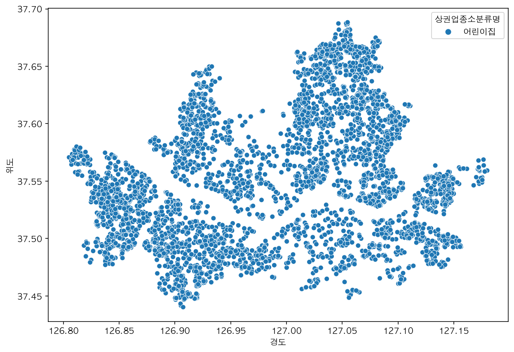

## 상가(상권)정보 분석하기
* 데이터 출처 : [공공데이터포털](https://www.data.go.kr/dataset/15012005/fileData.do)
* 소상공인 상권정보 상가업소 데이터

### 데이터셋을 엑셀에서 열어보는 방법

```
MS엑셀(Excel)에서 UTF-8로 된 CSV파일 불러오기 
 ◦  기존 euc-kr 데이터 추출형식으로 인해 업소명 오류가 발견되었으며 이를 개선하고자 UTF-8 형식으로 추출하였습니다.
 ◦ 개발자가 아닌 일반사용자의 경우 euc-kr(UTF-8 이나 UTF-16)이 아닌 CSV파일을 엑셀에서 바로 열면 한글이 모두 깨지게 됩니다.
 
 ◦ 바로 열지 마시고 다음 절차를 거치시기 바랍니다. 
   - 엑셀을 실행하고 데이터 → 텍스트를 선택합니다.
   - 가져올 파일을 선택하고 확인을 클릭합니다.
   - 콤보 박스에서 적절한 코드 타입이 선택됐는지 확인합니다. 
     * UTF-8의 코드 페이지 넘버는 65001입니다.
 
   - 원본 데이터 파일 유형을 ‘구분 기호로 분리됨’ 선택합니다. 
   - 기타 ‘|’(파이프) 입력, 3단계 텍스트로 선택합니다.  
     * 단, 지번코드, 건물관리번호, 신우편번호, 경도, 위도 등 행마다 텍스트 선택   
  
``` 

### 데이터셋 분류 지역
* 이 튜토리얼에서는 1번 파일만 사용합니다.

```
※ 파일데이터 분류 지역 
1 : 서울, 부산
2 : 대구, 인천, 광주, 대전, 울산
3 : 경기, 강원, 충북
4 : 충남, 전북, 전남, 경북, 경남, 제주
```

## 라이브러리 로드


```python
# 라이브러리를 로드합니다.

import pandas as pd
import seaborn as sns
import matplotlib.pyplot as plt

import warnings
warnings.filterwarnings(action='ignore')
```

## 한글폰트 설정


```python
# 폰트 설정이 잘 안 된다면 해당 셀의 마지막 줄 주석을 풀고 실행해 보세요.
# colab 사용시에도 아래 함수를 활용해 보세요.
def get_font_family():
    """
    시스템 환경에 따른 기본 폰트명을 반환하는 함수
    """
    import platform
    system_name = platform.system()

    if system_name == "Darwin" :
        font_family = "AppleGothic"
    elif system_name == "Windows":
        font_family = "Malgun Gothic"
    else:
        # Linux(colab)
        !apt-get install fonts-nanum -qq  > /dev/null
        !fc-cache -fv

        import matplotlib as mpl
        mpl.font_manager._rebuild()
        findfont = mpl.font_manager.fontManager.findfont
        mpl.font_manager.findfont = findfont
        mpl.backends.backend_agg.findfont = findfont
        
        font_family = "NanumBarunGothic"
    return font_family

# plt.rc("font", family=get_font_family())
```


```python
# 한글폰트를 설정합니다.
# Win
# plt.rc("font", family="Malgun Gothic")
# Mac
plt.rc("font", family="AppleGothic")
plt.rc("axes", unicode_minus=False)
```


```python
# 레티나 디스플레이로 폰트가 선명하게 표시되도록 합니다.

from IPython.display import set_matplotlib_formats
set_matplotlib_formats("retina")
```

### 한글폰트 설정 확인


```python
pd.Series([-4, 1, 0, 3, -2, 4, 5]).plot(title="한글폰트 설정")
```


    <matplotlib.axes._subplots.AxesSubplot at 0x7fa77191ac10>


    

    


## 파일로드


```python
%ls data
```

    seoul_municipalities_geo_simple.json
    상가업소정보_201912_01.csv*
    전국 평균 분양가격(2013년 9월부터 2015년 8월까지).csv
    전국도시공원표준데이터.csv
    주택도시보증공사_전국 평균 분양가격(2019년 12월).csv


```python
# 파일을 로드합니다.

df = pd.read_csv("data/상가업소정보_201912_01.csv", sep='|')
df.shape
```


    (573680, 39)


```python
# 모든 컬럼이 표시되도록 max_columns 의 수를 지정합니다.

pd.options.display.max_columns = 39
```

## 미리보기

### head, tail


```python
# head 로 미리보기를 합니다.

df.head()
```


<div>
<style scoped>
    .dataframe tbody tr th:only-of-type {
        vertical-align: middle;
    }

    .dataframe tbody tr th {
        vertical-align: top;
    }

    .dataframe thead th {
        text-align: right;
    }
</style>
<table border="1" class="dataframe">
  <thead>
    <tr style="text-align: right;">
      <th></th>
      <th>상가업소번호</th>
      <th>상호명</th>
      <th>지점명</th>
      <th>상권업종대분류코드</th>
      <th>상권업종대분류명</th>
      <th>상권업종중분류코드</th>
      <th>상권업종중분류명</th>
      <th>상권업종소분류코드</th>
      <th>상권업종소분류명</th>
      <th>표준산업분류코드</th>
      <th>표준산업분류명</th>
      <th>시도코드</th>
      <th>시도명</th>
      <th>시군구코드</th>
      <th>시군구명</th>
      <th>행정동코드</th>
      <th>행정동명</th>
      <th>법정동코드</th>
      <th>법정동명</th>
      <th>지번코드</th>
      <th>대지구분코드</th>
      <th>대지구분명</th>
      <th>지번본번지</th>
      <th>지번부번지</th>
      <th>지번주소</th>
      <th>도로명코드</th>
      <th>도로명</th>
      <th>건물본번지</th>
      <th>건물부번지</th>
      <th>건물관리번호</th>
      <th>건물명</th>
      <th>도로명주소</th>
      <th>구우편번호</th>
      <th>신우편번호</th>
      <th>동정보</th>
      <th>층정보</th>
      <th>호정보</th>
      <th>경도</th>
      <th>위도</th>
    </tr>
  </thead>
  <tbody>
    <tr>
      <th>0</th>
      <td>19905471</td>
      <td>와라와라호프</td>
      <td>NaN</td>
      <td>Q</td>
      <td>음식</td>
      <td>Q09</td>
      <td>유흥주점</td>
      <td>Q09A01</td>
      <td>호프/맥주</td>
      <td>I56219</td>
      <td>기타 주점업</td>
      <td>11</td>
      <td>서울특별시</td>
      <td>11680</td>
      <td>강남구</td>
      <td>1168060000</td>
      <td>대치1동</td>
      <td>1168010600</td>
      <td>대치동</td>
      <td>1168010600206040000</td>
      <td>1</td>
      <td>대지</td>
      <td>604</td>
      <td>NaN</td>
      <td>서울특별시 강남구 대치동 604</td>
      <td>116802000003</td>
      <td>서울특별시 강남구 남부순환로</td>
      <td>2933</td>
      <td>NaN</td>
      <td>1168010600106040000014378</td>
      <td>대치상가</td>
      <td>서울특별시 강남구 남부순환로 2933</td>
      <td>135280</td>
      <td>6280.0</td>
      <td>NaN</td>
      <td>1</td>
      <td>NaN</td>
      <td>127.061026</td>
      <td>37.493922</td>
    </tr>
    <tr>
      <th>1</th>
      <td>19911397</td>
      <td>커피빈코리아선릉로93길점</td>
      <td>코리아선릉로93길점</td>
      <td>Q</td>
      <td>음식</td>
      <td>Q12</td>
      <td>커피점/카페</td>
      <td>Q12A01</td>
      <td>커피전문점/카페/다방</td>
      <td>I56220</td>
      <td>비알콜 음료점업</td>
      <td>11</td>
      <td>서울특별시</td>
      <td>11680</td>
      <td>강남구</td>
      <td>1168064000</td>
      <td>역삼1동</td>
      <td>1168010100</td>
      <td>역삼동</td>
      <td>1168010100206960042</td>
      <td>1</td>
      <td>대지</td>
      <td>696</td>
      <td>42.0</td>
      <td>서울특별시 강남구 역삼동 696-42</td>
      <td>116804166502</td>
      <td>서울특별시 강남구 선릉로93길</td>
      <td>6</td>
      <td>NaN</td>
      <td>1168010100106960042022041</td>
      <td>NaN</td>
      <td>서울특별시 강남구 선릉로93길 6</td>
      <td>135080</td>
      <td>6149.0</td>
      <td>NaN</td>
      <td>1</td>
      <td>NaN</td>
      <td>127.047883</td>
      <td>37.505675</td>
    </tr>
    <tr>
      <th>2</th>
      <td>19911801</td>
      <td>프로포즈</td>
      <td>NaN</td>
      <td>Q</td>
      <td>음식</td>
      <td>Q09</td>
      <td>유흥주점</td>
      <td>Q09A01</td>
      <td>호프/맥주</td>
      <td>I56219</td>
      <td>기타 주점업</td>
      <td>11</td>
      <td>서울특별시</td>
      <td>11545</td>
      <td>금천구</td>
      <td>1154563000</td>
      <td>독산3동</td>
      <td>1154510200</td>
      <td>독산동</td>
      <td>1154510200201620001</td>
      <td>1</td>
      <td>대지</td>
      <td>162</td>
      <td>1.0</td>
      <td>서울특별시 금천구 독산동 162-1</td>
      <td>115453117003</td>
      <td>서울특별시 금천구 가산로</td>
      <td>34</td>
      <td>6.0</td>
      <td>1154510200101620001017748</td>
      <td>NaN</td>
      <td>서울특별시 금천구 가산로 34-6</td>
      <td>153010</td>
      <td>8545.0</td>
      <td>NaN</td>
      <td>1</td>
      <td>NaN</td>
      <td>126.899220</td>
      <td>37.471711</td>
    </tr>
    <tr>
      <th>3</th>
      <td>19912201</td>
      <td>싱싱커피&amp;토스트</td>
      <td>NaN</td>
      <td>Q</td>
      <td>음식</td>
      <td>Q07</td>
      <td>패스트푸드</td>
      <td>Q07A10</td>
      <td>토스트전문</td>
      <td>I56192</td>
      <td>피자, 햄버거, 샌드위치 및 유사 음식점업</td>
      <td>26</td>
      <td>부산광역시</td>
      <td>26530</td>
      <td>사상구</td>
      <td>2653062000</td>
      <td>괘법동</td>
      <td>2653010400</td>
      <td>괘법동</td>
      <td>2653010400205780000</td>
      <td>1</td>
      <td>대지</td>
      <td>578</td>
      <td>NaN</td>
      <td>부산광역시 사상구 괘법동 578</td>
      <td>265303139004</td>
      <td>부산광역시 사상구 괘감로</td>
      <td>37</td>
      <td>NaN</td>
      <td>2653010400105780000002037</td>
      <td>산업용품유통상가</td>
      <td>부산광역시 사상구 괘감로 37</td>
      <td>617726</td>
      <td>46977.0</td>
      <td>NaN</td>
      <td>1</td>
      <td>26</td>
      <td>128.980455</td>
      <td>35.159774</td>
    </tr>
    <tr>
      <th>4</th>
      <td>19932756</td>
      <td>가락사우나내스낵</td>
      <td>NaN</td>
      <td>F</td>
      <td>생활서비스</td>
      <td>F09</td>
      <td>대중목욕탕/휴게</td>
      <td>F09A02</td>
      <td>사우나/증기탕/온천</td>
      <td>S96121</td>
      <td>욕탕업</td>
      <td>11</td>
      <td>서울특별시</td>
      <td>11710</td>
      <td>송파구</td>
      <td>1171060000</td>
      <td>석촌동</td>
      <td>1171010500</td>
      <td>석촌동</td>
      <td>1171010500202560000</td>
      <td>1</td>
      <td>대지</td>
      <td>256</td>
      <td>NaN</td>
      <td>서울특별시 송파구 석촌동 256</td>
      <td>117103123001</td>
      <td>서울특별시 송파구 가락로</td>
      <td>71</td>
      <td>NaN</td>
      <td>1171010500102560005010490</td>
      <td>NaN</td>
      <td>서울특별시 송파구 가락로 71</td>
      <td>138846</td>
      <td>5690.0</td>
      <td>NaN</td>
      <td>1</td>
      <td>NaN</td>
      <td>127.104071</td>
      <td>37.500249</td>
    </tr>
  </tbody>
</table>
</div>


```python
# tail 로 미리보기를 합니다.
df.tail()
```


<div>
<style scoped>
    .dataframe tbody tr th:only-of-type {
        vertical-align: middle;
    }

    .dataframe tbody tr th {
        vertical-align: top;
    }

    .dataframe thead th {
        text-align: right;
    }
</style>
<table border="1" class="dataframe">
  <thead>
    <tr style="text-align: right;">
      <th></th>
      <th>상가업소번호</th>
      <th>상호명</th>
      <th>지점명</th>
      <th>상권업종대분류코드</th>
      <th>상권업종대분류명</th>
      <th>상권업종중분류코드</th>
      <th>상권업종중분류명</th>
      <th>상권업종소분류코드</th>
      <th>상권업종소분류명</th>
      <th>표준산업분류코드</th>
      <th>표준산업분류명</th>
      <th>시도코드</th>
      <th>시도명</th>
      <th>시군구코드</th>
      <th>시군구명</th>
      <th>행정동코드</th>
      <th>행정동명</th>
      <th>법정동코드</th>
      <th>법정동명</th>
      <th>지번코드</th>
      <th>대지구분코드</th>
      <th>대지구분명</th>
      <th>지번본번지</th>
      <th>지번부번지</th>
      <th>지번주소</th>
      <th>도로명코드</th>
      <th>도로명</th>
      <th>건물본번지</th>
      <th>건물부번지</th>
      <th>건물관리번호</th>
      <th>건물명</th>
      <th>도로명주소</th>
      <th>구우편번호</th>
      <th>신우편번호</th>
      <th>동정보</th>
      <th>층정보</th>
      <th>호정보</th>
      <th>경도</th>
      <th>위도</th>
    </tr>
  </thead>
  <tbody>
    <tr>
      <th>573675</th>
      <td>16394290</td>
      <td>비파티세리공덕</td>
      <td>NaN</td>
      <td>Q</td>
      <td>음식</td>
      <td>Q01</td>
      <td>한식</td>
      <td>Q01A01</td>
      <td>한식/백반/한정식</td>
      <td>I56111</td>
      <td>한식 음식점업</td>
      <td>11</td>
      <td>서울특별시</td>
      <td>11440</td>
      <td>마포구</td>
      <td>1144056500</td>
      <td>공덕동</td>
      <td>1144010200</td>
      <td>공덕동</td>
      <td>1144010200201050067</td>
      <td>1</td>
      <td>대지</td>
      <td>105</td>
      <td>67.0</td>
      <td>서울특별시 마포구 공덕동 105-67</td>
      <td>114404139142</td>
      <td>서울특별시 마포구 마포대로14길</td>
      <td>4</td>
      <td>NaN</td>
      <td>1144010200101050067001710</td>
      <td>NaN</td>
      <td>서울특별시 마포구 마포대로14길 4</td>
      <td>121801</td>
      <td>4211.0</td>
      <td>NaN</td>
      <td>NaN</td>
      <td>NaN</td>
      <td>126.955059</td>
      <td>37.548618</td>
    </tr>
    <tr>
      <th>573676</th>
      <td>16336474</td>
      <td>앤탑PC방</td>
      <td>NaN</td>
      <td>N</td>
      <td>관광/여가/오락</td>
      <td>N01</td>
      <td>PC/오락/당구/볼링등</td>
      <td>N01A01</td>
      <td>인터넷PC방</td>
      <td>R91222</td>
      <td>컴퓨터 게임방 운영업</td>
      <td>11</td>
      <td>서울특별시</td>
      <td>11200</td>
      <td>성동구</td>
      <td>1120069000</td>
      <td>성수2가3동</td>
      <td>1120011500</td>
      <td>성수동2가</td>
      <td>1120011500202890015</td>
      <td>1</td>
      <td>대지</td>
      <td>289</td>
      <td>15.0</td>
      <td>서울특별시 성동구 성수동2가 289-15</td>
      <td>112004109367</td>
      <td>서울특별시 성동구 성수일로8길</td>
      <td>37</td>
      <td>NaN</td>
      <td>1120011500102890015004255</td>
      <td>으뜸프린팅(주)</td>
      <td>서울특별시 성동구 성수일로8길 37</td>
      <td>133834</td>
      <td>4794.0</td>
      <td>NaN</td>
      <td>2</td>
      <td>NaN</td>
      <td>127.054615</td>
      <td>37.545853</td>
    </tr>
    <tr>
      <th>573677</th>
      <td>16336218</td>
      <td>오즈아레나PC방</td>
      <td>NaN</td>
      <td>N</td>
      <td>관광/여가/오락</td>
      <td>N01</td>
      <td>PC/오락/당구/볼링등</td>
      <td>N01A01</td>
      <td>인터넷PC방</td>
      <td>R91222</td>
      <td>컴퓨터 게임방 운영업</td>
      <td>11</td>
      <td>서울특별시</td>
      <td>11680</td>
      <td>강남구</td>
      <td>1168052100</td>
      <td>논현1동</td>
      <td>1168010800</td>
      <td>논현동</td>
      <td>1168010800201650008</td>
      <td>1</td>
      <td>대지</td>
      <td>165</td>
      <td>8.0</td>
      <td>서울특별시 강남구 논현동 165-8</td>
      <td>116802102001</td>
      <td>서울특별시 강남구 강남대로</td>
      <td>492</td>
      <td>NaN</td>
      <td>1168010800101650008000001</td>
      <td>한맥빌딩</td>
      <td>서울특별시 강남구 강남대로 492</td>
      <td>135825</td>
      <td>6119.0</td>
      <td>NaN</td>
      <td>2</td>
      <td>NaN</td>
      <td>127.024102</td>
      <td>37.506202</td>
    </tr>
    <tr>
      <th>573678</th>
      <td>16335152</td>
      <td>파인트리네일</td>
      <td>NaN</td>
      <td>F</td>
      <td>생활서비스</td>
      <td>F01</td>
      <td>이/미용/건강</td>
      <td>F01A02</td>
      <td>발/네일케어</td>
      <td>S96119</td>
      <td>기타미용업</td>
      <td>11</td>
      <td>서울특별시</td>
      <td>11560</td>
      <td>영등포구</td>
      <td>1156054000</td>
      <td>여의동</td>
      <td>1156011000</td>
      <td>여의도동</td>
      <td>1156011000200230000</td>
      <td>1</td>
      <td>대지</td>
      <td>23</td>
      <td>NaN</td>
      <td>서울특별시 영등포구 여의도동 23</td>
      <td>115603118002</td>
      <td>서울특별시 영등포구 국제금융로</td>
      <td>10</td>
      <td>NaN</td>
      <td>1156011000100230000000001</td>
      <td>서울국제금융센터</td>
      <td>서울특별시 영등포구 국제금융로 10</td>
      <td>150945</td>
      <td>7326.0</td>
      <td>NaN</td>
      <td>1</td>
      <td>NaN</td>
      <td>126.924863</td>
      <td>37.525172</td>
    </tr>
    <tr>
      <th>573679</th>
      <td>16335150</td>
      <td>마이리틀네일</td>
      <td>NaN</td>
      <td>F</td>
      <td>생활서비스</td>
      <td>F01</td>
      <td>이/미용/건강</td>
      <td>F01A02</td>
      <td>발/네일케어</td>
      <td>S96119</td>
      <td>기타미용업</td>
      <td>11</td>
      <td>서울특별시</td>
      <td>11320</td>
      <td>도봉구</td>
      <td>1132051100</td>
      <td>창1동</td>
      <td>1132010700</td>
      <td>창동</td>
      <td>1132010700208120000</td>
      <td>1</td>
      <td>대지</td>
      <td>812</td>
      <td>NaN</td>
      <td>서울특별시 도봉구 창동 812</td>
      <td>113204127109</td>
      <td>서울특별시 도봉구 도봉로114길</td>
      <td>22</td>
      <td>8.0</td>
      <td>1132010700108120000018489</td>
      <td>현대타운아파트</td>
      <td>서울특별시 도봉구 도봉로114길 22-8</td>
      <td>132691</td>
      <td>1455.0</td>
      <td>101</td>
      <td>NaN</td>
      <td>NaN</td>
      <td>127.035145</td>
      <td>37.647099</td>
    </tr>
  </tbody>
</table>
</div>


### 인덱스 정보 보기


```python
df.index
```


    RangeIndex(start=0, stop=573680, step=1)


### 컬럼명만 보기


```python
# 컬럼값만 보기
df.columns
```


    Index(['상가업소번호', '상호명', '지점명', '상권업종대분류코드', '상권업종대분류명', '상권업종중분류코드',
           '상권업종중분류명', '상권업종소분류코드', '상권업종소분류명', '표준산업분류코드', '표준산업분류명', '시도코드',
           '시도명', '시군구코드', '시군구명', '행정동코드', '행정동명', '법정동코드', '법정동명', '지번코드',
           '대지구분코드', '대지구분명', '지번본번지', '지번부번지', '지번주소', '도로명코드', '도로명', '건물본번지',
           '건물부번지', '건물관리번호', '건물명', '도로명주소', '구우편번호', '신우편번호', '동정보', '층정보',
           '호정보', '경도', '위도'],
          dtype='object')


### info


```python
# info 로 데이터프레임의 정보보기

df.info()
```

    <class 'pandas.core.frame.DataFrame'>
    RangeIndex: 573680 entries, 0 to 573679
    Data columns (total 39 columns):
     #   Column     Non-Null Count   Dtype  
    ---  ------     --------------   -----  
     0   상가업소번호     573680 non-null  int64  
     1   상호명        573679 non-null  object 
     2   지점명        76674 non-null   object 
     3   상권업종대분류코드  573680 non-null  object 
     4   상권업종대분류명   573680 non-null  object 
     5   상권업종중분류코드  573680 non-null  object 
     6   상권업종중분류명   573680 non-null  object 
     7   상권업종소분류코드  573680 non-null  object 
     8   상권업종소분류명   573680 non-null  object 
     9   표준산업분류코드   539290 non-null  object 
     10  표준산업분류명    539290 non-null  object 
     11  시도코드       573680 non-null  int64  
     12  시도명        573680 non-null  object 
     13  시군구코드      573680 non-null  int64  
     14  시군구명       573680 non-null  object 
     15  행정동코드      573680 non-null  int64  
     16  행정동명       573680 non-null  object 
     17  법정동코드      573680 non-null  int64  
     18  법정동명       573680 non-null  object 
     19  지번코드       573680 non-null  int64  
     20  대지구분코드     573680 non-null  int64  
     21  대지구분명      573680 non-null  object 
     22  지번본번지      573680 non-null  int64  
     23  지번부번지      474924 non-null  float64
     24  지번주소       573680 non-null  object 
     25  도로명코드      573680 non-null  int64  
     26  도로명        573680 non-null  object 
     27  건물본번지      573680 non-null  int64  
     28  건물부번지      71988 non-null   float64
     29  건물관리번호     573680 non-null  object 
     30  건물명        265608 non-null  object 
     31  도로명주소      573680 non-null  object 
     32  구우편번호      573680 non-null  int64  
     33  신우편번호      573671 non-null  float64
     34  동정보        50856 non-null   object 
     35  층정보        347127 non-null  object 
     36  호정보        85266 non-null   object 
     37  경도         573680 non-null  float64
     38  위도         573680 non-null  float64
    dtypes: float64(5), int64(11), object(23)
    memory usage: 170.7+ MB
    

### 데이터 타입 보기


```python
df.dtypes
```


    상가업소번호         int64
    상호명           object
    지점명           object
    상권업종대분류코드     object
    상권업종대분류명      object
    상권업종중분류코드     object
    상권업종중분류명      object
    상권업종소분류코드     object
    상권업종소분류명      object
    표준산업분류코드      object
    표준산업분류명       object
    시도코드           int64
    시도명           object
    시군구코드          int64
    시군구명          object
    행정동코드          int64
    행정동명          object
    법정동코드          int64
    법정동명          object
    지번코드           int64
    대지구분코드         int64
    대지구분명         object
    지번본번지          int64
    지번부번지        float64
    지번주소          object
    도로명코드          int64
    도로명           object
    건물본번지          int64
    건물부번지        float64
    건물관리번호        object
    건물명           object
    도로명주소         object
    구우편번호          int64
    신우편번호        float64
    동정보           object
    층정보           object
    호정보           object
    경도           float64
    위도           float64
    dtype: object


## 결측치 확인하기


```python
True == 1
```


    True


```python
# 결측치를 구해서 n 이라는 변수에 담고 재사용 합니다.

n = df.isnull().sum()
n
```


    상가업소번호            0
    상호명               1
    지점명          497006
    상권업종대분류코드         0
    상권업종대분류명          0
    상권업종중분류코드         0
    상권업종중분류명          0
    상권업종소분류코드         0
    상권업종소분류명          0
    표준산업분류코드      34390
    표준산업분류명       34390
    시도코드              0
    시도명               0
    시군구코드             0
    시군구명              0
    행정동코드             0
    행정동명              0
    법정동코드             0
    법정동명              0
    지번코드              0
    대지구분코드            0
    대지구분명             0
    지번본번지             0
    지번부번지         98756
    지번주소              0
    도로명코드             0
    도로명               0
    건물본번지             0
    건물부번지        501692
    건물관리번호            0
    건물명          308072
    도로명주소             0
    구우편번호             0
    신우편번호             9
    동정보          522824
    층정보          226553
    호정보          488414
    경도                0
    위도                0
    dtype: int64


### 결측치 시각화


```python
# 막대그래프로 시각화 합니다.
n.plot.bar()
```


    <matplotlib.axes._subplots.AxesSubplot at 0x7fa752a4bbd0>


    

    


```python
# 값을 정렬해서 결측치가 많은 값이 위에 그려지도록 barh로 그립니다.
n.sort_values().plot.barh(figsize=(7, 8))
```


    <matplotlib.axes._subplots.AxesSubplot at 0x7fa73046b290>


    

    


### missingno 로 결측치 시각화 하기
* 별도의 설치가 필요한 라이브러리 입니다. 아나콘다를 설치하게 되면 자주 사용되는 패키지와 라이브러리가 함께 설치 됩니다. 아나콘다를 사용하지 않는다면 이런 라이브러리를 따로 설치하고 의존성있는 버전을 일일이 맞춰주어야 합니다. 아나콘다는 기본적으로 자주 사용되는 판다스, 넘파이, 사이킷런, 맷플롯립 등의 라이브러리를 내장하고 있습니다. 이에 비해 missingno, folium 등의 라이브러리는 아나콘다에 포함되어 있지 않습니다. 그래서 따로 설치를 해서 사용합니다.
* [ResidentMario/missingno: Missing data visualization module for Python.](https://github.com/ResidentMario/missingno)

* 윈도우
    * <font color="red">주피터 노트북 상에서 설치가 되지 않으니</font> anaconda prompt 를 열어서 설치해 주세요.
    * <font color="red">관리자 권한</font>으로 아나콘다를 설치하셨다면 다음의 방법으로 anaconda prompt 를 열어 주세요.
    
* 맥
    * terminal 프로그램을 열어 설치해 주세요. 


* 아나콘다에서 설치(다음 3가지 중 하나의 명령어를 사용)
    + conda install -c conda-forge missingno
    + conda install -c conda-forge/label/gcc7 missingno
    + conda install -c conda-forge/label/cf201901 missingno


```python
import missingno as msno

msno.matrix(df)
```


    <matplotlib.axes._subplots.AxesSubplot at 0x7fa7921af450>


    

    


```python
# heatmap 으로 표현합니다.

msno.heatmap(df)
```


    <matplotlib.axes._subplots.AxesSubplot at 0x7fa7737e8810>


    

    


```python
# dendrogram 으로 표현합니다.

msno.dendrogram(df)
```


    <matplotlib.axes._subplots.AxesSubplot at 0x7fa73046be50>


    

    


## 사용하지 않는 컬럼 제거하기

### 결측치가 너무 많은 컬럼 제거하기


```python
# sort_values 를 통해 결측치가 많은 데이터를 위에서 9개 가져와서 not_use 변수에 담습니다.
# not_use 변수에 담긴 인덱스값만 추출해서 not_use_col 이라는 변수에 담습니다.

not_use = n.sort_values(ascending=False).head(9)
not_use_col = not_use.index
not_use_col
```


    Index(['동정보', '건물부번지', '지점명', '호정보', '건물명', '층정보', '지번부번지', '표준산업분류코드',
           '표준산업분류명'],
          dtype='object')


```python
# 사용하지 않는 컬럼을 제거하고 잘 제거가 되었는지 shape 의 수로 확인합니다.
print(df.shape)
df = df.drop(not_use_col, axis=1)
print(df.shape)
```

    (573680, 39)
    (573680, 30)
    


```python
# info()를 통해 해당 컬럼이 제거되었는지 확인하며 메모리 사용량이 줄어들었는지 확인합니다.

df.info()
```

    <class 'pandas.core.frame.DataFrame'>
    RangeIndex: 573680 entries, 0 to 573679
    Data columns (total 30 columns):
     #   Column     Non-Null Count   Dtype  
    ---  ------     --------------   -----  
     0   상가업소번호     573680 non-null  int64  
     1   상호명        573679 non-null  object 
     2   상권업종대분류코드  573680 non-null  object 
     3   상권업종대분류명   573680 non-null  object 
     4   상권업종중분류코드  573680 non-null  object 
     5   상권업종중분류명   573680 non-null  object 
     6   상권업종소분류코드  573680 non-null  object 
     7   상권업종소분류명   573680 non-null  object 
     8   시도코드       573680 non-null  int64  
     9   시도명        573680 non-null  object 
     10  시군구코드      573680 non-null  int64  
     11  시군구명       573680 non-null  object 
     12  행정동코드      573680 non-null  int64  
     13  행정동명       573680 non-null  object 
     14  법정동코드      573680 non-null  int64  
     15  법정동명       573680 non-null  object 
     16  지번코드       573680 non-null  int64  
     17  대지구분코드     573680 non-null  int64  
     18  대지구분명      573680 non-null  object 
     19  지번본번지      573680 non-null  int64  
     20  지번주소       573680 non-null  object 
     21  도로명코드      573680 non-null  int64  
     22  도로명        573680 non-null  object 
     23  건물본번지      573680 non-null  int64  
     24  건물관리번호     573680 non-null  object 
     25  도로명주소      573680 non-null  object 
     26  구우편번호      573680 non-null  int64  
     27  신우편번호      573671 non-null  float64
     28  경도         573680 non-null  float64
     29  위도         573680 non-null  float64
    dtypes: float64(3), int64(11), object(16)
    memory usage: 131.3+ MB
    

### 사용하지 않는 컬럼 제거하기


```python
# 컬럼명을 전처리 하기 위해 cols 라는 변수에 담습니다.
cols = df.columns
cols
```


    Index(['상가업소번호', '상호명', '상권업종대분류코드', '상권업종대분류명', '상권업종중분류코드', '상권업종중분류명',
           '상권업종소분류코드', '상권업종소분류명', '시도코드', '시도명', '시군구코드', '시군구명', '행정동코드',
           '행정동명', '법정동코드', '법정동명', '지번코드', '대지구분코드', '대지구분명', '지번본번지', '지번주소',
           '도로명코드', '도로명', '건물본번지', '건물관리번호', '도로명주소', '구우편번호', '신우편번호', '경도',
           '위도'],
          dtype='object')


```python
# 컬럼명에 "코드", "번호"가 있지만 이번 분석에서는 사용하지 않기 때문에 
# 해당되는 컬럼만 찾아와서 cols_code 라는 변수에 담습니다.

cols_code = cols[cols.str.contains("코드|번호")]
cols_code
```


    Index(['상가업소번호', '상권업종대분류코드', '상권업종중분류코드', '상권업종소분류코드', '시도코드', '시군구코드',
           '행정동코드', '법정동코드', '지번코드', '대지구분코드', '도로명코드', '건물관리번호', '구우편번호',
           '신우편번호'],
          dtype='object')


```python
# "코드", "번호" 가 들어가는 컬럼명만 drop으로 데이터프레임에서 제거합니다.
#  제거 전 후에 shape를 통해 컬럼이 삭제되었는지 확인합니다.
print(df.shape)
df = df.drop(cols_code, axis=1)
print(df.shape)
```

    (573680, 30)
    (573680, 16)
    


```python
# info를 통해 컬럼정보와 메모리 사용량 등을 확인합니다.

df.info()
```

    <class 'pandas.core.frame.DataFrame'>
    RangeIndex: 573680 entries, 0 to 573679
    Data columns (total 16 columns):
     #   Column    Non-Null Count   Dtype  
    ---  ------    --------------   -----  
     0   상호명       573679 non-null  object 
     1   상권업종대분류명  573680 non-null  object 
     2   상권업종중분류명  573680 non-null  object 
     3   상권업종소분류명  573680 non-null  object 
     4   시도명       573680 non-null  object 
     5   시군구명      573680 non-null  object 
     6   행정동명      573680 non-null  object 
     7   법정동명      573680 non-null  object 
     8   대지구분명     573680 non-null  object 
     9   지번본번지     573680 non-null  int64  
     10  지번주소      573680 non-null  object 
     11  도로명       573680 non-null  object 
     12  건물본번지     573680 non-null  int64  
     13  도로명주소     573680 non-null  object 
     14  경도        573680 non-null  float64
     15  위도        573680 non-null  float64
    dtypes: float64(2), int64(2), object(12)
    memory usage: 70.0+ MB
    

## 행, 열을 기준으로 값을 가져오기

### 열(column)기준 
* df[열이름]
    * 결과가 Pandas 의 Series 형태로 반환
* df[[열목록]] : 2개 이상의 열을 가져올 때는 리스트 형태로 묶어서 지정해주어야 합니다.
    * 결과가 Pandas 의 DataFrame 형태로 반환
    * 1개의 열을 2차원 리스트로 지정할 때에도 DataFrame 형태로 반환이 됩니다.


```python
# "상호명" 컬럼만 가져옵니다.

df["상호명"].head()
```


    0           와라와라호프
    1    커피빈코리아선릉로93길점
    2             프로포즈
    3         싱싱커피&토스트
    4         가락사우나내스낵
    Name: 상호명, dtype: object


```python
# "상호명", "도로명주소" 2개의 컬럼을 가져옵니다.

df[["상호명", "도로명주소"]].head()
```


<div>
<style scoped>
    .dataframe tbody tr th:only-of-type {
        vertical-align: middle;
    }

    .dataframe tbody tr th {
        vertical-align: top;
    }

    .dataframe thead th {
        text-align: right;
    }
</style>
<table border="1" class="dataframe">
  <thead>
    <tr style="text-align: right;">
      <th></th>
      <th>상호명</th>
      <th>도로명주소</th>
    </tr>
  </thead>
  <tbody>
    <tr>
      <th>0</th>
      <td>와라와라호프</td>
      <td>서울특별시 강남구 남부순환로 2933</td>
    </tr>
    <tr>
      <th>1</th>
      <td>커피빈코리아선릉로93길점</td>
      <td>서울특별시 강남구 선릉로93길 6</td>
    </tr>
    <tr>
      <th>2</th>
      <td>프로포즈</td>
      <td>서울특별시 금천구 가산로 34-6</td>
    </tr>
    <tr>
      <th>3</th>
      <td>싱싱커피&amp;토스트</td>
      <td>부산광역시 사상구 괘감로 37</td>
    </tr>
    <tr>
      <th>4</th>
      <td>가락사우나내스낵</td>
      <td>서울특별시 송파구 가락로 71</td>
    </tr>
  </tbody>
</table>
</div>


### 행(row) 기준
* df.loc[행]
* df.loc[행, 열]


* df.loc[행이름 혹은 번호]
    * 결과가 Pandas 의 Series 형태로 반환
* df.loc[[행목록]] : 2개 이상의 행을 가져올 때는 열(column)을 가져올 때와 마찬가지로 리스트 형태로 묶어서 지정해주어야 합니다.
    * 결과가 Pandas 의 DataFrame 형태로 반환
    * 1개의 행을 2차원 리스트로 지정할 때에도 DataFrame 형태로 반환이 됩니다.


```python
# 0 번째 인덱스 행을 가져옵니다.

df.loc[0]
```


    상호명                       와라와라호프
    상권업종대분류명                      음식
    상권업종중분류명                    유흥주점
    상권업종소분류명                   호프/맥주
    시도명                        서울특별시
    시군구명                         강남구
    행정동명                        대치1동
    법정동명                         대치동
    대지구분명                         대지
    지번본번지                        604
    지번주소           서울특별시 강남구 대치동 604
    도로명              서울특별시 강남구 남부순환로
    건물본번지                       2933
    도로명주소       서울특별시 강남구 남부순환로 2933
    경도                    127.061026
    위도                     37.493922
    Name: 0, dtype: object


```python
# 0, 1,2 번째 인덱스 행을 가져옵니다.

df.loc[[0, 1, 2]]
```


<div>
<style scoped>
    .dataframe tbody tr th:only-of-type {
        vertical-align: middle;
    }

    .dataframe tbody tr th {
        vertical-align: top;
    }

    .dataframe thead th {
        text-align: right;
    }
</style>
<table border="1" class="dataframe">
  <thead>
    <tr style="text-align: right;">
      <th></th>
      <th>상호명</th>
      <th>상권업종대분류명</th>
      <th>상권업종중분류명</th>
      <th>상권업종소분류명</th>
      <th>시도명</th>
      <th>시군구명</th>
      <th>행정동명</th>
      <th>법정동명</th>
      <th>대지구분명</th>
      <th>지번본번지</th>
      <th>지번주소</th>
      <th>도로명</th>
      <th>건물본번지</th>
      <th>도로명주소</th>
      <th>경도</th>
      <th>위도</th>
    </tr>
  </thead>
  <tbody>
    <tr>
      <th>0</th>
      <td>와라와라호프</td>
      <td>음식</td>
      <td>유흥주점</td>
      <td>호프/맥주</td>
      <td>서울특별시</td>
      <td>강남구</td>
      <td>대치1동</td>
      <td>대치동</td>
      <td>대지</td>
      <td>604</td>
      <td>서울특별시 강남구 대치동 604</td>
      <td>서울특별시 강남구 남부순환로</td>
      <td>2933</td>
      <td>서울특별시 강남구 남부순환로 2933</td>
      <td>127.061026</td>
      <td>37.493922</td>
    </tr>
    <tr>
      <th>1</th>
      <td>커피빈코리아선릉로93길점</td>
      <td>음식</td>
      <td>커피점/카페</td>
      <td>커피전문점/카페/다방</td>
      <td>서울특별시</td>
      <td>강남구</td>
      <td>역삼1동</td>
      <td>역삼동</td>
      <td>대지</td>
      <td>696</td>
      <td>서울특별시 강남구 역삼동 696-42</td>
      <td>서울특별시 강남구 선릉로93길</td>
      <td>6</td>
      <td>서울특별시 강남구 선릉로93길 6</td>
      <td>127.047883</td>
      <td>37.505675</td>
    </tr>
    <tr>
      <th>2</th>
      <td>프로포즈</td>
      <td>음식</td>
      <td>유흥주점</td>
      <td>호프/맥주</td>
      <td>서울특별시</td>
      <td>금천구</td>
      <td>독산3동</td>
      <td>독산동</td>
      <td>대지</td>
      <td>162</td>
      <td>서울특별시 금천구 독산동 162-1</td>
      <td>서울특별시 금천구 가산로</td>
      <td>34</td>
      <td>서울특별시 금천구 가산로 34-6</td>
      <td>126.899220</td>
      <td>37.471711</td>
    </tr>
  </tbody>
</table>
</div>


```python
# 0번째 행의 "상호명"을 가져옵니다.

# df.loc[0]["상호명"]
df.loc[0, "상호명"]
```


    '와라와라호프'


```python
# 0, 1, 2 번째 행의 "상호명"을 가져옵니다.

df.loc[[0, 1, 2], "상호명"]
```


    0           와라와라호프
    1    커피빈코리아선릉로93길점
    2             프로포즈
    Name: 상호명, dtype: object


```python
# 0, 1, 2 번째 행의 "상호명", "도로명주소"를 가져옵니다.

df.loc[[0, 1, 2], ["상호명", "도로명주소"]]
```


<div>
<style scoped>
    .dataframe tbody tr th:only-of-type {
        vertical-align: middle;
    }

    .dataframe tbody tr th {
        vertical-align: top;
    }

    .dataframe thead th {
        text-align: right;
    }
</style>
<table border="1" class="dataframe">
  <thead>
    <tr style="text-align: right;">
      <th></th>
      <th>상호명</th>
      <th>도로명주소</th>
    </tr>
  </thead>
  <tbody>
    <tr>
      <th>0</th>
      <td>와라와라호프</td>
      <td>서울특별시 강남구 남부순환로 2933</td>
    </tr>
    <tr>
      <th>1</th>
      <td>커피빈코리아선릉로93길점</td>
      <td>서울특별시 강남구 선릉로93길 6</td>
    </tr>
    <tr>
      <th>2</th>
      <td>프로포즈</td>
      <td>서울특별시 금천구 가산로 34-6</td>
    </tr>
  </tbody>
</table>
</div>


### iloc 로 슬라이싱을 통해 가져오기

* df.iloc[:] 전체 데이터를 가져옵니다.  
* df.iloc[행, 열] 순으로 인덱스 번호를 지정합니다.
* : 은 전체를 의미합니다.
* 시작인덱스:끝나는인덱스+1을 써줍니다. 
    * 예) 3:5 라면 3번째 인덱스 부터 4번째 인덱스까지 가져옵니다.
* : 에서 앞이나 뒤 인덱스를 써주지 않으면 처음부터 혹은 끝까지를 의미합니다.
    * 예) :5 => 처음부터 4번 인덱스까지 가져옵니다.
    * 예) 5: => 5번 인덱스부터 끝까지 가져옵니다.
    * 예) -5: => 뒤에서 5번째 부터 끝까지 가져옵니다.
    * 예) :-5 => 처음부터 5번째 전까지 가져옵니다.


```python
# 위에서 5개의 행과, 왼쪽에서 5개의 열을 가져옵니다.

df.iloc[:5, :5]
```


<div>
<style scoped>
    .dataframe tbody tr th:only-of-type {
        vertical-align: middle;
    }

    .dataframe tbody tr th {
        vertical-align: top;
    }

    .dataframe thead th {
        text-align: right;
    }
</style>
<table border="1" class="dataframe">
  <thead>
    <tr style="text-align: right;">
      <th></th>
      <th>상호명</th>
      <th>상권업종대분류명</th>
      <th>상권업종중분류명</th>
      <th>상권업종소분류명</th>
      <th>시도명</th>
    </tr>
  </thead>
  <tbody>
    <tr>
      <th>0</th>
      <td>와라와라호프</td>
      <td>음식</td>
      <td>유흥주점</td>
      <td>호프/맥주</td>
      <td>서울특별시</td>
    </tr>
    <tr>
      <th>1</th>
      <td>커피빈코리아선릉로93길점</td>
      <td>음식</td>
      <td>커피점/카페</td>
      <td>커피전문점/카페/다방</td>
      <td>서울특별시</td>
    </tr>
    <tr>
      <th>2</th>
      <td>프로포즈</td>
      <td>음식</td>
      <td>유흥주점</td>
      <td>호프/맥주</td>
      <td>서울특별시</td>
    </tr>
    <tr>
      <th>3</th>
      <td>싱싱커피&amp;토스트</td>
      <td>음식</td>
      <td>패스트푸드</td>
      <td>토스트전문</td>
      <td>부산광역시</td>
    </tr>
    <tr>
      <th>4</th>
      <td>가락사우나내스낵</td>
      <td>생활서비스</td>
      <td>대중목욕탕/휴게</td>
      <td>사우나/증기탕/온천</td>
      <td>서울특별시</td>
    </tr>
  </tbody>
</table>
</div>


```python
# 끝에서 5개의 행과, 오른쪽에서 5개의 열을 가져옵니다.

df.iloc[-5:, -5:]
```


<div>
<style scoped>
    .dataframe tbody tr th:only-of-type {
        vertical-align: middle;
    }

    .dataframe tbody tr th {
        vertical-align: top;
    }

    .dataframe thead th {
        text-align: right;
    }
</style>
<table border="1" class="dataframe">
  <thead>
    <tr style="text-align: right;">
      <th></th>
      <th>도로명</th>
      <th>건물본번지</th>
      <th>도로명주소</th>
      <th>경도</th>
      <th>위도</th>
    </tr>
  </thead>
  <tbody>
    <tr>
      <th>573675</th>
      <td>서울특별시 마포구 마포대로14길</td>
      <td>4</td>
      <td>서울특별시 마포구 마포대로14길 4</td>
      <td>126.955059</td>
      <td>37.548618</td>
    </tr>
    <tr>
      <th>573676</th>
      <td>서울특별시 성동구 성수일로8길</td>
      <td>37</td>
      <td>서울특별시 성동구 성수일로8길 37</td>
      <td>127.054615</td>
      <td>37.545853</td>
    </tr>
    <tr>
      <th>573677</th>
      <td>서울특별시 강남구 강남대로</td>
      <td>492</td>
      <td>서울특별시 강남구 강남대로 492</td>
      <td>127.024102</td>
      <td>37.506202</td>
    </tr>
    <tr>
      <th>573678</th>
      <td>서울특별시 영등포구 국제금융로</td>
      <td>10</td>
      <td>서울특별시 영등포구 국제금융로 10</td>
      <td>126.924863</td>
      <td>37.525172</td>
    </tr>
    <tr>
      <th>573679</th>
      <td>서울특별시 도봉구 도봉로114길</td>
      <td>22</td>
      <td>서울특별시 도봉구 도봉로114길 22-8</td>
      <td>127.035145</td>
      <td>37.647099</td>
    </tr>
  </tbody>
</table>
</div>


## 기술통계 값 보기

### describe 로 요약하기


* describe 를 사용하면 데이터를 요약해 볼 수 있습니다.
* 기본적으로 수치형 데이터를 요약해서 보여줍니다. 
* include, exclude 옵션으로 데이터 타입에 따른 요약수치를 볼 수 있습니다.
* 데이터의 갯수, 평균, 표준편차, 최솟값, 1사분위수(25%), 2사분위수(50%), 3사분위수(75%), 최댓값을 볼 수 있습니다.
* [Descriptive statistics - Wikipedia](https://en.wikipedia.org/wiki/Descriptive_statistics)


```python
# describe 로 기술통계값을 봅니다.
# DataFrame.count: Count number of non-NA/null observations.
# DataFrame.max: Maximum of the values in the object.
# DataFrame.min: Minimum of the values in the object.
# DataFrame.mean: Mean of the values.
# DataFrame.std: Standard deviation of the observations.
# DataFrame.select_dtypes: Subset of a DataFrame including/excluding
#     columns based on their dtype.
df.describe()
```


<div>
<style scoped>
    .dataframe tbody tr th:only-of-type {
        vertical-align: middle;
    }

    .dataframe tbody tr th {
        vertical-align: top;
    }

    .dataframe thead th {
        text-align: right;
    }
</style>
<table border="1" class="dataframe">
  <thead>
    <tr style="text-align: right;">
      <th></th>
      <th>지번본번지</th>
      <th>건물본번지</th>
      <th>경도</th>
      <th>위도</th>
    </tr>
  </thead>
  <tbody>
    <tr>
      <th>count</th>
      <td>573680.000000</td>
      <td>573680.000000</td>
      <td>573680.000000</td>
      <td>573680.000000</td>
    </tr>
    <tr>
      <th>mean</th>
      <td>469.281810</td>
      <td>153.912094</td>
      <td>127.596287</td>
      <td>36.854698</td>
    </tr>
    <tr>
      <th>std</th>
      <td>484.778049</td>
      <td>276.980935</td>
      <td>0.941262</td>
      <td>1.081285</td>
    </tr>
    <tr>
      <th>min</th>
      <td>1.000000</td>
      <td>0.000000</td>
      <td>126.768169</td>
      <td>35.006760</td>
    </tr>
    <tr>
      <th>25%</th>
      <td>109.000000</td>
      <td>20.000000</td>
      <td>126.968316</td>
      <td>35.215422</td>
    </tr>
    <tr>
      <th>50%</th>
      <td>335.000000</td>
      <td>50.000000</td>
      <td>127.047672</td>
      <td>37.511207</td>
    </tr>
    <tr>
      <th>75%</th>
      <td>678.000000</td>
      <td>172.000000</td>
      <td>128.986938</td>
      <td>37.560362</td>
    </tr>
    <tr>
      <th>max</th>
      <td>9999.000000</td>
      <td>3318.000000</td>
      <td>129.292243</td>
      <td>37.692398</td>
    </tr>
  </tbody>
</table>
</div>


```python
# 필요한 컬럼에 대한 요약만 봅니다. 
# 위도, 경도 만 따로 가져와 요약합니다.

df[["위도", "경도"]].describe()
```


<div>
<style scoped>
    .dataframe tbody tr th:only-of-type {
        vertical-align: middle;
    }

    .dataframe tbody tr th {
        vertical-align: top;
    }

    .dataframe thead th {
        text-align: right;
    }
</style>
<table border="1" class="dataframe">
  <thead>
    <tr style="text-align: right;">
      <th></th>
      <th>위도</th>
      <th>경도</th>
    </tr>
  </thead>
  <tbody>
    <tr>
      <th>count</th>
      <td>573680.000000</td>
      <td>573680.000000</td>
    </tr>
    <tr>
      <th>mean</th>
      <td>36.854698</td>
      <td>127.596287</td>
    </tr>
    <tr>
      <th>std</th>
      <td>1.081285</td>
      <td>0.941262</td>
    </tr>
    <tr>
      <th>min</th>
      <td>35.006760</td>
      <td>126.768169</td>
    </tr>
    <tr>
      <th>25%</th>
      <td>35.215422</td>
      <td>126.968316</td>
    </tr>
    <tr>
      <th>50%</th>
      <td>37.511207</td>
      <td>127.047672</td>
    </tr>
    <tr>
      <th>75%</th>
      <td>37.560362</td>
      <td>128.986938</td>
    </tr>
    <tr>
      <th>max</th>
      <td>37.692398</td>
      <td>129.292243</td>
    </tr>
  </tbody>
</table>
</div>


### 개별 기술통계 값 구하기


* [Computational tools — pandas 1.0.1 documentation](https://pandas.pydata.org/docs/user_guide/computation.html#method-summary)

* count 결측치를 제외한 (NaN이 아닌) 값의 갯수를 계산
* min, max 최솟값, 최댓값
* argmin, argmax 최솟값, 최댓값이 위치한 (정수)인덱스를 반환
* idxmin, idxmax 인덱스 중 최솟값, 최댓값을 반환
* quantile 특정 사분위수에 해당하는 값을 반환 (0~1 사이)
    * 0.25 : 1사분위 수
    * 0.5 : 2사분위수 (quantile 의 기본 값)
    * 0.75 : 3사분위수
* sum 수치 데이터의 합계
* mean 평균
* median 중앙값(중간값:데이터를 한 줄로 세웠을 때 가운데 위치하는 값, 중앙값이 짝수일 때는 가운데 2개 값의 평균을 구함)
* mad 평균값으로부터의 절대 편차(absolute deviation)의 평균
* std, var 표준편차, 분산을 계산
* cumsum 맨 첫 번째 성분부터 각 성분까지의 누적합을 계산 (0 번째 부터 계속 더해짐)
* cumprod 맨 첫번째 성분부터 각 성분까지의 누적곱을 계산 (1 번째 부터 계속 곱해짐)


```python
# 결측치를 제외한 (NaN이 아닌) 값의 갯수를 계산
df["위도"].count()
```


    573680


```python
# 평균
df["위도"].mean()
```


    36.85469787421801


```python
# 최댓값
df["위도"].max()
```


    37.6923983816612


```python
# 최솟값
df["위도"].min()
```


    35.0067597383124


```python
# 1사분위 수(25%)
df["위도"].quantile(q=0.25)
```


    35.2154217343356


```python
# 2사분위 수(50%) == 중앙값
df["위도"].quantile()
```


    37.5112070048312


```python
# 중앙값
df["위도"].median()
```


    37.5112070048312


```python
# 중앙값 vs 평균값
df["위도"].mean()
```


    36.85469787421801


```python
# 분산
df["위도"].var()
```


    1.1691762199811804


* 출처 : [표준 편차 - 위키백과, 우리 모두의 백과사전](https://ko.wikipedia.org/wiki/%ED%91%9C%EC%A4%80_%ED%8E%B8%EC%B0%A8)

표준 편차(標準 偏差, 영어: standard deviation)는 자료의 산포도를 나타내는 수치로, 분산의 양의 제곱근으로 정의된다. 표준편차가 작을수록 평균값에서 변량들의 거리가 가깝다.[1] 통계학과 확률에서 주로 확률의 분포, 확률변수 혹은 측정된 인구나 중복집합을 나타낸다. 일반적으로 모집단의 표준편차는 {\displaystyle \sigma }\sigma (시그마)로, 표본의 표준편차는 {\displaystyle S}S(에스)로 나타낸다.[출처 필요]

편차(deviation)는 관측값에서 평균 또는 중앙값을 뺀 것이다.

분산(variance)은 관측값에서 평균을 뺀 값을 제곱하고, 그것을 모두 더한 후 전체 개수로 나눠서 구한다. 즉, 차이값의 제곱의 평균이다. 관측값에서 평균을 뺀 값인 편차를 모두 더하면 0이 나오므로 제곱해서 더한다.

표준 편차(standard deviation)는 분산을 제곱근한 것이다. 제곱해서 값이 부풀려진 분산을 제곱근해서 다시 원래 크기로 만들어준다.


```python
# 표준편차 => 분산에 root 를 씌운 값입니다.
import numpy as np

np.sqrt(df["위도"].var())
```


    1.081284523139576


```python
df["위도"].std()
```


    1.081284523139576


### 단변량 수치형 변수 시각화


```python
# 위도의 distplot 을 그립니다.

sns.distplot(df["위도"])
```


    <matplotlib.axes._subplots.AxesSubplot at 0x7fa76273a310>


    

    


```python
# 경도의 distplot 을 그립니다.

sns.distplot(df["경도"])
```


    <matplotlib.axes._subplots.AxesSubplot at 0x7fa762c29ad0>


    

    


```python
# 위도의 평균, 중앙값을 표현하고 color로 선의 색상을 linestyle 로 점선으로 표시해 봅니다.
plt.axvline(df["위도"].mean(), linestyle=":", color="r")
plt.axvline(df["위도"].median(), linestyle="--")
sns.distplot(df["위도"])
```


    <matplotlib.axes._subplots.AxesSubplot at 0x7fa774e07310>


    

    


### 상관계수
* [상관 분석 - 위키백과, 우리 모두의 백과사전](https://ko.wikipedia.org/wiki/%EC%83%81%EA%B4%80_%EB%B6%84%EC%84%9D)
* r 값은 X 와 Y 가 완전히 동일하면 +1, 전혀 다르면 0, 반대방향으로 완전히 동일 하면 –1 을 가진다.
* 결정계수(coefficient of determination) 는 r ** 2 로 계산하며 이것은 X 로부터 Y 를 예측할 수 있는 정도를 의미한다.
    * r이 -1.0과 -0.7 사이이면, 강한 음적 선형관계,
    * r이 -0.7과 -0.3 사이이면, 뚜렷한 음적 선형관계,
    * r이 -0.3과 -0.1 사이이면, 약한 음적 선형관계,
    * r이 -0.1과 +0.1 사이이면, 거의 무시될 수 있는 선형관계,
    * r이 +0.1과 +0.3 사이이면, 약한 양적 선형관계,
    * r이 +0.3과 +0.7 사이이면, 뚜렷한 양적 선형관계,
    * r이 +0.7과 +1.0 사이이면, 강한 양적 선형관계
    


이미지 출처 : [Correlation and dependence - Wikipedia](https://en.wikipedia.org/wiki/Correlation_and_dependence)


```python
# 각 변수의 상관계수를 구합니다.

corr = df.corr()
corr
```


<div>
<style scoped>
    .dataframe tbody tr th:only-of-type {
        vertical-align: middle;
    }

    .dataframe tbody tr th {
        vertical-align: top;
    }

    .dataframe thead th {
        text-align: right;
    }
</style>
<table border="1" class="dataframe">
  <thead>
    <tr style="text-align: right;">
      <th></th>
      <th>지번본번지</th>
      <th>건물본번지</th>
      <th>경도</th>
      <th>위도</th>
    </tr>
  </thead>
  <tbody>
    <tr>
      <th>지번본번지</th>
      <td>1.000000</td>
      <td>0.057987</td>
      <td>0.182678</td>
      <td>-0.196658</td>
    </tr>
    <tr>
      <th>건물본번지</th>
      <td>0.057987</td>
      <td>1.000000</td>
      <td>0.000255</td>
      <td>0.004606</td>
    </tr>
    <tr>
      <th>경도</th>
      <td>0.182678</td>
      <td>0.000255</td>
      <td>1.000000</td>
      <td>-0.994711</td>
    </tr>
    <tr>
      <th>위도</th>
      <td>-0.196658</td>
      <td>0.004606</td>
      <td>-0.994711</td>
      <td>1.000000</td>
    </tr>
  </tbody>
</table>
</div>


* 상관계수 시각화 : https://seaborn.pydata.org/examples/many_pairwise_correlations.html


```python
# 위에서 구한 상관계수를 시각화 합니다.

mask = np.triu(np.ones_like(corr, dtype=np.bool))
sns.heatmap(corr, annot=True, cmap="Blues", mask=mask)
```


    <matplotlib.axes._subplots.AxesSubplot at 0x7fa762713f90>


    

    


### 산점도로 이변량 수치형 변수 표현하기


```python
# scatterplot 으로 경도와 위도를 표현하며, 
# 데이터의 갯수가 많으면 오래 걸리기 때문에 1000 개의 샘플을 추출해서 그립니다.

sns.scatterplot(data=df.sample(1000), x="경도", y="위도")
```


    <matplotlib.axes._subplots.AxesSubplot at 0x7fa77557dc50>


    

    


```python
# 위 시각화에서 회귀선을 그립니다.

sns.regplot(data=df.sample(1000), x="경도", y="위도")
```


    <matplotlib.axes._subplots.AxesSubplot at 0x7fa738686210>


    

    


[Anscombe’s quartet — seaborn 0.10.0 documentation](https://seaborn.pydata.org/examples/anscombes_quartet.html)


```python
pd.__version__
```


    '1.2.5'


```python
# 회귀선을 그리는 그래프의 서브플롯을 그립니다.

sns.lmplot(data=df.sample(1000), x="경도", y="위도", hue="시도명", col="시도명", 
           truncate=False, fit_reg=True)
```


    <seaborn.axisgrid.FacetGrid at 0x7fa7541bfc10>


    

    


### object 타입의 데이터 요약하기


```python
# include="object" 로 문자열 데이터에 대한 요약을 봅니다.
df.describe(include="object")
```


<div>
<style scoped>
    .dataframe tbody tr th:only-of-type {
        vertical-align: middle;
    }

    .dataframe tbody tr th {
        vertical-align: top;
    }

    .dataframe thead th {
        text-align: right;
    }
</style>
<table border="1" class="dataframe">
  <thead>
    <tr style="text-align: right;">
      <th></th>
      <th>상호명</th>
      <th>상권업종대분류명</th>
      <th>상권업종중분류명</th>
      <th>상권업종소분류명</th>
      <th>시도명</th>
      <th>시군구명</th>
      <th>행정동명</th>
      <th>법정동명</th>
      <th>대지구분명</th>
      <th>지번주소</th>
      <th>도로명</th>
      <th>도로명주소</th>
    </tr>
  </thead>
  <tbody>
    <tr>
      <th>count</th>
      <td>573679</td>
      <td>573680</td>
      <td>573680</td>
      <td>573680</td>
      <td>573680</td>
      <td>573680</td>
      <td>573680</td>
      <td>573680</td>
      <td>573680</td>
      <td>573680</td>
      <td>573680</td>
      <td>573680</td>
    </tr>
    <tr>
      <th>unique</th>
      <td>378758</td>
      <td>9</td>
      <td>94</td>
      <td>709</td>
      <td>2</td>
      <td>39</td>
      <td>629</td>
      <td>648</td>
      <td>2</td>
      <td>190237</td>
      <td>18001</td>
      <td>190486</td>
    </tr>
    <tr>
      <th>top</th>
      <td>점프셈교실</td>
      <td>음식</td>
      <td>한식</td>
      <td>한식/백반/한정식</td>
      <td>서울특별시</td>
      <td>강남구</td>
      <td>역삼1동</td>
      <td>역삼동</td>
      <td>대지</td>
      <td>부산광역시 부산진구 부전동 503-15</td>
      <td>서울특별시 서초구 신반포로</td>
      <td>부산광역시 부산진구 가야대로 772</td>
    </tr>
    <tr>
      <th>freq</th>
      <td>2297</td>
      <td>185516</td>
      <td>59725</td>
      <td>38133</td>
      <td>407376</td>
      <td>47080</td>
      <td>10400</td>
      <td>12102</td>
      <td>572913</td>
      <td>1058</td>
      <td>3543</td>
      <td>1058</td>
    </tr>
  </tbody>
</table>
</div>


```python
# 상권업종대분류명 의 요약값을 봅니다.

df["상권업종대분류명"].describe()
```


    count     573680
    unique         9
    top           음식
    freq      185516
    Name: 상권업종대분류명, dtype: object


```python
# 상권업종대분류명 의 unique 값을 봅니다.

df["상권업종대분류명"].unique()
```


    array(['음식', '생활서비스', '소매', '의료', '학문/교육', '관광/여가/오락', '부동산', '숙박', '스포츠'],
          dtype=object)


```python
# 상권업종대분류명 의 unique 값의 갯수를 세어봅니다.

df["상권업종대분류명"].nunique()
```


    9


```python
df["상권업종대분류명"].mode()
```


    0    음식
    dtype: object


### 범주형 변수의 빈도수 구하기


```python
# value_counts 로 상권업종대분류명 의 빈도수를 구합니다.

df["상권업종대분류명"].value_counts()
```


    음식          185516
    소매          179460
    생활서비스        97789
    학문/교육        42477
    의료           25509
    부동산          20918
    관광/여가/오락     16377
    숙박            5327
    스포츠            307
    Name: 상권업종대분류명, dtype: int64


## 인덱싱과 필터로 서브셋 만들기


```python
# "상권업종대분류명" 이 "음식인 데이터만 가져오기
# df_food 라는 변수에 담아줍니다. 서브셋을 새로운 변수에 저장할 때 copy()를 사용하는 것을 권장합니다.

df_food = df[df["상권업종대분류명"] == "음식"].copy()
df_food.head()
```


<div>
<style scoped>
    .dataframe tbody tr th:only-of-type {
        vertical-align: middle;
    }

    .dataframe tbody tr th {
        vertical-align: top;
    }

    .dataframe thead th {
        text-align: right;
    }
</style>
<table border="1" class="dataframe">
  <thead>
    <tr style="text-align: right;">
      <th></th>
      <th>상호명</th>
      <th>상권업종대분류명</th>
      <th>상권업종중분류명</th>
      <th>상권업종소분류명</th>
      <th>시도명</th>
      <th>시군구명</th>
      <th>행정동명</th>
      <th>법정동명</th>
      <th>대지구분명</th>
      <th>지번본번지</th>
      <th>지번주소</th>
      <th>도로명</th>
      <th>건물본번지</th>
      <th>도로명주소</th>
      <th>경도</th>
      <th>위도</th>
    </tr>
  </thead>
  <tbody>
    <tr>
      <th>0</th>
      <td>와라와라호프</td>
      <td>음식</td>
      <td>유흥주점</td>
      <td>호프/맥주</td>
      <td>서울특별시</td>
      <td>강남구</td>
      <td>대치1동</td>
      <td>대치동</td>
      <td>대지</td>
      <td>604</td>
      <td>서울특별시 강남구 대치동 604</td>
      <td>서울특별시 강남구 남부순환로</td>
      <td>2933</td>
      <td>서울특별시 강남구 남부순환로 2933</td>
      <td>127.061026</td>
      <td>37.493922</td>
    </tr>
    <tr>
      <th>1</th>
      <td>커피빈코리아선릉로93길점</td>
      <td>음식</td>
      <td>커피점/카페</td>
      <td>커피전문점/카페/다방</td>
      <td>서울특별시</td>
      <td>강남구</td>
      <td>역삼1동</td>
      <td>역삼동</td>
      <td>대지</td>
      <td>696</td>
      <td>서울특별시 강남구 역삼동 696-42</td>
      <td>서울특별시 강남구 선릉로93길</td>
      <td>6</td>
      <td>서울특별시 강남구 선릉로93길 6</td>
      <td>127.047883</td>
      <td>37.505675</td>
    </tr>
    <tr>
      <th>2</th>
      <td>프로포즈</td>
      <td>음식</td>
      <td>유흥주점</td>
      <td>호프/맥주</td>
      <td>서울특별시</td>
      <td>금천구</td>
      <td>독산3동</td>
      <td>독산동</td>
      <td>대지</td>
      <td>162</td>
      <td>서울특별시 금천구 독산동 162-1</td>
      <td>서울특별시 금천구 가산로</td>
      <td>34</td>
      <td>서울특별시 금천구 가산로 34-6</td>
      <td>126.899220</td>
      <td>37.471711</td>
    </tr>
    <tr>
      <th>3</th>
      <td>싱싱커피&amp;토스트</td>
      <td>음식</td>
      <td>패스트푸드</td>
      <td>토스트전문</td>
      <td>부산광역시</td>
      <td>사상구</td>
      <td>괘법동</td>
      <td>괘법동</td>
      <td>대지</td>
      <td>578</td>
      <td>부산광역시 사상구 괘법동 578</td>
      <td>부산광역시 사상구 괘감로</td>
      <td>37</td>
      <td>부산광역시 사상구 괘감로 37</td>
      <td>128.980455</td>
      <td>35.159774</td>
    </tr>
    <tr>
      <th>5</th>
      <td>초밥왕</td>
      <td>음식</td>
      <td>일식/수산물</td>
      <td>음식점-초밥전문</td>
      <td>서울특별시</td>
      <td>송파구</td>
      <td>잠실6동</td>
      <td>신천동</td>
      <td>대지</td>
      <td>7</td>
      <td>서울특별시 송파구 신천동 7-28</td>
      <td>서울특별시 송파구 올림픽로</td>
      <td>293</td>
      <td>서울특별시 송파구 올림픽로 293-19</td>
      <td>127.102490</td>
      <td>37.515149</td>
    </tr>
  </tbody>
</table>
</div>


### 강남구의 상권업종대분류가 음식만 보기


```python
# 시군구명이 "강남구" 인 데이터만 가져옵니다.

df[df["시군구명"] == "강남구"].head()
```


<div>
<style scoped>
    .dataframe tbody tr th:only-of-type {
        vertical-align: middle;
    }

    .dataframe tbody tr th {
        vertical-align: top;
    }

    .dataframe thead th {
        text-align: right;
    }
</style>
<table border="1" class="dataframe">
  <thead>
    <tr style="text-align: right;">
      <th></th>
      <th>상호명</th>
      <th>상권업종대분류명</th>
      <th>상권업종중분류명</th>
      <th>상권업종소분류명</th>
      <th>시도명</th>
      <th>시군구명</th>
      <th>행정동명</th>
      <th>법정동명</th>
      <th>대지구분명</th>
      <th>지번본번지</th>
      <th>지번주소</th>
      <th>도로명</th>
      <th>건물본번지</th>
      <th>도로명주소</th>
      <th>경도</th>
      <th>위도</th>
    </tr>
  </thead>
  <tbody>
    <tr>
      <th>0</th>
      <td>와라와라호프</td>
      <td>음식</td>
      <td>유흥주점</td>
      <td>호프/맥주</td>
      <td>서울특별시</td>
      <td>강남구</td>
      <td>대치1동</td>
      <td>대치동</td>
      <td>대지</td>
      <td>604</td>
      <td>서울특별시 강남구 대치동 604</td>
      <td>서울특별시 강남구 남부순환로</td>
      <td>2933</td>
      <td>서울특별시 강남구 남부순환로 2933</td>
      <td>127.061026</td>
      <td>37.493922</td>
    </tr>
    <tr>
      <th>1</th>
      <td>커피빈코리아선릉로93길점</td>
      <td>음식</td>
      <td>커피점/카페</td>
      <td>커피전문점/카페/다방</td>
      <td>서울특별시</td>
      <td>강남구</td>
      <td>역삼1동</td>
      <td>역삼동</td>
      <td>대지</td>
      <td>696</td>
      <td>서울특별시 강남구 역삼동 696-42</td>
      <td>서울특별시 강남구 선릉로93길</td>
      <td>6</td>
      <td>서울특별시 강남구 선릉로93길 6</td>
      <td>127.047883</td>
      <td>37.505675</td>
    </tr>
    <tr>
      <th>26</th>
      <td>쉼터</td>
      <td>음식</td>
      <td>분식</td>
      <td>라면김밥분식</td>
      <td>서울특별시</td>
      <td>강남구</td>
      <td>삼성1동</td>
      <td>삼성동</td>
      <td>대지</td>
      <td>159</td>
      <td>서울특별시 강남구 삼성동 159</td>
      <td>서울특별시 강남구 봉은사로</td>
      <td>524</td>
      <td>서울특별시 강남구 봉은사로 524</td>
      <td>127.057100</td>
      <td>37.512939</td>
    </tr>
    <tr>
      <th>27</th>
      <td>배제현의웰빙낙지한마리수제비</td>
      <td>음식</td>
      <td>일식/수산물</td>
      <td>낙지/오징어</td>
      <td>서울특별시</td>
      <td>강남구</td>
      <td>신사동</td>
      <td>신사동</td>
      <td>대지</td>
      <td>512</td>
      <td>서울특별시 강남구 신사동 512-13</td>
      <td>서울특별시 강남구 강남대로152길</td>
      <td>19</td>
      <td>서울특별시 강남구 강남대로152길 19</td>
      <td>127.020945</td>
      <td>37.517574</td>
    </tr>
    <tr>
      <th>38</th>
      <td>타워광명내과의원</td>
      <td>의료</td>
      <td>병원</td>
      <td>내과/외과</td>
      <td>서울특별시</td>
      <td>강남구</td>
      <td>도곡2동</td>
      <td>도곡동</td>
      <td>대지</td>
      <td>467</td>
      <td>서울특별시 강남구 도곡동 467-14</td>
      <td>서울특별시 강남구 언주로30길</td>
      <td>39</td>
      <td>서울특별시 강남구 언주로30길 39</td>
      <td>127.053198</td>
      <td>37.488742</td>
    </tr>
  </tbody>
</table>
</div>


```python
# 이번에는 시군구명이 "강남구" 이고 "상권업종대분류명" 이 "음식"인 서브셋을 가져온 후 
# "상권업종중분류명" 별로 빈도수를 구합니다.

df[(df["시군구명"] == "강남구") & 
   (df["상권업종대분류명"] == "음식")]["상권업종중분류명"].value_counts()
```


    한식         4371
    커피점/카페     2790
    유흥주점       1573
    양식         1573
    일식/수산물     1255
    분식         1197
    패스트푸드       786
    제과제빵떡케익     650
    닭/오리요리      539
    중식          358
    별식/퓨전요리     341
    부페           63
    기타음식업        47
    음식배달서비스      11
    Name: 상권업종중분류명, dtype: int64


```python
# 위와 똑같이 구하지만 이번에는 loc를 사용합니다.
# loc[행, 열]
df.loc[(df["시군구명"] == "강남구") & (df["상권업종대분류명"] == "음식"),
       "상권업종중분류명"].value_counts()
```


    한식         4371
    커피점/카페     2790
    유흥주점       1573
    양식         1573
    일식/수산물     1255
    분식         1197
    패스트푸드       786
    제과제빵떡케익     650
    닭/오리요리      539
    중식          358
    별식/퓨전요리     341
    부페           63
    기타음식업        47
    음식배달서비스      11
    Name: 상권업종중분류명, dtype: int64


### 구별 음식점 업종 비교하기


```python
# df_seoul_food 에 "시도명"이 "서울특별시" 이고 "상권업종대분류명" 이 "음식" 에 대한 서브셋만 가져와서 담아줍니다.

df_seoul_food = df[(df["시도명"] == "서울특별시") & (df["상권업종대분류명"] == "음식")].copy()
df_seoul_food.shape
```


    (132889, 16)


```python
# "시군구명", "상권업종중분류명" 으로 그룹화 해서 상점수를 세어봅니다.
# 결과를 food_gu 에 담아 재사용할 예정입니다.

food_gu = df_seoul_food.groupby(["시군구명", "상권업종중분류명"])["상호명"].count()
food_gu.head()
```


    시군구명  상권업종중분류명
    강남구   기타음식업         47
          닭/오리요리       539
          별식/퓨전요리      341
          부페            63
          분식          1197
    Name: 상호명, dtype: int64


```python
food_gu.unstack().iloc[:5, :5]
```


<div>
<style scoped>
    .dataframe tbody tr th:only-of-type {
        vertical-align: middle;
    }

    .dataframe tbody tr th {
        vertical-align: top;
    }

    .dataframe thead th {
        text-align: right;
    }
</style>
<table border="1" class="dataframe">
  <thead>
    <tr style="text-align: right;">
      <th>상권업종중분류명</th>
      <th>기타음식업</th>
      <th>닭/오리요리</th>
      <th>별식/퓨전요리</th>
      <th>부페</th>
      <th>분식</th>
    </tr>
    <tr>
      <th>시군구명</th>
      <th></th>
      <th></th>
      <th></th>
      <th></th>
      <th></th>
    </tr>
  </thead>
  <tbody>
    <tr>
      <th>강남구</th>
      <td>47.0</td>
      <td>539.0</td>
      <td>341.0</td>
      <td>63.0</td>
      <td>1197.0</td>
    </tr>
    <tr>
      <th>강동구</th>
      <td>4.0</td>
      <td>318.0</td>
      <td>138.0</td>
      <td>24.0</td>
      <td>509.0</td>
    </tr>
    <tr>
      <th>강북구</th>
      <td>2.0</td>
      <td>208.0</td>
      <td>97.0</td>
      <td>6.0</td>
      <td>329.0</td>
    </tr>
    <tr>
      <th>강서구</th>
      <td>16.0</td>
      <td>323.0</td>
      <td>145.0</td>
      <td>21.0</td>
      <td>531.0</td>
    </tr>
    <tr>
      <th>관악구</th>
      <td>11.0</td>
      <td>324.0</td>
      <td>118.0</td>
      <td>11.0</td>
      <td>461.0</td>
    </tr>
  </tbody>
</table>
</div>


```python
# food_gu 에 담긴 데이터를 시각화 합니다.
# 상권업종중분류명 과 상점수 로 barplot을 그립니다.

food_gu.unstack().loc["강남구"].plot.bar()
```


    <matplotlib.axes._subplots.AxesSubplot at 0x7fa775d42410>


    

    


```python
food = food_gu.reset_index()
food = food.rename(columns={"상호명":"상호수"})
food.head()
```


<div>
<style scoped>
    .dataframe tbody tr th:only-of-type {
        vertical-align: middle;
    }

    .dataframe tbody tr th {
        vertical-align: top;
    }

    .dataframe thead th {
        text-align: right;
    }
</style>
<table border="1" class="dataframe">
  <thead>
    <tr style="text-align: right;">
      <th></th>
      <th>시군구명</th>
      <th>상권업종중분류명</th>
      <th>상호수</th>
    </tr>
  </thead>
  <tbody>
    <tr>
      <th>0</th>
      <td>강남구</td>
      <td>기타음식업</td>
      <td>47</td>
    </tr>
    <tr>
      <th>1</th>
      <td>강남구</td>
      <td>닭/오리요리</td>
      <td>539</td>
    </tr>
    <tr>
      <th>2</th>
      <td>강남구</td>
      <td>별식/퓨전요리</td>
      <td>341</td>
    </tr>
    <tr>
      <th>3</th>
      <td>강남구</td>
      <td>부페</td>
      <td>63</td>
    </tr>
    <tr>
      <th>4</th>
      <td>강남구</td>
      <td>분식</td>
      <td>1197</td>
    </tr>
  </tbody>
</table>
</div>


```python
plt.figure(figsize=(15, 4))
sns.barplot(data=food, x="상권업종중분류명", y="상호수")
```


    <matplotlib.axes._subplots.AxesSubplot at 0x7fa7523610d0>


    

    


* https://seaborn.pydata.org/tutorial/categorical.html


```python
# catplot을 사용하여 서브프롯을 그립니다.
sns.catplot(data=food, x="시군구명", y="상호수", 
            kind="bar", col="상권업종중분류명", col_wrap=4)
```


    <seaborn.axisgrid.FacetGrid at 0x7fa7648b1d10>


    

    


```python
sns.catplot(data=food, y="시군구명", x="상호수", 
            kind="bar", col="상권업종중분류명", col_wrap=4, sharex=False)
```


    <seaborn.axisgrid.FacetGrid at 0x7fa7384f6650>


    

    


## 구별 학원수 비교
* 주거나 입지로 문화시설이나 학원, 교육 등을 고려하게 됩니다.
* 사교육이 발달한 지역으로 대치동이나 목동을 꼽는데 이 지역에 학원이 많이 분포 되어 있는지 알아봅니다.

### 서브셋 만들고 집계하기


```python
# 학원의 분류명을 알아보기 위해 "상권업종대분류명"의 unique 값을 추출합니다.

df["상권업종대분류명"].unique()
```


    array(['음식', '생활서비스', '소매', '의료', '학문/교육', '관광/여가/오락', '부동산', '숙박', '스포츠'],
          dtype=object)


```python
# "시도명"이 "서울특별시"이고 "상권업종대분류명"이 "학문/교육" 인 데이터를 서브셋으로 가져옵니다.
# 재사용을 위해 서브셋을 df_academy 에 저장합니다.

df_academy = df[(df["시도명"] == "서울특별시") & (df["상권업종대분류명"] == "학문/교육")].copy()
df_academy.head()
```


<div>
<style scoped>
    .dataframe tbody tr th:only-of-type {
        vertical-align: middle;
    }

    .dataframe tbody tr th {
        vertical-align: top;
    }

    .dataframe thead th {
        text-align: right;
    }
</style>
<table border="1" class="dataframe">
  <thead>
    <tr style="text-align: right;">
      <th></th>
      <th>상호명</th>
      <th>상권업종대분류명</th>
      <th>상권업종중분류명</th>
      <th>상권업종소분류명</th>
      <th>시도명</th>
      <th>시군구명</th>
      <th>행정동명</th>
      <th>법정동명</th>
      <th>대지구분명</th>
      <th>지번본번지</th>
      <th>지번주소</th>
      <th>도로명</th>
      <th>건물본번지</th>
      <th>도로명주소</th>
      <th>경도</th>
      <th>위도</th>
    </tr>
  </thead>
  <tbody>
    <tr>
      <th>85</th>
      <td>GIA보석교육원</td>
      <td>학문/교육</td>
      <td>학원-자격/국가고시</td>
      <td>학원-보석감정</td>
      <td>서울특별시</td>
      <td>강남구</td>
      <td>압구정동</td>
      <td>신사동</td>
      <td>대지</td>
      <td>639</td>
      <td>서울특별시 강남구 신사동 639-3</td>
      <td>서울특별시 강남구 압구정로</td>
      <td>320</td>
      <td>서울특별시 강남구 압구정로 320</td>
      <td>127.036437</td>
      <td>37.528532</td>
    </tr>
    <tr>
      <th>101</th>
      <td>안재형영어</td>
      <td>학문/교육</td>
      <td>학원-어학</td>
      <td>학원-외국어/어학</td>
      <td>서울특별시</td>
      <td>양천구</td>
      <td>목5동</td>
      <td>목동</td>
      <td>대지</td>
      <td>905</td>
      <td>서울특별시 양천구 목동 905-34</td>
      <td>서울특별시 양천구 목동서로</td>
      <td>133</td>
      <td>서울특별시 양천구 목동서로 133-2</td>
      <td>126.875973</td>
      <td>37.531592</td>
    </tr>
    <tr>
      <th>121</th>
      <td>정아트</td>
      <td>학문/교육</td>
      <td>학원-음악미술무용</td>
      <td>서예/서화/미술</td>
      <td>서울특별시</td>
      <td>강서구</td>
      <td>염창동</td>
      <td>염창동</td>
      <td>대지</td>
      <td>184</td>
      <td>서울특별시 강서구 염창동 184-8</td>
      <td>서울특별시 강서구 양천로73가길</td>
      <td>21</td>
      <td>서울특별시 강서구 양천로73가길 21</td>
      <td>126.873645</td>
      <td>37.550924</td>
    </tr>
    <tr>
      <th>126</th>
      <td>경찰태권도</td>
      <td>학문/교육</td>
      <td>학원-예능취미체육</td>
      <td>태권도장</td>
      <td>서울특별시</td>
      <td>성북구</td>
      <td>길음1동</td>
      <td>길음동</td>
      <td>대지</td>
      <td>1283</td>
      <td>서울특별시 성북구 길음동 1283-4</td>
      <td>서울특별시 성북구 길음로</td>
      <td>20</td>
      <td>서울특별시 성북구 길음로 20</td>
      <td>127.023020</td>
      <td>37.604749</td>
    </tr>
    <tr>
      <th>134</th>
      <td>아트인스튜디오</td>
      <td>학문/교육</td>
      <td>학원-음악미술무용</td>
      <td>서예/서화/미술</td>
      <td>서울특별시</td>
      <td>강남구</td>
      <td>역삼1동</td>
      <td>역삼동</td>
      <td>대지</td>
      <td>818</td>
      <td>서울특별시 강남구 역삼동 818-1</td>
      <td>서울특별시 강남구 강남대로96길</td>
      <td>12</td>
      <td>서울특별시 강남구 강남대로96길 12</td>
      <td>127.028054</td>
      <td>37.499729</td>
    </tr>
  </tbody>
</table>
</div>


```python
# df_academy 에서 "상호명"으로 빈도수를 구합니다.
df_academy["상호명"].value_counts().head(10)
```


    점프셈교실      1659
    해법수학         57
    윤선생영어교실      34
    뮤엠영어         27
    해법영어교실       24
    눈높이          22
    해동검도         22
    삼성영어         21
    구몬학습         20
    행복한어린이집      19
    Name: 상호명, dtype: int64


```python
# "시군구명" 으로 빈도수를 구합니다.
df_academy["시군구명"].value_counts()
```


    강남구     4005
    서초구     2103
    양천구     1881
    광진구     1848
    송파구     1797
    강동구     1585
    노원구     1582
    강서구     1498
    은평구     1333
    관악구     1313
    성북구     1246
    구로구     1140
    동대문구    1051
    동작구     1050
    마포구     1007
    영등포구     984
    도봉구      931
    중랑구      884
    서대문구     773
    성동구      742
    금천구      701
    종로구      638
    강북구      513
    용산구      491
    중구       413
    Name: 시군구명, dtype: int64


```python
# "상권업종소분류명"으로 빈도수를 구하고 위에서 30개만 봅니다.
academy_count = df_academy["상권업종소분류명"].value_counts().head(30)
academy_count
```


    학원-입시          7509
    학원(종합)         4561
    어린이집           4395
    학원-외국어/어학      3544
    피아노/바이올린/기타    2868
    서예/서화/미술       1595
    독서실            1096
    고시원            1062
    학원-기타           677
    태권도장            610
    학습지보급           430
    학원-어린이영어        319
    컴퓨터학원           270
    학원-스포츠/재즈댄스     269
    학원-무용           220
    놀이방             139
    학원-주산암산부기속셈     122
    유아교육기관기타        107
    학원-미용           106
    학원-배우/탤런트       102
    합기도장             96
    검도도장             95
    실내놀이터-유아         84
    학원-요리            78
    학원-간호조무사         76
    학원/국가고시          70
    학원-사교춤           54
    유도장              49
    학원-심리변론          46
    학원-국악            45
    Name: 상권업종소분류명, dtype: int64


```python
# "상권업종소분류명"으로 빈도수를 구하고
# 빈도수가 1000개 이상인 데이터만 따로 봅니다.

academy_count_1000 = academy_count[academy_count > 1000]
academy_count_1000
```


    학원-입시          7509
    학원(종합)         4561
    어린이집           4395
    학원-외국어/어학      3544
    피아노/바이올린/기타    2868
    서예/서화/미술       1595
    독서실            1096
    고시원            1062
    Name: 상권업종소분류명, dtype: int64


```python
# "시군구명", "상권업종소분류명" 으로 그룹화를 하고 "상호명"으로 빈도수를 계산합니다.

g_academy = df_academy.groupby(["시군구명", "상권업종소분류명"])["상호명"].count()
g_academy = g_academy.reset_index()
g_academy.columns = ["시군구명", "상권업종소분류명", "상호수"]
g_academy.head()
```


<div>
<style scoped>
    .dataframe tbody tr th:only-of-type {
        vertical-align: middle;
    }

    .dataframe tbody tr th {
        vertical-align: top;
    }

    .dataframe thead th {
        text-align: right;
    }
</style>
<table border="1" class="dataframe">
  <thead>
    <tr style="text-align: right;">
      <th></th>
      <th>시군구명</th>
      <th>상권업종소분류명</th>
      <th>상호수</th>
    </tr>
  </thead>
  <tbody>
    <tr>
      <th>0</th>
      <td>강남구</td>
      <td>검도도장</td>
      <td>9</td>
    </tr>
    <tr>
      <th>1</th>
      <td>강남구</td>
      <td>고시원</td>
      <td>139</td>
    </tr>
    <tr>
      <th>2</th>
      <td>강남구</td>
      <td>놀이방</td>
      <td>8</td>
    </tr>
    <tr>
      <th>3</th>
      <td>강남구</td>
      <td>독서실</td>
      <td>125</td>
    </tr>
    <tr>
      <th>4</th>
      <td>강남구</td>
      <td>서예/서화/미술</td>
      <td>219</td>
    </tr>
  </tbody>
</table>
</div>


### seaborn으로 시각화 하기


```python
# 위에서 구한 결과를 시군구명, 상호수로 barplot을 그립니다.

plt.figure(figsize=(15, 4))
sns.barplot(data=g_academy, x="시군구명", y="상호수")
```


    <matplotlib.axes._subplots.AxesSubplot at 0x7fa7743ced50>


    

    


###  isin 을 사용해 서브셋 만들기
* 상권업종소분류명을 빈도수로 계산했을 때 1000개 이상인 데이터만 가져와서 봅니다.


```python
academy_count_1000.index
```


    Index(['학원-입시', '학원(종합)', '어린이집', '학원-외국어/어학', '피아노/바이올린/기타', '서예/서화/미술',
           '독서실', '고시원'],
          dtype='object')


```python
# isin 으로 빈도수로 계산했을 때 1000개 이상인 데이터만 가져와서 봅니다.
# 서브셋을 df_academy_selected 에 저장합니다.

print(df_academy.shape)
df_academy_selected = df_academy[
    df_academy["상권업종소분류명"].isin(academy_count_1000.index)].copy()
df_academy_selected.shape
```

    (31509, 16)
    


    (26630, 16)


```python
df_academy_selected["상권업종소분류명"].value_counts()
```


    학원-입시          7509
    학원(종합)         4561
    어린이집           4395
    학원-외국어/어학      3544
    피아노/바이올린/기타    2868
    서예/서화/미술       1595
    독서실            1096
    고시원            1062
    Name: 상권업종소분류명, dtype: int64


```python
# df_academy_selected 의 "시군구명"으로 빈도수를 셉니다.

df_academy_selected["시군구명"].value_counts()
```


    강남구     3410
    서초구     1732
    양천구     1706
    광진구     1536
    송파구     1484
    노원구     1425
    강서구     1288
    강동구     1255
    은평구     1162
    관악구     1115
    성북구     1066
    구로구      987
    동작구      877
    동대문구     863
    마포구      857
    도봉구      849
    영등포구     775
    중랑구      745
    서대문구     656
    성동구      642
    금천구      568
    종로구      479
    강북구      444
    용산구      395
    중구       314
    Name: 시군구명, dtype: int64


```python
df_academy_selected.loc[
    df_academy_selected["법정동명"] == "대치동", 
    "상권업종소분류명"].value_counts()
```


    학원-입시          831
    학원-외국어/어학      281
    학원(종합)         211
    서예/서화/미술       113
    피아노/바이올린/기타     60
    독서실             42
    고시원             30
    어린이집            16
    Name: 상권업종소분류명, dtype: int64


```python
df_academy_selected.loc[
    df_academy_selected["법정동명"] == "목동", 
    "상권업종소분류명"].value_counts()
```


    학원-입시          375
    학원-외국어/어학      152
    학원(종합)          88
    어린이집            61
    피아노/바이올린/기타     41
    서예/서화/미술        39
    독서실             22
    고시원              7
    Name: 상권업종소분류명, dtype: int64


```python
# df_academy_selected 로 위에서 했던 그룹화를 복습해 봅니다.
# "상권업종소분류명", "시군구명" 으로 그룹화를 하고 "상호명"으로 빈도수를 계산합니다.
# g 라는 변수에 담아 재사용 할 예정입니다.
g = df_academy_selected.groupby(["상권업종소분류명", "시군구명"])["상호명"].count()
g
```


    상권업종소분류명  시군구명
    고시원       강남구     139
              강동구      62
              강북구      11
              강서구      32
              관악구      83
                     ... 
    학원-입시     용산구      70
              은평구     337
              종로구      75
              중구       59
              중랑구     172
    Name: 상호명, Length: 200, dtype: int64


### Pandas 의 plot 으로 시각화


```python
# 상권업종소분류명이 index 로 되어 있습니다.
# loc를 통해 index 값을 가져올 수 있습니다.
# 그룹화된 결과 중 "학원-입시" 데이터만 가져옵니다. 
g.loc["학원-입시"].sort_values().plot.barh(figsize=(10, 7))
```


    <matplotlib.axes._subplots.AxesSubplot at 0x7fa775a7f890>


    

    


```python
# 그룹화된 데이터를 시각화 하게 되면 멀티인덱스 값으로 표현이 되어 보기가 어렵습니다.
# 다음 셀부터 이 그래프를 개선해 봐요!

g.plot.bar()
```


    <matplotlib.axes._subplots.AxesSubplot at 0x7fa796306f10>


    

    


### unstack() 이해하기
* https://pandas.pydata.org/docs/user_guide/reshaping.html


```python
# 위에서 그룹화한 데이터를 unstack() 하고 iloc로 위에서 5개 왼쪽에서 5개만 서브셋을 봅니다.

g.unstack().iloc[:5, :5]
```


<div>
<style scoped>
    .dataframe tbody tr th:only-of-type {
        vertical-align: middle;
    }

    .dataframe tbody tr th {
        vertical-align: top;
    }

    .dataframe thead th {
        text-align: right;
    }
</style>
<table border="1" class="dataframe">
  <thead>
    <tr style="text-align: right;">
      <th>시군구명</th>
      <th>강남구</th>
      <th>강동구</th>
      <th>강북구</th>
      <th>강서구</th>
      <th>관악구</th>
    </tr>
    <tr>
      <th>상권업종소분류명</th>
      <th></th>
      <th></th>
      <th></th>
      <th></th>
      <th></th>
    </tr>
  </thead>
  <tbody>
    <tr>
      <th>고시원</th>
      <td>139</td>
      <td>62</td>
      <td>11</td>
      <td>32</td>
      <td>83</td>
    </tr>
    <tr>
      <th>독서실</th>
      <td>125</td>
      <td>46</td>
      <td>14</td>
      <td>60</td>
      <td>69</td>
    </tr>
    <tr>
      <th>서예/서화/미술</th>
      <td>219</td>
      <td>110</td>
      <td>19</td>
      <td>70</td>
      <td>72</td>
    </tr>
    <tr>
      <th>어린이집</th>
      <td>189</td>
      <td>210</td>
      <td>112</td>
      <td>262</td>
      <td>220</td>
    </tr>
    <tr>
      <th>피아노/바이올린/기타</th>
      <td>266</td>
      <td>189</td>
      <td>47</td>
      <td>150</td>
      <td>139</td>
    </tr>
  </tbody>
</table>
</div>


```python
# 그룹화된 결과에 unstack 을 사용하면 마지막 인덱스 컬럼이 컬럼으로 바뀝니다.

g.unstack().plot.barh(figsize=(8, 9))
```


    <matplotlib.axes._subplots.AxesSubplot at 0x7fa7612bad50>


    

    


```python
# 구별로 학원 수 시각화 하기 unstack() 값에 transpose 를 하면 행과 열이 바뀝니다.

g.unstack().T.plot.bar(figsize=(15, 5))
```


    <matplotlib.axes._subplots.AxesSubplot at 0x7fa7767055d0>


    

    


```python
# 그룹화 한 값의 인덱스를 출력해 봅니다.

g.index
```


    MultiIndex([(  '고시원',  '강남구'),
                (  '고시원',  '강동구'),
                (  '고시원',  '강북구'),
                (  '고시원',  '강서구'),
                (  '고시원',  '관악구'),
                (  '고시원',  '광진구'),
                (  '고시원',  '구로구'),
                (  '고시원',  '금천구'),
                (  '고시원',  '노원구'),
                (  '고시원',  '도봉구'),
                ...
                ('학원-입시',  '성동구'),
                ('학원-입시',  '성북구'),
                ('학원-입시',  '송파구'),
                ('학원-입시',  '양천구'),
                ('학원-입시', '영등포구'),
                ('학원-입시',  '용산구'),
                ('학원-입시',  '은평구'),
                ('학원-입시',  '종로구'),
                ('학원-입시',   '중구'),
                ('학원-입시',  '중랑구')],
               names=['상권업종소분류명', '시군구명'], length=200)


```python
# 멀티인덱스보다 컬럼으로 접근이 편하기 때문에 reset_index 를 통해 인덱스값을 컬럼으로 만들어 줍니다.
# "상호명" 컬럼은 "상호수" 이기 때문에 컬럼명을 변경해 줍니다.

t = g.reset_index()
t = t.rename(columns={"상호명":"상호수"})
t
```


<div>
<style scoped>
    .dataframe tbody tr th:only-of-type {
        vertical-align: middle;
    }

    .dataframe tbody tr th {
        vertical-align: top;
    }

    .dataframe thead th {
        text-align: right;
    }
</style>
<table border="1" class="dataframe">
  <thead>
    <tr style="text-align: right;">
      <th></th>
      <th>상권업종소분류명</th>
      <th>시군구명</th>
      <th>상호수</th>
    </tr>
  </thead>
  <tbody>
    <tr>
      <th>0</th>
      <td>고시원</td>
      <td>강남구</td>
      <td>139</td>
    </tr>
    <tr>
      <th>1</th>
      <td>고시원</td>
      <td>강동구</td>
      <td>62</td>
    </tr>
    <tr>
      <th>2</th>
      <td>고시원</td>
      <td>강북구</td>
      <td>11</td>
    </tr>
    <tr>
      <th>3</th>
      <td>고시원</td>
      <td>강서구</td>
      <td>32</td>
    </tr>
    <tr>
      <th>4</th>
      <td>고시원</td>
      <td>관악구</td>
      <td>83</td>
    </tr>
    <tr>
      <th>...</th>
      <td>...</td>
      <td>...</td>
      <td>...</td>
    </tr>
    <tr>
      <th>195</th>
      <td>학원-입시</td>
      <td>용산구</td>
      <td>70</td>
    </tr>
    <tr>
      <th>196</th>
      <td>학원-입시</td>
      <td>은평구</td>
      <td>337</td>
    </tr>
    <tr>
      <th>197</th>
      <td>학원-입시</td>
      <td>종로구</td>
      <td>75</td>
    </tr>
    <tr>
      <th>198</th>
      <td>학원-입시</td>
      <td>중구</td>
      <td>59</td>
    </tr>
    <tr>
      <th>199</th>
      <td>학원-입시</td>
      <td>중랑구</td>
      <td>172</td>
    </tr>
  </tbody>
</table>
<p>200 rows × 3 columns</p>
</div>


### 같은 그래프를 seaborn 으로 그리기


이미지 출처 : https://pandas.pydata.org/pandas-docs/stable/user_guide/reshaping.html


```python
# x축에 시군구명을 y축에 상호수를 막대그래프로 그립니다. 
# 상권업종소분류명 으로 색상을 다르게 표현합니다.
plt.figure(figsize=(15, 4))
sns.barplot(data=t, x="시군구명", y="상호수", ci=None)
```


    <matplotlib.axes._subplots.AxesSubplot at 0x7fa796a11350>


    

    


```python
# x축에 상권업종소분류명을 y축에 상호수를 막대그래프로 그립니다. 
# 시군구명 으로 색상을 다르게 표현합니다.


plt.figure(figsize=(15, 4))
sns.barplot(data=t, x="상권업종소분류명", y="상호수", ci=None)
```


    <matplotlib.axes._subplots.AxesSubplot at 0x7fa7550a58d0>


    

    


```python
# "상권업종소분류명"이 "학원-입시" 인 서브셋만 가져와서 시각화 합니다.

academy_sub = t[t["상권업종소분류명"] == "학원-입시"].copy()
print(academy_sub.shape)
plt.figure(figsize=(15, 4))
sns.barplot(data=academy_sub, x="시군구명", y="상호수")
```

    (25, 3)
    


    <matplotlib.axes._subplots.AxesSubplot at 0x7fa792e0a090>


    

    


```python
# catplot을 통해 서브플롯을 그립니다.
sns.catplot(data=t, x="상권업종소분류명", y="상호수", kind="bar", 
            col="시군구명", col_wrap=4, sharex=False)
```


    <seaborn.axisgrid.FacetGrid at 0x7fa792746c10>


    

    


### 경도와 위도를 scatterplot 으로 표현하기


```python
# scatterplot 으로 경도와 위도를 표현하고 시군구명으로 색상을 다르게 표현합니다.
plt.figure(figsize=(10, 7))
sns.scatterplot(data=df_academy_selected, x="경도", y="위도", hue="시군구명")
```


    <matplotlib.axes._subplots.AxesSubplot at 0x7fa79299f7d0>


    

    


```python
# scatterplot 으로 경도와 위도를 표현하고 상권업종소분류명으로 색상을 다르게 표현합니다.

plt.figure(figsize=(10, 7))
sns.scatterplot(data=df_academy_selected, x="경도", y="위도", hue="상권업종소분류명")
```


    <matplotlib.axes._subplots.AxesSubplot at 0x7fa7756efed0>


    

    


```python
# "상권업종소분류명"이 "학원-입시" 인 데이터만 그려봅니다.


plt.figure(figsize=(10, 7))
sns.scatterplot(
    data=df_academy_selected[df_academy_selected["상권업종소분류명"] == "학원-입시"], 
                x="경도", y="위도", hue="상권업종소분류명")
```


    <matplotlib.axes._subplots.AxesSubplot at 0x7fa7306266d0>


    

    


```python
# "상권업종소분류명"이 "어린이집" 인 데이터만 그려봅니다.


plt.figure(figsize=(10, 7))
sns.scatterplot(
    data=df_academy_selected[df_academy_selected["상권업종소분류명"] == "어린이집"], 
                x="경도", y="위도", hue="상권업종소분류명")
```


    <matplotlib.axes._subplots.AxesSubplot at 0x7fa7521cae10>


    

    


```python
# 어린이집과 학원-입시를 비교해 봅니다.


plt.figure(figsize=(10, 7))
sns.scatterplot(
    data=df_academy_selected[
        df_academy_selected["상권업종소분류명"].isin(["어린이집", "학원-입시"])],
    x="경도", y="위도", hue="상권업종소분류명")
```


    <matplotlib.axes._subplots.AxesSubplot at 0x7fa763132290>


    

    


## Folium 으로 지도 활용하기
아나콘다를 설치하게 되면 자주 사용되는 패키지와 라이브러리가 함께 설치 됩니다.
아나콘다를 사용하지 않는다면 이런 라이브러리를 따로 설치하고 의존성있는 버전을 일일이 맞춰주어야 합니다.
아나콘다는 기본적으로 자주 사용되는 판다스, 넘파이, 사이킷런, 맷플롯립 등의 라이브러리를 내장하고 있습니다.
이에 비해 missingno, folium 등의 라이브러리는 아나콘다에 포함되어 있지 않습니다.
그래서 따로 설치를 해서 사용합니다.


* 다음의 프롬프트 창을 열어 conda 명령어로 설치합니다.

* <font color="red">주피터 노트북 상에서 설치가 되지 않으니</font> anaconda prompt 를 열어서 설치해 주세요.


* 윈도우
    * <font color="red">관리자 권한</font>으로 아나콘다를 설치하셨다면 다음의 방법으로 anaconda prompt 를 열어 주세요.
    
* 맥
    * terminal 프로그램을 열어 설치해 주세요. 


검은색 프롬프트 창에 아래 명령어를 통해 folium 을 설치합니다.


`conda install -c conda-forge folium`


### Folium 사용예제
* 예제목록 : http://nbviewer.jupyter.org/github/python-visualization/folium/tree/master/examples/
* Quickstart : https://nbviewer.jupyter.org/github/python-visualization/folium/blob/master/examples/Quickstart.ipynb


```python
# 위에서 그렸던 어린이집과 학원-입시에 대한 상호 데이터를 지도에 시각화 해봅니다.

import folium 
```


```python
long = df_academy_selected["경도"].mean()
lat = df_academy_selected["위도"].mean()
```


```python
df_m = df_academy_selected[
        df_academy_selected["상권업종소분류명"].isin(["어린이집", "학원-입시"])]
df_m = df_m.sample(1000)
df_m.shape
```


    (1000, 16)


```python
df_m.iloc[0]
```


    상호명                         이해법수학교
    상권업종대분류명                     학문/교육
    상권업종중분류명                 학원-보습교습입시
    상권업종소분류명                     학원-입시
    시도명                          서울특별시
    시군구명                           구로구
    행정동명                          오류2동
    법정동명                            항동
    대지구분명                           대지
    지번본번지                           14
    지번주소             서울특별시 구로구 항동 14-3
    도로명               서울특별시 구로구 연동로13길
    건물본번지                           18
    도로명주소       서울특별시 구로구 연동로13길 18-13
    경도                      126.820715
    위도                       37.484821
    Name: 88819, dtype: object


```python
m = folium.Map(location=[lat, long], zoom_start=12)


folium.Marker([37.5545, 126.867], tooltip="해법수학").add_to(m)

m
```


<div style="width:100%;"><div style="position:relative;width:100%;height:0;padding-bottom:60%;"><span style="color:#565656">Make this Notebook Trusted to load map: File -> Trust Notebook</span><iframe src="about:blank" style="position:absolute;width:100%;height:100%;left:0;top:0;border:none !important;" data-html=%3C%21DOCTYPE%20html%3E%0A%3Chead%3E%20%20%20%20%0A%20%20%20%20%3Cmeta%20http-equiv%3D%22content-type%22%20content%3D%22text/html%3B%20charset%3DUTF-8%22%20/%3E%0A%20%20%20%20%0A%20%20%20%20%20%20%20%20%3Cscript%3E%0A%20%20%20%20%20%20%20%20%20%20%20%20L_NO_TOUCH%20%3D%20false%3B%0A%20%20%20%20%20%20%20%20%20%20%20%20L_DISABLE_3D%20%3D%20false%3B%0A%20%20%20%20%20%20%20%20%3C/script%3E%0A%20%20%20%20%0A%20%20%20%20%3Cstyle%3Ehtml%2C%20body%20%7Bwidth%3A%20100%25%3Bheight%3A%20100%25%3Bmargin%3A%200%3Bpadding%3A%200%3B%7D%3C/style%3E%0A%20%20%20%20%3Cstyle%3E%23map%20%7Bposition%3Aabsolute%3Btop%3A0%3Bbottom%3A0%3Bright%3A0%3Bleft%3A0%3B%7D%3C/style%3E%0A%20%20%20%20%3Cscript%20src%3D%22https%3A//cdn.jsdelivr.net/npm/leaflet%401.6.0/dist/leaflet.js%22%3E%3C/script%3E%0A%20%20%20%20%3Cscript%20src%3D%22https%3A//code.jquery.com/jquery-1.12.4.min.js%22%3E%3C/script%3E%0A%20%20%20%20%3Cscript%20src%3D%22https%3A//maxcdn.bootstrapcdn.com/bootstrap/3.2.0/js/bootstrap.min.js%22%3E%3C/script%3E%0A%20%20%20%20%3Cscript%20src%3D%22https%3A//cdnjs.cloudflare.com/ajax/libs/Leaflet.awesome-markers/2.0.2/leaflet.awesome-markers.js%22%3E%3C/script%3E%0A%20%20%20%20%3Clink%20rel%3D%22stylesheet%22%20href%3D%22https%3A//cdn.jsdelivr.net/npm/leaflet%401.6.0/dist/leaflet.css%22/%3E%0A%20%20%20%20%3Clink%20rel%3D%22stylesheet%22%20href%3D%22https%3A//maxcdn.bootstrapcdn.com/bootstrap/3.2.0/css/bootstrap.min.css%22/%3E%0A%20%20%20%20%3Clink%20rel%3D%22stylesheet%22%20href%3D%22https%3A//maxcdn.bootstrapcdn.com/bootstrap/3.2.0/css/bootstrap-theme.min.css%22/%3E%0A%20%20%20%20%3Clink%20rel%3D%22stylesheet%22%20href%3D%22https%3A//maxcdn.bootstrapcdn.com/font-awesome/4.6.3/css/font-awesome.min.css%22/%3E%0A%20%20%20%20%3Clink%20rel%3D%22stylesheet%22%20href%3D%22https%3A//cdnjs.cloudflare.com/ajax/libs/Leaflet.awesome-markers/2.0.2/leaflet.awesome-markers.css%22/%3E%0A%20%20%20%20%3Clink%20rel%3D%22stylesheet%22%20href%3D%22https%3A//cdn.jsdelivr.net/gh/python-visualization/folium/folium/templates/leaflet.awesome.rotate.min.css%22/%3E%0A%20%20%20%20%0A%20%20%20%20%20%20%20%20%20%20%20%20%3Cmeta%20name%3D%22viewport%22%20content%3D%22width%3Ddevice-width%2C%0A%20%20%20%20%20%20%20%20%20%20%20%20%20%20%20%20initial-scale%3D1.0%2C%20maximum-scale%3D1.0%2C%20user-scalable%3Dno%22%20/%3E%0A%20%20%20%20%20%20%20%20%20%20%20%20%3Cstyle%3E%0A%20%20%20%20%20%20%20%20%20%20%20%20%20%20%20%20%23map_7b90ee98c6f1437993477917e302011c%20%7B%0A%20%20%20%20%20%20%20%20%20%20%20%20%20%20%20%20%20%20%20%20position%3A%20relative%3B%0A%20%20%20%20%20%20%20%20%20%20%20%20%20%20%20%20%20%20%20%20width%3A%20100.0%25%3B%0A%20%20%20%20%20%20%20%20%20%20%20%20%20%20%20%20%20%20%20%20height%3A%20100.0%25%3B%0A%20%20%20%20%20%20%20%20%20%20%20%20%20%20%20%20%20%20%20%20left%3A%200.0%25%3B%0A%20%20%20%20%20%20%20%20%20%20%20%20%20%20%20%20%20%20%20%20top%3A%200.0%25%3B%0A%20%20%20%20%20%20%20%20%20%20%20%20%20%20%20%20%7D%0A%20%20%20%20%20%20%20%20%20%20%20%20%3C/style%3E%0A%20%20%20%20%20%20%20%20%0A%3C/head%3E%0A%3Cbody%3E%20%20%20%20%0A%20%20%20%20%0A%20%20%20%20%20%20%20%20%20%20%20%20%3Cdiv%20class%3D%22folium-map%22%20id%3D%22map_7b90ee98c6f1437993477917e302011c%22%20%3E%3C/div%3E%0A%20%20%20%20%20%20%20%20%0A%3C/body%3E%0A%3Cscript%3E%20%20%20%20%0A%20%20%20%20%0A%20%20%20%20%20%20%20%20%20%20%20%20var%20map_7b90ee98c6f1437993477917e302011c%20%3D%20L.map%28%0A%20%20%20%20%20%20%20%20%20%20%20%20%20%20%20%20%22map_7b90ee98c6f1437993477917e302011c%22%2C%0A%20%20%20%20%20%20%20%20%20%20%20%20%20%20%20%20%7B%0A%20%20%20%20%20%20%20%20%20%20%20%20%20%20%20%20%20%20%20%20center%3A%20%5B37.544627646255%2C%20126.99795538192822%5D%2C%0A%20%20%20%20%20%20%20%20%20%20%20%20%20%20%20%20%20%20%20%20crs%3A%20L.CRS.EPSG3857%2C%0A%20%20%20%20%20%20%20%20%20%20%20%20%20%20%20%20%20%20%20%20zoom%3A%2012%2C%0A%20%20%20%20%20%20%20%20%20%20%20%20%20%20%20%20%20%20%20%20zoomControl%3A%20true%2C%0A%20%20%20%20%20%20%20%20%20%20%20%20%20%20%20%20%20%20%20%20preferCanvas%3A%20false%2C%0A%20%20%20%20%20%20%20%20%20%20%20%20%20%20%20%20%7D%0A%20%20%20%20%20%20%20%20%20%20%20%20%29%3B%0A%0A%20%20%20%20%20%20%20%20%20%20%20%20%0A%0A%20%20%20%20%20%20%20%20%0A%20%20%20%20%0A%20%20%20%20%20%20%20%20%20%20%20%20var%20tile_layer_d752bd0d151a4cb0a00685d33f2e9a62%20%3D%20L.tileLayer%28%0A%20%20%20%20%20%20%20%20%20%20%20%20%20%20%20%20%22https%3A//%7Bs%7D.tile.openstreetmap.org/%7Bz%7D/%7Bx%7D/%7By%7D.png%22%2C%0A%20%20%20%20%20%20%20%20%20%20%20%20%20%20%20%20%7B%22attribution%22%3A%20%22Data%20by%20%5Cu0026copy%3B%20%5Cu003ca%20href%3D%5C%22http%3A//openstreetmap.org%5C%22%5Cu003eOpenStreetMap%5Cu003c/a%5Cu003e%2C%20under%20%5Cu003ca%20href%3D%5C%22http%3A//www.openstreetmap.org/copyright%5C%22%5Cu003eODbL%5Cu003c/a%5Cu003e.%22%2C%20%22detectRetina%22%3A%20false%2C%20%22maxNativeZoom%22%3A%2018%2C%20%22maxZoom%22%3A%2018%2C%20%22minZoom%22%3A%200%2C%20%22noWrap%22%3A%20false%2C%20%22opacity%22%3A%201%2C%20%22subdomains%22%3A%20%22abc%22%2C%20%22tms%22%3A%20false%7D%0A%20%20%20%20%20%20%20%20%20%20%20%20%29.addTo%28map_7b90ee98c6f1437993477917e302011c%29%3B%0A%20%20%20%20%20%20%20%20%0A%20%20%20%20%0A%20%20%20%20%20%20%20%20%20%20%20%20var%20marker_9cb9f15526474782a9a3757b0af50982%20%3D%20L.marker%28%0A%20%20%20%20%20%20%20%20%20%20%20%20%20%20%20%20%5B37.5545%2C%20126.867%5D%2C%0A%20%20%20%20%20%20%20%20%20%20%20%20%20%20%20%20%7B%7D%0A%20%20%20%20%20%20%20%20%20%20%20%20%29.addTo%28map_7b90ee98c6f1437993477917e302011c%29%3B%0A%20%20%20%20%20%20%20%20%0A%20%20%20%20%0A%20%20%20%20%20%20%20%20%20%20%20%20marker_9cb9f15526474782a9a3757b0af50982.bindTooltip%28%0A%20%20%20%20%20%20%20%20%20%20%20%20%20%20%20%20%60%3Cdiv%3E%0A%20%20%20%20%20%20%20%20%20%20%20%20%20%20%20%20%20%20%20%20%20%ED%95%B4%EB%B2%95%EC%88%98%ED%95%99%0A%20%20%20%20%20%20%20%20%20%20%20%20%20%20%20%20%20%3C/div%3E%60%2C%0A%20%20%20%20%20%20%20%20%20%20%20%20%20%20%20%20%7B%22sticky%22%3A%20true%7D%0A%20%20%20%20%20%20%20%20%20%20%20%20%29%3B%0A%20%20%20%20%20%20%20%20%0A%3C/script%3E onload="this.contentDocument.open();this.contentDocument.write(    decodeURIComponent(this.getAttribute('data-html')));this.contentDocument.close();" allowfullscreen webkitallowfullscreen mozallowfullscreen></iframe></div></div>


```python
m.save('index.html')
```


```python
df_m.index
```


    Int64Index([ 88819, 308997,  90690, 330519, 322096, 340832, 417106, 200984,
                131488, 186985,
                ...
                334344, 499343, 138803, 137614, 212949, 233986, 338027, 120944,
                562545, 562099],
               dtype='int64', length=1000)


```python
for i in df_m.index[:10]:
    tooltip = df_m.loc[i, "상호명"] +"-"+ df_m.loc[i, "도로명주소"]
    lat = df_m.loc[i, "위도"]
    long = df_m.loc[i, "경도"]
    
    print(tooltip, lat, long)
```

    이해법수학교-서울특별시 구로구 연동로13길 18-13 37.4848208091181 126.820714898494
    한미르학원-서울특별시 강서구 강서로 279 37.5506765868182 126.836053752556
    피아노하우스서울용산구지사-서울특별시 용산구 녹사평대로40다길 20 37.535202678964 126.989349381309
    사랑나무어린이집-서울특별시 영등포구 도림로 313 37.5054698263992 126.901733399925
    상계2동어린이집-서울특별시 노원구 상계로3길 38-17 37.6584714472774 127.063309643492
    꿈나무어린이집-서울특별시 동작구 여의대방로36길 11 37.5046019801372 126.922952667457
    파인탑삼성영어교습소-서울특별시 송파구 오금로32길 31 37.5029414574986 127.119465348981
    대치오름학원-서울특별시 강남구 역삼로64길 22 37.4995720949145 127.05314041918
    신화창조보습학원-서울특별시 구로구 고척로 206 37.5050096085171 126.856092214233
    이젠입시영어교습소-서울특별시 송파구 송이로 31 37.5025190499966 127.117196993607
    


```python
m = folium.Map(location=[lat, long], zoom_start=12, 
    tiles='Stamen Toner')

for i in df_m.index[:100]:
    tooltip = df_m.loc[i, "상호명"] +"-"+ df_m.loc[i, "도로명주소"]
    lat = df_m.loc[i, "위도"]
    long = df_m.loc[i, "경도"]
    
    folium.CircleMarker([lat, long], tooltip=tooltip, radius=3).add_to(m)

m
```


<div style="width:100%;"><div style="position:relative;width:100%;height:0;padding-bottom:60%;"><span style="color:#565656">Make this Notebook Trusted to load map: File -> Trust Notebook</span><iframe src="about:blank" style="position:absolute;width:100%;height:100%;left:0;top:0;border:none !important;" data-html=%3C%21DOCTYPE%20html%3E%0A%3Chead%3E%20%20%20%20%0A%20%20%20%20%3Cmeta%20http-equiv%3D%22content-type%22%20content%3D%22text/html%3B%20charset%3DUTF-8%22%20/%3E%0A%20%20%20%20%0A%20%20%20%20%20%20%20%20%3Cscript%3E%0A%20%20%20%20%20%20%20%20%20%20%20%20L_NO_TOUCH%20%3D%20false%3B%0A%20%20%20%20%20%20%20%20%20%20%20%20L_DISABLE_3D%20%3D%20false%3B%0A%20%20%20%20%20%20%20%20%3C/script%3E%0A%20%20%20%20%0A%20%20%20%20%3Cstyle%3Ehtml%2C%20body%20%7Bwidth%3A%20100%25%3Bheight%3A%20100%25%3Bmargin%3A%200%3Bpadding%3A%200%3B%7D%3C/style%3E%0A%20%20%20%20%3Cstyle%3E%23map%20%7Bposition%3Aabsolute%3Btop%3A0%3Bbottom%3A0%3Bright%3A0%3Bleft%3A0%3B%7D%3C/style%3E%0A%20%20%20%20%3Cscript%20src%3D%22https%3A//cdn.jsdelivr.net/npm/leaflet%401.6.0/dist/leaflet.js%22%3E%3C/script%3E%0A%20%20%20%20%3Cscript%20src%3D%22https%3A//code.jquery.com/jquery-1.12.4.min.js%22%3E%3C/script%3E%0A%20%20%20%20%3Cscript%20src%3D%22https%3A//maxcdn.bootstrapcdn.com/bootstrap/3.2.0/js/bootstrap.min.js%22%3E%3C/script%3E%0A%20%20%20%20%3Cscript%20src%3D%22https%3A//cdnjs.cloudflare.com/ajax/libs/Leaflet.awesome-markers/2.0.2/leaflet.awesome-markers.js%22%3E%3C/script%3E%0A%20%20%20%20%3Clink%20rel%3D%22stylesheet%22%20href%3D%22https%3A//cdn.jsdelivr.net/npm/leaflet%401.6.0/dist/leaflet.css%22/%3E%0A%20%20%20%20%3Clink%20rel%3D%22stylesheet%22%20href%3D%22https%3A//maxcdn.bootstrapcdn.com/bootstrap/3.2.0/css/bootstrap.min.css%22/%3E%0A%20%20%20%20%3Clink%20rel%3D%22stylesheet%22%20href%3D%22https%3A//maxcdn.bootstrapcdn.com/bootstrap/3.2.0/css/bootstrap-theme.min.css%22/%3E%0A%20%20%20%20%3Clink%20rel%3D%22stylesheet%22%20href%3D%22https%3A//maxcdn.bootstrapcdn.com/font-awesome/4.6.3/css/font-awesome.min.css%22/%3E%0A%20%20%20%20%3Clink%20rel%3D%22stylesheet%22%20href%3D%22https%3A//cdnjs.cloudflare.com/ajax/libs/Leaflet.awesome-markers/2.0.2/leaflet.awesome-markers.css%22/%3E%0A%20%20%20%20%3Clink%20rel%3D%22stylesheet%22%20href%3D%22https%3A//cdn.jsdelivr.net/gh/python-visualization/folium/folium/templates/leaflet.awesome.rotate.min.css%22/%3E%0A%20%20%20%20%0A%20%20%20%20%20%20%20%20%20%20%20%20%3Cmeta%20name%3D%22viewport%22%20content%3D%22width%3Ddevice-width%2C%0A%20%20%20%20%20%20%20%20%20%20%20%20%20%20%20%20initial-scale%3D1.0%2C%20maximum-scale%3D1.0%2C%20user-scalable%3Dno%22%20/%3E%0A%20%20%20%20%20%20%20%20%20%20%20%20%3Cstyle%3E%0A%20%20%20%20%20%20%20%20%20%20%20%20%20%20%20%20%23map_962fab41ba8b4f79834d2a04ecd6de62%20%7B%0A%20%20%20%20%20%20%20%20%20%20%20%20%20%20%20%20%20%20%20%20position%3A%20relative%3B%0A%20%20%20%20%20%20%20%20%20%20%20%20%20%20%20%20%20%20%20%20width%3A%20100.0%25%3B%0A%20%20%20%20%20%20%20%20%20%20%20%20%20%20%20%20%20%20%20%20height%3A%20100.0%25%3B%0A%20%20%20%20%20%20%20%20%20%20%20%20%20%20%20%20%20%20%20%20left%3A%200.0%25%3B%0A%20%20%20%20%20%20%20%20%20%20%20%20%20%20%20%20%20%20%20%20top%3A%200.0%25%3B%0A%20%20%20%20%20%20%20%20%20%20%20%20%20%20%20%20%7D%0A%20%20%20%20%20%20%20%20%20%20%20%20%3C/style%3E%0A%20%20%20%20%20%20%20%20%0A%3C/head%3E%0A%3Cbody%3E%20%20%20%20%0A%20%20%20%20%0A%20%20%20%20%20%20%20%20%20%20%20%20%3Cdiv%20class%3D%22folium-map%22%20id%3D%22map_962fab41ba8b4f79834d2a04ecd6de62%22%20%3E%3C/div%3E%0A%20%20%20%20%20%20%20%20%0A%3C/body%3E%0A%3Cscript%3E%20%20%20%20%0A%20%20%20%20%0A%20%20%20%20%20%20%20%20%20%20%20%20var%20map_962fab41ba8b4f79834d2a04ecd6de62%20%3D%20L.map%28%0A%20%20%20%20%20%20%20%20%20%20%20%20%20%20%20%20%22map_962fab41ba8b4f79834d2a04ecd6de62%22%2C%0A%20%20%20%20%20%20%20%20%20%20%20%20%20%20%20%20%7B%0A%20%20%20%20%20%20%20%20%20%20%20%20%20%20%20%20%20%20%20%20center%3A%20%5B37.5025190499966%2C%20127.117196993607%5D%2C%0A%20%20%20%20%20%20%20%20%20%20%20%20%20%20%20%20%20%20%20%20crs%3A%20L.CRS.EPSG3857%2C%0A%20%20%20%20%20%20%20%20%20%20%20%20%20%20%20%20%20%20%20%20zoom%3A%2012%2C%0A%20%20%20%20%20%20%20%20%20%20%20%20%20%20%20%20%20%20%20%20zoomControl%3A%20true%2C%0A%20%20%20%20%20%20%20%20%20%20%20%20%20%20%20%20%20%20%20%20preferCanvas%3A%20false%2C%0A%20%20%20%20%20%20%20%20%20%20%20%20%20%20%20%20%7D%0A%20%20%20%20%20%20%20%20%20%20%20%20%29%3B%0A%0A%20%20%20%20%20%20%20%20%20%20%20%20%0A%0A%20%20%20%20%20%20%20%20%0A%20%20%20%20%0A%20%20%20%20%20%20%20%20%20%20%20%20var%20tile_layer_2a7dc01ff4174410be0157e8b4f1983f%20%3D%20L.tileLayer%28%0A%20%20%20%20%20%20%20%20%20%20%20%20%20%20%20%20%22https%3A//stamen-tiles-%7Bs%7D.a.ssl.fastly.net/toner/%7Bz%7D/%7Bx%7D/%7By%7D.png%22%2C%0A%20%20%20%20%20%20%20%20%20%20%20%20%20%20%20%20%7B%22attribution%22%3A%20%22Map%20tiles%20by%20%5Cu003ca%20href%3D%5C%22http%3A//stamen.com%5C%22%5Cu003eStamen%20Design%5Cu003c/a%5Cu003e%2C%20under%20%5Cu003ca%20href%3D%5C%22http%3A//creativecommons.org/licenses/by/3.0%5C%22%5Cu003eCC%20BY%203.0%5Cu003c/a%5Cu003e.%20Data%20by%20%5Cu0026copy%3B%20%5Cu003ca%20href%3D%5C%22http%3A//openstreetmap.org%5C%22%5Cu003eOpenStreetMap%5Cu003c/a%5Cu003e%2C%20under%20%5Cu003ca%20href%3D%5C%22http%3A//www.openstreetmap.org/copyright%5C%22%5Cu003eODbL%5Cu003c/a%5Cu003e.%22%2C%20%22detectRetina%22%3A%20false%2C%20%22maxNativeZoom%22%3A%2018%2C%20%22maxZoom%22%3A%2018%2C%20%22minZoom%22%3A%200%2C%20%22noWrap%22%3A%20false%2C%20%22opacity%22%3A%201%2C%20%22subdomains%22%3A%20%22abc%22%2C%20%22tms%22%3A%20false%7D%0A%20%20%20%20%20%20%20%20%20%20%20%20%29.addTo%28map_962fab41ba8b4f79834d2a04ecd6de62%29%3B%0A%20%20%20%20%20%20%20%20%0A%20%20%20%20%0A%20%20%20%20%20%20%20%20%20%20%20%20var%20circle_marker_18d01ba1447849ae87ca81f64be8fe2f%20%3D%20L.circleMarker%28%0A%20%20%20%20%20%20%20%20%20%20%20%20%20%20%20%20%5B37.4848208091181%2C%20126.820714898494%5D%2C%0A%20%20%20%20%20%20%20%20%20%20%20%20%20%20%20%20%7B%22bubblingMouseEvents%22%3A%20true%2C%20%22color%22%3A%20%22%233388ff%22%2C%20%22dashArray%22%3A%20null%2C%20%22dashOffset%22%3A%20null%2C%20%22fill%22%3A%20false%2C%20%22fillColor%22%3A%20%22%233388ff%22%2C%20%22fillOpacity%22%3A%200.2%2C%20%22fillRule%22%3A%20%22evenodd%22%2C%20%22lineCap%22%3A%20%22round%22%2C%20%22lineJoin%22%3A%20%22round%22%2C%20%22opacity%22%3A%201.0%2C%20%22radius%22%3A%203%2C%20%22stroke%22%3A%20true%2C%20%22weight%22%3A%203%7D%0A%20%20%20%20%20%20%20%20%20%20%20%20%29.addTo%28map_962fab41ba8b4f79834d2a04ecd6de62%29%3B%0A%20%20%20%20%20%20%20%20%0A%20%20%20%20%0A%20%20%20%20%20%20%20%20%20%20%20%20circle_marker_18d01ba1447849ae87ca81f64be8fe2f.bindTooltip%28%0A%20%20%20%20%20%20%20%20%20%20%20%20%20%20%20%20%60%3Cdiv%3E%0A%20%20%20%20%20%20%20%20%20%20%20%20%20%20%20%20%20%20%20%20%20%EC%9D%B4%ED%95%B4%EB%B2%95%EC%88%98%ED%95%99%EA%B5%90-%EC%84%9C%EC%9A%B8%ED%8A%B9%EB%B3%84%EC%8B%9C%20%EA%B5%AC%EB%A1%9C%EA%B5%AC%20%EC%97%B0%EB%8F%99%EB%A1%9C13%EA%B8%B8%2018-13%0A%20%20%20%20%20%20%20%20%20%20%20%20%20%20%20%20%20%3C/div%3E%60%2C%0A%20%20%20%20%20%20%20%20%20%20%20%20%20%20%20%20%7B%22sticky%22%3A%20true%7D%0A%20%20%20%20%20%20%20%20%20%20%20%20%29%3B%0A%20%20%20%20%20%20%20%20%0A%20%20%20%20%0A%20%20%20%20%20%20%20%20%20%20%20%20var%20circle_marker_4ce02b0d6f5c4985a9ddeaf60e574c60%20%3D%20L.circleMarker%28%0A%20%20%20%20%20%20%20%20%20%20%20%20%20%20%20%20%5B37.5506765868182%2C%20126.836053752556%5D%2C%0A%20%20%20%20%20%20%20%20%20%20%20%20%20%20%20%20%7B%22bubblingMouseEvents%22%3A%20true%2C%20%22color%22%3A%20%22%233388ff%22%2C%20%22dashArray%22%3A%20null%2C%20%22dashOffset%22%3A%20null%2C%20%22fill%22%3A%20false%2C%20%22fillColor%22%3A%20%22%233388ff%22%2C%20%22fillOpacity%22%3A%200.2%2C%20%22fillRule%22%3A%20%22evenodd%22%2C%20%22lineCap%22%3A%20%22round%22%2C%20%22lineJoin%22%3A%20%22round%22%2C%20%22opacity%22%3A%201.0%2C%20%22radius%22%3A%203%2C%20%22stroke%22%3A%20true%2C%20%22weight%22%3A%203%7D%0A%20%20%20%20%20%20%20%20%20%20%20%20%29.addTo%28map_962fab41ba8b4f79834d2a04ecd6de62%29%3B%0A%20%20%20%20%20%20%20%20%0A%20%20%20%20%0A%20%20%20%20%20%20%20%20%20%20%20%20circle_marker_4ce02b0d6f5c4985a9ddeaf60e574c60.bindTooltip%28%0A%20%20%20%20%20%20%20%20%20%20%20%20%20%20%20%20%60%3Cdiv%3E%0A%20%20%20%20%20%20%20%20%20%20%20%20%20%20%20%20%20%20%20%20%20%ED%95%9C%EB%AF%B8%EB%A5%B4%ED%95%99%EC%9B%90-%EC%84%9C%EC%9A%B8%ED%8A%B9%EB%B3%84%EC%8B%9C%20%EA%B0%95%EC%84%9C%EA%B5%AC%20%EA%B0%95%EC%84%9C%EB%A1%9C%20279%0A%20%20%20%20%20%20%20%20%20%20%20%20%20%20%20%20%20%3C/div%3E%60%2C%0A%20%20%20%20%20%20%20%20%20%20%20%20%20%20%20%20%7B%22sticky%22%3A%20true%7D%0A%20%20%20%20%20%20%20%20%20%20%20%20%29%3B%0A%20%20%20%20%20%20%20%20%0A%20%20%20%20%0A%20%20%20%20%20%20%20%20%20%20%20%20var%20circle_marker_5e0e2ec864b34e37b4f400915ecf91cf%20%3D%20L.circleMarker%28%0A%20%20%20%20%20%20%20%20%20%20%20%20%20%20%20%20%5B37.535202678964%2C%20126.989349381309%5D%2C%0A%20%20%20%20%20%20%20%20%20%20%20%20%20%20%20%20%7B%22bubblingMouseEvents%22%3A%20true%2C%20%22color%22%3A%20%22%233388ff%22%2C%20%22dashArray%22%3A%20null%2C%20%22dashOffset%22%3A%20null%2C%20%22fill%22%3A%20false%2C%20%22fillColor%22%3A%20%22%233388ff%22%2C%20%22fillOpacity%22%3A%200.2%2C%20%22fillRule%22%3A%20%22evenodd%22%2C%20%22lineCap%22%3A%20%22round%22%2C%20%22lineJoin%22%3A%20%22round%22%2C%20%22opacity%22%3A%201.0%2C%20%22radius%22%3A%203%2C%20%22stroke%22%3A%20true%2C%20%22weight%22%3A%203%7D%0A%20%20%20%20%20%20%20%20%20%20%20%20%29.addTo%28map_962fab41ba8b4f79834d2a04ecd6de62%29%3B%0A%20%20%20%20%20%20%20%20%0A%20%20%20%20%0A%20%20%20%20%20%20%20%20%20%20%20%20circle_marker_5e0e2ec864b34e37b4f400915ecf91cf.bindTooltip%28%0A%20%20%20%20%20%20%20%20%20%20%20%20%20%20%20%20%60%3Cdiv%3E%0A%20%20%20%20%20%20%20%20%20%20%20%20%20%20%20%20%20%20%20%20%20%ED%94%BC%EC%95%84%EB%85%B8%ED%95%98%EC%9A%B0%EC%8A%A4%EC%84%9C%EC%9A%B8%EC%9A%A9%EC%82%B0%EA%B5%AC%EC%A7%80%EC%82%AC-%EC%84%9C%EC%9A%B8%ED%8A%B9%EB%B3%84%EC%8B%9C%20%EC%9A%A9%EC%82%B0%EA%B5%AC%20%EB%85%B9%EC%82%AC%ED%8F%89%EB%8C%80%EB%A1%9C40%EB%8B%A4%EA%B8%B8%2020%0A%20%20%20%20%20%20%20%20%20%20%20%20%20%20%20%20%20%3C/div%3E%60%2C%0A%20%20%20%20%20%20%20%20%20%20%20%20%20%20%20%20%7B%22sticky%22%3A%20true%7D%0A%20%20%20%20%20%20%20%20%20%20%20%20%29%3B%0A%20%20%20%20%20%20%20%20%0A%20%20%20%20%0A%20%20%20%20%20%20%20%20%20%20%20%20var%20circle_marker_828534721a024928bdebc5ca2205a364%20%3D%20L.circleMarker%28%0A%20%20%20%20%20%20%20%20%20%20%20%20%20%20%20%20%5B37.5054698263992%2C%20126.901733399925%5D%2C%0A%20%20%20%20%20%20%20%20%20%20%20%20%20%20%20%20%7B%22bubblingMouseEvents%22%3A%20true%2C%20%22color%22%3A%20%22%233388ff%22%2C%20%22dashArray%22%3A%20null%2C%20%22dashOffset%22%3A%20null%2C%20%22fill%22%3A%20false%2C%20%22fillColor%22%3A%20%22%233388ff%22%2C%20%22fillOpacity%22%3A%200.2%2C%20%22fillRule%22%3A%20%22evenodd%22%2C%20%22lineCap%22%3A%20%22round%22%2C%20%22lineJoin%22%3A%20%22round%22%2C%20%22opacity%22%3A%201.0%2C%20%22radius%22%3A%203%2C%20%22stroke%22%3A%20true%2C%20%22weight%22%3A%203%7D%0A%20%20%20%20%20%20%20%20%20%20%20%20%29.addTo%28map_962fab41ba8b4f79834d2a04ecd6de62%29%3B%0A%20%20%20%20%20%20%20%20%0A%20%20%20%20%0A%20%20%20%20%20%20%20%20%20%20%20%20circle_marker_828534721a024928bdebc5ca2205a364.bindTooltip%28%0A%20%20%20%20%20%20%20%20%20%20%20%20%20%20%20%20%60%3Cdiv%3E%0A%20%20%20%20%20%20%20%20%20%20%20%20%20%20%20%20%20%20%20%20%20%EC%82%AC%EB%9E%91%EB%82%98%EB%AC%B4%EC%96%B4%EB%A6%B0%EC%9D%B4%EC%A7%91-%EC%84%9C%EC%9A%B8%ED%8A%B9%EB%B3%84%EC%8B%9C%20%EC%98%81%EB%93%B1%ED%8F%AC%EA%B5%AC%20%EB%8F%84%EB%A6%BC%EB%A1%9C%20313%0A%20%20%20%20%20%20%20%20%20%20%20%20%20%20%20%20%20%3C/div%3E%60%2C%0A%20%20%20%20%20%20%20%20%20%20%20%20%20%20%20%20%7B%22sticky%22%3A%20true%7D%0A%20%20%20%20%20%20%20%20%20%20%20%20%29%3B%0A%20%20%20%20%20%20%20%20%0A%20%20%20%20%0A%20%20%20%20%20%20%20%20%20%20%20%20var%20circle_marker_a29b806acc664d0b9af435eb785bc472%20%3D%20L.circleMarker%28%0A%20%20%20%20%20%20%20%20%20%20%20%20%20%20%20%20%5B37.6584714472774%2C%20127.063309643492%5D%2C%0A%20%20%20%20%20%20%20%20%20%20%20%20%20%20%20%20%7B%22bubblingMouseEvents%22%3A%20true%2C%20%22color%22%3A%20%22%233388ff%22%2C%20%22dashArray%22%3A%20null%2C%20%22dashOffset%22%3A%20null%2C%20%22fill%22%3A%20false%2C%20%22fillColor%22%3A%20%22%233388ff%22%2C%20%22fillOpacity%22%3A%200.2%2C%20%22fillRule%22%3A%20%22evenodd%22%2C%20%22lineCap%22%3A%20%22round%22%2C%20%22lineJoin%22%3A%20%22round%22%2C%20%22opacity%22%3A%201.0%2C%20%22radius%22%3A%203%2C%20%22stroke%22%3A%20true%2C%20%22weight%22%3A%203%7D%0A%20%20%20%20%20%20%20%20%20%20%20%20%29.addTo%28map_962fab41ba8b4f79834d2a04ecd6de62%29%3B%0A%20%20%20%20%20%20%20%20%0A%20%20%20%20%0A%20%20%20%20%20%20%20%20%20%20%20%20circle_marker_a29b806acc664d0b9af435eb785bc472.bindTooltip%28%0A%20%20%20%20%20%20%20%20%20%20%20%20%20%20%20%20%60%3Cdiv%3E%0A%20%20%20%20%20%20%20%20%20%20%20%20%20%20%20%20%20%20%20%20%20%EC%83%81%EA%B3%842%EB%8F%99%EC%96%B4%EB%A6%B0%EC%9D%B4%EC%A7%91-%EC%84%9C%EC%9A%B8%ED%8A%B9%EB%B3%84%EC%8B%9C%20%EB%85%B8%EC%9B%90%EA%B5%AC%20%EC%83%81%EA%B3%84%EB%A1%9C3%EA%B8%B8%2038-17%0A%20%20%20%20%20%20%20%20%20%20%20%20%20%20%20%20%20%3C/div%3E%60%2C%0A%20%20%20%20%20%20%20%20%20%20%20%20%20%20%20%20%7B%22sticky%22%3A%20true%7D%0A%20%20%20%20%20%20%20%20%20%20%20%20%29%3B%0A%20%20%20%20%20%20%20%20%0A%20%20%20%20%0A%20%20%20%20%20%20%20%20%20%20%20%20var%20circle_marker_7886e9553acb47d0a08bcaf318b6d48d%20%3D%20L.circleMarker%28%0A%20%20%20%20%20%20%20%20%20%20%20%20%20%20%20%20%5B37.5046019801372%2C%20126.922952667457%5D%2C%0A%20%20%20%20%20%20%20%20%20%20%20%20%20%20%20%20%7B%22bubblingMouseEvents%22%3A%20true%2C%20%22color%22%3A%20%22%233388ff%22%2C%20%22dashArray%22%3A%20null%2C%20%22dashOffset%22%3A%20null%2C%20%22fill%22%3A%20false%2C%20%22fillColor%22%3A%20%22%233388ff%22%2C%20%22fillOpacity%22%3A%200.2%2C%20%22fillRule%22%3A%20%22evenodd%22%2C%20%22lineCap%22%3A%20%22round%22%2C%20%22lineJoin%22%3A%20%22round%22%2C%20%22opacity%22%3A%201.0%2C%20%22radius%22%3A%203%2C%20%22stroke%22%3A%20true%2C%20%22weight%22%3A%203%7D%0A%20%20%20%20%20%20%20%20%20%20%20%20%29.addTo%28map_962fab41ba8b4f79834d2a04ecd6de62%29%3B%0A%20%20%20%20%20%20%20%20%0A%20%20%20%20%0A%20%20%20%20%20%20%20%20%20%20%20%20circle_marker_7886e9553acb47d0a08bcaf318b6d48d.bindTooltip%28%0A%20%20%20%20%20%20%20%20%20%20%20%20%20%20%20%20%60%3Cdiv%3E%0A%20%20%20%20%20%20%20%20%20%20%20%20%20%20%20%20%20%20%20%20%20%EA%BF%88%EB%82%98%EB%AC%B4%EC%96%B4%EB%A6%B0%EC%9D%B4%EC%A7%91-%EC%84%9C%EC%9A%B8%ED%8A%B9%EB%B3%84%EC%8B%9C%20%EB%8F%99%EC%9E%91%EA%B5%AC%20%EC%97%AC%EC%9D%98%EB%8C%80%EB%B0%A9%EB%A1%9C36%EA%B8%B8%2011%0A%20%20%20%20%20%20%20%20%20%20%20%20%20%20%20%20%20%3C/div%3E%60%2C%0A%20%20%20%20%20%20%20%20%20%20%20%20%20%20%20%20%7B%22sticky%22%3A%20true%7D%0A%20%20%20%20%20%20%20%20%20%20%20%20%29%3B%0A%20%20%20%20%20%20%20%20%0A%20%20%20%20%0A%20%20%20%20%20%20%20%20%20%20%20%20var%20circle_marker_422174bf9f984b22a4630a47b7a62637%20%3D%20L.circleMarker%28%0A%20%20%20%20%20%20%20%20%20%20%20%20%20%20%20%20%5B37.5029414574986%2C%20127.119465348981%5D%2C%0A%20%20%20%20%20%20%20%20%20%20%20%20%20%20%20%20%7B%22bubblingMouseEvents%22%3A%20true%2C%20%22color%22%3A%20%22%233388ff%22%2C%20%22dashArray%22%3A%20null%2C%20%22dashOffset%22%3A%20null%2C%20%22fill%22%3A%20false%2C%20%22fillColor%22%3A%20%22%233388ff%22%2C%20%22fillOpacity%22%3A%200.2%2C%20%22fillRule%22%3A%20%22evenodd%22%2C%20%22lineCap%22%3A%20%22round%22%2C%20%22lineJoin%22%3A%20%22round%22%2C%20%22opacity%22%3A%201.0%2C%20%22radius%22%3A%203%2C%20%22stroke%22%3A%20true%2C%20%22weight%22%3A%203%7D%0A%20%20%20%20%20%20%20%20%20%20%20%20%29.addTo%28map_962fab41ba8b4f79834d2a04ecd6de62%29%3B%0A%20%20%20%20%20%20%20%20%0A%20%20%20%20%0A%20%20%20%20%20%20%20%20%20%20%20%20circle_marker_422174bf9f984b22a4630a47b7a62637.bindTooltip%28%0A%20%20%20%20%20%20%20%20%20%20%20%20%20%20%20%20%60%3Cdiv%3E%0A%20%20%20%20%20%20%20%20%20%20%20%20%20%20%20%20%20%20%20%20%20%ED%8C%8C%EC%9D%B8%ED%83%91%EC%82%BC%EC%84%B1%EC%98%81%EC%96%B4%EA%B5%90%EC%8A%B5%EC%86%8C-%EC%84%9C%EC%9A%B8%ED%8A%B9%EB%B3%84%EC%8B%9C%20%EC%86%A1%ED%8C%8C%EA%B5%AC%20%EC%98%A4%EA%B8%88%EB%A1%9C32%EA%B8%B8%2031%0A%20%20%20%20%20%20%20%20%20%20%20%20%20%20%20%20%20%3C/div%3E%60%2C%0A%20%20%20%20%20%20%20%20%20%20%20%20%20%20%20%20%7B%22sticky%22%3A%20true%7D%0A%20%20%20%20%20%20%20%20%20%20%20%20%29%3B%0A%20%20%20%20%20%20%20%20%0A%20%20%20%20%0A%20%20%20%20%20%20%20%20%20%20%20%20var%20circle_marker_59752567deda434d9bbbf2b3b0edd97b%20%3D%20L.circleMarker%28%0A%20%20%20%20%20%20%20%20%20%20%20%20%20%20%20%20%5B37.4995720949145%2C%20127.05314041918%5D%2C%0A%20%20%20%20%20%20%20%20%20%20%20%20%20%20%20%20%7B%22bubblingMouseEvents%22%3A%20true%2C%20%22color%22%3A%20%22%233388ff%22%2C%20%22dashArray%22%3A%20null%2C%20%22dashOffset%22%3A%20null%2C%20%22fill%22%3A%20false%2C%20%22fillColor%22%3A%20%22%233388ff%22%2C%20%22fillOpacity%22%3A%200.2%2C%20%22fillRule%22%3A%20%22evenodd%22%2C%20%22lineCap%22%3A%20%22round%22%2C%20%22lineJoin%22%3A%20%22round%22%2C%20%22opacity%22%3A%201.0%2C%20%22radius%22%3A%203%2C%20%22stroke%22%3A%20true%2C%20%22weight%22%3A%203%7D%0A%20%20%20%20%20%20%20%20%20%20%20%20%29.addTo%28map_962fab41ba8b4f79834d2a04ecd6de62%29%3B%0A%20%20%20%20%20%20%20%20%0A%20%20%20%20%0A%20%20%20%20%20%20%20%20%20%20%20%20circle_marker_59752567deda434d9bbbf2b3b0edd97b.bindTooltip%28%0A%20%20%20%20%20%20%20%20%20%20%20%20%20%20%20%20%60%3Cdiv%3E%0A%20%20%20%20%20%20%20%20%20%20%20%20%20%20%20%20%20%20%20%20%20%EB%8C%80%EC%B9%98%EC%98%A4%EB%A6%84%ED%95%99%EC%9B%90-%EC%84%9C%EC%9A%B8%ED%8A%B9%EB%B3%84%EC%8B%9C%20%EA%B0%95%EB%82%A8%EA%B5%AC%20%EC%97%AD%EC%82%BC%EB%A1%9C64%EA%B8%B8%2022%0A%20%20%20%20%20%20%20%20%20%20%20%20%20%20%20%20%20%3C/div%3E%60%2C%0A%20%20%20%20%20%20%20%20%20%20%20%20%20%20%20%20%7B%22sticky%22%3A%20true%7D%0A%20%20%20%20%20%20%20%20%20%20%20%20%29%3B%0A%20%20%20%20%20%20%20%20%0A%20%20%20%20%0A%20%20%20%20%20%20%20%20%20%20%20%20var%20circle_marker_30ef3111cfcf4b39a2680b32aa891018%20%3D%20L.circleMarker%28%0A%20%20%20%20%20%20%20%20%20%20%20%20%20%20%20%20%5B37.5050096085171%2C%20126.856092214233%5D%2C%0A%20%20%20%20%20%20%20%20%20%20%20%20%20%20%20%20%7B%22bubblingMouseEvents%22%3A%20true%2C%20%22color%22%3A%20%22%233388ff%22%2C%20%22dashArray%22%3A%20null%2C%20%22dashOffset%22%3A%20null%2C%20%22fill%22%3A%20false%2C%20%22fillColor%22%3A%20%22%233388ff%22%2C%20%22fillOpacity%22%3A%200.2%2C%20%22fillRule%22%3A%20%22evenodd%22%2C%20%22lineCap%22%3A%20%22round%22%2C%20%22lineJoin%22%3A%20%22round%22%2C%20%22opacity%22%3A%201.0%2C%20%22radius%22%3A%203%2C%20%22stroke%22%3A%20true%2C%20%22weight%22%3A%203%7D%0A%20%20%20%20%20%20%20%20%20%20%20%20%29.addTo%28map_962fab41ba8b4f79834d2a04ecd6de62%29%3B%0A%20%20%20%20%20%20%20%20%0A%20%20%20%20%0A%20%20%20%20%20%20%20%20%20%20%20%20circle_marker_30ef3111cfcf4b39a2680b32aa891018.bindTooltip%28%0A%20%20%20%20%20%20%20%20%20%20%20%20%20%20%20%20%60%3Cdiv%3E%0A%20%20%20%20%20%20%20%20%20%20%20%20%20%20%20%20%20%20%20%20%20%EC%8B%A0%ED%99%94%EC%B0%BD%EC%A1%B0%EB%B3%B4%EC%8A%B5%ED%95%99%EC%9B%90-%EC%84%9C%EC%9A%B8%ED%8A%B9%EB%B3%84%EC%8B%9C%20%EA%B5%AC%EB%A1%9C%EA%B5%AC%20%EA%B3%A0%EC%B2%99%EB%A1%9C%20206%0A%20%20%20%20%20%20%20%20%20%20%20%20%20%20%20%20%20%3C/div%3E%60%2C%0A%20%20%20%20%20%20%20%20%20%20%20%20%20%20%20%20%7B%22sticky%22%3A%20true%7D%0A%20%20%20%20%20%20%20%20%20%20%20%20%29%3B%0A%20%20%20%20%20%20%20%20%0A%20%20%20%20%0A%20%20%20%20%20%20%20%20%20%20%20%20var%20circle_marker_a3e6c0a570dd4c57acffaf7c68e71c56%20%3D%20L.circleMarker%28%0A%20%20%20%20%20%20%20%20%20%20%20%20%20%20%20%20%5B37.5025190499966%2C%20127.117196993607%5D%2C%0A%20%20%20%20%20%20%20%20%20%20%20%20%20%20%20%20%7B%22bubblingMouseEvents%22%3A%20true%2C%20%22color%22%3A%20%22%233388ff%22%2C%20%22dashArray%22%3A%20null%2C%20%22dashOffset%22%3A%20null%2C%20%22fill%22%3A%20false%2C%20%22fillColor%22%3A%20%22%233388ff%22%2C%20%22fillOpacity%22%3A%200.2%2C%20%22fillRule%22%3A%20%22evenodd%22%2C%20%22lineCap%22%3A%20%22round%22%2C%20%22lineJoin%22%3A%20%22round%22%2C%20%22opacity%22%3A%201.0%2C%20%22radius%22%3A%203%2C%20%22stroke%22%3A%20true%2C%20%22weight%22%3A%203%7D%0A%20%20%20%20%20%20%20%20%20%20%20%20%29.addTo%28map_962fab41ba8b4f79834d2a04ecd6de62%29%3B%0A%20%20%20%20%20%20%20%20%0A%20%20%20%20%0A%20%20%20%20%20%20%20%20%20%20%20%20circle_marker_a3e6c0a570dd4c57acffaf7c68e71c56.bindTooltip%28%0A%20%20%20%20%20%20%20%20%20%20%20%20%20%20%20%20%60%3Cdiv%3E%0A%20%20%20%20%20%20%20%20%20%20%20%20%20%20%20%20%20%20%20%20%20%EC%9D%B4%EC%A0%A0%EC%9E%85%EC%8B%9C%EC%98%81%EC%96%B4%EA%B5%90%EC%8A%B5%EC%86%8C-%EC%84%9C%EC%9A%B8%ED%8A%B9%EB%B3%84%EC%8B%9C%20%EC%86%A1%ED%8C%8C%EA%B5%AC%20%EC%86%A1%EC%9D%B4%EB%A1%9C%2031%0A%20%20%20%20%20%20%20%20%20%20%20%20%20%20%20%20%20%3C/div%3E%60%2C%0A%20%20%20%20%20%20%20%20%20%20%20%20%20%20%20%20%7B%22sticky%22%3A%20true%7D%0A%20%20%20%20%20%20%20%20%20%20%20%20%29%3B%0A%20%20%20%20%20%20%20%20%0A%20%20%20%20%0A%20%20%20%20%20%20%20%20%20%20%20%20var%20circle_marker_aeb2033cc139473e935a1918f4a4760d%20%3D%20L.circleMarker%28%0A%20%20%20%20%20%20%20%20%20%20%20%20%20%20%20%20%5B37.4728843226916%2C%20126.93579869458%5D%2C%0A%20%20%20%20%20%20%20%20%20%20%20%20%20%20%20%20%7B%22bubblingMouseEvents%22%3A%20true%2C%20%22color%22%3A%20%22%233388ff%22%2C%20%22dashArray%22%3A%20null%2C%20%22dashOffset%22%3A%20null%2C%20%22fill%22%3A%20false%2C%20%22fillColor%22%3A%20%22%233388ff%22%2C%20%22fillOpacity%22%3A%200.2%2C%20%22fillRule%22%3A%20%22evenodd%22%2C%20%22lineCap%22%3A%20%22round%22%2C%20%22lineJoin%22%3A%20%22round%22%2C%20%22opacity%22%3A%201.0%2C%20%22radius%22%3A%203%2C%20%22stroke%22%3A%20true%2C%20%22weight%22%3A%203%7D%0A%20%20%20%20%20%20%20%20%20%20%20%20%29.addTo%28map_962fab41ba8b4f79834d2a04ecd6de62%29%3B%0A%20%20%20%20%20%20%20%20%0A%20%20%20%20%0A%20%20%20%20%20%20%20%20%20%20%20%20circle_marker_aeb2033cc139473e935a1918f4a4760d.bindTooltip%28%0A%20%20%20%20%20%20%20%20%20%20%20%20%20%20%20%20%60%3Cdiv%3E%0A%20%20%20%20%20%20%20%20%20%20%20%20%20%20%20%20%20%20%20%20%20%ED%95%B4%EB%B2%95%EC%88%98%ED%95%99-%EC%84%9C%EC%9A%B8%ED%8A%B9%EB%B3%84%EC%8B%9C%20%EA%B4%80%EC%95%85%EA%B5%AC%20%EC%8B%A0%EB%A6%BC%EB%A1%9C30%EA%B8%B8%2027%0A%20%20%20%20%20%20%20%20%20%20%20%20%20%20%20%20%20%3C/div%3E%60%2C%0A%20%20%20%20%20%20%20%20%20%20%20%20%20%20%20%20%7B%22sticky%22%3A%20true%7D%0A%20%20%20%20%20%20%20%20%20%20%20%20%29%3B%0A%20%20%20%20%20%20%20%20%0A%20%20%20%20%0A%20%20%20%20%20%20%20%20%20%20%20%20var%20circle_marker_148156f036f64a2a9e9b1e93e5803c53%20%3D%20L.circleMarker%28%0A%20%20%20%20%20%20%20%20%20%20%20%20%20%20%20%20%5B37.5131666369864%2C%20127.093023075814%5D%2C%0A%20%20%20%20%20%20%20%20%20%20%20%20%20%20%20%20%7B%22bubblingMouseEvents%22%3A%20true%2C%20%22color%22%3A%20%22%233388ff%22%2C%20%22dashArray%22%3A%20null%2C%20%22dashOffset%22%3A%20null%2C%20%22fill%22%3A%20false%2C%20%22fillColor%22%3A%20%22%233388ff%22%2C%20%22fillOpacity%22%3A%200.2%2C%20%22fillRule%22%3A%20%22evenodd%22%2C%20%22lineCap%22%3A%20%22round%22%2C%20%22lineJoin%22%3A%20%22round%22%2C%20%22opacity%22%3A%201.0%2C%20%22radius%22%3A%203%2C%20%22stroke%22%3A%20true%2C%20%22weight%22%3A%203%7D%0A%20%20%20%20%20%20%20%20%20%20%20%20%29.addTo%28map_962fab41ba8b4f79834d2a04ecd6de62%29%3B%0A%20%20%20%20%20%20%20%20%0A%20%20%20%20%0A%20%20%20%20%20%20%20%20%20%20%20%20circle_marker_148156f036f64a2a9e9b1e93e5803c53.bindTooltip%28%0A%20%20%20%20%20%20%20%20%20%20%20%20%20%20%20%20%60%3Cdiv%3E%0A%20%20%20%20%20%20%20%20%20%20%20%20%20%20%20%20%20%20%20%20%20%EC%9D%80%ED%98%9C%EC%96%B4%EB%A6%B0%EC%9D%B4%EC%A7%91-%EC%84%9C%EC%9A%B8%ED%8A%B9%EB%B3%84%EC%8B%9C%20%EC%86%A1%ED%8C%8C%EA%B5%AC%20%EC%86%A1%ED%8C%8C%EB%8C%80%EB%A1%9C%20567%0A%20%20%20%20%20%20%20%20%20%20%20%20%20%20%20%20%20%3C/div%3E%60%2C%0A%20%20%20%20%20%20%20%20%20%20%20%20%20%20%20%20%7B%22sticky%22%3A%20true%7D%0A%20%20%20%20%20%20%20%20%20%20%20%20%29%3B%0A%20%20%20%20%20%20%20%20%0A%20%20%20%20%0A%20%20%20%20%20%20%20%20%20%20%20%20var%20circle_marker_e51f164c8a7040cdb4dbd07aeb38c40f%20%3D%20L.circleMarker%28%0A%20%20%20%20%20%20%20%20%20%20%20%20%20%20%20%20%5B37.5526960783113%2C%20126.838002880869%5D%2C%0A%20%20%20%20%20%20%20%20%20%20%20%20%20%20%20%20%7B%22bubblingMouseEvents%22%3A%20true%2C%20%22color%22%3A%20%22%233388ff%22%2C%20%22dashArray%22%3A%20null%2C%20%22dashOffset%22%3A%20null%2C%20%22fill%22%3A%20false%2C%20%22fillColor%22%3A%20%22%233388ff%22%2C%20%22fillOpacity%22%3A%200.2%2C%20%22fillRule%22%3A%20%22evenodd%22%2C%20%22lineCap%22%3A%20%22round%22%2C%20%22lineJoin%22%3A%20%22round%22%2C%20%22opacity%22%3A%201.0%2C%20%22radius%22%3A%203%2C%20%22stroke%22%3A%20true%2C%20%22weight%22%3A%203%7D%0A%20%20%20%20%20%20%20%20%20%20%20%20%29.addTo%28map_962fab41ba8b4f79834d2a04ecd6de62%29%3B%0A%20%20%20%20%20%20%20%20%0A%20%20%20%20%0A%20%20%20%20%20%20%20%20%20%20%20%20circle_marker_e51f164c8a7040cdb4dbd07aeb38c40f.bindTooltip%28%0A%20%20%20%20%20%20%20%20%20%20%20%20%20%20%20%20%60%3Cdiv%3E%0A%20%20%20%20%20%20%20%20%20%20%20%20%20%20%20%20%20%20%20%20%20%EB%8F%84%EB%8B%B4%EB%8F%84%EB%8B%B4%EC%96%B4%EB%A6%B0%EC%9D%B4%EC%A7%91-%EC%84%9C%EC%9A%B8%ED%8A%B9%EB%B3%84%EC%8B%9C%20%EA%B0%95%EC%84%9C%EA%B5%AC%20%EA%B0%95%EC%84%9C%EB%A1%9C48%EA%B8%B8%2025%0A%20%20%20%20%20%20%20%20%20%20%20%20%20%20%20%20%20%3C/div%3E%60%2C%0A%20%20%20%20%20%20%20%20%20%20%20%20%20%20%20%20%7B%22sticky%22%3A%20true%7D%0A%20%20%20%20%20%20%20%20%20%20%20%20%29%3B%0A%20%20%20%20%20%20%20%20%0A%20%20%20%20%0A%20%20%20%20%20%20%20%20%20%20%20%20var%20circle_marker_6d201b5e7b9f4d6584e038da0f1e6936%20%3D%20L.circleMarker%28%0A%20%20%20%20%20%20%20%20%20%20%20%20%20%20%20%20%5B37.5116685227547%2C%20127.124961985459%5D%2C%0A%20%20%20%20%20%20%20%20%20%20%20%20%20%20%20%20%7B%22bubblingMouseEvents%22%3A%20true%2C%20%22color%22%3A%20%22%233388ff%22%2C%20%22dashArray%22%3A%20null%2C%20%22dashOffset%22%3A%20null%2C%20%22fill%22%3A%20false%2C%20%22fillColor%22%3A%20%22%233388ff%22%2C%20%22fillOpacity%22%3A%200.2%2C%20%22fillRule%22%3A%20%22evenodd%22%2C%20%22lineCap%22%3A%20%22round%22%2C%20%22lineJoin%22%3A%20%22round%22%2C%20%22opacity%22%3A%201.0%2C%20%22radius%22%3A%203%2C%20%22stroke%22%3A%20true%2C%20%22weight%22%3A%203%7D%0A%20%20%20%20%20%20%20%20%20%20%20%20%29.addTo%28map_962fab41ba8b4f79834d2a04ecd6de62%29%3B%0A%20%20%20%20%20%20%20%20%0A%20%20%20%20%0A%20%20%20%20%20%20%20%20%20%20%20%20circle_marker_6d201b5e7b9f4d6584e038da0f1e6936.bindTooltip%28%0A%20%20%20%20%20%20%20%20%20%20%20%20%20%20%20%20%60%3Cdiv%3E%0A%20%20%20%20%20%20%20%20%20%20%20%20%20%20%20%20%20%20%20%20%20%EC%B5%9C%EC%9A%A9%ED%9B%88%EA%B5%AD%EC%96%B4%EB%85%BC%EC%88%A0-%EC%84%9C%EC%9A%B8%ED%8A%B9%EB%B3%84%EC%8B%9C%20%EC%86%A1%ED%8C%8C%EA%B5%AC%20%EC%9C%84%EB%A1%80%EC%84%B1%EB%8C%80%EB%A1%9C16%EA%B8%B8%2011%0A%20%20%20%20%20%20%20%20%20%20%20%20%20%20%20%20%20%3C/div%3E%60%2C%0A%20%20%20%20%20%20%20%20%20%20%20%20%20%20%20%20%7B%22sticky%22%3A%20true%7D%0A%20%20%20%20%20%20%20%20%20%20%20%20%29%3B%0A%20%20%20%20%20%20%20%20%0A%20%20%20%20%0A%20%20%20%20%20%20%20%20%20%20%20%20var%20circle_marker_471d74bdc34e4eaebad4c650cdfcba7d%20%3D%20L.circleMarker%28%0A%20%20%20%20%20%20%20%20%20%20%20%20%20%20%20%20%5B37.5534402409494%2C%20126.826696500369%5D%2C%0A%20%20%20%20%20%20%20%20%20%20%20%20%20%20%20%20%7B%22bubblingMouseEvents%22%3A%20true%2C%20%22color%22%3A%20%22%233388ff%22%2C%20%22dashArray%22%3A%20null%2C%20%22dashOffset%22%3A%20null%2C%20%22fill%22%3A%20false%2C%20%22fillColor%22%3A%20%22%233388ff%22%2C%20%22fillOpacity%22%3A%200.2%2C%20%22fillRule%22%3A%20%22evenodd%22%2C%20%22lineCap%22%3A%20%22round%22%2C%20%22lineJoin%22%3A%20%22round%22%2C%20%22opacity%22%3A%201.0%2C%20%22radius%22%3A%203%2C%20%22stroke%22%3A%20true%2C%20%22weight%22%3A%203%7D%0A%20%20%20%20%20%20%20%20%20%20%20%20%29.addTo%28map_962fab41ba8b4f79834d2a04ecd6de62%29%3B%0A%20%20%20%20%20%20%20%20%0A%20%20%20%20%0A%20%20%20%20%20%20%20%20%20%20%20%20circle_marker_471d74bdc34e4eaebad4c650cdfcba7d.bindTooltip%28%0A%20%20%20%20%20%20%20%20%20%20%20%20%20%20%20%20%60%3Cdiv%3E%0A%20%20%20%20%20%20%20%20%20%20%20%20%20%20%20%20%20%20%20%20%20%EC%95%8C%EC%95%A4%ED%8B%B0%ED%82%A4%EC%A6%88%ED%95%99%EC%9B%90-%EC%84%9C%EC%9A%B8%ED%8A%B9%EB%B3%84%EC%8B%9C%20%EA%B0%95%EC%84%9C%EA%B5%AC%20%EA%B0%95%EC%84%9C%EB%A1%9C47%EA%B8%B8%20169%0A%20%20%20%20%20%20%20%20%20%20%20%20%20%20%20%20%20%3C/div%3E%60%2C%0A%20%20%20%20%20%20%20%20%20%20%20%20%20%20%20%20%7B%22sticky%22%3A%20true%7D%0A%20%20%20%20%20%20%20%20%20%20%20%20%29%3B%0A%20%20%20%20%20%20%20%20%0A%20%20%20%20%0A%20%20%20%20%20%20%20%20%20%20%20%20var%20circle_marker_922b39a65e9246b782b1ae163d8e22f8%20%3D%20L.circleMarker%28%0A%20%20%20%20%20%20%20%20%20%20%20%20%20%20%20%20%5B37.625925492912%2C%20126.923809982899%5D%2C%0A%20%20%20%20%20%20%20%20%20%20%20%20%20%20%20%20%7B%22bubblingMouseEvents%22%3A%20true%2C%20%22color%22%3A%20%22%233388ff%22%2C%20%22dashArray%22%3A%20null%2C%20%22dashOffset%22%3A%20null%2C%20%22fill%22%3A%20false%2C%20%22fillColor%22%3A%20%22%233388ff%22%2C%20%22fillOpacity%22%3A%200.2%2C%20%22fillRule%22%3A%20%22evenodd%22%2C%20%22lineCap%22%3A%20%22round%22%2C%20%22lineJoin%22%3A%20%22round%22%2C%20%22opacity%22%3A%201.0%2C%20%22radius%22%3A%203%2C%20%22stroke%22%3A%20true%2C%20%22weight%22%3A%203%7D%0A%20%20%20%20%20%20%20%20%20%20%20%20%29.addTo%28map_962fab41ba8b4f79834d2a04ecd6de62%29%3B%0A%20%20%20%20%20%20%20%20%0A%20%20%20%20%0A%20%20%20%20%20%20%20%20%20%20%20%20circle_marker_922b39a65e9246b782b1ae163d8e22f8.bindTooltip%28%0A%20%20%20%20%20%20%20%20%20%20%20%20%20%20%20%20%60%3Cdiv%3E%0A%20%20%20%20%20%20%20%20%20%20%20%20%20%20%20%20%20%20%20%20%20%EB%82%98%EB%82%98%EC%96%B4%EB%A6%B0%EC%9D%B4%EC%A7%91-%EC%84%9C%EC%9A%B8%ED%8A%B9%EB%B3%84%EC%8B%9C%20%EC%9D%80%ED%8F%89%EA%B5%AC%20%ED%86%B5%EC%9D%BC%EB%A1%9C92%EA%B8%B8%2036-1%0A%20%20%20%20%20%20%20%20%20%20%20%20%20%20%20%20%20%3C/div%3E%60%2C%0A%20%20%20%20%20%20%20%20%20%20%20%20%20%20%20%20%7B%22sticky%22%3A%20true%7D%0A%20%20%20%20%20%20%20%20%20%20%20%20%29%3B%0A%20%20%20%20%20%20%20%20%0A%20%20%20%20%0A%20%20%20%20%20%20%20%20%20%20%20%20var%20circle_marker_694707b3ae944a528c14df28ddd1e184%20%3D%20L.circleMarker%28%0A%20%20%20%20%20%20%20%20%20%20%20%20%20%20%20%20%5B37.6253374314725%2C%20126.926514632663%5D%2C%0A%20%20%20%20%20%20%20%20%20%20%20%20%20%20%20%20%7B%22bubblingMouseEvents%22%3A%20true%2C%20%22color%22%3A%20%22%233388ff%22%2C%20%22dashArray%22%3A%20null%2C%20%22dashOffset%22%3A%20null%2C%20%22fill%22%3A%20false%2C%20%22fillColor%22%3A%20%22%233388ff%22%2C%20%22fillOpacity%22%3A%200.2%2C%20%22fillRule%22%3A%20%22evenodd%22%2C%20%22lineCap%22%3A%20%22round%22%2C%20%22lineJoin%22%3A%20%22round%22%2C%20%22opacity%22%3A%201.0%2C%20%22radius%22%3A%203%2C%20%22stroke%22%3A%20true%2C%20%22weight%22%3A%203%7D%0A%20%20%20%20%20%20%20%20%20%20%20%20%29.addTo%28map_962fab41ba8b4f79834d2a04ecd6de62%29%3B%0A%20%20%20%20%20%20%20%20%0A%20%20%20%20%0A%20%20%20%20%20%20%20%20%20%20%20%20circle_marker_694707b3ae944a528c14df28ddd1e184.bindTooltip%28%0A%20%20%20%20%20%20%20%20%20%20%20%20%20%20%20%20%60%3Cdiv%3E%0A%20%20%20%20%20%20%20%20%20%20%20%20%20%20%20%20%20%20%20%20%20%EA%B0%9C%EB%82%98%EB%A6%AC%EC%96%B4%EB%A6%B0%EC%9D%B4%EC%A7%91-%EC%84%9C%EC%9A%B8%ED%8A%B9%EB%B3%84%EC%8B%9C%20%EC%9D%80%ED%8F%89%EA%B5%AC%20%EC%97%B0%EC%84%9C%EB%A1%9C37%EA%B0%80%EA%B8%B8%208-25%0A%20%20%20%20%20%20%20%20%20%20%20%20%20%20%20%20%20%3C/div%3E%60%2C%0A%20%20%20%20%20%20%20%20%20%20%20%20%20%20%20%20%7B%22sticky%22%3A%20true%7D%0A%20%20%20%20%20%20%20%20%20%20%20%20%29%3B%0A%20%20%20%20%20%20%20%20%0A%20%20%20%20%0A%20%20%20%20%20%20%20%20%20%20%20%20var%20circle_marker_f0a87bf732b44fbf8c9364e197c98ae3%20%3D%20L.circleMarker%28%0A%20%20%20%20%20%20%20%20%20%20%20%20%20%20%20%20%5B37.545874244597%2C%20127.044939057141%5D%2C%0A%20%20%20%20%20%20%20%20%20%20%20%20%20%20%20%20%7B%22bubblingMouseEvents%22%3A%20true%2C%20%22color%22%3A%20%22%233388ff%22%2C%20%22dashArray%22%3A%20null%2C%20%22dashOffset%22%3A%20null%2C%20%22fill%22%3A%20false%2C%20%22fillColor%22%3A%20%22%233388ff%22%2C%20%22fillOpacity%22%3A%200.2%2C%20%22fillRule%22%3A%20%22evenodd%22%2C%20%22lineCap%22%3A%20%22round%22%2C%20%22lineJoin%22%3A%20%22round%22%2C%20%22opacity%22%3A%201.0%2C%20%22radius%22%3A%203%2C%20%22stroke%22%3A%20true%2C%20%22weight%22%3A%203%7D%0A%20%20%20%20%20%20%20%20%20%20%20%20%29.addTo%28map_962fab41ba8b4f79834d2a04ecd6de62%29%3B%0A%20%20%20%20%20%20%20%20%0A%20%20%20%20%0A%20%20%20%20%20%20%20%20%20%20%20%20circle_marker_f0a87bf732b44fbf8c9364e197c98ae3.bindTooltip%28%0A%20%20%20%20%20%20%20%20%20%20%20%20%20%20%20%20%60%3Cdiv%3E%0A%20%20%20%20%20%20%20%20%20%20%20%20%20%20%20%20%20%20%20%20%20%EC%BC%80%EC%9D%B4%EC%95%84%EC%B9%B4%EB%8D%B0%EB%AF%B8%EB%B3%B4%EC%8A%B5%ED%95%99%EC%9B%90-%EC%84%9C%EC%9A%B8%ED%8A%B9%EB%B3%84%EC%8B%9C%20%EC%84%B1%EB%8F%99%EA%B5%AC%20%EC%99%95%EC%8B%AD%EB%A6%AC%EB%A1%9C%2094%0A%20%20%20%20%20%20%20%20%20%20%20%20%20%20%20%20%20%3C/div%3E%60%2C%0A%20%20%20%20%20%20%20%20%20%20%20%20%20%20%20%20%7B%22sticky%22%3A%20true%7D%0A%20%20%20%20%20%20%20%20%20%20%20%20%29%3B%0A%20%20%20%20%20%20%20%20%0A%20%20%20%20%0A%20%20%20%20%20%20%20%20%20%20%20%20var%20circle_marker_6ca6fdd7d903433094d02c8fb6e74a7b%20%3D%20L.circleMarker%28%0A%20%20%20%20%20%20%20%20%20%20%20%20%20%20%20%20%5B37.5588352036677%2C%20126.925862265919%5D%2C%0A%20%20%20%20%20%20%20%20%20%20%20%20%20%20%20%20%7B%22bubblingMouseEvents%22%3A%20true%2C%20%22color%22%3A%20%22%233388ff%22%2C%20%22dashArray%22%3A%20null%2C%20%22dashOffset%22%3A%20null%2C%20%22fill%22%3A%20false%2C%20%22fillColor%22%3A%20%22%233388ff%22%2C%20%22fillOpacity%22%3A%200.2%2C%20%22fillRule%22%3A%20%22evenodd%22%2C%20%22lineCap%22%3A%20%22round%22%2C%20%22lineJoin%22%3A%20%22round%22%2C%20%22opacity%22%3A%201.0%2C%20%22radius%22%3A%203%2C%20%22stroke%22%3A%20true%2C%20%22weight%22%3A%203%7D%0A%20%20%20%20%20%20%20%20%20%20%20%20%29.addTo%28map_962fab41ba8b4f79834d2a04ecd6de62%29%3B%0A%20%20%20%20%20%20%20%20%0A%20%20%20%20%0A%20%20%20%20%20%20%20%20%20%20%20%20circle_marker_6ca6fdd7d903433094d02c8fb6e74a7b.bindTooltip%28%0A%20%20%20%20%20%20%20%20%20%20%20%20%20%20%20%20%60%3Cdiv%3E%0A%20%20%20%20%20%20%20%20%20%20%20%20%20%20%20%20%20%20%20%20%20%EC%9C%88%ED%84%B0%ED%95%9C%EA%B5%AD%EC%96%B4%EA%B5%90%EC%9C%A1%EC%84%BC%ED%84%B0-%EC%84%9C%EC%9A%B8%ED%8A%B9%EB%B3%84%EC%8B%9C%20%EB%A7%88%ED%8F%AC%EA%B5%AC%20%EC%96%91%ED%99%94%EB%A1%9C%20193%0A%20%20%20%20%20%20%20%20%20%20%20%20%20%20%20%20%20%3C/div%3E%60%2C%0A%20%20%20%20%20%20%20%20%20%20%20%20%20%20%20%20%7B%22sticky%22%3A%20true%7D%0A%20%20%20%20%20%20%20%20%20%20%20%20%29%3B%0A%20%20%20%20%20%20%20%20%0A%20%20%20%20%0A%20%20%20%20%20%20%20%20%20%20%20%20var%20circle_marker_48e06cff22bd4e6bb7e083cdaefeb9b1%20%3D%20L.circleMarker%28%0A%20%20%20%20%20%20%20%20%20%20%20%20%20%20%20%20%5B37.5011892864306%2C%20127.059317756324%5D%2C%0A%20%20%20%20%20%20%20%20%20%20%20%20%20%20%20%20%7B%22bubblingMouseEvents%22%3A%20true%2C%20%22color%22%3A%20%22%233388ff%22%2C%20%22dashArray%22%3A%20null%2C%20%22dashOffset%22%3A%20null%2C%20%22fill%22%3A%20false%2C%20%22fillColor%22%3A%20%22%233388ff%22%2C%20%22fillOpacity%22%3A%200.2%2C%20%22fillRule%22%3A%20%22evenodd%22%2C%20%22lineCap%22%3A%20%22round%22%2C%20%22lineJoin%22%3A%20%22round%22%2C%20%22opacity%22%3A%201.0%2C%20%22radius%22%3A%203%2C%20%22stroke%22%3A%20true%2C%20%22weight%22%3A%203%7D%0A%20%20%20%20%20%20%20%20%20%20%20%20%29.addTo%28map_962fab41ba8b4f79834d2a04ecd6de62%29%3B%0A%20%20%20%20%20%20%20%20%0A%20%20%20%20%0A%20%20%20%20%20%20%20%20%20%20%20%20circle_marker_48e06cff22bd4e6bb7e083cdaefeb9b1.bindTooltip%28%0A%20%20%20%20%20%20%20%20%20%20%20%20%20%20%20%20%60%3Cdiv%3E%0A%20%20%20%20%20%20%20%20%20%20%20%20%20%20%20%20%20%20%20%20%20%EC%94%A8%EC%97%A0%EC%97%90%EC%8A%A4-%EC%84%9C%EC%9A%B8%ED%8A%B9%EB%B3%84%EC%8B%9C%20%EA%B0%95%EB%82%A8%EA%B5%AC%20%EC%82%BC%EC%84%B1%EB%A1%9C%20331%0A%20%20%20%20%20%20%20%20%20%20%20%20%20%20%20%20%20%3C/div%3E%60%2C%0A%20%20%20%20%20%20%20%20%20%20%20%20%20%20%20%20%7B%22sticky%22%3A%20true%7D%0A%20%20%20%20%20%20%20%20%20%20%20%20%29%3B%0A%20%20%20%20%20%20%20%20%0A%20%20%20%20%0A%20%20%20%20%20%20%20%20%20%20%20%20var%20circle_marker_21f8c6153af54944ac5f68575b417e2c%20%3D%20L.circleMarker%28%0A%20%20%20%20%20%20%20%20%20%20%20%20%20%20%20%20%5B37.5604418734132%2C%20126.9522455553%5D%2C%0A%20%20%20%20%20%20%20%20%20%20%20%20%20%20%20%20%7B%22bubblingMouseEvents%22%3A%20true%2C%20%22color%22%3A%20%22%233388ff%22%2C%20%22dashArray%22%3A%20null%2C%20%22dashOffset%22%3A%20null%2C%20%22fill%22%3A%20false%2C%20%22fillColor%22%3A%20%22%233388ff%22%2C%20%22fillOpacity%22%3A%200.2%2C%20%22fillRule%22%3A%20%22evenodd%22%2C%20%22lineCap%22%3A%20%22round%22%2C%20%22lineJoin%22%3A%20%22round%22%2C%20%22opacity%22%3A%201.0%2C%20%22radius%22%3A%203%2C%20%22stroke%22%3A%20true%2C%20%22weight%22%3A%203%7D%0A%20%20%20%20%20%20%20%20%20%20%20%20%29.addTo%28map_962fab41ba8b4f79834d2a04ecd6de62%29%3B%0A%20%20%20%20%20%20%20%20%0A%20%20%20%20%0A%20%20%20%20%20%20%20%20%20%20%20%20circle_marker_21f8c6153af54944ac5f68575b417e2c.bindTooltip%28%0A%20%20%20%20%20%20%20%20%20%20%20%20%20%20%20%20%60%3Cdiv%3E%0A%20%20%20%20%20%20%20%20%20%20%20%20%20%20%20%20%20%20%20%20%20%EB%B6%81%EC%95%84%ED%98%84%EC%82%AC%EA%B4%80%EC%A0%9C3%EA%B4%80%ED%95%99%EC%9B%90-%EC%84%9C%EC%9A%B8%ED%8A%B9%EB%B3%84%EC%8B%9C%20%EC%84%9C%EB%8C%80%EB%AC%B8%EA%B5%AC%20%EB%B6%81%EC%95%84%ED%98%84%EB%A1%9C1%EA%B8%B8%2050%0A%20%20%20%20%20%20%20%20%20%20%20%20%20%20%20%20%20%3C/div%3E%60%2C%0A%20%20%20%20%20%20%20%20%20%20%20%20%20%20%20%20%7B%22sticky%22%3A%20true%7D%0A%20%20%20%20%20%20%20%20%20%20%20%20%29%3B%0A%20%20%20%20%20%20%20%20%0A%20%20%20%20%0A%20%20%20%20%20%20%20%20%20%20%20%20var%20circle_marker_8e67b97d0e6b4e54a111a3595ffbed04%20%3D%20L.circleMarker%28%0A%20%20%20%20%20%20%20%20%20%20%20%20%20%20%20%20%5B37.65603359578%2C%20127.03694518812%5D%2C%0A%20%20%20%20%20%20%20%20%20%20%20%20%20%20%20%20%7B%22bubblingMouseEvents%22%3A%20true%2C%20%22color%22%3A%20%22%233388ff%22%2C%20%22dashArray%22%3A%20null%2C%20%22dashOffset%22%3A%20null%2C%20%22fill%22%3A%20false%2C%20%22fillColor%22%3A%20%22%233388ff%22%2C%20%22fillOpacity%22%3A%200.2%2C%20%22fillRule%22%3A%20%22evenodd%22%2C%20%22lineCap%22%3A%20%22round%22%2C%20%22lineJoin%22%3A%20%22round%22%2C%20%22opacity%22%3A%201.0%2C%20%22radius%22%3A%203%2C%20%22stroke%22%3A%20true%2C%20%22weight%22%3A%203%7D%0A%20%20%20%20%20%20%20%20%20%20%20%20%29.addTo%28map_962fab41ba8b4f79834d2a04ecd6de62%29%3B%0A%20%20%20%20%20%20%20%20%0A%20%20%20%20%0A%20%20%20%20%20%20%20%20%20%20%20%20circle_marker_8e67b97d0e6b4e54a111a3595ffbed04.bindTooltip%28%0A%20%20%20%20%20%20%20%20%20%20%20%20%20%20%20%20%60%3Cdiv%3E%0A%20%20%20%20%20%20%20%20%20%20%20%20%20%20%20%20%20%20%20%20%20%EC%9B%94%EB%93%9C%EC%98%A4%EB%B8%8C%EC%97%90%EB%93%80%EC%BC%80%EC%9D%B4%EC%85%98%ED%95%99%EC%9B%90-%EC%84%9C%EC%9A%B8%ED%8A%B9%EB%B3%84%EC%8B%9C%20%EB%8F%84%EB%B4%89%EA%B5%AC%20%EB%8F%84%EB%B4%89%EB%A1%9C125%EA%B8%B8%2077%0A%20%20%20%20%20%20%20%20%20%20%20%20%20%20%20%20%20%3C/div%3E%60%2C%0A%20%20%20%20%20%20%20%20%20%20%20%20%20%20%20%20%7B%22sticky%22%3A%20true%7D%0A%20%20%20%20%20%20%20%20%20%20%20%20%29%3B%0A%20%20%20%20%20%20%20%20%0A%20%20%20%20%0A%20%20%20%20%20%20%20%20%20%20%20%20var%20circle_marker_aa744a371e14480687d9f223f2d153c0%20%3D%20L.circleMarker%28%0A%20%20%20%20%20%20%20%20%20%20%20%20%20%20%20%20%5B37.5250617464833%2C%20127.025304239543%5D%2C%0A%20%20%20%20%20%20%20%20%20%20%20%20%20%20%20%20%7B%22bubblingMouseEvents%22%3A%20true%2C%20%22color%22%3A%20%22%233388ff%22%2C%20%22dashArray%22%3A%20null%2C%20%22dashOffset%22%3A%20null%2C%20%22fill%22%3A%20false%2C%20%22fillColor%22%3A%20%22%233388ff%22%2C%20%22fillOpacity%22%3A%200.2%2C%20%22fillRule%22%3A%20%22evenodd%22%2C%20%22lineCap%22%3A%20%22round%22%2C%20%22lineJoin%22%3A%20%22round%22%2C%20%22opacity%22%3A%201.0%2C%20%22radius%22%3A%203%2C%20%22stroke%22%3A%20true%2C%20%22weight%22%3A%203%7D%0A%20%20%20%20%20%20%20%20%20%20%20%20%29.addTo%28map_962fab41ba8b4f79834d2a04ecd6de62%29%3B%0A%20%20%20%20%20%20%20%20%0A%20%20%20%20%0A%20%20%20%20%20%20%20%20%20%20%20%20circle_marker_aa744a371e14480687d9f223f2d153c0.bindTooltip%28%0A%20%20%20%20%20%20%20%20%20%20%20%20%20%20%20%20%60%3Cdiv%3E%0A%20%20%20%20%20%20%20%20%20%20%20%20%20%20%20%20%20%20%20%20%20%EB%A7%89%EA%B0%95%EC%88%98%ED%95%99-%EC%84%9C%EC%9A%B8%ED%8A%B9%EB%B3%84%EC%8B%9C%20%EA%B0%95%EB%82%A8%EA%B5%AC%20%EB%85%BC%ED%98%84%EB%A1%9C175%EA%B8%B8%2040%0A%20%20%20%20%20%20%20%20%20%20%20%20%20%20%20%20%20%3C/div%3E%60%2C%0A%20%20%20%20%20%20%20%20%20%20%20%20%20%20%20%20%7B%22sticky%22%3A%20true%7D%0A%20%20%20%20%20%20%20%20%20%20%20%20%29%3B%0A%20%20%20%20%20%20%20%20%0A%20%20%20%20%0A%20%20%20%20%20%20%20%20%20%20%20%20var%20circle_marker_3115ac40111b4aed9a99f03c9bf48ad2%20%3D%20L.circleMarker%28%0A%20%20%20%20%20%20%20%20%20%20%20%20%20%20%20%20%5B37.5408795398734%2C%20126.951150175769%5D%2C%0A%20%20%20%20%20%20%20%20%20%20%20%20%20%20%20%20%7B%22bubblingMouseEvents%22%3A%20true%2C%20%22color%22%3A%20%22%233388ff%22%2C%20%22dashArray%22%3A%20null%2C%20%22dashOffset%22%3A%20null%2C%20%22fill%22%3A%20false%2C%20%22fillColor%22%3A%20%22%233388ff%22%2C%20%22fillOpacity%22%3A%200.2%2C%20%22fillRule%22%3A%20%22evenodd%22%2C%20%22lineCap%22%3A%20%22round%22%2C%20%22lineJoin%22%3A%20%22round%22%2C%20%22opacity%22%3A%201.0%2C%20%22radius%22%3A%203%2C%20%22stroke%22%3A%20true%2C%20%22weight%22%3A%203%7D%0A%20%20%20%20%20%20%20%20%20%20%20%20%29.addTo%28map_962fab41ba8b4f79834d2a04ecd6de62%29%3B%0A%20%20%20%20%20%20%20%20%0A%20%20%20%20%0A%20%20%20%20%20%20%20%20%20%20%20%20circle_marker_3115ac40111b4aed9a99f03c9bf48ad2.bindTooltip%28%0A%20%20%20%20%20%20%20%20%20%20%20%20%20%20%20%20%60%3Cdiv%3E%0A%20%20%20%20%20%20%20%20%20%20%20%20%20%20%20%20%20%20%20%20%20%EB%8C%80%ED%95%9C%EB%85%BC%EB%A6%AC%EC%86%8D%EB%8F%85%ED%95%99%ED%9A%8C%EB%A7%88%ED%8F%AC%EA%B5%90%EC%9C%A1%EC%9B%90-%EC%84%9C%EC%9A%B8%ED%8A%B9%EB%B3%84%EC%8B%9C%20%EB%A7%88%ED%8F%AC%EA%B5%AC%20%EB%8F%84%ED%99%944%EA%B8%B8%2023%0A%20%20%20%20%20%20%20%20%20%20%20%20%20%20%20%20%20%3C/div%3E%60%2C%0A%20%20%20%20%20%20%20%20%20%20%20%20%20%20%20%20%7B%22sticky%22%3A%20true%7D%0A%20%20%20%20%20%20%20%20%20%20%20%20%29%3B%0A%20%20%20%20%20%20%20%20%0A%20%20%20%20%0A%20%20%20%20%20%20%20%20%20%20%20%20var%20circle_marker_26a7ff15c128442c85f44c91a4f01538%20%3D%20L.circleMarker%28%0A%20%20%20%20%20%20%20%20%20%20%20%20%20%20%20%20%5B37.4942537781092%2C%20127.061915291202%5D%2C%0A%20%20%20%20%20%20%20%20%20%20%20%20%20%20%20%20%7B%22bubblingMouseEvents%22%3A%20true%2C%20%22color%22%3A%20%22%233388ff%22%2C%20%22dashArray%22%3A%20null%2C%20%22dashOffset%22%3A%20null%2C%20%22fill%22%3A%20false%2C%20%22fillColor%22%3A%20%22%233388ff%22%2C%20%22fillOpacity%22%3A%200.2%2C%20%22fillRule%22%3A%20%22evenodd%22%2C%20%22lineCap%22%3A%20%22round%22%2C%20%22lineJoin%22%3A%20%22round%22%2C%20%22opacity%22%3A%201.0%2C%20%22radius%22%3A%203%2C%20%22stroke%22%3A%20true%2C%20%22weight%22%3A%203%7D%0A%20%20%20%20%20%20%20%20%20%20%20%20%29.addTo%28map_962fab41ba8b4f79834d2a04ecd6de62%29%3B%0A%20%20%20%20%20%20%20%20%0A%20%20%20%20%0A%20%20%20%20%20%20%20%20%20%20%20%20circle_marker_26a7ff15c128442c85f44c91a4f01538.bindTooltip%28%0A%20%20%20%20%20%20%20%20%20%20%20%20%20%20%20%20%60%3Cdiv%3E%0A%20%20%20%20%20%20%20%20%20%20%20%20%20%20%20%20%20%20%20%20%20%EC%8C%A4%EA%B5%AD%EC%96%B4%EC%88%98%ED%95%99%ED%95%99%EC%9B%90-%EC%84%9C%EC%9A%B8%ED%8A%B9%EB%B3%84%EC%8B%9C%20%EA%B0%95%EB%82%A8%EA%B5%AC%20%EB%82%A8%EB%B6%80%EC%88%9C%ED%99%98%EB%A1%9C%202941%0A%20%20%20%20%20%20%20%20%20%20%20%20%20%20%20%20%20%3C/div%3E%60%2C%0A%20%20%20%20%20%20%20%20%20%20%20%20%20%20%20%20%7B%22sticky%22%3A%20true%7D%0A%20%20%20%20%20%20%20%20%20%20%20%20%29%3B%0A%20%20%20%20%20%20%20%20%0A%20%20%20%20%0A%20%20%20%20%20%20%20%20%20%20%20%20var%20circle_marker_c1aaa2c6cc3c475bba91bd1085cdccd1%20%3D%20L.circleMarker%28%0A%20%20%20%20%20%20%20%20%20%20%20%20%20%20%20%20%5B37.6034233268817%2C%20127.097523089662%5D%2C%0A%20%20%20%20%20%20%20%20%20%20%20%20%20%20%20%20%7B%22bubblingMouseEvents%22%3A%20true%2C%20%22color%22%3A%20%22%233388ff%22%2C%20%22dashArray%22%3A%20null%2C%20%22dashOffset%22%3A%20null%2C%20%22fill%22%3A%20false%2C%20%22fillColor%22%3A%20%22%233388ff%22%2C%20%22fillOpacity%22%3A%200.2%2C%20%22fillRule%22%3A%20%22evenodd%22%2C%20%22lineCap%22%3A%20%22round%22%2C%20%22lineJoin%22%3A%20%22round%22%2C%20%22opacity%22%3A%201.0%2C%20%22radius%22%3A%203%2C%20%22stroke%22%3A%20true%2C%20%22weight%22%3A%203%7D%0A%20%20%20%20%20%20%20%20%20%20%20%20%29.addTo%28map_962fab41ba8b4f79834d2a04ecd6de62%29%3B%0A%20%20%20%20%20%20%20%20%0A%20%20%20%20%0A%20%20%20%20%20%20%20%20%20%20%20%20circle_marker_c1aaa2c6cc3c475bba91bd1085cdccd1.bindTooltip%28%0A%20%20%20%20%20%20%20%20%20%20%20%20%20%20%20%20%60%3Cdiv%3E%0A%20%20%20%20%20%20%20%20%20%20%20%20%20%20%20%20%20%20%20%20%20%ED%95%B4%ED%94%BC%EC%95%84%EC%9D%B4%EC%96%B4%EB%A6%B0%EC%9D%B4%EC%A7%91-%EC%84%9C%EC%9A%B8%ED%8A%B9%EB%B3%84%EC%8B%9C%20%EC%A4%91%EB%9E%91%EA%B5%AC%20%EB%B4%89%ED%99%94%EC%82%B0%EB%A1%9C56%EA%B8%B8%20123%0A%20%20%20%20%20%20%20%20%20%20%20%20%20%20%20%20%20%3C/div%3E%60%2C%0A%20%20%20%20%20%20%20%20%20%20%20%20%20%20%20%20%7B%22sticky%22%3A%20true%7D%0A%20%20%20%20%20%20%20%20%20%20%20%20%29%3B%0A%20%20%20%20%20%20%20%20%0A%20%20%20%20%0A%20%20%20%20%20%20%20%20%20%20%20%20var%20circle_marker_b5722dda119e4e62bd7b1c1b1634c32e%20%3D%20L.circleMarker%28%0A%20%20%20%20%20%20%20%20%20%20%20%20%20%20%20%20%5B37.6511483136697%2C%20127.077317942595%5D%2C%0A%20%20%20%20%20%20%20%20%20%20%20%20%20%20%20%20%7B%22bubblingMouseEvents%22%3A%20true%2C%20%22color%22%3A%20%22%233388ff%22%2C%20%22dashArray%22%3A%20null%2C%20%22dashOffset%22%3A%20null%2C%20%22fill%22%3A%20false%2C%20%22fillColor%22%3A%20%22%233388ff%22%2C%20%22fillOpacity%22%3A%200.2%2C%20%22fillRule%22%3A%20%22evenodd%22%2C%20%22lineCap%22%3A%20%22round%22%2C%20%22lineJoin%22%3A%20%22round%22%2C%20%22opacity%22%3A%201.0%2C%20%22radius%22%3A%203%2C%20%22stroke%22%3A%20true%2C%20%22weight%22%3A%203%7D%0A%20%20%20%20%20%20%20%20%20%20%20%20%29.addTo%28map_962fab41ba8b4f79834d2a04ecd6de62%29%3B%0A%20%20%20%20%20%20%20%20%0A%20%20%20%20%0A%20%20%20%20%20%20%20%20%20%20%20%20circle_marker_b5722dda119e4e62bd7b1c1b1634c32e.bindTooltip%28%0A%20%20%20%20%20%20%20%20%20%20%20%20%20%20%20%20%60%3Cdiv%3E%0A%20%20%20%20%20%20%20%20%20%20%20%20%20%20%20%20%20%20%20%20%20%ED%95%B4%EB%83%84%ED%95%99%EC%9B%90-%EC%84%9C%EC%9A%B8%ED%8A%B9%EB%B3%84%EC%8B%9C%20%EB%85%B8%EC%9B%90%EA%B5%AC%20%ED%95%9C%EA%B8%80%EB%B9%84%EC%84%9D%EB%A1%9C%20264%0A%20%20%20%20%20%20%20%20%20%20%20%20%20%20%20%20%20%3C/div%3E%60%2C%0A%20%20%20%20%20%20%20%20%20%20%20%20%20%20%20%20%7B%22sticky%22%3A%20true%7D%0A%20%20%20%20%20%20%20%20%20%20%20%20%29%3B%0A%20%20%20%20%20%20%20%20%0A%20%20%20%20%0A%20%20%20%20%20%20%20%20%20%20%20%20var%20circle_marker_c229c4ea55394eb2a268bcc907fcb3e0%20%3D%20L.circleMarker%28%0A%20%20%20%20%20%20%20%20%20%20%20%20%20%20%20%20%5B37.6330227150502%2C%20127.060604133653%5D%2C%0A%20%20%20%20%20%20%20%20%20%20%20%20%20%20%20%20%7B%22bubblingMouseEvents%22%3A%20true%2C%20%22color%22%3A%20%22%233388ff%22%2C%20%22dashArray%22%3A%20null%2C%20%22dashOffset%22%3A%20null%2C%20%22fill%22%3A%20false%2C%20%22fillColor%22%3A%20%22%233388ff%22%2C%20%22fillOpacity%22%3A%200.2%2C%20%22fillRule%22%3A%20%22evenodd%22%2C%20%22lineCap%22%3A%20%22round%22%2C%20%22lineJoin%22%3A%20%22round%22%2C%20%22opacity%22%3A%201.0%2C%20%22radius%22%3A%203%2C%20%22stroke%22%3A%20true%2C%20%22weight%22%3A%203%7D%0A%20%20%20%20%20%20%20%20%20%20%20%20%29.addTo%28map_962fab41ba8b4f79834d2a04ecd6de62%29%3B%0A%20%20%20%20%20%20%20%20%0A%20%20%20%20%0A%20%20%20%20%20%20%20%20%20%20%20%20circle_marker_c229c4ea55394eb2a268bcc907fcb3e0.bindTooltip%28%0A%20%20%20%20%20%20%20%20%20%20%20%20%20%20%20%20%60%3Cdiv%3E%0A%20%20%20%20%20%20%20%20%20%20%20%20%20%20%20%20%20%20%20%20%20%EC%9B%94%EA%B3%844%EB%8F%99%EC%96%B4%EB%A6%B0%EC%9D%B4%EC%A7%91-%EC%84%9C%EC%9A%B8%ED%8A%B9%EB%B3%84%EC%8B%9C%20%EB%85%B8%EC%9B%90%EA%B5%AC%20%EC%9B%94%EA%B3%84%EB%A1%9C55%EA%B8%B8%2016%0A%20%20%20%20%20%20%20%20%20%20%20%20%20%20%20%20%20%3C/div%3E%60%2C%0A%20%20%20%20%20%20%20%20%20%20%20%20%20%20%20%20%7B%22sticky%22%3A%20true%7D%0A%20%20%20%20%20%20%20%20%20%20%20%20%29%3B%0A%20%20%20%20%20%20%20%20%0A%20%20%20%20%0A%20%20%20%20%20%20%20%20%20%20%20%20var%20circle_marker_0156f7e0b72b4eeaa6df75b6d22340b1%20%3D%20L.circleMarker%28%0A%20%20%20%20%20%20%20%20%20%20%20%20%20%20%20%20%5B37.5136364413618%2C%20126.90498456635%5D%2C%0A%20%20%20%20%20%20%20%20%20%20%20%20%20%20%20%20%7B%22bubblingMouseEvents%22%3A%20true%2C%20%22color%22%3A%20%22%233388ff%22%2C%20%22dashArray%22%3A%20null%2C%20%22dashOffset%22%3A%20null%2C%20%22fill%22%3A%20false%2C%20%22fillColor%22%3A%20%22%233388ff%22%2C%20%22fillOpacity%22%3A%200.2%2C%20%22fillRule%22%3A%20%22evenodd%22%2C%20%22lineCap%22%3A%20%22round%22%2C%20%22lineJoin%22%3A%20%22round%22%2C%20%22opacity%22%3A%201.0%2C%20%22radius%22%3A%203%2C%20%22stroke%22%3A%20true%2C%20%22weight%22%3A%203%7D%0A%20%20%20%20%20%20%20%20%20%20%20%20%29.addTo%28map_962fab41ba8b4f79834d2a04ecd6de62%29%3B%0A%20%20%20%20%20%20%20%20%0A%20%20%20%20%0A%20%20%20%20%20%20%20%20%20%20%20%20circle_marker_0156f7e0b72b4eeaa6df75b6d22340b1.bindTooltip%28%0A%20%20%20%20%20%20%20%20%20%20%20%20%20%20%20%20%60%3Cdiv%3E%0A%20%20%20%20%20%20%20%20%20%20%20%20%20%20%20%20%20%20%20%20%20%EC%A0%90%ED%94%84%EC%85%88%EA%B5%90%EC%8B%A4-%EC%84%9C%EC%9A%B8%ED%8A%B9%EB%B3%84%EC%8B%9C%20%EC%98%81%EB%93%B1%ED%8F%AC%EA%B5%AC%20%EC%98%81%EC%8B%A0%EB%A1%9C19%EA%B8%B8%2028%0A%20%20%20%20%20%20%20%20%20%20%20%20%20%20%20%20%20%3C/div%3E%60%2C%0A%20%20%20%20%20%20%20%20%20%20%20%20%20%20%20%20%7B%22sticky%22%3A%20true%7D%0A%20%20%20%20%20%20%20%20%20%20%20%20%29%3B%0A%20%20%20%20%20%20%20%20%0A%20%20%20%20%0A%20%20%20%20%20%20%20%20%20%20%20%20var%20circle_marker_bbfbfacdf1684236b8a5e74f874a11c2%20%3D%20L.circleMarker%28%0A%20%20%20%20%20%20%20%20%20%20%20%20%20%20%20%20%5B37.474773746034%2C%20126.91862118957%5D%2C%0A%20%20%20%20%20%20%20%20%20%20%20%20%20%20%20%20%7B%22bubblingMouseEvents%22%3A%20true%2C%20%22color%22%3A%20%22%233388ff%22%2C%20%22dashArray%22%3A%20null%2C%20%22dashOffset%22%3A%20null%2C%20%22fill%22%3A%20false%2C%20%22fillColor%22%3A%20%22%233388ff%22%2C%20%22fillOpacity%22%3A%200.2%2C%20%22fillRule%22%3A%20%22evenodd%22%2C%20%22lineCap%22%3A%20%22round%22%2C%20%22lineJoin%22%3A%20%22round%22%2C%20%22opacity%22%3A%201.0%2C%20%22radius%22%3A%203%2C%20%22stroke%22%3A%20true%2C%20%22weight%22%3A%203%7D%0A%20%20%20%20%20%20%20%20%20%20%20%20%29.addTo%28map_962fab41ba8b4f79834d2a04ecd6de62%29%3B%0A%20%20%20%20%20%20%20%20%0A%20%20%20%20%0A%20%20%20%20%20%20%20%20%20%20%20%20circle_marker_bbfbfacdf1684236b8a5e74f874a11c2.bindTooltip%28%0A%20%20%20%20%20%20%20%20%20%20%20%20%20%20%20%20%60%3Cdiv%3E%0A%20%20%20%20%20%20%20%20%20%20%20%20%20%20%20%20%20%20%20%20%20%EB%88%88%EB%86%92%EC%9D%B4%EB%9F%AC%EB%8B%9D%EC%84%BC%ED%84%B0-%EC%84%9C%EC%9A%B8%ED%8A%B9%EB%B3%84%EC%8B%9C%20%EA%B4%80%EC%95%85%EA%B5%AC%20%EB%82%9C%EC%9A%B0%EA%B8%B8%2020%0A%20%20%20%20%20%20%20%20%20%20%20%20%20%20%20%20%20%3C/div%3E%60%2C%0A%20%20%20%20%20%20%20%20%20%20%20%20%20%20%20%20%7B%22sticky%22%3A%20true%7D%0A%20%20%20%20%20%20%20%20%20%20%20%20%29%3B%0A%20%20%20%20%20%20%20%20%0A%20%20%20%20%0A%20%20%20%20%20%20%20%20%20%20%20%20var%20circle_marker_93989a14a9f0452ea97381e8038ebc07%20%3D%20L.circleMarker%28%0A%20%20%20%20%20%20%20%20%20%20%20%20%20%20%20%20%5B37.4939282273061%2C%20127.06290321902%5D%2C%0A%20%20%20%20%20%20%20%20%20%20%20%20%20%20%20%20%7B%22bubblingMouseEvents%22%3A%20true%2C%20%22color%22%3A%20%22%233388ff%22%2C%20%22dashArray%22%3A%20null%2C%20%22dashOffset%22%3A%20null%2C%20%22fill%22%3A%20false%2C%20%22fillColor%22%3A%20%22%233388ff%22%2C%20%22fillOpacity%22%3A%200.2%2C%20%22fillRule%22%3A%20%22evenodd%22%2C%20%22lineCap%22%3A%20%22round%22%2C%20%22lineJoin%22%3A%20%22round%22%2C%20%22opacity%22%3A%201.0%2C%20%22radius%22%3A%203%2C%20%22stroke%22%3A%20true%2C%20%22weight%22%3A%203%7D%0A%20%20%20%20%20%20%20%20%20%20%20%20%29.addTo%28map_962fab41ba8b4f79834d2a04ecd6de62%29%3B%0A%20%20%20%20%20%20%20%20%0A%20%20%20%20%0A%20%20%20%20%20%20%20%20%20%20%20%20circle_marker_93989a14a9f0452ea97381e8038ebc07.bindTooltip%28%0A%20%20%20%20%20%20%20%20%20%20%20%20%20%20%20%20%60%3Cdiv%3E%0A%20%20%20%20%20%20%20%20%20%20%20%20%20%20%20%20%20%20%20%20%20%EA%B7%B8%EB%A6%AC%ED%95%80%EC%88%98%ED%95%99-%EC%84%9C%EC%9A%B8%ED%8A%B9%EB%B3%84%EC%8B%9C%20%EA%B0%95%EB%82%A8%EA%B5%AC%20%EC%82%BC%EC%84%B1%EB%A1%9C%20155%0A%20%20%20%20%20%20%20%20%20%20%20%20%20%20%20%20%20%3C/div%3E%60%2C%0A%20%20%20%20%20%20%20%20%20%20%20%20%20%20%20%20%7B%22sticky%22%3A%20true%7D%0A%20%20%20%20%20%20%20%20%20%20%20%20%29%3B%0A%20%20%20%20%20%20%20%20%0A%20%20%20%20%0A%20%20%20%20%20%20%20%20%20%20%20%20var%20circle_marker_79d1eaad1390475893938ed5707140c0%20%3D%20L.circleMarker%28%0A%20%20%20%20%20%20%20%20%20%20%20%20%20%20%20%20%5B37.5103095482349%2C%20127.125181452012%5D%2C%0A%20%20%20%20%20%20%20%20%20%20%20%20%20%20%20%20%7B%22bubblingMouseEvents%22%3A%20true%2C%20%22color%22%3A%20%22%233388ff%22%2C%20%22dashArray%22%3A%20null%2C%20%22dashOffset%22%3A%20null%2C%20%22fill%22%3A%20false%2C%20%22fillColor%22%3A%20%22%233388ff%22%2C%20%22fillOpacity%22%3A%200.2%2C%20%22fillRule%22%3A%20%22evenodd%22%2C%20%22lineCap%22%3A%20%22round%22%2C%20%22lineJoin%22%3A%20%22round%22%2C%20%22opacity%22%3A%201.0%2C%20%22radius%22%3A%203%2C%20%22stroke%22%3A%20true%2C%20%22weight%22%3A%203%7D%0A%20%20%20%20%20%20%20%20%20%20%20%20%29.addTo%28map_962fab41ba8b4f79834d2a04ecd6de62%29%3B%0A%20%20%20%20%20%20%20%20%0A%20%20%20%20%0A%20%20%20%20%20%20%20%20%20%20%20%20circle_marker_79d1eaad1390475893938ed5707140c0.bindTooltip%28%0A%20%20%20%20%20%20%20%20%20%20%20%20%20%20%20%20%60%3Cdiv%3E%0A%20%20%20%20%20%20%20%20%20%20%20%20%20%20%20%20%20%20%20%20%20%EC%98%81%EC%9E%AC%EB%B3%B4%EC%8A%B5%ED%95%99%EC%9B%90-%EC%84%9C%EC%9A%B8%ED%8A%B9%EB%B3%84%EC%8B%9C%20%EC%86%A1%ED%8C%8C%EA%B5%AC%20%EC%9C%84%EB%A1%80%EC%84%B1%EB%8C%80%EB%A1%9C18%EA%B8%B8%2022%0A%20%20%20%20%20%20%20%20%20%20%20%20%20%20%20%20%20%3C/div%3E%60%2C%0A%20%20%20%20%20%20%20%20%20%20%20%20%20%20%20%20%7B%22sticky%22%3A%20true%7D%0A%20%20%20%20%20%20%20%20%20%20%20%20%29%3B%0A%20%20%20%20%20%20%20%20%0A%20%20%20%20%0A%20%20%20%20%20%20%20%20%20%20%20%20var%20circle_marker_2e154e5c0610416686a0ef1b06938aa8%20%3D%20L.circleMarker%28%0A%20%20%20%20%20%20%20%20%20%20%20%20%20%20%20%20%5B37.6578914576142%2C%20127.022912995618%5D%2C%0A%20%20%20%20%20%20%20%20%20%20%20%20%20%20%20%20%7B%22bubblingMouseEvents%22%3A%20true%2C%20%22color%22%3A%20%22%233388ff%22%2C%20%22dashArray%22%3A%20null%2C%20%22dashOffset%22%3A%20null%2C%20%22fill%22%3A%20false%2C%20%22fillColor%22%3A%20%22%233388ff%22%2C%20%22fillOpacity%22%3A%200.2%2C%20%22fillRule%22%3A%20%22evenodd%22%2C%20%22lineCap%22%3A%20%22round%22%2C%20%22lineJoin%22%3A%20%22round%22%2C%20%22opacity%22%3A%201.0%2C%20%22radius%22%3A%203%2C%20%22stroke%22%3A%20true%2C%20%22weight%22%3A%203%7D%0A%20%20%20%20%20%20%20%20%20%20%20%20%29.addTo%28map_962fab41ba8b4f79834d2a04ecd6de62%29%3B%0A%20%20%20%20%20%20%20%20%0A%20%20%20%20%0A%20%20%20%20%20%20%20%20%20%20%20%20circle_marker_2e154e5c0610416686a0ef1b06938aa8.bindTooltip%28%0A%20%20%20%20%20%20%20%20%20%20%20%20%20%20%20%20%60%3Cdiv%3E%0A%20%20%20%20%20%20%20%20%20%20%20%20%20%20%20%20%20%20%20%20%20%EC%9D%B4%ED%95%9C%EC%95%84%EC%88%98%ED%95%99%EA%B5%90%EC%8A%B5%EC%86%8C-%EC%84%9C%EC%9A%B8%ED%8A%B9%EB%B3%84%EC%8B%9C%20%EB%8F%84%EB%B4%89%EA%B5%AC%20%ED%95%B4%EB%93%B1%EB%A1%9C32%EA%B8%B8%208%0A%20%20%20%20%20%20%20%20%20%20%20%20%20%20%20%20%20%3C/div%3E%60%2C%0A%20%20%20%20%20%20%20%20%20%20%20%20%20%20%20%20%7B%22sticky%22%3A%20true%7D%0A%20%20%20%20%20%20%20%20%20%20%20%20%29%3B%0A%20%20%20%20%20%20%20%20%0A%20%20%20%20%0A%20%20%20%20%20%20%20%20%20%20%20%20var%20circle_marker_ce63db57ef9644aaa6b7609c26576dde%20%3D%20L.circleMarker%28%0A%20%20%20%20%20%20%20%20%20%20%20%20%20%20%20%20%5B37.5203241009521%2C%20126.978610815135%5D%2C%0A%20%20%20%20%20%20%20%20%20%20%20%20%20%20%20%20%7B%22bubblingMouseEvents%22%3A%20true%2C%20%22color%22%3A%20%22%233388ff%22%2C%20%22dashArray%22%3A%20null%2C%20%22dashOffset%22%3A%20null%2C%20%22fill%22%3A%20false%2C%20%22fillColor%22%3A%20%22%233388ff%22%2C%20%22fillOpacity%22%3A%200.2%2C%20%22fillRule%22%3A%20%22evenodd%22%2C%20%22lineCap%22%3A%20%22round%22%2C%20%22lineJoin%22%3A%20%22round%22%2C%20%22opacity%22%3A%201.0%2C%20%22radius%22%3A%203%2C%20%22stroke%22%3A%20true%2C%20%22weight%22%3A%203%7D%0A%20%20%20%20%20%20%20%20%20%20%20%20%29.addTo%28map_962fab41ba8b4f79834d2a04ecd6de62%29%3B%0A%20%20%20%20%20%20%20%20%0A%20%20%20%20%0A%20%20%20%20%20%20%20%20%20%20%20%20circle_marker_ce63db57ef9644aaa6b7609c26576dde.bindTooltip%28%0A%20%20%20%20%20%20%20%20%20%20%20%20%20%20%20%20%60%3Cdiv%3E%0A%20%20%20%20%20%20%20%20%20%20%20%20%20%20%20%20%20%20%20%20%20%EB%8F%99%EB%B6%80%EC%9D%B4%EC%B4%8C%EC%88%98%ED%95%99%EA%B3%B5%EB%B6%80%EB%B0%A9IMA-%EC%84%9C%EC%9A%B8%ED%8A%B9%EB%B3%84%EC%8B%9C%20%EC%9A%A9%EC%82%B0%EA%B5%AC%20%EC%9D%B4%EC%B4%8C%EB%A1%9C87%EA%B8%B8%2021%0A%20%20%20%20%20%20%20%20%20%20%20%20%20%20%20%20%20%3C/div%3E%60%2C%0A%20%20%20%20%20%20%20%20%20%20%20%20%20%20%20%20%7B%22sticky%22%3A%20true%7D%0A%20%20%20%20%20%20%20%20%20%20%20%20%29%3B%0A%20%20%20%20%20%20%20%20%0A%20%20%20%20%0A%20%20%20%20%20%20%20%20%20%20%20%20var%20circle_marker_7512bb8f92ff4a2ab25b5e08daa75ec7%20%3D%20L.circleMarker%28%0A%20%20%20%20%20%20%20%20%20%20%20%20%20%20%20%20%5B37.4985154718137%2C%20127.060742352379%5D%2C%0A%20%20%20%20%20%20%20%20%20%20%20%20%20%20%20%20%7B%22bubblingMouseEvents%22%3A%20true%2C%20%22color%22%3A%20%22%233388ff%22%2C%20%22dashArray%22%3A%20null%2C%20%22dashOffset%22%3A%20null%2C%20%22fill%22%3A%20false%2C%20%22fillColor%22%3A%20%22%233388ff%22%2C%20%22fillOpacity%22%3A%200.2%2C%20%22fillRule%22%3A%20%22evenodd%22%2C%20%22lineCap%22%3A%20%22round%22%2C%20%22lineJoin%22%3A%20%22round%22%2C%20%22opacity%22%3A%201.0%2C%20%22radius%22%3A%203%2C%20%22stroke%22%3A%20true%2C%20%22weight%22%3A%203%7D%0A%20%20%20%20%20%20%20%20%20%20%20%20%29.addTo%28map_962fab41ba8b4f79834d2a04ecd6de62%29%3B%0A%20%20%20%20%20%20%20%20%0A%20%20%20%20%0A%20%20%20%20%20%20%20%20%20%20%20%20circle_marker_7512bb8f92ff4a2ab25b5e08daa75ec7.bindTooltip%28%0A%20%20%20%20%20%20%20%20%20%20%20%20%20%20%20%20%60%3Cdiv%3E%0A%20%20%20%20%20%20%20%20%20%20%20%20%20%20%20%20%20%20%20%20%20%EC%9D%B4%EB%A3%B8%EB%82%98%EB%AC%B4%ED%95%99%EC%9B%90-%EC%84%9C%EC%9A%B8%ED%8A%B9%EB%B3%84%EC%8B%9C%20%EA%B0%95%EB%82%A8%EA%B5%AC%20%EB%8F%84%EA%B3%A1%EB%A1%9C%20462%0A%20%20%20%20%20%20%20%20%20%20%20%20%20%20%20%20%20%3C/div%3E%60%2C%0A%20%20%20%20%20%20%20%20%20%20%20%20%20%20%20%20%7B%22sticky%22%3A%20true%7D%0A%20%20%20%20%20%20%20%20%20%20%20%20%29%3B%0A%20%20%20%20%20%20%20%20%0A%20%20%20%20%0A%20%20%20%20%20%20%20%20%20%20%20%20var%20circle_marker_ee58b7ab31624d198348c19489f3ece8%20%3D%20L.circleMarker%28%0A%20%20%20%20%20%20%20%20%20%20%20%20%20%20%20%20%5B37.5372522127048%2C%20127.146252691317%5D%2C%0A%20%20%20%20%20%20%20%20%20%20%20%20%20%20%20%20%7B%22bubblingMouseEvents%22%3A%20true%2C%20%22color%22%3A%20%22%233388ff%22%2C%20%22dashArray%22%3A%20null%2C%20%22dashOffset%22%3A%20null%2C%20%22fill%22%3A%20false%2C%20%22fillColor%22%3A%20%22%233388ff%22%2C%20%22fillOpacity%22%3A%200.2%2C%20%22fillRule%22%3A%20%22evenodd%22%2C%20%22lineCap%22%3A%20%22round%22%2C%20%22lineJoin%22%3A%20%22round%22%2C%20%22opacity%22%3A%201.0%2C%20%22radius%22%3A%203%2C%20%22stroke%22%3A%20true%2C%20%22weight%22%3A%203%7D%0A%20%20%20%20%20%20%20%20%20%20%20%20%29.addTo%28map_962fab41ba8b4f79834d2a04ecd6de62%29%3B%0A%20%20%20%20%20%20%20%20%0A%20%20%20%20%0A%20%20%20%20%20%20%20%20%20%20%20%20circle_marker_ee58b7ab31624d198348c19489f3ece8.bindTooltip%28%0A%20%20%20%20%20%20%20%20%20%20%20%20%20%20%20%20%60%3Cdiv%3E%0A%20%20%20%20%20%20%20%20%20%20%20%20%20%20%20%20%20%20%20%20%20%EC%98%A4%EB%A0%8C%EC%A7%80%EC%95%84%EC%B9%B4%EB%8D%B0%EB%AF%B8%EC%88%98%ED%95%99-%EC%84%9C%EC%9A%B8%ED%8A%B9%EB%B3%84%EC%8B%9C%20%EA%B0%95%EB%8F%99%EA%B5%AC%20%EB%AA%85%EC%9D%BC%EB%A1%9C16%EA%B8%B8%206%0A%20%20%20%20%20%20%20%20%20%20%20%20%20%20%20%20%20%3C/div%3E%60%2C%0A%20%20%20%20%20%20%20%20%20%20%20%20%20%20%20%20%7B%22sticky%22%3A%20true%7D%0A%20%20%20%20%20%20%20%20%20%20%20%20%29%3B%0A%20%20%20%20%20%20%20%20%0A%20%20%20%20%0A%20%20%20%20%20%20%20%20%20%20%20%20var%20circle_marker_a5a709395a2746ea871ad370e357dd9c%20%3D%20L.circleMarker%28%0A%20%20%20%20%20%20%20%20%20%20%20%20%20%20%20%20%5B37.5088952551761%2C%20126.932358142028%5D%2C%0A%20%20%20%20%20%20%20%20%20%20%20%20%20%20%20%20%7B%22bubblingMouseEvents%22%3A%20true%2C%20%22color%22%3A%20%22%233388ff%22%2C%20%22dashArray%22%3A%20null%2C%20%22dashOffset%22%3A%20null%2C%20%22fill%22%3A%20false%2C%20%22fillColor%22%3A%20%22%233388ff%22%2C%20%22fillOpacity%22%3A%200.2%2C%20%22fillRule%22%3A%20%22evenodd%22%2C%20%22lineCap%22%3A%20%22round%22%2C%20%22lineJoin%22%3A%20%22round%22%2C%20%22opacity%22%3A%201.0%2C%20%22radius%22%3A%203%2C%20%22stroke%22%3A%20true%2C%20%22weight%22%3A%203%7D%0A%20%20%20%20%20%20%20%20%20%20%20%20%29.addTo%28map_962fab41ba8b4f79834d2a04ecd6de62%29%3B%0A%20%20%20%20%20%20%20%20%0A%20%20%20%20%0A%20%20%20%20%20%20%20%20%20%20%20%20circle_marker_a5a709395a2746ea871ad370e357dd9c.bindTooltip%28%0A%20%20%20%20%20%20%20%20%20%20%20%20%20%20%20%20%60%3Cdiv%3E%0A%20%20%20%20%20%20%20%20%20%20%20%20%20%20%20%20%20%20%20%20%20e%EC%B2%B4%ED%81%AC%EC%98%81%EC%96%B4-%EC%84%9C%EC%9A%B8%ED%8A%B9%EB%B3%84%EC%8B%9C%20%EB%8F%99%EC%9E%91%EA%B5%AC%20%EB%93%B1%EC%9A%A9%EB%A1%9C%2086%0A%20%20%20%20%20%20%20%20%20%20%20%20%20%20%20%20%20%3C/div%3E%60%2C%0A%20%20%20%20%20%20%20%20%20%20%20%20%20%20%20%20%7B%22sticky%22%3A%20true%7D%0A%20%20%20%20%20%20%20%20%20%20%20%20%29%3B%0A%20%20%20%20%20%20%20%20%0A%20%20%20%20%0A%20%20%20%20%20%20%20%20%20%20%20%20var%20circle_marker_b837a920cca54a7a8d1666671db587e9%20%3D%20L.circleMarker%28%0A%20%20%20%20%20%20%20%20%20%20%20%20%20%20%20%20%5B37.6240216710365%2C%20127.073178631762%5D%2C%0A%20%20%20%20%20%20%20%20%20%20%20%20%20%20%20%20%7B%22bubblingMouseEvents%22%3A%20true%2C%20%22color%22%3A%20%22%233388ff%22%2C%20%22dashArray%22%3A%20null%2C%20%22dashOffset%22%3A%20null%2C%20%22fill%22%3A%20false%2C%20%22fillColor%22%3A%20%22%233388ff%22%2C%20%22fillOpacity%22%3A%200.2%2C%20%22fillRule%22%3A%20%22evenodd%22%2C%20%22lineCap%22%3A%20%22round%22%2C%20%22lineJoin%22%3A%20%22round%22%2C%20%22opacity%22%3A%201.0%2C%20%22radius%22%3A%203%2C%20%22stroke%22%3A%20true%2C%20%22weight%22%3A%203%7D%0A%20%20%20%20%20%20%20%20%20%20%20%20%29.addTo%28map_962fab41ba8b4f79834d2a04ecd6de62%29%3B%0A%20%20%20%20%20%20%20%20%0A%20%20%20%20%0A%20%20%20%20%20%20%20%20%20%20%20%20circle_marker_b837a920cca54a7a8d1666671db587e9.bindTooltip%28%0A%20%20%20%20%20%20%20%20%20%20%20%20%20%20%20%20%60%3Cdiv%3E%0A%20%20%20%20%20%20%20%20%20%20%20%20%20%20%20%20%20%20%20%20%20E%ED%95%B4%EB%B2%95%EC%88%98%ED%95%99-%EC%84%9C%EC%9A%B8%ED%8A%B9%EB%B3%84%EC%8B%9C%20%EB%85%B8%EC%9B%90%EA%B5%AC%20%EB%8F%99%EC%9D%BC%EB%A1%9C%201053%0A%20%20%20%20%20%20%20%20%20%20%20%20%20%20%20%20%20%3C/div%3E%60%2C%0A%20%20%20%20%20%20%20%20%20%20%20%20%20%20%20%20%7B%22sticky%22%3A%20true%7D%0A%20%20%20%20%20%20%20%20%20%20%20%20%29%3B%0A%20%20%20%20%20%20%20%20%0A%20%20%20%20%0A%20%20%20%20%20%20%20%20%20%20%20%20var%20circle_marker_abdb02eb81ba4cd698e25754454352fc%20%3D%20L.circleMarker%28%0A%20%20%20%20%20%20%20%20%20%20%20%20%20%20%20%20%5B37.6575313170996%2C%20127.061791437221%5D%2C%0A%20%20%20%20%20%20%20%20%20%20%20%20%20%20%20%20%7B%22bubblingMouseEvents%22%3A%20true%2C%20%22color%22%3A%20%22%233388ff%22%2C%20%22dashArray%22%3A%20null%2C%20%22dashOffset%22%3A%20null%2C%20%22fill%22%3A%20false%2C%20%22fillColor%22%3A%20%22%233388ff%22%2C%20%22fillOpacity%22%3A%200.2%2C%20%22fillRule%22%3A%20%22evenodd%22%2C%20%22lineCap%22%3A%20%22round%22%2C%20%22lineJoin%22%3A%20%22round%22%2C%20%22opacity%22%3A%201.0%2C%20%22radius%22%3A%203%2C%20%22stroke%22%3A%20true%2C%20%22weight%22%3A%203%7D%0A%20%20%20%20%20%20%20%20%20%20%20%20%29.addTo%28map_962fab41ba8b4f79834d2a04ecd6de62%29%3B%0A%20%20%20%20%20%20%20%20%0A%20%20%20%20%0A%20%20%20%20%20%20%20%20%20%20%20%20circle_marker_abdb02eb81ba4cd698e25754454352fc.bindTooltip%28%0A%20%20%20%20%20%20%20%20%20%20%20%20%20%20%20%20%60%3Cdiv%3E%0A%20%20%20%20%20%20%20%20%20%20%20%20%20%20%20%20%20%20%20%20%20%EC%A0%90%ED%94%84%EC%85%88%EA%B5%90%EC%8B%A4-%EC%84%9C%EC%9A%B8%ED%8A%B9%EB%B3%84%EC%8B%9C%20%EB%85%B8%EC%9B%90%EA%B5%AC%20%EC%83%81%EA%B3%84%EB%A1%9C1%EA%B8%B8%2034%0A%20%20%20%20%20%20%20%20%20%20%20%20%20%20%20%20%20%3C/div%3E%60%2C%0A%20%20%20%20%20%20%20%20%20%20%20%20%20%20%20%20%7B%22sticky%22%3A%20true%7D%0A%20%20%20%20%20%20%20%20%20%20%20%20%29%3B%0A%20%20%20%20%20%20%20%20%0A%20%20%20%20%0A%20%20%20%20%20%20%20%20%20%20%20%20var%20circle_marker_d2a918dfbfce470da8df9c0c31361398%20%3D%20L.circleMarker%28%0A%20%20%20%20%20%20%20%20%20%20%20%20%20%20%20%20%5B37.5268440718014%2C%20126.850758316573%5D%2C%0A%20%20%20%20%20%20%20%20%20%20%20%20%20%20%20%20%7B%22bubblingMouseEvents%22%3A%20true%2C%20%22color%22%3A%20%22%233388ff%22%2C%20%22dashArray%22%3A%20null%2C%20%22dashOffset%22%3A%20null%2C%20%22fill%22%3A%20false%2C%20%22fillColor%22%3A%20%22%233388ff%22%2C%20%22fillOpacity%22%3A%200.2%2C%20%22fillRule%22%3A%20%22evenodd%22%2C%20%22lineCap%22%3A%20%22round%22%2C%20%22lineJoin%22%3A%20%22round%22%2C%20%22opacity%22%3A%201.0%2C%20%22radius%22%3A%203%2C%20%22stroke%22%3A%20true%2C%20%22weight%22%3A%203%7D%0A%20%20%20%20%20%20%20%20%20%20%20%20%29.addTo%28map_962fab41ba8b4f79834d2a04ecd6de62%29%3B%0A%20%20%20%20%20%20%20%20%0A%20%20%20%20%0A%20%20%20%20%20%20%20%20%20%20%20%20circle_marker_d2a918dfbfce470da8df9c0c31361398.bindTooltip%28%0A%20%20%20%20%20%20%20%20%20%20%20%20%20%20%20%20%60%3Cdiv%3E%0A%20%20%20%20%20%20%20%20%20%20%20%20%20%20%20%20%20%20%20%20%20%EA%B5%AC%EB%A6%BD%EC%82%B0%EB%93%A4%EC%96%B4%EB%A6%B0%EC%9D%B4%EC%A7%91-%EC%84%9C%EC%9A%B8%ED%8A%B9%EB%B3%84%EC%8B%9C%20%EC%96%91%EC%B2%9C%EA%B5%AC%20%EC%8B%A0%EC%A0%95%EC%A4%91%EC%95%99%EB%A1%9C2%EA%B8%B8%2010-13%0A%20%20%20%20%20%20%20%20%20%20%20%20%20%20%20%20%20%3C/div%3E%60%2C%0A%20%20%20%20%20%20%20%20%20%20%20%20%20%20%20%20%7B%22sticky%22%3A%20true%7D%0A%20%20%20%20%20%20%20%20%20%20%20%20%29%3B%0A%20%20%20%20%20%20%20%20%0A%20%20%20%20%0A%20%20%20%20%20%20%20%20%20%20%20%20var%20circle_marker_228a69a3729c4b16a02da55cb0ba2ad0%20%3D%20L.circleMarker%28%0A%20%20%20%20%20%20%20%20%20%20%20%20%20%20%20%20%5B37.5580363646859%2C%20126.8240665302%5D%2C%0A%20%20%20%20%20%20%20%20%20%20%20%20%20%20%20%20%7B%22bubblingMouseEvents%22%3A%20true%2C%20%22color%22%3A%20%22%233388ff%22%2C%20%22dashArray%22%3A%20null%2C%20%22dashOffset%22%3A%20null%2C%20%22fill%22%3A%20false%2C%20%22fillColor%22%3A%20%22%233388ff%22%2C%20%22fillOpacity%22%3A%200.2%2C%20%22fillRule%22%3A%20%22evenodd%22%2C%20%22lineCap%22%3A%20%22round%22%2C%20%22lineJoin%22%3A%20%22round%22%2C%20%22opacity%22%3A%201.0%2C%20%22radius%22%3A%203%2C%20%22stroke%22%3A%20true%2C%20%22weight%22%3A%203%7D%0A%20%20%20%20%20%20%20%20%20%20%20%20%29.addTo%28map_962fab41ba8b4f79834d2a04ecd6de62%29%3B%0A%20%20%20%20%20%20%20%20%0A%20%20%20%20%0A%20%20%20%20%20%20%20%20%20%20%20%20circle_marker_228a69a3729c4b16a02da55cb0ba2ad0.bindTooltip%28%0A%20%20%20%20%20%20%20%20%20%20%20%20%20%20%20%20%60%3Cdiv%3E%0A%20%20%20%20%20%20%20%20%20%20%20%20%20%20%20%20%20%20%20%20%20%EB%A7%88%EA%B3%A114%EC%95%84%EC%9D%B4%EB%A7%88%EB%8B%B9%EC%96%B4%EB%A6%B0%EC%9D%B4%EC%A7%91-%EC%84%9C%EC%9A%B8%ED%8A%B9%EB%B3%84%EC%8B%9C%20%EA%B0%95%EC%84%9C%EA%B5%AC%20%EB%A7%88%EA%B3%A1%EC%A4%91%EC%95%99%EB%A1%9C%2033%0A%20%20%20%20%20%20%20%20%20%20%20%20%20%20%20%20%20%3C/div%3E%60%2C%0A%20%20%20%20%20%20%20%20%20%20%20%20%20%20%20%20%7B%22sticky%22%3A%20true%7D%0A%20%20%20%20%20%20%20%20%20%20%20%20%29%3B%0A%20%20%20%20%20%20%20%20%0A%20%20%20%20%0A%20%20%20%20%20%20%20%20%20%20%20%20var%20circle_marker_915c58899bee4a499e36364719899191%20%3D%20L.circleMarker%28%0A%20%20%20%20%20%20%20%20%20%20%20%20%20%20%20%20%5B37.6402380688742%2C%20127.010759689279%5D%2C%0A%20%20%20%20%20%20%20%20%20%20%20%20%20%20%20%20%7B%22bubblingMouseEvents%22%3A%20true%2C%20%22color%22%3A%20%22%233388ff%22%2C%20%22dashArray%22%3A%20null%2C%20%22dashOffset%22%3A%20null%2C%20%22fill%22%3A%20false%2C%20%22fillColor%22%3A%20%22%233388ff%22%2C%20%22fillOpacity%22%3A%200.2%2C%20%22fillRule%22%3A%20%22evenodd%22%2C%20%22lineCap%22%3A%20%22round%22%2C%20%22lineJoin%22%3A%20%22round%22%2C%20%22opacity%22%3A%201.0%2C%20%22radius%22%3A%203%2C%20%22stroke%22%3A%20true%2C%20%22weight%22%3A%203%7D%0A%20%20%20%20%20%20%20%20%20%20%20%20%29.addTo%28map_962fab41ba8b4f79834d2a04ecd6de62%29%3B%0A%20%20%20%20%20%20%20%20%0A%20%20%20%20%0A%20%20%20%20%20%20%20%20%20%20%20%20circle_marker_915c58899bee4a499e36364719899191.bindTooltip%28%0A%20%20%20%20%20%20%20%20%20%20%20%20%20%20%20%20%60%3Cdiv%3E%0A%20%20%20%20%20%20%20%20%20%20%20%20%20%20%20%20%20%20%20%20%20%EC%A6%90%EA%B1%B0%EC%9A%B4%EC%88%B2%EC%96%B4%EB%A6%B0%EC%9D%B4%EC%A7%91-%EC%84%9C%EC%9A%B8%ED%8A%B9%EB%B3%84%EC%8B%9C%20%EA%B0%95%EB%B6%81%EA%B5%AC%20%EC%9D%B8%EC%88%98%EB%B4%89%EB%A1%9C67%EA%B8%B8%2012-5%0A%20%20%20%20%20%20%20%20%20%20%20%20%20%20%20%20%20%3C/div%3E%60%2C%0A%20%20%20%20%20%20%20%20%20%20%20%20%20%20%20%20%7B%22sticky%22%3A%20true%7D%0A%20%20%20%20%20%20%20%20%20%20%20%20%29%3B%0A%20%20%20%20%20%20%20%20%0A%20%20%20%20%0A%20%20%20%20%20%20%20%20%20%20%20%20var%20circle_marker_b512d67deb7c4b6d9e84b616be2bec63%20%3D%20L.circleMarker%28%0A%20%20%20%20%20%20%20%20%20%20%20%20%20%20%20%20%5B37.5544970170153%2C%20127.026154629814%5D%2C%0A%20%20%20%20%20%20%20%20%20%20%20%20%20%20%20%20%7B%22bubblingMouseEvents%22%3A%20true%2C%20%22color%22%3A%20%22%233388ff%22%2C%20%22dashArray%22%3A%20null%2C%20%22dashOffset%22%3A%20null%2C%20%22fill%22%3A%20false%2C%20%22fillColor%22%3A%20%22%233388ff%22%2C%20%22fillOpacity%22%3A%200.2%2C%20%22fillRule%22%3A%20%22evenodd%22%2C%20%22lineCap%22%3A%20%22round%22%2C%20%22lineJoin%22%3A%20%22round%22%2C%20%22opacity%22%3A%201.0%2C%20%22radius%22%3A%203%2C%20%22stroke%22%3A%20true%2C%20%22weight%22%3A%203%7D%0A%20%20%20%20%20%20%20%20%20%20%20%20%29.addTo%28map_962fab41ba8b4f79834d2a04ecd6de62%29%3B%0A%20%20%20%20%20%20%20%20%0A%20%20%20%20%0A%20%20%20%20%20%20%20%20%20%20%20%20circle_marker_b512d67deb7c4b6d9e84b616be2bec63.bindTooltip%28%0A%20%20%20%20%20%20%20%20%20%20%20%20%20%20%20%20%60%3Cdiv%3E%0A%20%20%20%20%20%20%20%20%20%20%20%20%20%20%20%20%20%20%20%20%20%EC%97%90%EC%8A%A4%EC%95%A4%EC%9C%A0%ED%9E%98%EC%B0%AC%EC%88%98%ED%95%99%EA%B5%90%EC%8A%B5%EC%86%8C-%EC%84%9C%EC%9A%B8%ED%8A%B9%EB%B3%84%EC%8B%9C%20%EC%84%B1%EB%8F%99%EA%B5%AC%20%EA%B8%88%ED%98%B8%EB%A1%9C%20100%0A%20%20%20%20%20%20%20%20%20%20%20%20%20%20%20%20%20%3C/div%3E%60%2C%0A%20%20%20%20%20%20%20%20%20%20%20%20%20%20%20%20%7B%22sticky%22%3A%20true%7D%0A%20%20%20%20%20%20%20%20%20%20%20%20%29%3B%0A%20%20%20%20%20%20%20%20%0A%20%20%20%20%0A%20%20%20%20%20%20%20%20%20%20%20%20var%20circle_marker_8a0a584fe27044bfbfb5140517df5580%20%3D%20L.circleMarker%28%0A%20%20%20%20%20%20%20%20%20%20%20%20%20%20%20%20%5B37.5586635290231%2C%20126.912033721319%5D%2C%0A%20%20%20%20%20%20%20%20%20%20%20%20%20%20%20%20%7B%22bubblingMouseEvents%22%3A%20true%2C%20%22color%22%3A%20%22%233388ff%22%2C%20%22dashArray%22%3A%20null%2C%20%22dashOffset%22%3A%20null%2C%20%22fill%22%3A%20false%2C%20%22fillColor%22%3A%20%22%233388ff%22%2C%20%22fillOpacity%22%3A%200.2%2C%20%22fillRule%22%3A%20%22evenodd%22%2C%20%22lineCap%22%3A%20%22round%22%2C%20%22lineJoin%22%3A%20%22round%22%2C%20%22opacity%22%3A%201.0%2C%20%22radius%22%3A%203%2C%20%22stroke%22%3A%20true%2C%20%22weight%22%3A%203%7D%0A%20%20%20%20%20%20%20%20%20%20%20%20%29.addTo%28map_962fab41ba8b4f79834d2a04ecd6de62%29%3B%0A%20%20%20%20%20%20%20%20%0A%20%20%20%20%0A%20%20%20%20%20%20%20%20%20%20%20%20circle_marker_8a0a584fe27044bfbfb5140517df5580.bindTooltip%28%0A%20%20%20%20%20%20%20%20%20%20%20%20%20%20%20%20%60%3Cdiv%3E%0A%20%20%20%20%20%20%20%20%20%20%20%20%20%20%20%20%20%20%20%20%20%EC%95%A4%ED%8A%B8%EC%8A%A4%ED%84%B0%EB%94%94%ED%95%99%EC%9B%90-%EC%84%9C%EC%9A%B8%ED%8A%B9%EB%B3%84%EC%8B%9C%20%EB%A7%88%ED%8F%AC%EA%B5%AC%20%EC%84%B1%EB%AF%B8%EC%82%B0%EB%A1%9C%2034%0A%20%20%20%20%20%20%20%20%20%20%20%20%20%20%20%20%20%3C/div%3E%60%2C%0A%20%20%20%20%20%20%20%20%20%20%20%20%20%20%20%20%7B%22sticky%22%3A%20true%7D%0A%20%20%20%20%20%20%20%20%20%20%20%20%29%3B%0A%20%20%20%20%20%20%20%20%0A%20%20%20%20%0A%20%20%20%20%20%20%20%20%20%20%20%20var%20circle_marker_cd03739c6b374963a28a6e3fb1d82443%20%3D%20L.circleMarker%28%0A%20%20%20%20%20%20%20%20%20%20%20%20%20%20%20%20%5B37.4952628970615%2C%20126.911676269508%5D%2C%0A%20%20%20%20%20%20%20%20%20%20%20%20%20%20%20%20%7B%22bubblingMouseEvents%22%3A%20true%2C%20%22color%22%3A%20%22%233388ff%22%2C%20%22dashArray%22%3A%20null%2C%20%22dashOffset%22%3A%20null%2C%20%22fill%22%3A%20false%2C%20%22fillColor%22%3A%20%22%233388ff%22%2C%20%22fillOpacity%22%3A%200.2%2C%20%22fillRule%22%3A%20%22evenodd%22%2C%20%22lineCap%22%3A%20%22round%22%2C%20%22lineJoin%22%3A%20%22round%22%2C%20%22opacity%22%3A%201.0%2C%20%22radius%22%3A%203%2C%20%22stroke%22%3A%20true%2C%20%22weight%22%3A%203%7D%0A%20%20%20%20%20%20%20%20%20%20%20%20%29.addTo%28map_962fab41ba8b4f79834d2a04ecd6de62%29%3B%0A%20%20%20%20%20%20%20%20%0A%20%20%20%20%0A%20%20%20%20%20%20%20%20%20%20%20%20circle_marker_cd03739c6b374963a28a6e3fb1d82443.bindTooltip%28%0A%20%20%20%20%20%20%20%20%20%20%20%20%20%20%20%20%60%3Cdiv%3E%0A%20%20%20%20%20%20%20%20%20%20%20%20%20%20%20%20%20%20%20%20%20%EB%AA%A8%EC%95%84%EC%88%98%ED%95%99-%EC%84%9C%EC%9A%B8%ED%8A%B9%EB%B3%84%EC%8B%9C%20%EB%8F%99%EC%9E%91%EA%B5%AC%20%EC%97%AC%EC%9D%98%EB%8C%80%EB%B0%A9%EB%A1%9C%2028%0A%20%20%20%20%20%20%20%20%20%20%20%20%20%20%20%20%20%3C/div%3E%60%2C%0A%20%20%20%20%20%20%20%20%20%20%20%20%20%20%20%20%7B%22sticky%22%3A%20true%7D%0A%20%20%20%20%20%20%20%20%20%20%20%20%29%3B%0A%20%20%20%20%20%20%20%20%0A%20%20%20%20%0A%20%20%20%20%20%20%20%20%20%20%20%20var%20circle_marker_aedf27c400ef4ed4bee6edf6a5092a0f%20%3D%20L.circleMarker%28%0A%20%20%20%20%20%20%20%20%20%20%20%20%20%20%20%20%5B37.561377973907%2C%20127.172192171092%5D%2C%0A%20%20%20%20%20%20%20%20%20%20%20%20%20%20%20%20%7B%22bubblingMouseEvents%22%3A%20true%2C%20%22color%22%3A%20%22%233388ff%22%2C%20%22dashArray%22%3A%20null%2C%20%22dashOffset%22%3A%20null%2C%20%22fill%22%3A%20false%2C%20%22fillColor%22%3A%20%22%233388ff%22%2C%20%22fillOpacity%22%3A%200.2%2C%20%22fillRule%22%3A%20%22evenodd%22%2C%20%22lineCap%22%3A%20%22round%22%2C%20%22lineJoin%22%3A%20%22round%22%2C%20%22opacity%22%3A%201.0%2C%20%22radius%22%3A%203%2C%20%22stroke%22%3A%20true%2C%20%22weight%22%3A%203%7D%0A%20%20%20%20%20%20%20%20%20%20%20%20%29.addTo%28map_962fab41ba8b4f79834d2a04ecd6de62%29%3B%0A%20%20%20%20%20%20%20%20%0A%20%20%20%20%0A%20%20%20%20%20%20%20%20%20%20%20%20circle_marker_aedf27c400ef4ed4bee6edf6a5092a0f.bindTooltip%28%0A%20%20%20%20%20%20%20%20%20%20%20%20%20%20%20%20%60%3Cdiv%3E%0A%20%20%20%20%20%20%20%20%20%20%20%20%20%20%20%20%20%20%20%20%20%EA%BF%88%ED%84%B0%EC%96%B4%EB%A6%B0%EC%9D%B4%EC%A7%91-%EC%84%9C%EC%9A%B8%ED%8A%B9%EB%B3%84%EC%8B%9C%20%EA%B0%95%EB%8F%99%EA%B5%AC%20%EC%83%81%EC%9D%BC%EB%A1%9C%20152%0A%20%20%20%20%20%20%20%20%20%20%20%20%20%20%20%20%20%3C/div%3E%60%2C%0A%20%20%20%20%20%20%20%20%20%20%20%20%20%20%20%20%7B%22sticky%22%3A%20true%7D%0A%20%20%20%20%20%20%20%20%20%20%20%20%29%3B%0A%20%20%20%20%20%20%20%20%0A%20%20%20%20%0A%20%20%20%20%20%20%20%20%20%20%20%20var%20circle_marker_b9a1fb9adcc9411b87c6c45ce2d96ceb%20%3D%20L.circleMarker%28%0A%20%20%20%20%20%20%20%20%20%20%20%20%20%20%20%20%5B37.6505977391495%2C%20127.061210060292%5D%2C%0A%20%20%20%20%20%20%20%20%20%20%20%20%20%20%20%20%7B%22bubblingMouseEvents%22%3A%20true%2C%20%22color%22%3A%20%22%233388ff%22%2C%20%22dashArray%22%3A%20null%2C%20%22dashOffset%22%3A%20null%2C%20%22fill%22%3A%20false%2C%20%22fillColor%22%3A%20%22%233388ff%22%2C%20%22fillOpacity%22%3A%200.2%2C%20%22fillRule%22%3A%20%22evenodd%22%2C%20%22lineCap%22%3A%20%22round%22%2C%20%22lineJoin%22%3A%20%22round%22%2C%20%22opacity%22%3A%201.0%2C%20%22radius%22%3A%203%2C%20%22stroke%22%3A%20true%2C%20%22weight%22%3A%203%7D%0A%20%20%20%20%20%20%20%20%20%20%20%20%29.addTo%28map_962fab41ba8b4f79834d2a04ecd6de62%29%3B%0A%20%20%20%20%20%20%20%20%0A%20%20%20%20%0A%20%20%20%20%20%20%20%20%20%20%20%20circle_marker_b9a1fb9adcc9411b87c6c45ce2d96ceb.bindTooltip%28%0A%20%20%20%20%20%20%20%20%20%20%20%20%20%20%20%20%60%3Cdiv%3E%0A%20%20%20%20%20%20%20%20%20%20%20%20%20%20%20%20%20%20%20%20%20%EC%95%84%EC%9D%B4%EC%95%A4%EB%B9%84%ED%95%99%EC%9B%90-%EC%84%9C%EC%9A%B8%ED%8A%B9%EB%B3%84%EC%8B%9C%20%EB%85%B8%EC%9B%90%EA%B5%AC%20%EB%8F%99%EC%9D%BC%EB%A1%9C%201365%0A%20%20%20%20%20%20%20%20%20%20%20%20%20%20%20%20%20%3C/div%3E%60%2C%0A%20%20%20%20%20%20%20%20%20%20%20%20%20%20%20%20%7B%22sticky%22%3A%20true%7D%0A%20%20%20%20%20%20%20%20%20%20%20%20%29%3B%0A%20%20%20%20%20%20%20%20%0A%20%20%20%20%0A%20%20%20%20%20%20%20%20%20%20%20%20var%20circle_marker_4eef2cae7b194e5abbe7bdfcee08e904%20%3D%20L.circleMarker%28%0A%20%20%20%20%20%20%20%20%20%20%20%20%20%20%20%20%5B37.5806962331295%2C%20126.928050353406%5D%2C%0A%20%20%20%20%20%20%20%20%20%20%20%20%20%20%20%20%7B%22bubblingMouseEvents%22%3A%20true%2C%20%22color%22%3A%20%22%233388ff%22%2C%20%22dashArray%22%3A%20null%2C%20%22dashOffset%22%3A%20null%2C%20%22fill%22%3A%20false%2C%20%22fillColor%22%3A%20%22%233388ff%22%2C%20%22fillOpacity%22%3A%200.2%2C%20%22fillRule%22%3A%20%22evenodd%22%2C%20%22lineCap%22%3A%20%22round%22%2C%20%22lineJoin%22%3A%20%22round%22%2C%20%22opacity%22%3A%201.0%2C%20%22radius%22%3A%203%2C%20%22stroke%22%3A%20true%2C%20%22weight%22%3A%203%7D%0A%20%20%20%20%20%20%20%20%20%20%20%20%29.addTo%28map_962fab41ba8b4f79834d2a04ecd6de62%29%3B%0A%20%20%20%20%20%20%20%20%0A%20%20%20%20%0A%20%20%20%20%20%20%20%20%20%20%20%20circle_marker_4eef2cae7b194e5abbe7bdfcee08e904.bindTooltip%28%0A%20%20%20%20%20%20%20%20%20%20%20%20%20%20%20%20%60%3Cdiv%3E%0A%20%20%20%20%20%20%20%20%20%20%20%20%20%20%20%20%20%20%20%20%20%EC%B0%B8%EA%B8%B8%EC%98%81%EC%96%B4%EC%88%98%ED%95%99%ED%95%99%EC%9B%90-%EC%84%9C%EC%9A%B8%ED%8A%B9%EB%B3%84%EC%8B%9C%20%EC%84%9C%EB%8C%80%EB%AC%B8%EA%B5%AC%20%EA%B0%80%EC%A2%8C%EB%A1%9C%2084-1%0A%20%20%20%20%20%20%20%20%20%20%20%20%20%20%20%20%20%3C/div%3E%60%2C%0A%20%20%20%20%20%20%20%20%20%20%20%20%20%20%20%20%7B%22sticky%22%3A%20true%7D%0A%20%20%20%20%20%20%20%20%20%20%20%20%29%3B%0A%20%20%20%20%20%20%20%20%0A%20%20%20%20%0A%20%20%20%20%20%20%20%20%20%20%20%20var%20circle_marker_ab797221fd5145ed92db49fab6230f0b%20%3D%20L.circleMarker%28%0A%20%20%20%20%20%20%20%20%20%20%20%20%20%20%20%20%5B37.6033075835016%2C%20127.080196852817%5D%2C%0A%20%20%20%20%20%20%20%20%20%20%20%20%20%20%20%20%7B%22bubblingMouseEvents%22%3A%20true%2C%20%22color%22%3A%20%22%233388ff%22%2C%20%22dashArray%22%3A%20null%2C%20%22dashOffset%22%3A%20null%2C%20%22fill%22%3A%20false%2C%20%22fillColor%22%3A%20%22%233388ff%22%2C%20%22fillOpacity%22%3A%200.2%2C%20%22fillRule%22%3A%20%22evenodd%22%2C%20%22lineCap%22%3A%20%22round%22%2C%20%22lineJoin%22%3A%20%22round%22%2C%20%22opacity%22%3A%201.0%2C%20%22radius%22%3A%203%2C%20%22stroke%22%3A%20true%2C%20%22weight%22%3A%203%7D%0A%20%20%20%20%20%20%20%20%20%20%20%20%29.addTo%28map_962fab41ba8b4f79834d2a04ecd6de62%29%3B%0A%20%20%20%20%20%20%20%20%0A%20%20%20%20%0A%20%20%20%20%20%20%20%20%20%20%20%20circle_marker_ab797221fd5145ed92db49fab6230f0b.bindTooltip%28%0A%20%20%20%20%20%20%20%20%20%20%20%20%20%20%20%20%60%3Cdiv%3E%0A%20%20%20%20%20%20%20%20%20%20%20%20%20%20%20%20%20%20%20%20%20%ED%95%B4%EB%B2%95%EC%8A%A4%ED%84%B0%EB%94%94%ED%95%99%EC%9B%90-%EC%84%9C%EC%9A%B8%ED%8A%B9%EB%B3%84%EC%8B%9C%20%EC%A4%91%EB%9E%91%EA%B5%AC%20%EB%8F%99%EC%9D%BC%EB%A1%9C138%EA%B8%B8%2015%0A%20%20%20%20%20%20%20%20%20%20%20%20%20%20%20%20%20%3C/div%3E%60%2C%0A%20%20%20%20%20%20%20%20%20%20%20%20%20%20%20%20%7B%22sticky%22%3A%20true%7D%0A%20%20%20%20%20%20%20%20%20%20%20%20%29%3B%0A%20%20%20%20%20%20%20%20%0A%20%20%20%20%0A%20%20%20%20%20%20%20%20%20%20%20%20var%20circle_marker_246df7720a1942b6ac64594ee69757af%20%3D%20L.circleMarker%28%0A%20%20%20%20%20%20%20%20%20%20%20%20%20%20%20%20%5B37.5049554649762%2C%20127.097397744853%5D%2C%0A%20%20%20%20%20%20%20%20%20%20%20%20%20%20%20%20%7B%22bubblingMouseEvents%22%3A%20true%2C%20%22color%22%3A%20%22%233388ff%22%2C%20%22dashArray%22%3A%20null%2C%20%22dashOffset%22%3A%20null%2C%20%22fill%22%3A%20false%2C%20%22fillColor%22%3A%20%22%233388ff%22%2C%20%22fillOpacity%22%3A%200.2%2C%20%22fillRule%22%3A%20%22evenodd%22%2C%20%22lineCap%22%3A%20%22round%22%2C%20%22lineJoin%22%3A%20%22round%22%2C%20%22opacity%22%3A%201.0%2C%20%22radius%22%3A%203%2C%20%22stroke%22%3A%20true%2C%20%22weight%22%3A%203%7D%0A%20%20%20%20%20%20%20%20%20%20%20%20%29.addTo%28map_962fab41ba8b4f79834d2a04ecd6de62%29%3B%0A%20%20%20%20%20%20%20%20%0A%20%20%20%20%0A%20%20%20%20%20%20%20%20%20%20%20%20circle_marker_246df7720a1942b6ac64594ee69757af.bindTooltip%28%0A%20%20%20%20%20%20%20%20%20%20%20%20%20%20%20%20%60%3Cdiv%3E%0A%20%20%20%20%20%20%20%20%20%20%20%20%20%20%20%20%20%20%20%20%20%EC%A0%90%ED%94%84%EC%85%88%EA%B5%90%EC%8B%A4-%EC%84%9C%EC%9A%B8%ED%8A%B9%EB%B3%84%EC%8B%9C%20%EC%86%A1%ED%8C%8C%EA%B5%AC%20%EC%82%BC%ED%95%99%EC%82%AC%EB%A1%9C%2088%0A%20%20%20%20%20%20%20%20%20%20%20%20%20%20%20%20%20%3C/div%3E%60%2C%0A%20%20%20%20%20%20%20%20%20%20%20%20%20%20%20%20%7B%22sticky%22%3A%20true%7D%0A%20%20%20%20%20%20%20%20%20%20%20%20%29%3B%0A%20%20%20%20%20%20%20%20%0A%20%20%20%20%0A%20%20%20%20%20%20%20%20%20%20%20%20var%20circle_marker_1c5d46b3693e4c20b1e8afed78006786%20%3D%20L.circleMarker%28%0A%20%20%20%20%20%20%20%20%20%20%20%20%20%20%20%20%5B37.5713637145268%2C%20126.821468450197%5D%2C%0A%20%20%20%20%20%20%20%20%20%20%20%20%20%20%20%20%7B%22bubblingMouseEvents%22%3A%20true%2C%20%22color%22%3A%20%22%233388ff%22%2C%20%22dashArray%22%3A%20null%2C%20%22dashOffset%22%3A%20null%2C%20%22fill%22%3A%20false%2C%20%22fillColor%22%3A%20%22%233388ff%22%2C%20%22fillOpacity%22%3A%200.2%2C%20%22fillRule%22%3A%20%22evenodd%22%2C%20%22lineCap%22%3A%20%22round%22%2C%20%22lineJoin%22%3A%20%22round%22%2C%20%22opacity%22%3A%201.0%2C%20%22radius%22%3A%203%2C%20%22stroke%22%3A%20true%2C%20%22weight%22%3A%203%7D%0A%20%20%20%20%20%20%20%20%20%20%20%20%29.addTo%28map_962fab41ba8b4f79834d2a04ecd6de62%29%3B%0A%20%20%20%20%20%20%20%20%0A%20%20%20%20%0A%20%20%20%20%20%20%20%20%20%20%20%20circle_marker_1c5d46b3693e4c20b1e8afed78006786.bindTooltip%28%0A%20%20%20%20%20%20%20%20%20%20%20%20%20%20%20%20%60%3Cdiv%3E%0A%20%20%20%20%20%20%20%20%20%20%20%20%20%20%20%20%20%20%20%20%20%EC%9E%91%EC%9D%80%EA%BD%83%EC%96%B4%EB%A6%B0%EC%9D%B4%EC%A7%91-%EC%84%9C%EC%9A%B8%ED%8A%B9%EB%B3%84%EC%8B%9C%20%EA%B0%95%EC%84%9C%EA%B5%AC%20%EC%96%91%EC%B2%9C%EB%A1%9C28%EA%B8%B8%2029%0A%20%20%20%20%20%20%20%20%20%20%20%20%20%20%20%20%20%3C/div%3E%60%2C%0A%20%20%20%20%20%20%20%20%20%20%20%20%20%20%20%20%7B%22sticky%22%3A%20true%7D%0A%20%20%20%20%20%20%20%20%20%20%20%20%29%3B%0A%20%20%20%20%20%20%20%20%0A%20%20%20%20%0A%20%20%20%20%20%20%20%20%20%20%20%20var%20circle_marker_248e318f8a5a4698a26118caf13d7287%20%3D%20L.circleMarker%28%0A%20%20%20%20%20%20%20%20%20%20%20%20%20%20%20%20%5B37.4952628970615%2C%20126.911676269508%5D%2C%0A%20%20%20%20%20%20%20%20%20%20%20%20%20%20%20%20%7B%22bubblingMouseEvents%22%3A%20true%2C%20%22color%22%3A%20%22%233388ff%22%2C%20%22dashArray%22%3A%20null%2C%20%22dashOffset%22%3A%20null%2C%20%22fill%22%3A%20false%2C%20%22fillColor%22%3A%20%22%233388ff%22%2C%20%22fillOpacity%22%3A%200.2%2C%20%22fillRule%22%3A%20%22evenodd%22%2C%20%22lineCap%22%3A%20%22round%22%2C%20%22lineJoin%22%3A%20%22round%22%2C%20%22opacity%22%3A%201.0%2C%20%22radius%22%3A%203%2C%20%22stroke%22%3A%20true%2C%20%22weight%22%3A%203%7D%0A%20%20%20%20%20%20%20%20%20%20%20%20%29.addTo%28map_962fab41ba8b4f79834d2a04ecd6de62%29%3B%0A%20%20%20%20%20%20%20%20%0A%20%20%20%20%0A%20%20%20%20%20%20%20%20%20%20%20%20circle_marker_248e318f8a5a4698a26118caf13d7287.bindTooltip%28%0A%20%20%20%20%20%20%20%20%20%20%20%20%20%20%20%20%60%3Cdiv%3E%0A%20%20%20%20%20%20%20%20%20%20%20%20%20%20%20%20%20%20%20%20%20%EC%86%94%EB%A3%A8%EB%8B%88-%EC%84%9C%EC%9A%B8%ED%8A%B9%EB%B3%84%EC%8B%9C%20%EB%8F%99%EC%9E%91%EA%B5%AC%20%EC%97%AC%EC%9D%98%EB%8C%80%EB%B0%A9%EB%A1%9C%2028%0A%20%20%20%20%20%20%20%20%20%20%20%20%20%20%20%20%20%3C/div%3E%60%2C%0A%20%20%20%20%20%20%20%20%20%20%20%20%20%20%20%20%7B%22sticky%22%3A%20true%7D%0A%20%20%20%20%20%20%20%20%20%20%20%20%29%3B%0A%20%20%20%20%20%20%20%20%0A%20%20%20%20%0A%20%20%20%20%20%20%20%20%20%20%20%20var%20circle_marker_2712b3451db54468b553ae0d3e8600a8%20%3D%20L.circleMarker%28%0A%20%20%20%20%20%20%20%20%20%20%20%20%20%20%20%20%5B37.5005494715913%2C%20127.05030065767%5D%2C%0A%20%20%20%20%20%20%20%20%20%20%20%20%20%20%20%20%7B%22bubblingMouseEvents%22%3A%20true%2C%20%22color%22%3A%20%22%233388ff%22%2C%20%22dashArray%22%3A%20null%2C%20%22dashOffset%22%3A%20null%2C%20%22fill%22%3A%20false%2C%20%22fillColor%22%3A%20%22%233388ff%22%2C%20%22fillOpacity%22%3A%200.2%2C%20%22fillRule%22%3A%20%22evenodd%22%2C%20%22lineCap%22%3A%20%22round%22%2C%20%22lineJoin%22%3A%20%22round%22%2C%20%22opacity%22%3A%201.0%2C%20%22radius%22%3A%203%2C%20%22stroke%22%3A%20true%2C%20%22weight%22%3A%203%7D%0A%20%20%20%20%20%20%20%20%20%20%20%20%29.addTo%28map_962fab41ba8b4f79834d2a04ecd6de62%29%3B%0A%20%20%20%20%20%20%20%20%0A%20%20%20%20%0A%20%20%20%20%20%20%20%20%20%20%20%20circle_marker_2712b3451db54468b553ae0d3e8600a8.bindTooltip%28%0A%20%20%20%20%20%20%20%20%20%20%20%20%20%20%20%20%60%3Cdiv%3E%0A%20%20%20%20%20%20%20%20%20%20%20%20%20%20%20%20%20%20%20%20%20%EB%8F%84%EC%84%B1%ED%95%B4%EB%B2%95%EC%88%98%ED%95%99%EA%B5%90%EC%8A%B5%EC%86%8C-%EC%84%9C%EC%9A%B8%ED%8A%B9%EB%B3%84%EC%8B%9C%20%EA%B0%95%EB%82%A8%EA%B5%AC%20%EC%97%AD%EC%82%BC%EB%A1%9C%20315%0A%20%20%20%20%20%20%20%20%20%20%20%20%20%20%20%20%20%3C/div%3E%60%2C%0A%20%20%20%20%20%20%20%20%20%20%20%20%20%20%20%20%7B%22sticky%22%3A%20true%7D%0A%20%20%20%20%20%20%20%20%20%20%20%20%29%3B%0A%20%20%20%20%20%20%20%20%0A%20%20%20%20%0A%20%20%20%20%20%20%20%20%20%20%20%20var%20circle_marker_5dbabae8f3e4440bbb9e09efb45fb45e%20%3D%20L.circleMarker%28%0A%20%20%20%20%20%20%20%20%20%20%20%20%20%20%20%20%5B37.531384051702%2C%20127.075344462893%5D%2C%0A%20%20%20%20%20%20%20%20%20%20%20%20%20%20%20%20%7B%22bubblingMouseEvents%22%3A%20true%2C%20%22color%22%3A%20%22%233388ff%22%2C%20%22dashArray%22%3A%20null%2C%20%22dashOffset%22%3A%20null%2C%20%22fill%22%3A%20false%2C%20%22fillColor%22%3A%20%22%233388ff%22%2C%20%22fillOpacity%22%3A%200.2%2C%20%22fillRule%22%3A%20%22evenodd%22%2C%20%22lineCap%22%3A%20%22round%22%2C%20%22lineJoin%22%3A%20%22round%22%2C%20%22opacity%22%3A%201.0%2C%20%22radius%22%3A%203%2C%20%22stroke%22%3A%20true%2C%20%22weight%22%3A%203%7D%0A%20%20%20%20%20%20%20%20%20%20%20%20%29.addTo%28map_962fab41ba8b4f79834d2a04ecd6de62%29%3B%0A%20%20%20%20%20%20%20%20%0A%20%20%20%20%0A%20%20%20%20%20%20%20%20%20%20%20%20circle_marker_5dbabae8f3e4440bbb9e09efb45fb45e.bindTooltip%28%0A%20%20%20%20%20%20%20%20%20%20%20%20%20%20%20%20%60%3Cdiv%3E%0A%20%20%20%20%20%20%20%20%20%20%20%20%20%20%20%20%20%20%20%20%20%EC%A0%95%EC%84%9D%EC%88%98%ED%95%99%EB%B3%B4%EC%8A%B5%ED%95%99%EC%9B%90-%EC%84%9C%EC%9A%B8%ED%8A%B9%EB%B3%84%EC%8B%9C%20%EA%B4%91%EC%A7%84%EA%B5%AC%20%EC%9E%90%EC%96%91%EB%B2%88%EC%98%81%EB%A1%9C%2020%0A%20%20%20%20%20%20%20%20%20%20%20%20%20%20%20%20%20%3C/div%3E%60%2C%0A%20%20%20%20%20%20%20%20%20%20%20%20%20%20%20%20%7B%22sticky%22%3A%20true%7D%0A%20%20%20%20%20%20%20%20%20%20%20%20%29%3B%0A%20%20%20%20%20%20%20%20%0A%20%20%20%20%0A%20%20%20%20%20%20%20%20%20%20%20%20var%20circle_marker_5ae5f07576e9483192c4a071b05209ee%20%3D%20L.circleMarker%28%0A%20%20%20%20%20%20%20%20%20%20%20%20%20%20%20%20%5B37.5162859819583%2C%20126.897287685038%5D%2C%0A%20%20%20%20%20%20%20%20%20%20%20%20%20%20%20%20%7B%22bubblingMouseEvents%22%3A%20true%2C%20%22color%22%3A%20%22%233388ff%22%2C%20%22dashArray%22%3A%20null%2C%20%22dashOffset%22%3A%20null%2C%20%22fill%22%3A%20false%2C%20%22fillColor%22%3A%20%22%233388ff%22%2C%20%22fillOpacity%22%3A%200.2%2C%20%22fillRule%22%3A%20%22evenodd%22%2C%20%22lineCap%22%3A%20%22round%22%2C%20%22lineJoin%22%3A%20%22round%22%2C%20%22opacity%22%3A%201.0%2C%20%22radius%22%3A%203%2C%20%22stroke%22%3A%20true%2C%20%22weight%22%3A%203%7D%0A%20%20%20%20%20%20%20%20%20%20%20%20%29.addTo%28map_962fab41ba8b4f79834d2a04ecd6de62%29%3B%0A%20%20%20%20%20%20%20%20%0A%20%20%20%20%0A%20%20%20%20%20%20%20%20%20%20%20%20circle_marker_5ae5f07576e9483192c4a071b05209ee.bindTooltip%28%0A%20%20%20%20%20%20%20%20%20%20%20%20%20%20%20%20%60%3Cdiv%3E%0A%20%20%20%20%20%20%20%20%20%20%20%20%20%20%20%20%20%20%20%20%20%EC%97%B0%EC%84%B8%EC%96%B4%EB%A6%B0%EC%9D%B4%EC%A7%91-%EC%84%9C%EC%9A%B8%ED%8A%B9%EB%B3%84%EC%8B%9C%20%EC%98%81%EB%93%B1%ED%8F%AC%EA%B5%AC%20%EB%8B%B9%EC%82%B0%EB%A1%9C4%EA%B8%B8%2012%0A%20%20%20%20%20%20%20%20%20%20%20%20%20%20%20%20%20%3C/div%3E%60%2C%0A%20%20%20%20%20%20%20%20%20%20%20%20%20%20%20%20%7B%22sticky%22%3A%20true%7D%0A%20%20%20%20%20%20%20%20%20%20%20%20%29%3B%0A%20%20%20%20%20%20%20%20%0A%20%20%20%20%0A%20%20%20%20%20%20%20%20%20%20%20%20var%20circle_marker_3bc22977f1734ebbbb099d4fa8870aff%20%3D%20L.circleMarker%28%0A%20%20%20%20%20%20%20%20%20%20%20%20%20%20%20%20%5B37.4826310917252%2C%20127.062038010107%5D%2C%0A%20%20%20%20%20%20%20%20%20%20%20%20%20%20%20%20%7B%22bubblingMouseEvents%22%3A%20true%2C%20%22color%22%3A%20%22%233388ff%22%2C%20%22dashArray%22%3A%20null%2C%20%22dashOffset%22%3A%20null%2C%20%22fill%22%3A%20false%2C%20%22fillColor%22%3A%20%22%233388ff%22%2C%20%22fillOpacity%22%3A%200.2%2C%20%22fillRule%22%3A%20%22evenodd%22%2C%20%22lineCap%22%3A%20%22round%22%2C%20%22lineJoin%22%3A%20%22round%22%2C%20%22opacity%22%3A%201.0%2C%20%22radius%22%3A%203%2C%20%22stroke%22%3A%20true%2C%20%22weight%22%3A%203%7D%0A%20%20%20%20%20%20%20%20%20%20%20%20%29.addTo%28map_962fab41ba8b4f79834d2a04ecd6de62%29%3B%0A%20%20%20%20%20%20%20%20%0A%20%20%20%20%0A%20%20%20%20%20%20%20%20%20%20%20%20circle_marker_3bc22977f1734ebbbb099d4fa8870aff.bindTooltip%28%0A%20%20%20%20%20%20%20%20%20%20%20%20%20%20%20%20%60%3Cdiv%3E%0A%20%20%20%20%20%20%20%20%20%20%20%20%20%20%20%20%20%20%20%20%20%ED%94%BC%EC%97%A0%EC%97%90%EC%9D%B4%EC%88%98%ED%95%99%EC%A0%84%EB%AC%B8%ED%95%99%EC%9B%90-%EC%84%9C%EC%9A%B8%ED%8A%B9%EB%B3%84%EC%8B%9C%20%EA%B0%95%EB%82%A8%EA%B5%AC%20%EC%84%A0%EB%A6%89%EB%A1%9C4%EA%B8%B8%2011%0A%20%20%20%20%20%20%20%20%20%20%20%20%20%20%20%20%20%3C/div%3E%60%2C%0A%20%20%20%20%20%20%20%20%20%20%20%20%20%20%20%20%7B%22sticky%22%3A%20true%7D%0A%20%20%20%20%20%20%20%20%20%20%20%20%29%3B%0A%20%20%20%20%20%20%20%20%0A%20%20%20%20%0A%20%20%20%20%20%20%20%20%20%20%20%20var%20circle_marker_9e8aaa6fd7dd4bef98a8bcea00eb2f19%20%3D%20L.circleMarker%28%0A%20%20%20%20%20%20%20%20%20%20%20%20%20%20%20%20%5B37.5657189286176%2C%20127.173174222586%5D%2C%0A%20%20%20%20%20%20%20%20%20%20%20%20%20%20%20%20%7B%22bubblingMouseEvents%22%3A%20true%2C%20%22color%22%3A%20%22%233388ff%22%2C%20%22dashArray%22%3A%20null%2C%20%22dashOffset%22%3A%20null%2C%20%22fill%22%3A%20false%2C%20%22fillColor%22%3A%20%22%233388ff%22%2C%20%22fillOpacity%22%3A%200.2%2C%20%22fillRule%22%3A%20%22evenodd%22%2C%20%22lineCap%22%3A%20%22round%22%2C%20%22lineJoin%22%3A%20%22round%22%2C%20%22opacity%22%3A%201.0%2C%20%22radius%22%3A%203%2C%20%22stroke%22%3A%20true%2C%20%22weight%22%3A%203%7D%0A%20%20%20%20%20%20%20%20%20%20%20%20%29.addTo%28map_962fab41ba8b4f79834d2a04ecd6de62%29%3B%0A%20%20%20%20%20%20%20%20%0A%20%20%20%20%0A%20%20%20%20%20%20%20%20%20%20%20%20circle_marker_9e8aaa6fd7dd4bef98a8bcea00eb2f19.bindTooltip%28%0A%20%20%20%20%20%20%20%20%20%20%20%20%20%20%20%20%60%3Cdiv%3E%0A%20%20%20%20%20%20%20%20%20%20%20%20%20%20%20%20%20%20%20%20%20%EC%A0%90%ED%94%84%EC%85%88%EA%B5%90%EC%8B%A4-%EC%84%9C%EC%9A%B8%ED%8A%B9%EB%B3%84%EC%8B%9C%20%EA%B0%95%EB%8F%99%EA%B5%AC%20%EC%95%84%EB%A6%AC%EC%88%98%EB%A1%9C93%EA%B8%B8%2033-9%0A%20%20%20%20%20%20%20%20%20%20%20%20%20%20%20%20%20%3C/div%3E%60%2C%0A%20%20%20%20%20%20%20%20%20%20%20%20%20%20%20%20%7B%22sticky%22%3A%20true%7D%0A%20%20%20%20%20%20%20%20%20%20%20%20%29%3B%0A%20%20%20%20%20%20%20%20%0A%20%20%20%20%0A%20%20%20%20%20%20%20%20%20%20%20%20var%20circle_marker_f942abbef0ee48f58cef4e24475bb30c%20%3D%20L.circleMarker%28%0A%20%20%20%20%20%20%20%20%20%20%20%20%20%20%20%20%5B37.5116685227547%2C%20127.124961985459%5D%2C%0A%20%20%20%20%20%20%20%20%20%20%20%20%20%20%20%20%7B%22bubblingMouseEvents%22%3A%20true%2C%20%22color%22%3A%20%22%233388ff%22%2C%20%22dashArray%22%3A%20null%2C%20%22dashOffset%22%3A%20null%2C%20%22fill%22%3A%20false%2C%20%22fillColor%22%3A%20%22%233388ff%22%2C%20%22fillOpacity%22%3A%200.2%2C%20%22fillRule%22%3A%20%22evenodd%22%2C%20%22lineCap%22%3A%20%22round%22%2C%20%22lineJoin%22%3A%20%22round%22%2C%20%22opacity%22%3A%201.0%2C%20%22radius%22%3A%203%2C%20%22stroke%22%3A%20true%2C%20%22weight%22%3A%203%7D%0A%20%20%20%20%20%20%20%20%20%20%20%20%29.addTo%28map_962fab41ba8b4f79834d2a04ecd6de62%29%3B%0A%20%20%20%20%20%20%20%20%0A%20%20%20%20%0A%20%20%20%20%20%20%20%20%20%20%20%20circle_marker_f942abbef0ee48f58cef4e24475bb30c.bindTooltip%28%0A%20%20%20%20%20%20%20%20%20%20%20%20%20%20%20%20%60%3Cdiv%3E%0A%20%20%20%20%20%20%20%20%20%20%20%20%20%20%20%20%20%20%20%20%20%EC%B5%9C%EC%9A%A9%ED%9B%88%EA%B5%AD%EC%96%B4%EC%A0%84%EB%AC%B8%ED%95%99%EC%9B%90-%EC%84%9C%EC%9A%B8%ED%8A%B9%EB%B3%84%EC%8B%9C%20%EC%86%A1%ED%8C%8C%EA%B5%AC%20%EC%9C%84%EB%A1%80%EC%84%B1%EB%8C%80%EB%A1%9C16%EA%B8%B8%2011%0A%20%20%20%20%20%20%20%20%20%20%20%20%20%20%20%20%20%3C/div%3E%60%2C%0A%20%20%20%20%20%20%20%20%20%20%20%20%20%20%20%20%7B%22sticky%22%3A%20true%7D%0A%20%20%20%20%20%20%20%20%20%20%20%20%29%3B%0A%20%20%20%20%20%20%20%20%0A%20%20%20%20%0A%20%20%20%20%20%20%20%20%20%20%20%20var%20circle_marker_aefbcc54ce304d1980af48373687b3e1%20%3D%20L.circleMarker%28%0A%20%20%20%20%20%20%20%20%20%20%20%20%20%20%20%20%5B37.4883792292678%2C%20126.902944826995%5D%2C%0A%20%20%20%20%20%20%20%20%20%20%20%20%20%20%20%20%7B%22bubblingMouseEvents%22%3A%20true%2C%20%22color%22%3A%20%22%233388ff%22%2C%20%22dashArray%22%3A%20null%2C%20%22dashOffset%22%3A%20null%2C%20%22fill%22%3A%20false%2C%20%22fillColor%22%3A%20%22%233388ff%22%2C%20%22fillOpacity%22%3A%200.2%2C%20%22fillRule%22%3A%20%22evenodd%22%2C%20%22lineCap%22%3A%20%22round%22%2C%20%22lineJoin%22%3A%20%22round%22%2C%20%22opacity%22%3A%201.0%2C%20%22radius%22%3A%203%2C%20%22stroke%22%3A%20true%2C%20%22weight%22%3A%203%7D%0A%20%20%20%20%20%20%20%20%20%20%20%20%29.addTo%28map_962fab41ba8b4f79834d2a04ecd6de62%29%3B%0A%20%20%20%20%20%20%20%20%0A%20%20%20%20%0A%20%20%20%20%20%20%20%20%20%20%20%20circle_marker_aefbcc54ce304d1980af48373687b3e1.bindTooltip%28%0A%20%20%20%20%20%20%20%20%20%20%20%20%20%20%20%20%60%3Cdiv%3E%0A%20%20%20%20%20%20%20%20%20%20%20%20%20%20%20%20%20%20%20%20%20%EC%9C%A4%EC%A7%80%EC%96%B4%EB%A6%B0%EC%9D%B4%EC%A7%91-%EC%84%9C%EC%9A%B8%ED%8A%B9%EB%B3%84%EC%8B%9C%20%EC%98%81%EB%93%B1%ED%8F%AC%EA%B5%AC%20%EB%8F%84%EB%A6%BC%EC%B2%9C%EB%A1%9C21%EA%B8%B8%2033%0A%20%20%20%20%20%20%20%20%20%20%20%20%20%20%20%20%20%3C/div%3E%60%2C%0A%20%20%20%20%20%20%20%20%20%20%20%20%20%20%20%20%7B%22sticky%22%3A%20true%7D%0A%20%20%20%20%20%20%20%20%20%20%20%20%29%3B%0A%20%20%20%20%20%20%20%20%0A%20%20%20%20%0A%20%20%20%20%20%20%20%20%20%20%20%20var%20circle_marker_43e4a3e5f4d84af6b2a66f0f87381007%20%3D%20L.circleMarker%28%0A%20%20%20%20%20%20%20%20%20%20%20%20%20%20%20%20%5B37.4887460609749%2C%20127.067321504548%5D%2C%0A%20%20%20%20%20%20%20%20%20%20%20%20%20%20%20%20%7B%22bubblingMouseEvents%22%3A%20true%2C%20%22color%22%3A%20%22%233388ff%22%2C%20%22dashArray%22%3A%20null%2C%20%22dashOffset%22%3A%20null%2C%20%22fill%22%3A%20false%2C%20%22fillColor%22%3A%20%22%233388ff%22%2C%20%22fillOpacity%22%3A%200.2%2C%20%22fillRule%22%3A%20%22evenodd%22%2C%20%22lineCap%22%3A%20%22round%22%2C%20%22lineJoin%22%3A%20%22round%22%2C%20%22opacity%22%3A%201.0%2C%20%22radius%22%3A%203%2C%20%22stroke%22%3A%20true%2C%20%22weight%22%3A%203%7D%0A%20%20%20%20%20%20%20%20%20%20%20%20%29.addTo%28map_962fab41ba8b4f79834d2a04ecd6de62%29%3B%0A%20%20%20%20%20%20%20%20%0A%20%20%20%20%0A%20%20%20%20%20%20%20%20%20%20%20%20circle_marker_43e4a3e5f4d84af6b2a66f0f87381007.bindTooltip%28%0A%20%20%20%20%20%20%20%20%20%20%20%20%20%20%20%20%60%3Cdiv%3E%0A%20%20%20%20%20%20%20%20%20%20%20%20%20%20%20%20%20%20%20%20%20%EB%A1%9C%EC%BB%A4%EC%8A%A4%EB%B3%B4%EC%8A%B5%ED%95%99%EC%9B%90-%EC%84%9C%EC%9A%B8%ED%8A%B9%EB%B3%84%EC%8B%9C%20%EA%B0%95%EB%82%A8%EA%B5%AC%20%EA%B0%9C%ED%8F%AC%EB%A1%9C82%EA%B8%B8%207%0A%20%20%20%20%20%20%20%20%20%20%20%20%20%20%20%20%20%3C/div%3E%60%2C%0A%20%20%20%20%20%20%20%20%20%20%20%20%20%20%20%20%7B%22sticky%22%3A%20true%7D%0A%20%20%20%20%20%20%20%20%20%20%20%20%29%3B%0A%20%20%20%20%20%20%20%20%0A%20%20%20%20%0A%20%20%20%20%20%20%20%20%20%20%20%20var%20circle_marker_43b704410a5741019f9a9eb65919d07f%20%3D%20L.circleMarker%28%0A%20%20%20%20%20%20%20%20%20%20%20%20%20%20%20%20%5B37.4673924079414%2C%20126.919417103551%5D%2C%0A%20%20%20%20%20%20%20%20%20%20%20%20%20%20%20%20%7B%22bubblingMouseEvents%22%3A%20true%2C%20%22color%22%3A%20%22%233388ff%22%2C%20%22dashArray%22%3A%20null%2C%20%22dashOffset%22%3A%20null%2C%20%22fill%22%3A%20false%2C%20%22fillColor%22%3A%20%22%233388ff%22%2C%20%22fillOpacity%22%3A%200.2%2C%20%22fillRule%22%3A%20%22evenodd%22%2C%20%22lineCap%22%3A%20%22round%22%2C%20%22lineJoin%22%3A%20%22round%22%2C%20%22opacity%22%3A%201.0%2C%20%22radius%22%3A%203%2C%20%22stroke%22%3A%20true%2C%20%22weight%22%3A%203%7D%0A%20%20%20%20%20%20%20%20%20%20%20%20%29.addTo%28map_962fab41ba8b4f79834d2a04ecd6de62%29%3B%0A%20%20%20%20%20%20%20%20%0A%20%20%20%20%0A%20%20%20%20%20%20%20%20%20%20%20%20circle_marker_43b704410a5741019f9a9eb65919d07f.bindTooltip%28%0A%20%20%20%20%20%20%20%20%20%20%20%20%20%20%20%20%60%3Cdiv%3E%0A%20%20%20%20%20%20%20%20%20%20%20%20%20%20%20%20%20%20%20%20%20%EC%86%94%ED%96%A5%EA%B8%B0%EC%96%B4%EB%A6%B0%EC%9D%B4%EC%A7%91-%EC%84%9C%EC%9A%B8%ED%8A%B9%EB%B3%84%EC%8B%9C%20%EA%B4%80%EC%95%85%EA%B5%AC%20%EB%82%9C%EA%B3%A1%EB%A1%9C15%EA%B8%B8%2022-4%0A%20%20%20%20%20%20%20%20%20%20%20%20%20%20%20%20%20%3C/div%3E%60%2C%0A%20%20%20%20%20%20%20%20%20%20%20%20%20%20%20%20%7B%22sticky%22%3A%20true%7D%0A%20%20%20%20%20%20%20%20%20%20%20%20%29%3B%0A%20%20%20%20%20%20%20%20%0A%20%20%20%20%0A%20%20%20%20%20%20%20%20%20%20%20%20var%20circle_marker_da91924ab5da49458644563e3753066c%20%3D%20L.circleMarker%28%0A%20%20%20%20%20%20%20%20%20%20%20%20%20%20%20%20%5B37.5343165830477%2C%20127.081644544801%5D%2C%0A%20%20%20%20%20%20%20%20%20%20%20%20%20%20%20%20%7B%22bubblingMouseEvents%22%3A%20true%2C%20%22color%22%3A%20%22%233388ff%22%2C%20%22dashArray%22%3A%20null%2C%20%22dashOffset%22%3A%20null%2C%20%22fill%22%3A%20false%2C%20%22fillColor%22%3A%20%22%233388ff%22%2C%20%22fillOpacity%22%3A%200.2%2C%20%22fillRule%22%3A%20%22evenodd%22%2C%20%22lineCap%22%3A%20%22round%22%2C%20%22lineJoin%22%3A%20%22round%22%2C%20%22opacity%22%3A%201.0%2C%20%22radius%22%3A%203%2C%20%22stroke%22%3A%20true%2C%20%22weight%22%3A%203%7D%0A%20%20%20%20%20%20%20%20%20%20%20%20%29.addTo%28map_962fab41ba8b4f79834d2a04ecd6de62%29%3B%0A%20%20%20%20%20%20%20%20%0A%20%20%20%20%0A%20%20%20%20%20%20%20%20%20%20%20%20circle_marker_da91924ab5da49458644563e3753066c.bindTooltip%28%0A%20%20%20%20%20%20%20%20%20%20%20%20%20%20%20%20%60%3Cdiv%3E%0A%20%20%20%20%20%20%20%20%20%20%20%20%20%20%20%20%20%20%20%20%20%EC%A0%90%ED%94%84%EC%85%88%EA%B5%90%EC%8B%A4-%EC%84%9C%EC%9A%B8%ED%8A%B9%EB%B3%84%EC%8B%9C%20%EA%B4%91%EC%A7%84%EA%B5%AC%20%EC%9E%90%EC%96%91%EB%A1%9C13%EA%B8%B8%2048%0A%20%20%20%20%20%20%20%20%20%20%20%20%20%20%20%20%20%3C/div%3E%60%2C%0A%20%20%20%20%20%20%20%20%20%20%20%20%20%20%20%20%7B%22sticky%22%3A%20true%7D%0A%20%20%20%20%20%20%20%20%20%20%20%20%29%3B%0A%20%20%20%20%20%20%20%20%0A%20%20%20%20%0A%20%20%20%20%20%20%20%20%20%20%20%20var%20circle_marker_9bb72fa68dc742948209b6907884ca83%20%3D%20L.circleMarker%28%0A%20%20%20%20%20%20%20%20%20%20%20%20%20%20%20%20%5B37.5314840258236%2C%20127.083546148555%5D%2C%0A%20%20%20%20%20%20%20%20%20%20%20%20%20%20%20%20%7B%22bubblingMouseEvents%22%3A%20true%2C%20%22color%22%3A%20%22%233388ff%22%2C%20%22dashArray%22%3A%20null%2C%20%22dashOffset%22%3A%20null%2C%20%22fill%22%3A%20false%2C%20%22fillColor%22%3A%20%22%233388ff%22%2C%20%22fillOpacity%22%3A%200.2%2C%20%22fillRule%22%3A%20%22evenodd%22%2C%20%22lineCap%22%3A%20%22round%22%2C%20%22lineJoin%22%3A%20%22round%22%2C%20%22opacity%22%3A%201.0%2C%20%22radius%22%3A%203%2C%20%22stroke%22%3A%20true%2C%20%22weight%22%3A%203%7D%0A%20%20%20%20%20%20%20%20%20%20%20%20%29.addTo%28map_962fab41ba8b4f79834d2a04ecd6de62%29%3B%0A%20%20%20%20%20%20%20%20%0A%20%20%20%20%0A%20%20%20%20%20%20%20%20%20%20%20%20circle_marker_9bb72fa68dc742948209b6907884ca83.bindTooltip%28%0A%20%20%20%20%20%20%20%20%20%20%20%20%20%20%20%20%60%3Cdiv%3E%0A%20%20%20%20%20%20%20%20%20%20%20%20%20%20%20%20%20%20%20%20%20%EC%95%84%EC%9D%B4%EB%B9%84%ED%94%84%EB%A0%99%EC%8A%A4%ED%81%B4-%EC%84%9C%EC%9A%B8%ED%8A%B9%EB%B3%84%EC%8B%9C%20%EA%B4%91%EC%A7%84%EA%B5%AC%20%EB%9A%9D%EC%84%AC%EB%A1%9C%20666%0A%20%20%20%20%20%20%20%20%20%20%20%20%20%20%20%20%20%3C/div%3E%60%2C%0A%20%20%20%20%20%20%20%20%20%20%20%20%20%20%20%20%7B%22sticky%22%3A%20true%7D%0A%20%20%20%20%20%20%20%20%20%20%20%20%29%3B%0A%20%20%20%20%20%20%20%20%0A%20%20%20%20%0A%20%20%20%20%20%20%20%20%20%20%20%20var%20circle_marker_d90fb71343bd44648e7bfc9dd04ad334%20%3D%20L.circleMarker%28%0A%20%20%20%20%20%20%20%20%20%20%20%20%20%20%20%20%5B37.503671252358%2C%20127.060960519718%5D%2C%0A%20%20%20%20%20%20%20%20%20%20%20%20%20%20%20%20%7B%22bubblingMouseEvents%22%3A%20true%2C%20%22color%22%3A%20%22%233388ff%22%2C%20%22dashArray%22%3A%20null%2C%20%22dashOffset%22%3A%20null%2C%20%22fill%22%3A%20false%2C%20%22fillColor%22%3A%20%22%233388ff%22%2C%20%22fillOpacity%22%3A%200.2%2C%20%22fillRule%22%3A%20%22evenodd%22%2C%20%22lineCap%22%3A%20%22round%22%2C%20%22lineJoin%22%3A%20%22round%22%2C%20%22opacity%22%3A%201.0%2C%20%22radius%22%3A%203%2C%20%22stroke%22%3A%20true%2C%20%22weight%22%3A%203%7D%0A%20%20%20%20%20%20%20%20%20%20%20%20%29.addTo%28map_962fab41ba8b4f79834d2a04ecd6de62%29%3B%0A%20%20%20%20%20%20%20%20%0A%20%20%20%20%0A%20%20%20%20%20%20%20%20%20%20%20%20circle_marker_d90fb71343bd44648e7bfc9dd04ad334.bindTooltip%28%0A%20%20%20%20%20%20%20%20%20%20%20%20%20%20%20%20%60%3Cdiv%3E%0A%20%20%20%20%20%20%20%20%20%20%20%20%20%20%20%20%20%20%20%20%20Bluesky-%EC%84%9C%EC%9A%B8%ED%8A%B9%EB%B3%84%EC%8B%9C%20%EA%B0%95%EB%82%A8%EA%B5%AC%20%EC%97%AD%EC%82%BC%EB%A1%9C%20530%0A%20%20%20%20%20%20%20%20%20%20%20%20%20%20%20%20%20%3C/div%3E%60%2C%0A%20%20%20%20%20%20%20%20%20%20%20%20%20%20%20%20%7B%22sticky%22%3A%20true%7D%0A%20%20%20%20%20%20%20%20%20%20%20%20%29%3B%0A%20%20%20%20%20%20%20%20%0A%20%20%20%20%0A%20%20%20%20%20%20%20%20%20%20%20%20var%20circle_marker_7861ee299b3746169e3f7d0f11b21ecc%20%3D%20L.circleMarker%28%0A%20%20%20%20%20%20%20%20%20%20%20%20%20%20%20%20%5B37.5523504647707%2C%20126.954271487756%5D%2C%0A%20%20%20%20%20%20%20%20%20%20%20%20%20%20%20%20%7B%22bubblingMouseEvents%22%3A%20true%2C%20%22color%22%3A%20%22%233388ff%22%2C%20%22dashArray%22%3A%20null%2C%20%22dashOffset%22%3A%20null%2C%20%22fill%22%3A%20false%2C%20%22fillColor%22%3A%20%22%233388ff%22%2C%20%22fillOpacity%22%3A%200.2%2C%20%22fillRule%22%3A%20%22evenodd%22%2C%20%22lineCap%22%3A%20%22round%22%2C%20%22lineJoin%22%3A%20%22round%22%2C%20%22opacity%22%3A%201.0%2C%20%22radius%22%3A%203%2C%20%22stroke%22%3A%20true%2C%20%22weight%22%3A%203%7D%0A%20%20%20%20%20%20%20%20%20%20%20%20%29.addTo%28map_962fab41ba8b4f79834d2a04ecd6de62%29%3B%0A%20%20%20%20%20%20%20%20%0A%20%20%20%20%0A%20%20%20%20%20%20%20%20%20%20%20%20circle_marker_7861ee299b3746169e3f7d0f11b21ecc.bindTooltip%28%0A%20%20%20%20%20%20%20%20%20%20%20%20%20%20%20%20%60%3Cdiv%3E%0A%20%20%20%20%20%20%20%20%20%20%20%20%20%20%20%20%20%20%20%20%20%EA%B5%AC%EB%A6%BD%EC%88%B2%EC%86%8D%EC%96%B4%EB%A6%B0%EC%9D%B4%EC%A7%91-%EC%84%9C%EC%9A%B8%ED%8A%B9%EB%B3%84%EC%8B%9C%20%EB%A7%88%ED%8F%AC%EA%B5%AC%20%EB%A7%88%ED%8F%AC%EB%8C%80%EB%A1%9C%20195%0A%20%20%20%20%20%20%20%20%20%20%20%20%20%20%20%20%20%3C/div%3E%60%2C%0A%20%20%20%20%20%20%20%20%20%20%20%20%20%20%20%20%7B%22sticky%22%3A%20true%7D%0A%20%20%20%20%20%20%20%20%20%20%20%20%29%3B%0A%20%20%20%20%20%20%20%20%0A%20%20%20%20%0A%20%20%20%20%20%20%20%20%20%20%20%20var%20circle_marker_8ae4bb511c7645e4a3b5d924b5c5cf4a%20%3D%20L.circleMarker%28%0A%20%20%20%20%20%20%20%20%20%20%20%20%20%20%20%20%5B37.6007501097867%2C%20127.083863619541%5D%2C%0A%20%20%20%20%20%20%20%20%20%20%20%20%20%20%20%20%7B%22bubblingMouseEvents%22%3A%20true%2C%20%22color%22%3A%20%22%233388ff%22%2C%20%22dashArray%22%3A%20null%2C%20%22dashOffset%22%3A%20null%2C%20%22fill%22%3A%20false%2C%20%22fillColor%22%3A%20%22%233388ff%22%2C%20%22fillOpacity%22%3A%200.2%2C%20%22fillRule%22%3A%20%22evenodd%22%2C%20%22lineCap%22%3A%20%22round%22%2C%20%22lineJoin%22%3A%20%22round%22%2C%20%22opacity%22%3A%201.0%2C%20%22radius%22%3A%203%2C%20%22stroke%22%3A%20true%2C%20%22weight%22%3A%203%7D%0A%20%20%20%20%20%20%20%20%20%20%20%20%29.addTo%28map_962fab41ba8b4f79834d2a04ecd6de62%29%3B%0A%20%20%20%20%20%20%20%20%0A%20%20%20%20%0A%20%20%20%20%20%20%20%20%20%20%20%20circle_marker_8ae4bb511c7645e4a3b5d924b5c5cf4a.bindTooltip%28%0A%20%20%20%20%20%20%20%20%20%20%20%20%20%20%20%20%60%3Cdiv%3E%0A%20%20%20%20%20%20%20%20%20%20%20%20%20%20%20%20%20%20%20%20%20%EC%A4%91%ED%99%94E%ED%95%B4%EB%B2%95%EC%88%98%ED%95%99%EA%B5%90%EC%8A%B5%EC%86%8C-%EC%84%9C%EC%9A%B8%ED%8A%B9%EB%B3%84%EC%8B%9C%20%EC%A4%91%EB%9E%91%EA%B5%AC%20%EB%B4%89%ED%99%94%EC%82%B0%EB%A1%9C26%EA%B8%B8%2023%0A%20%20%20%20%20%20%20%20%20%20%20%20%20%20%20%20%20%3C/div%3E%60%2C%0A%20%20%20%20%20%20%20%20%20%20%20%20%20%20%20%20%7B%22sticky%22%3A%20true%7D%0A%20%20%20%20%20%20%20%20%20%20%20%20%29%3B%0A%20%20%20%20%20%20%20%20%0A%20%20%20%20%0A%20%20%20%20%20%20%20%20%20%20%20%20var%20circle_marker_575984848bd74d9b989b2efec77b7644%20%3D%20L.circleMarker%28%0A%20%20%20%20%20%20%20%20%20%20%20%20%20%20%20%20%5B37.5071104906681%2C%20127.009861147055%5D%2C%0A%20%20%20%20%20%20%20%20%20%20%20%20%20%20%20%20%7B%22bubblingMouseEvents%22%3A%20true%2C%20%22color%22%3A%20%22%233388ff%22%2C%20%22dashArray%22%3A%20null%2C%20%22dashOffset%22%3A%20null%2C%20%22fill%22%3A%20false%2C%20%22fillColor%22%3A%20%22%233388ff%22%2C%20%22fillOpacity%22%3A%200.2%2C%20%22fillRule%22%3A%20%22evenodd%22%2C%20%22lineCap%22%3A%20%22round%22%2C%20%22lineJoin%22%3A%20%22round%22%2C%20%22opacity%22%3A%201.0%2C%20%22radius%22%3A%203%2C%20%22stroke%22%3A%20true%2C%20%22weight%22%3A%203%7D%0A%20%20%20%20%20%20%20%20%20%20%20%20%29.addTo%28map_962fab41ba8b4f79834d2a04ecd6de62%29%3B%0A%20%20%20%20%20%20%20%20%0A%20%20%20%20%0A%20%20%20%20%20%20%20%20%20%20%20%20circle_marker_575984848bd74d9b989b2efec77b7644.bindTooltip%28%0A%20%20%20%20%20%20%20%20%20%20%20%20%20%20%20%20%60%3Cdiv%3E%0A%20%20%20%20%20%20%20%20%20%20%20%20%20%20%20%20%20%20%20%20%20%EB%B3%84%EC%98%A4%EB%A6%84%EC%B4%88%EB%93%B1%EA%B5%AD%EC%96%B4-%EC%84%9C%EC%9A%B8%ED%8A%B9%EB%B3%84%EC%8B%9C%20%EC%84%9C%EC%B4%88%EA%B5%AC%20%EC%9E%A0%EC%9B%90%EB%A1%9C%2024%0A%20%20%20%20%20%20%20%20%20%20%20%20%20%20%20%20%20%3C/div%3E%60%2C%0A%20%20%20%20%20%20%20%20%20%20%20%20%20%20%20%20%7B%22sticky%22%3A%20true%7D%0A%20%20%20%20%20%20%20%20%20%20%20%20%29%3B%0A%20%20%20%20%20%20%20%20%0A%20%20%20%20%0A%20%20%20%20%20%20%20%20%20%20%20%20var%20circle_marker_65fa93e1a4c54498825727aba6609254%20%3D%20L.circleMarker%28%0A%20%20%20%20%20%20%20%20%20%20%20%20%20%20%20%20%5B37.6340609959804%2C%20127.040707111129%5D%2C%0A%20%20%20%20%20%20%20%20%20%20%20%20%20%20%20%20%7B%22bubblingMouseEvents%22%3A%20true%2C%20%22color%22%3A%20%22%233388ff%22%2C%20%22dashArray%22%3A%20null%2C%20%22dashOffset%22%3A%20null%2C%20%22fill%22%3A%20false%2C%20%22fillColor%22%3A%20%22%233388ff%22%2C%20%22fillOpacity%22%3A%200.2%2C%20%22fillRule%22%3A%20%22evenodd%22%2C%20%22lineCap%22%3A%20%22round%22%2C%20%22lineJoin%22%3A%20%22round%22%2C%20%22opacity%22%3A%201.0%2C%20%22radius%22%3A%203%2C%20%22stroke%22%3A%20true%2C%20%22weight%22%3A%203%7D%0A%20%20%20%20%20%20%20%20%20%20%20%20%29.addTo%28map_962fab41ba8b4f79834d2a04ecd6de62%29%3B%0A%20%20%20%20%20%20%20%20%0A%20%20%20%20%0A%20%20%20%20%20%20%20%20%20%20%20%20circle_marker_65fa93e1a4c54498825727aba6609254.bindTooltip%28%0A%20%20%20%20%20%20%20%20%20%20%20%20%20%20%20%20%60%3Cdiv%3E%0A%20%20%20%20%20%20%20%20%20%20%20%20%20%20%20%20%20%20%20%20%20%EC%9A%B0%EB%A6%AC%EC%96%B4%EB%A6%B0%EC%9D%B4%EC%A7%91-%EC%84%9C%EC%9A%B8%ED%8A%B9%EB%B3%84%EC%8B%9C%20%EB%8F%84%EB%B4%89%EA%B5%AC%20%EC%9A%B0%EC%9D%B4%EC%B2%9C%EB%A1%9C4%EB%82%98%EA%B8%B8%206-4%0A%20%20%20%20%20%20%20%20%20%20%20%20%20%20%20%20%20%3C/div%3E%60%2C%0A%20%20%20%20%20%20%20%20%20%20%20%20%20%20%20%20%7B%22sticky%22%3A%20true%7D%0A%20%20%20%20%20%20%20%20%20%20%20%20%29%3B%0A%20%20%20%20%20%20%20%20%0A%20%20%20%20%0A%20%20%20%20%20%20%20%20%20%20%20%20var%20circle_marker_12b670cb59134a94aa78e11b0605666a%20%3D%20L.circleMarker%28%0A%20%20%20%20%20%20%20%20%20%20%20%20%20%20%20%20%5B37.4956342711988%2C%20127.05199139102%5D%2C%0A%20%20%20%20%20%20%20%20%20%20%20%20%20%20%20%20%7B%22bubblingMouseEvents%22%3A%20true%2C%20%22color%22%3A%20%22%233388ff%22%2C%20%22dashArray%22%3A%20null%2C%20%22dashOffset%22%3A%20null%2C%20%22fill%22%3A%20false%2C%20%22fillColor%22%3A%20%22%233388ff%22%2C%20%22fillOpacity%22%3A%200.2%2C%20%22fillRule%22%3A%20%22evenodd%22%2C%20%22lineCap%22%3A%20%22round%22%2C%20%22lineJoin%22%3A%20%22round%22%2C%20%22opacity%22%3A%201.0%2C%20%22radius%22%3A%203%2C%20%22stroke%22%3A%20true%2C%20%22weight%22%3A%203%7D%0A%20%20%20%20%20%20%20%20%20%20%20%20%29.addTo%28map_962fab41ba8b4f79834d2a04ecd6de62%29%3B%0A%20%20%20%20%20%20%20%20%0A%20%20%20%20%0A%20%20%20%20%20%20%20%20%20%20%20%20circle_marker_12b670cb59134a94aa78e11b0605666a.bindTooltip%28%0A%20%20%20%20%20%20%20%20%20%20%20%20%20%20%20%20%60%3Cdiv%3E%0A%20%20%20%20%20%20%20%20%20%20%20%20%20%20%20%20%20%20%20%20%20%EA%B0%9C%EB%85%90%EC%8A%A4%ED%86%A0%EB%A6%AC%EC%88%98%ED%95%99%EA%B5%90%EC%8A%B5%EC%86%8C-%EC%84%9C%EC%9A%B8%ED%8A%B9%EB%B3%84%EC%8B%9C%20%EA%B0%95%EB%82%A8%EA%B5%AC%20%EB%8F%84%EA%B3%A1%EB%A1%9C%20320%0A%20%20%20%20%20%20%20%20%20%20%20%20%20%20%20%20%20%3C/div%3E%60%2C%0A%20%20%20%20%20%20%20%20%20%20%20%20%20%20%20%20%7B%22sticky%22%3A%20true%7D%0A%20%20%20%20%20%20%20%20%20%20%20%20%29%3B%0A%20%20%20%20%20%20%20%20%0A%20%20%20%20%0A%20%20%20%20%20%20%20%20%20%20%20%20var%20circle_marker_01caec0f0b62409895aa828c003a82c9%20%3D%20L.circleMarker%28%0A%20%20%20%20%20%20%20%20%20%20%20%20%20%20%20%20%5B37.4995715111052%2C%20127.058704717464%5D%2C%0A%20%20%20%20%20%20%20%20%20%20%20%20%20%20%20%20%7B%22bubblingMouseEvents%22%3A%20true%2C%20%22color%22%3A%20%22%233388ff%22%2C%20%22dashArray%22%3A%20null%2C%20%22dashOffset%22%3A%20null%2C%20%22fill%22%3A%20false%2C%20%22fillColor%22%3A%20%22%233388ff%22%2C%20%22fillOpacity%22%3A%200.2%2C%20%22fillRule%22%3A%20%22evenodd%22%2C%20%22lineCap%22%3A%20%22round%22%2C%20%22lineJoin%22%3A%20%22round%22%2C%20%22opacity%22%3A%201.0%2C%20%22radius%22%3A%203%2C%20%22stroke%22%3A%20true%2C%20%22weight%22%3A%203%7D%0A%20%20%20%20%20%20%20%20%20%20%20%20%29.addTo%28map_962fab41ba8b4f79834d2a04ecd6de62%29%3B%0A%20%20%20%20%20%20%20%20%0A%20%20%20%20%0A%20%20%20%20%20%20%20%20%20%20%20%20circle_marker_01caec0f0b62409895aa828c003a82c9.bindTooltip%28%0A%20%20%20%20%20%20%20%20%20%20%20%20%20%20%20%20%60%3Cdiv%3E%0A%20%20%20%20%20%20%20%20%20%20%20%20%20%20%20%20%20%20%20%20%20%EC%9E%84%ED%8C%A9%ED%8A%B8%ED%95%99%EC%9B%90-%EC%84%9C%EC%9A%B8%ED%8A%B9%EB%B3%84%EC%8B%9C%20%EA%B0%95%EB%82%A8%EA%B5%AC%20%EC%82%BC%EC%84%B1%EB%A1%9C63%EA%B8%B8%2017%0A%20%20%20%20%20%20%20%20%20%20%20%20%20%20%20%20%20%3C/div%3E%60%2C%0A%20%20%20%20%20%20%20%20%20%20%20%20%20%20%20%20%7B%22sticky%22%3A%20true%7D%0A%20%20%20%20%20%20%20%20%20%20%20%20%29%3B%0A%20%20%20%20%20%20%20%20%0A%20%20%20%20%0A%20%20%20%20%20%20%20%20%20%20%20%20var%20circle_marker_8881fe40f6e74fbbbb4a7b70a7fc89af%20%3D%20L.circleMarker%28%0A%20%20%20%20%20%20%20%20%20%20%20%20%20%20%20%20%5B37.5041868249568%2C%20126.855799397497%5D%2C%0A%20%20%20%20%20%20%20%20%20%20%20%20%20%20%20%20%7B%22bubblingMouseEvents%22%3A%20true%2C%20%22color%22%3A%20%22%233388ff%22%2C%20%22dashArray%22%3A%20null%2C%20%22dashOffset%22%3A%20null%2C%20%22fill%22%3A%20false%2C%20%22fillColor%22%3A%20%22%233388ff%22%2C%20%22fillOpacity%22%3A%200.2%2C%20%22fillRule%22%3A%20%22evenodd%22%2C%20%22lineCap%22%3A%20%22round%22%2C%20%22lineJoin%22%3A%20%22round%22%2C%20%22opacity%22%3A%201.0%2C%20%22radius%22%3A%203%2C%20%22stroke%22%3A%20true%2C%20%22weight%22%3A%203%7D%0A%20%20%20%20%20%20%20%20%20%20%20%20%29.addTo%28map_962fab41ba8b4f79834d2a04ecd6de62%29%3B%0A%20%20%20%20%20%20%20%20%0A%20%20%20%20%0A%20%20%20%20%20%20%20%20%20%20%20%20circle_marker_8881fe40f6e74fbbbb4a7b70a7fc89af.bindTooltip%28%0A%20%20%20%20%20%20%20%20%20%20%20%20%20%20%20%20%60%3Cdiv%3E%0A%20%20%20%20%20%20%20%20%20%20%20%20%20%20%20%20%20%20%20%20%20%EC%84%B8%EC%A2%85%ED%95%99%EC%9B%90-%EC%84%9C%EC%9A%B8%ED%8A%B9%EB%B3%84%EC%8B%9C%20%EA%B5%AC%EB%A1%9C%EA%B5%AC%20%EA%B3%A0%EC%B2%99%EB%A1%9C52%EA%B0%80%EA%B8%B8%205%0A%20%20%20%20%20%20%20%20%20%20%20%20%20%20%20%20%20%3C/div%3E%60%2C%0A%20%20%20%20%20%20%20%20%20%20%20%20%20%20%20%20%7B%22sticky%22%3A%20true%7D%0A%20%20%20%20%20%20%20%20%20%20%20%20%29%3B%0A%20%20%20%20%20%20%20%20%0A%20%20%20%20%0A%20%20%20%20%20%20%20%20%20%20%20%20var%20circle_marker_2c9e6739997d4c5ea51f90fcf321b8ea%20%3D%20L.circleMarker%28%0A%20%20%20%20%20%20%20%20%20%20%20%20%20%20%20%20%5B37.4986842377784%2C%20127.059303944197%5D%2C%0A%20%20%20%20%20%20%20%20%20%20%20%20%20%20%20%20%7B%22bubblingMouseEvents%22%3A%20true%2C%20%22color%22%3A%20%22%233388ff%22%2C%20%22dashArray%22%3A%20null%2C%20%22dashOffset%22%3A%20null%2C%20%22fill%22%3A%20false%2C%20%22fillColor%22%3A%20%22%233388ff%22%2C%20%22fillOpacity%22%3A%200.2%2C%20%22fillRule%22%3A%20%22evenodd%22%2C%20%22lineCap%22%3A%20%22round%22%2C%20%22lineJoin%22%3A%20%22round%22%2C%20%22opacity%22%3A%201.0%2C%20%22radius%22%3A%203%2C%20%22stroke%22%3A%20true%2C%20%22weight%22%3A%203%7D%0A%20%20%20%20%20%20%20%20%20%20%20%20%29.addTo%28map_962fab41ba8b4f79834d2a04ecd6de62%29%3B%0A%20%20%20%20%20%20%20%20%0A%20%20%20%20%0A%20%20%20%20%20%20%20%20%20%20%20%20circle_marker_2c9e6739997d4c5ea51f90fcf321b8ea.bindTooltip%28%0A%20%20%20%20%20%20%20%20%20%20%20%20%20%20%20%20%60%3Cdiv%3E%0A%20%20%20%20%20%20%20%20%20%20%20%20%20%20%20%20%20%20%20%20%20%ED%95%B4%EB%B2%95%EC%88%98%ED%95%99%EA%B5%90%EC%8B%A4-%EC%84%9C%EC%9A%B8%ED%8A%B9%EB%B3%84%EC%8B%9C%20%EA%B0%95%EB%82%A8%EA%B5%AC%20%EB%8F%84%EA%B3%A1%EB%A1%9C%20447%0A%20%20%20%20%20%20%20%20%20%20%20%20%20%20%20%20%20%3C/div%3E%60%2C%0A%20%20%20%20%20%20%20%20%20%20%20%20%20%20%20%20%7B%22sticky%22%3A%20true%7D%0A%20%20%20%20%20%20%20%20%20%20%20%20%29%3B%0A%20%20%20%20%20%20%20%20%0A%20%20%20%20%0A%20%20%20%20%20%20%20%20%20%20%20%20var%20circle_marker_b8ef27644db24eb0b74021a9e74b88f9%20%3D%20L.circleMarker%28%0A%20%20%20%20%20%20%20%20%20%20%20%20%20%20%20%20%5B37.4976012733216%2C%20127.057960420544%5D%2C%0A%20%20%20%20%20%20%20%20%20%20%20%20%20%20%20%20%7B%22bubblingMouseEvents%22%3A%20true%2C%20%22color%22%3A%20%22%233388ff%22%2C%20%22dashArray%22%3A%20null%2C%20%22dashOffset%22%3A%20null%2C%20%22fill%22%3A%20false%2C%20%22fillColor%22%3A%20%22%233388ff%22%2C%20%22fillOpacity%22%3A%200.2%2C%20%22fillRule%22%3A%20%22evenodd%22%2C%20%22lineCap%22%3A%20%22round%22%2C%20%22lineJoin%22%3A%20%22round%22%2C%20%22opacity%22%3A%201.0%2C%20%22radius%22%3A%203%2C%20%22stroke%22%3A%20true%2C%20%22weight%22%3A%203%7D%0A%20%20%20%20%20%20%20%20%20%20%20%20%29.addTo%28map_962fab41ba8b4f79834d2a04ecd6de62%29%3B%0A%20%20%20%20%20%20%20%20%0A%20%20%20%20%0A%20%20%20%20%20%20%20%20%20%20%20%20circle_marker_b8ef27644db24eb0b74021a9e74b88f9.bindTooltip%28%0A%20%20%20%20%20%20%20%20%20%20%20%20%20%20%20%20%60%3Cdiv%3E%0A%20%20%20%20%20%20%20%20%20%20%20%20%20%20%20%20%20%20%20%20%20%EC%95%84%EC%B9%B4%EB%8D%B0%EB%AF%B8-%EC%84%9C%EC%9A%B8%ED%8A%B9%EB%B3%84%EC%8B%9C%20%EA%B0%95%EB%82%A8%EA%B5%AC%20%EB%8F%84%EA%B3%A1%EB%A1%9C%20434%0A%20%20%20%20%20%20%20%20%20%20%20%20%20%20%20%20%20%3C/div%3E%60%2C%0A%20%20%20%20%20%20%20%20%20%20%20%20%20%20%20%20%7B%22sticky%22%3A%20true%7D%0A%20%20%20%20%20%20%20%20%20%20%20%20%29%3B%0A%20%20%20%20%20%20%20%20%0A%20%20%20%20%0A%20%20%20%20%20%20%20%20%20%20%20%20var%20circle_marker_d5d7db25d3d34407a28d0f6247631544%20%3D%20L.circleMarker%28%0A%20%20%20%20%20%20%20%20%20%20%20%20%20%20%20%20%5B37.4988153239106%2C%20127.057662433499%5D%2C%0A%20%20%20%20%20%20%20%20%20%20%20%20%20%20%20%20%7B%22bubblingMouseEvents%22%3A%20true%2C%20%22color%22%3A%20%22%233388ff%22%2C%20%22dashArray%22%3A%20null%2C%20%22dashOffset%22%3A%20null%2C%20%22fill%22%3A%20false%2C%20%22fillColor%22%3A%20%22%233388ff%22%2C%20%22fillOpacity%22%3A%200.2%2C%20%22fillRule%22%3A%20%22evenodd%22%2C%20%22lineCap%22%3A%20%22round%22%2C%20%22lineJoin%22%3A%20%22round%22%2C%20%22opacity%22%3A%201.0%2C%20%22radius%22%3A%203%2C%20%22stroke%22%3A%20true%2C%20%22weight%22%3A%203%7D%0A%20%20%20%20%20%20%20%20%20%20%20%20%29.addTo%28map_962fab41ba8b4f79834d2a04ecd6de62%29%3B%0A%20%20%20%20%20%20%20%20%0A%20%20%20%20%0A%20%20%20%20%20%20%20%20%20%20%20%20circle_marker_d5d7db25d3d34407a28d0f6247631544.bindTooltip%28%0A%20%20%20%20%20%20%20%20%20%20%20%20%20%20%20%20%60%3Cdiv%3E%0A%20%20%20%20%20%20%20%20%20%20%20%20%20%20%20%20%20%20%20%20%20%EB%8C%80%EC%B9%98%EC%9D%B4%EB%A0%88%EB%B3%B4%EC%8A%B5%ED%95%99%EC%9B%90-%EC%84%9C%EC%9A%B8%ED%8A%B9%EB%B3%84%EC%8B%9C%20%EA%B0%95%EB%82%A8%EA%B5%AC%20%EC%82%BC%EC%84%B1%EB%A1%9C61%EA%B8%B8%2034%0A%20%20%20%20%20%20%20%20%20%20%20%20%20%20%20%20%20%3C/div%3E%60%2C%0A%20%20%20%20%20%20%20%20%20%20%20%20%20%20%20%20%7B%22sticky%22%3A%20true%7D%0A%20%20%20%20%20%20%20%20%20%20%20%20%29%3B%0A%20%20%20%20%20%20%20%20%0A%20%20%20%20%0A%20%20%20%20%20%20%20%20%20%20%20%20var%20circle_marker_16eb7ad0641c494eb671d71c99533b78%20%3D%20L.circleMarker%28%0A%20%20%20%20%20%20%20%20%20%20%20%20%20%20%20%20%5B37.538421654008%2C%20127.092819104746%5D%2C%0A%20%20%20%20%20%20%20%20%20%20%20%20%20%20%20%20%7B%22bubblingMouseEvents%22%3A%20true%2C%20%22color%22%3A%20%22%233388ff%22%2C%20%22dashArray%22%3A%20null%2C%20%22dashOffset%22%3A%20null%2C%20%22fill%22%3A%20false%2C%20%22fillColor%22%3A%20%22%233388ff%22%2C%20%22fillOpacity%22%3A%200.2%2C%20%22fillRule%22%3A%20%22evenodd%22%2C%20%22lineCap%22%3A%20%22round%22%2C%20%22lineJoin%22%3A%20%22round%22%2C%20%22opacity%22%3A%201.0%2C%20%22radius%22%3A%203%2C%20%22stroke%22%3A%20true%2C%20%22weight%22%3A%203%7D%0A%20%20%20%20%20%20%20%20%20%20%20%20%29.addTo%28map_962fab41ba8b4f79834d2a04ecd6de62%29%3B%0A%20%20%20%20%20%20%20%20%0A%20%20%20%20%0A%20%20%20%20%20%20%20%20%20%20%20%20circle_marker_16eb7ad0641c494eb671d71c99533b78.bindTooltip%28%0A%20%20%20%20%20%20%20%20%20%20%20%20%20%20%20%20%60%3Cdiv%3E%0A%20%20%20%20%20%20%20%20%20%20%20%20%20%20%20%20%20%20%20%20%20%EB%82%98%EB%AC%B4%EC%96%B4%EB%A6%B0%EC%9D%B4%EC%A7%91-%EC%84%9C%EC%9A%B8%ED%8A%B9%EB%B3%84%EC%8B%9C%20%EA%B4%91%EC%A7%84%EA%B5%AC%20%EA%B5%AC%EC%9D%98%EA%B0%95%EB%B3%80%EB%A1%9C5%EA%B8%B8%2018%0A%20%20%20%20%20%20%20%20%20%20%20%20%20%20%20%20%20%3C/div%3E%60%2C%0A%20%20%20%20%20%20%20%20%20%20%20%20%20%20%20%20%7B%22sticky%22%3A%20true%7D%0A%20%20%20%20%20%20%20%20%20%20%20%20%29%3B%0A%20%20%20%20%20%20%20%20%0A%20%20%20%20%0A%20%20%20%20%20%20%20%20%20%20%20%20var%20circle_marker_80749ae8211e4302b84987f2e7429280%20%3D%20L.circleMarker%28%0A%20%20%20%20%20%20%20%20%20%20%20%20%20%20%20%20%5B37.5912748151943%2C%20127.052376142898%5D%2C%0A%20%20%20%20%20%20%20%20%20%20%20%20%20%20%20%20%7B%22bubblingMouseEvents%22%3A%20true%2C%20%22color%22%3A%20%22%233388ff%22%2C%20%22dashArray%22%3A%20null%2C%20%22dashOffset%22%3A%20null%2C%20%22fill%22%3A%20false%2C%20%22fillColor%22%3A%20%22%233388ff%22%2C%20%22fillOpacity%22%3A%200.2%2C%20%22fillRule%22%3A%20%22evenodd%22%2C%20%22lineCap%22%3A%20%22round%22%2C%20%22lineJoin%22%3A%20%22round%22%2C%20%22opacity%22%3A%201.0%2C%20%22radius%22%3A%203%2C%20%22stroke%22%3A%20true%2C%20%22weight%22%3A%203%7D%0A%20%20%20%20%20%20%20%20%20%20%20%20%29.addTo%28map_962fab41ba8b4f79834d2a04ecd6de62%29%3B%0A%20%20%20%20%20%20%20%20%0A%20%20%20%20%0A%20%20%20%20%20%20%20%20%20%20%20%20circle_marker_80749ae8211e4302b84987f2e7429280.bindTooltip%28%0A%20%20%20%20%20%20%20%20%20%20%20%20%20%20%20%20%60%3Cdiv%3E%0A%20%20%20%20%20%20%20%20%20%20%20%20%20%20%20%20%20%20%20%20%20%EC%82%AC%EB%9E%91%EC%84%A0%EA%B5%90%EC%9B%90-%EC%84%9C%EC%9A%B8%ED%8A%B9%EB%B3%84%EC%8B%9C%20%EB%8F%99%EB%8C%80%EB%AC%B8%EA%B5%AC%20%ED%9A%8C%EA%B8%B0%EB%A1%9C%20140%0A%20%20%20%20%20%20%20%20%20%20%20%20%20%20%20%20%20%3C/div%3E%60%2C%0A%20%20%20%20%20%20%20%20%20%20%20%20%20%20%20%20%7B%22sticky%22%3A%20true%7D%0A%20%20%20%20%20%20%20%20%20%20%20%20%29%3B%0A%20%20%20%20%20%20%20%20%0A%20%20%20%20%0A%20%20%20%20%20%20%20%20%20%20%20%20var%20circle_marker_5430e5ef87004e30bdd7de562e77d617%20%3D%20L.circleMarker%28%0A%20%20%20%20%20%20%20%20%20%20%20%20%20%20%20%20%5B37.6066089538171%2C%20126.920033794526%5D%2C%0A%20%20%20%20%20%20%20%20%20%20%20%20%20%20%20%20%7B%22bubblingMouseEvents%22%3A%20true%2C%20%22color%22%3A%20%22%233388ff%22%2C%20%22dashArray%22%3A%20null%2C%20%22dashOffset%22%3A%20null%2C%20%22fill%22%3A%20false%2C%20%22fillColor%22%3A%20%22%233388ff%22%2C%20%22fillOpacity%22%3A%200.2%2C%20%22fillRule%22%3A%20%22evenodd%22%2C%20%22lineCap%22%3A%20%22round%22%2C%20%22lineJoin%22%3A%20%22round%22%2C%20%22opacity%22%3A%201.0%2C%20%22radius%22%3A%203%2C%20%22stroke%22%3A%20true%2C%20%22weight%22%3A%203%7D%0A%20%20%20%20%20%20%20%20%20%20%20%20%29.addTo%28map_962fab41ba8b4f79834d2a04ecd6de62%29%3B%0A%20%20%20%20%20%20%20%20%0A%20%20%20%20%0A%20%20%20%20%20%20%20%20%20%20%20%20circle_marker_5430e5ef87004e30bdd7de562e77d617.bindTooltip%28%0A%20%20%20%20%20%20%20%20%20%20%20%20%20%20%20%20%60%3Cdiv%3E%0A%20%20%20%20%20%20%20%20%20%20%20%20%20%20%20%20%20%20%20%20%20%EA%B0%80%EC%98%A8%EC%96%B4%EB%A6%B0%EC%9D%B4%EC%A7%91-%EC%84%9C%EC%9A%B8%ED%8A%B9%EB%B3%84%EC%8B%9C%20%EC%9D%80%ED%8F%89%EA%B5%AC%20%EC%84%9C%EC%98%A4%EB%A6%89%EB%A1%9C9%EA%B8%B8%2018%0A%20%20%20%20%20%20%20%20%20%20%20%20%20%20%20%20%20%3C/div%3E%60%2C%0A%20%20%20%20%20%20%20%20%20%20%20%20%20%20%20%20%7B%22sticky%22%3A%20true%7D%0A%20%20%20%20%20%20%20%20%20%20%20%20%29%3B%0A%20%20%20%20%20%20%20%20%0A%20%20%20%20%0A%20%20%20%20%20%20%20%20%20%20%20%20var%20circle_marker_0c77b035847948faaf3a2d7762895067%20%3D%20L.circleMarker%28%0A%20%20%20%20%20%20%20%20%20%20%20%20%20%20%20%20%5B37.6631018473159%2C%20127.046329345286%5D%2C%0A%20%20%20%20%20%20%20%20%20%20%20%20%20%20%20%20%7B%22bubblingMouseEvents%22%3A%20true%2C%20%22color%22%3A%20%22%233388ff%22%2C%20%22dashArray%22%3A%20null%2C%20%22dashOffset%22%3A%20null%2C%20%22fill%22%3A%20false%2C%20%22fillColor%22%3A%20%22%233388ff%22%2C%20%22fillOpacity%22%3A%200.2%2C%20%22fillRule%22%3A%20%22evenodd%22%2C%20%22lineCap%22%3A%20%22round%22%2C%20%22lineJoin%22%3A%20%22round%22%2C%20%22opacity%22%3A%201.0%2C%20%22radius%22%3A%203%2C%20%22stroke%22%3A%20true%2C%20%22weight%22%3A%203%7D%0A%20%20%20%20%20%20%20%20%20%20%20%20%29.addTo%28map_962fab41ba8b4f79834d2a04ecd6de62%29%3B%0A%20%20%20%20%20%20%20%20%0A%20%20%20%20%0A%20%20%20%20%20%20%20%20%20%20%20%20circle_marker_0c77b035847948faaf3a2d7762895067.bindTooltip%28%0A%20%20%20%20%20%20%20%20%20%20%20%20%20%20%20%20%60%3Cdiv%3E%0A%20%20%20%20%20%20%20%20%20%20%20%20%20%20%20%20%20%20%20%20%20%EC%86%A1%ED%98%84%EC%88%98%ED%95%99%EC%A0%84%EB%AC%B8%ED%95%99%EC%9B%90-%EC%84%9C%EC%9A%B8%ED%8A%B9%EB%B3%84%EC%8B%9C%20%EB%8F%84%EB%B4%89%EA%B5%AC%20%EB%A7%88%EB%93%A4%EB%A1%9C%20593%0A%20%20%20%20%20%20%20%20%20%20%20%20%20%20%20%20%20%3C/div%3E%60%2C%0A%20%20%20%20%20%20%20%20%20%20%20%20%20%20%20%20%7B%22sticky%22%3A%20true%7D%0A%20%20%20%20%20%20%20%20%20%20%20%20%29%3B%0A%20%20%20%20%20%20%20%20%0A%20%20%20%20%0A%20%20%20%20%20%20%20%20%20%20%20%20var%20circle_marker_6a64d38a00a94e2e812ea0c56773a494%20%3D%20L.circleMarker%28%0A%20%20%20%20%20%20%20%20%20%20%20%20%20%20%20%20%5B37.487114236824%2C%20126.947119256128%5D%2C%0A%20%20%20%20%20%20%20%20%20%20%20%20%20%20%20%20%7B%22bubblingMouseEvents%22%3A%20true%2C%20%22color%22%3A%20%22%233388ff%22%2C%20%22dashArray%22%3A%20null%2C%20%22dashOffset%22%3A%20null%2C%20%22fill%22%3A%20false%2C%20%22fillColor%22%3A%20%22%233388ff%22%2C%20%22fillOpacity%22%3A%200.2%2C%20%22fillRule%22%3A%20%22evenodd%22%2C%20%22lineCap%22%3A%20%22round%22%2C%20%22lineJoin%22%3A%20%22round%22%2C%20%22opacity%22%3A%201.0%2C%20%22radius%22%3A%203%2C%20%22stroke%22%3A%20true%2C%20%22weight%22%3A%203%7D%0A%20%20%20%20%20%20%20%20%20%20%20%20%29.addTo%28map_962fab41ba8b4f79834d2a04ecd6de62%29%3B%0A%20%20%20%20%20%20%20%20%0A%20%20%20%20%0A%20%20%20%20%20%20%20%20%20%20%20%20circle_marker_6a64d38a00a94e2e812ea0c56773a494.bindTooltip%28%0A%20%20%20%20%20%20%20%20%20%20%20%20%20%20%20%20%60%3Cdiv%3E%0A%20%20%20%20%20%20%20%20%20%20%20%20%20%20%20%20%20%20%20%20%20%EC%A0%90%ED%94%84%EC%85%88%EA%B5%90%EC%8B%A4-%EC%84%9C%EC%9A%B8%ED%8A%B9%EB%B3%84%EC%8B%9C%20%EA%B4%80%EC%95%85%EA%B5%AC%20%EC%9D%80%EC%B2%9C%EB%A1%9C%20105%0A%20%20%20%20%20%20%20%20%20%20%20%20%20%20%20%20%20%3C/div%3E%60%2C%0A%20%20%20%20%20%20%20%20%20%20%20%20%20%20%20%20%7B%22sticky%22%3A%20true%7D%0A%20%20%20%20%20%20%20%20%20%20%20%20%29%3B%0A%20%20%20%20%20%20%20%20%0A%20%20%20%20%0A%20%20%20%20%20%20%20%20%20%20%20%20var%20circle_marker_89512d3ec50040b7a26a7f486ee6f34d%20%3D%20L.circleMarker%28%0A%20%20%20%20%20%20%20%20%20%20%20%20%20%20%20%20%5B37.4751598068109%2C%20126.962685438076%5D%2C%0A%20%20%20%20%20%20%20%20%20%20%20%20%20%20%20%20%7B%22bubblingMouseEvents%22%3A%20true%2C%20%22color%22%3A%20%22%233388ff%22%2C%20%22dashArray%22%3A%20null%2C%20%22dashOffset%22%3A%20null%2C%20%22fill%22%3A%20false%2C%20%22fillColor%22%3A%20%22%233388ff%22%2C%20%22fillOpacity%22%3A%200.2%2C%20%22fillRule%22%3A%20%22evenodd%22%2C%20%22lineCap%22%3A%20%22round%22%2C%20%22lineJoin%22%3A%20%22round%22%2C%20%22opacity%22%3A%201.0%2C%20%22radius%22%3A%203%2C%20%22stroke%22%3A%20true%2C%20%22weight%22%3A%203%7D%0A%20%20%20%20%20%20%20%20%20%20%20%20%29.addTo%28map_962fab41ba8b4f79834d2a04ecd6de62%29%3B%0A%20%20%20%20%20%20%20%20%0A%20%20%20%20%0A%20%20%20%20%20%20%20%20%20%20%20%20circle_marker_89512d3ec50040b7a26a7f486ee6f34d.bindTooltip%28%0A%20%20%20%20%20%20%20%20%20%20%20%20%20%20%20%20%60%3Cdiv%3E%0A%20%20%20%20%20%20%20%20%20%20%20%20%20%20%20%20%20%20%20%20%20%ED%91%B8%EB%A5%B8%EC%86%94%EC%96%B4%EB%A6%B0%EC%9D%B4%EC%A7%91-%EC%84%9C%EC%9A%B8%ED%8A%B9%EB%B3%84%EC%8B%9C%20%EA%B4%80%EC%95%85%EA%B5%AC%20%EB%82%99%EC%84%B1%EB%8C%80%EC%97%AD%EA%B8%B8%2067%0A%20%20%20%20%20%20%20%20%20%20%20%20%20%20%20%20%20%3C/div%3E%60%2C%0A%20%20%20%20%20%20%20%20%20%20%20%20%20%20%20%20%7B%22sticky%22%3A%20true%7D%0A%20%20%20%20%20%20%20%20%20%20%20%20%29%3B%0A%20%20%20%20%20%20%20%20%0A%20%20%20%20%0A%20%20%20%20%20%20%20%20%20%20%20%20var%20circle_marker_49e41c175ed047268e38c442aa6a035c%20%3D%20L.circleMarker%28%0A%20%20%20%20%20%20%20%20%20%20%20%20%20%20%20%20%5B37.467722603403%2C%20126.941965066222%5D%2C%0A%20%20%20%20%20%20%20%20%20%20%20%20%20%20%20%20%7B%22bubblingMouseEvents%22%3A%20true%2C%20%22color%22%3A%20%22%233388ff%22%2C%20%22dashArray%22%3A%20null%2C%20%22dashOffset%22%3A%20null%2C%20%22fill%22%3A%20false%2C%20%22fillColor%22%3A%20%22%233388ff%22%2C%20%22fillOpacity%22%3A%200.2%2C%20%22fillRule%22%3A%20%22evenodd%22%2C%20%22lineCap%22%3A%20%22round%22%2C%20%22lineJoin%22%3A%20%22round%22%2C%20%22opacity%22%3A%201.0%2C%20%22radius%22%3A%203%2C%20%22stroke%22%3A%20true%2C%20%22weight%22%3A%203%7D%0A%20%20%20%20%20%20%20%20%20%20%20%20%29.addTo%28map_962fab41ba8b4f79834d2a04ecd6de62%29%3B%0A%20%20%20%20%20%20%20%20%0A%20%20%20%20%0A%20%20%20%20%20%20%20%20%20%20%20%20circle_marker_49e41c175ed047268e38c442aa6a035c.bindTooltip%28%0A%20%20%20%20%20%20%20%20%20%20%20%20%20%20%20%20%60%3Cdiv%3E%0A%20%20%20%20%20%20%20%20%20%20%20%20%20%20%20%20%20%20%20%20%20%EA%BF%88%EB%82%98%EB%AC%B4%EC%96%B4%EB%A6%B0%EC%9D%B4%EC%A7%91-%EC%84%9C%EC%9A%B8%ED%8A%B9%EB%B3%84%EC%8B%9C%20%EA%B4%80%EC%95%85%EA%B5%AC%20%EC%8B%A0%EB%A6%BC%EB%A1%9C3%EA%B0%80%EA%B8%B8%2045-24%0A%20%20%20%20%20%20%20%20%20%20%20%20%20%20%20%20%20%3C/div%3E%60%2C%0A%20%20%20%20%20%20%20%20%20%20%20%20%20%20%20%20%7B%22sticky%22%3A%20true%7D%0A%20%20%20%20%20%20%20%20%20%20%20%20%29%3B%0A%20%20%20%20%20%20%20%20%0A%20%20%20%20%0A%20%20%20%20%20%20%20%20%20%20%20%20var%20circle_marker_9c54365f281a4591b2a9d5c2c096dd7c%20%3D%20L.circleMarker%28%0A%20%20%20%20%20%20%20%20%20%20%20%20%20%20%20%20%5B37.4736454518316%2C%20126.965702337178%5D%2C%0A%20%20%20%20%20%20%20%20%20%20%20%20%20%20%20%20%7B%22bubblingMouseEvents%22%3A%20true%2C%20%22color%22%3A%20%22%233388ff%22%2C%20%22dashArray%22%3A%20null%2C%20%22dashOffset%22%3A%20null%2C%20%22fill%22%3A%20false%2C%20%22fillColor%22%3A%20%22%233388ff%22%2C%20%22fillOpacity%22%3A%200.2%2C%20%22fillRule%22%3A%20%22evenodd%22%2C%20%22lineCap%22%3A%20%22round%22%2C%20%22lineJoin%22%3A%20%22round%22%2C%20%22opacity%22%3A%201.0%2C%20%22radius%22%3A%203%2C%20%22stroke%22%3A%20true%2C%20%22weight%22%3A%203%7D%0A%20%20%20%20%20%20%20%20%20%20%20%20%29.addTo%28map_962fab41ba8b4f79834d2a04ecd6de62%29%3B%0A%20%20%20%20%20%20%20%20%0A%20%20%20%20%0A%20%20%20%20%20%20%20%20%20%20%20%20circle_marker_9c54365f281a4591b2a9d5c2c096dd7c.bindTooltip%28%0A%20%20%20%20%20%20%20%20%20%20%20%20%20%20%20%20%60%3Cdiv%3E%0A%20%20%20%20%20%20%20%20%20%20%20%20%20%20%20%20%20%20%20%20%20%EB%8F%99%EC%84%B1%EC%95%84%EC%B9%B4%EB%8D%B0%EB%AF%B8%ED%95%99%EC%9B%90-%EC%84%9C%EC%9A%B8%ED%8A%B9%EB%B3%84%EC%8B%9C%20%EA%B4%80%EC%95%85%EA%B5%AC%20%EB%82%A8%EB%B6%80%EC%88%9C%ED%99%98%EB%A1%9C248%EA%B8%B8%2056%0A%20%20%20%20%20%20%20%20%20%20%20%20%20%20%20%20%20%3C/div%3E%60%2C%0A%20%20%20%20%20%20%20%20%20%20%20%20%20%20%20%20%7B%22sticky%22%3A%20true%7D%0A%20%20%20%20%20%20%20%20%20%20%20%20%29%3B%0A%20%20%20%20%20%20%20%20%0A%20%20%20%20%0A%20%20%20%20%20%20%20%20%20%20%20%20var%20circle_marker_bfd8f9f7016b407492622b341cc07dbd%20%3D%20L.circleMarker%28%0A%20%20%20%20%20%20%20%20%20%20%20%20%20%20%20%20%5B37.4934887148353%2C%20127.059753605076%5D%2C%0A%20%20%20%20%20%20%20%20%20%20%20%20%20%20%20%20%7B%22bubblingMouseEvents%22%3A%20true%2C%20%22color%22%3A%20%22%233388ff%22%2C%20%22dashArray%22%3A%20null%2C%20%22dashOffset%22%3A%20null%2C%20%22fill%22%3A%20false%2C%20%22fillColor%22%3A%20%22%233388ff%22%2C%20%22fillOpacity%22%3A%200.2%2C%20%22fillRule%22%3A%20%22evenodd%22%2C%20%22lineCap%22%3A%20%22round%22%2C%20%22lineJoin%22%3A%20%22round%22%2C%20%22opacity%22%3A%201.0%2C%20%22radius%22%3A%203%2C%20%22stroke%22%3A%20true%2C%20%22weight%22%3A%203%7D%0A%20%20%20%20%20%20%20%20%20%20%20%20%29.addTo%28map_962fab41ba8b4f79834d2a04ecd6de62%29%3B%0A%20%20%20%20%20%20%20%20%0A%20%20%20%20%0A%20%20%20%20%20%20%20%20%20%20%20%20circle_marker_bfd8f9f7016b407492622b341cc07dbd.bindTooltip%28%0A%20%20%20%20%20%20%20%20%20%20%20%20%20%20%20%20%60%3Cdiv%3E%0A%20%20%20%20%20%20%20%20%20%20%20%20%20%20%20%20%20%20%20%20%20%EC%9D%BC%EB%B3%B8%EC%96%B4-%EC%84%9C%EC%9A%B8%ED%8A%B9%EB%B3%84%EC%8B%9C%20%EA%B0%95%EB%82%A8%EA%B5%AC%20%EB%82%A8%EB%B6%80%EC%88%9C%ED%99%98%EB%A1%9C%202921%0A%20%20%20%20%20%20%20%20%20%20%20%20%20%20%20%20%20%3C/div%3E%60%2C%0A%20%20%20%20%20%20%20%20%20%20%20%20%20%20%20%20%7B%22sticky%22%3A%20true%7D%0A%20%20%20%20%20%20%20%20%20%20%20%20%29%3B%0A%20%20%20%20%20%20%20%20%0A%20%20%20%20%0A%20%20%20%20%20%20%20%20%20%20%20%20var%20circle_marker_e554aaf5f6cf4be7992dfafb85f27ee3%20%3D%20L.circleMarker%28%0A%20%20%20%20%20%20%20%20%20%20%20%20%20%20%20%20%5B37.5910411565087%2C%20127.003224482763%5D%2C%0A%20%20%20%20%20%20%20%20%20%20%20%20%20%20%20%20%7B%22bubblingMouseEvents%22%3A%20true%2C%20%22color%22%3A%20%22%233388ff%22%2C%20%22dashArray%22%3A%20null%2C%20%22dashOffset%22%3A%20null%2C%20%22fill%22%3A%20false%2C%20%22fillColor%22%3A%20%22%233388ff%22%2C%20%22fillOpacity%22%3A%200.2%2C%20%22fillRule%22%3A%20%22evenodd%22%2C%20%22lineCap%22%3A%20%22round%22%2C%20%22lineJoin%22%3A%20%22round%22%2C%20%22opacity%22%3A%201.0%2C%20%22radius%22%3A%203%2C%20%22stroke%22%3A%20true%2C%20%22weight%22%3A%203%7D%0A%20%20%20%20%20%20%20%20%20%20%20%20%29.addTo%28map_962fab41ba8b4f79834d2a04ecd6de62%29%3B%0A%20%20%20%20%20%20%20%20%0A%20%20%20%20%0A%20%20%20%20%20%20%20%20%20%20%20%20circle_marker_e554aaf5f6cf4be7992dfafb85f27ee3.bindTooltip%28%0A%20%20%20%20%20%20%20%20%20%20%20%20%20%20%20%20%60%3Cdiv%3E%0A%20%20%20%20%20%20%20%20%20%20%20%20%20%20%20%20%20%20%20%20%20%ED%95%9C%EB%B9%9B%EC%96%B4%EB%A6%B0%EC%9D%B4%EC%A7%91-%EC%84%9C%EC%9A%B8%ED%8A%B9%EB%B3%84%EC%8B%9C%20%EC%84%B1%EB%B6%81%EA%B5%AC%20%EC%84%B1%EB%B6%81%EB%A1%9C%2037%0A%20%20%20%20%20%20%20%20%20%20%20%20%20%20%20%20%20%3C/div%3E%60%2C%0A%20%20%20%20%20%20%20%20%20%20%20%20%20%20%20%20%7B%22sticky%22%3A%20true%7D%0A%20%20%20%20%20%20%20%20%20%20%20%20%29%3B%0A%20%20%20%20%20%20%20%20%0A%20%20%20%20%0A%20%20%20%20%20%20%20%20%20%20%20%20var%20circle_marker_8e0c74d23a3b40df8962814ffbf0eda7%20%3D%20L.circleMarker%28%0A%20%20%20%20%20%20%20%20%20%20%20%20%20%20%20%20%5B37.5221830793042%2C%20126.842186876549%5D%2C%0A%20%20%20%20%20%20%20%20%20%20%20%20%20%20%20%20%7B%22bubblingMouseEvents%22%3A%20true%2C%20%22color%22%3A%20%22%233388ff%22%2C%20%22dashArray%22%3A%20null%2C%20%22dashOffset%22%3A%20null%2C%20%22fill%22%3A%20false%2C%20%22fillColor%22%3A%20%22%233388ff%22%2C%20%22fillOpacity%22%3A%200.2%2C%20%22fillRule%22%3A%20%22evenodd%22%2C%20%22lineCap%22%3A%20%22round%22%2C%20%22lineJoin%22%3A%20%22round%22%2C%20%22opacity%22%3A%201.0%2C%20%22radius%22%3A%203%2C%20%22stroke%22%3A%20true%2C%20%22weight%22%3A%203%7D%0A%20%20%20%20%20%20%20%20%20%20%20%20%29.addTo%28map_962fab41ba8b4f79834d2a04ecd6de62%29%3B%0A%20%20%20%20%20%20%20%20%0A%20%20%20%20%0A%20%20%20%20%20%20%20%20%20%20%20%20circle_marker_8e0c74d23a3b40df8962814ffbf0eda7.bindTooltip%28%0A%20%20%20%20%20%20%20%20%20%20%20%20%20%20%20%20%60%3Cdiv%3E%0A%20%20%20%20%20%20%20%20%20%20%20%20%20%20%20%20%20%20%20%20%20%EC%A2%85%EB%A1%9C%ED%95%99%EC%9B%90%ED%95%98%EB%8A%98%EA%B5%90%EC%9C%A1%EA%B5%90%EC%9C%A1%EC%9B%90%EC%84%BC%ED%84%B0-%EC%84%9C%EC%9A%B8%ED%8A%B9%EB%B3%84%EC%8B%9C%20%EC%96%91%EC%B2%9C%EA%B5%AC%20%EC%98%A4%EB%AA%A9%EB%A1%9C%2041%0A%20%20%20%20%20%20%20%20%20%20%20%20%20%20%20%20%20%3C/div%3E%60%2C%0A%20%20%20%20%20%20%20%20%20%20%20%20%20%20%20%20%7B%22sticky%22%3A%20true%7D%0A%20%20%20%20%20%20%20%20%20%20%20%20%29%3B%0A%20%20%20%20%20%20%20%20%0A%20%20%20%20%0A%20%20%20%20%20%20%20%20%20%20%20%20var%20circle_marker_cd8a237f771746df852a4b6c1e8cd82d%20%3D%20L.circleMarker%28%0A%20%20%20%20%20%20%20%20%20%20%20%20%20%20%20%20%5B37.5762591544148%2C%20127.069967041026%5D%2C%0A%20%20%20%20%20%20%20%20%20%20%20%20%20%20%20%20%7B%22bubblingMouseEvents%22%3A%20true%2C%20%22color%22%3A%20%22%233388ff%22%2C%20%22dashArray%22%3A%20null%2C%20%22dashOffset%22%3A%20null%2C%20%22fill%22%3A%20false%2C%20%22fillColor%22%3A%20%22%233388ff%22%2C%20%22fillOpacity%22%3A%200.2%2C%20%22fillRule%22%3A%20%22evenodd%22%2C%20%22lineCap%22%3A%20%22round%22%2C%20%22lineJoin%22%3A%20%22round%22%2C%20%22opacity%22%3A%201.0%2C%20%22radius%22%3A%203%2C%20%22stroke%22%3A%20true%2C%20%22weight%22%3A%203%7D%0A%20%20%20%20%20%20%20%20%20%20%20%20%29.addTo%28map_962fab41ba8b4f79834d2a04ecd6de62%29%3B%0A%20%20%20%20%20%20%20%20%0A%20%20%20%20%0A%20%20%20%20%20%20%20%20%20%20%20%20circle_marker_cd8a237f771746df852a4b6c1e8cd82d.bindTooltip%28%0A%20%20%20%20%20%20%20%20%20%20%20%20%20%20%20%20%60%3Cdiv%3E%0A%20%20%20%20%20%20%20%20%20%20%20%20%20%20%20%20%20%20%20%20%20%EC%A7%84%EC%A3%BC%EC%96%B4%EB%A6%B0%EC%9D%B4%EC%A7%91-%EC%84%9C%EC%9A%B8%ED%8A%B9%EB%B3%84%EC%8B%9C%20%EB%8F%99%EB%8C%80%EB%AC%B8%EA%B5%AC%20%EB%8B%B5%EC%8B%AD%EB%A6%AC%EB%A1%9C65%EA%B8%B8%2086%0A%20%20%20%20%20%20%20%20%20%20%20%20%20%20%20%20%20%3C/div%3E%60%2C%0A%20%20%20%20%20%20%20%20%20%20%20%20%20%20%20%20%7B%22sticky%22%3A%20true%7D%0A%20%20%20%20%20%20%20%20%20%20%20%20%29%3B%0A%20%20%20%20%20%20%20%20%0A%20%20%20%20%0A%20%20%20%20%20%20%20%20%20%20%20%20var%20circle_marker_1f146d221c094750846efeb541b163c3%20%3D%20L.circleMarker%28%0A%20%20%20%20%20%20%20%20%20%20%20%20%20%20%20%20%5B37.5357456692751%2C%20126.864663397758%5D%2C%0A%20%20%20%20%20%20%20%20%20%20%20%20%20%20%20%20%7B%22bubblingMouseEvents%22%3A%20true%2C%20%22color%22%3A%20%22%233388ff%22%2C%20%22dashArray%22%3A%20null%2C%20%22dashOffset%22%3A%20null%2C%20%22fill%22%3A%20false%2C%20%22fillColor%22%3A%20%22%233388ff%22%2C%20%22fillOpacity%22%3A%200.2%2C%20%22fillRule%22%3A%20%22evenodd%22%2C%20%22lineCap%22%3A%20%22round%22%2C%20%22lineJoin%22%3A%20%22round%22%2C%20%22opacity%22%3A%201.0%2C%20%22radius%22%3A%203%2C%20%22stroke%22%3A%20true%2C%20%22weight%22%3A%203%7D%0A%20%20%20%20%20%20%20%20%20%20%20%20%29.addTo%28map_962fab41ba8b4f79834d2a04ecd6de62%29%3B%0A%20%20%20%20%20%20%20%20%0A%20%20%20%20%0A%20%20%20%20%20%20%20%20%20%20%20%20circle_marker_1f146d221c094750846efeb541b163c3.bindTooltip%28%0A%20%20%20%20%20%20%20%20%20%20%20%20%20%20%20%20%60%3Cdiv%3E%0A%20%20%20%20%20%20%20%20%20%20%20%20%20%20%20%20%20%20%20%20%20%EB%A9%94%EC%93%B021%EC%88%98%ED%95%99%EA%B5%90%EC%8A%B5%EC%86%8C-%EC%84%9C%EC%9A%B8%ED%8A%B9%EB%B3%84%EC%8B%9C%20%EC%96%91%EC%B2%9C%EA%B5%AC%20%EB%AA%A9%EB%8F%99%EC%A4%91%EC%95%99%EB%82%A8%EB%A1%9C3%EA%B8%B8%2052%0A%20%20%20%20%20%20%20%20%20%20%20%20%20%20%20%20%20%3C/div%3E%60%2C%0A%20%20%20%20%20%20%20%20%20%20%20%20%20%20%20%20%7B%22sticky%22%3A%20true%7D%0A%20%20%20%20%20%20%20%20%20%20%20%20%29%3B%0A%20%20%20%20%20%20%20%20%0A%20%20%20%20%0A%20%20%20%20%20%20%20%20%20%20%20%20var%20circle_marker_fa00654ffed14988a1fdac30922f1800%20%3D%20L.circleMarker%28%0A%20%20%20%20%20%20%20%20%20%20%20%20%20%20%20%20%5B37.4976683399075%2C%20127.055075719861%5D%2C%0A%20%20%20%20%20%20%20%20%20%20%20%20%20%20%20%20%7B%22bubblingMouseEvents%22%3A%20true%2C%20%22color%22%3A%20%22%233388ff%22%2C%20%22dashArray%22%3A%20null%2C%20%22dashOffset%22%3A%20null%2C%20%22fill%22%3A%20false%2C%20%22fillColor%22%3A%20%22%233388ff%22%2C%20%22fillOpacity%22%3A%200.2%2C%20%22fillRule%22%3A%20%22evenodd%22%2C%20%22lineCap%22%3A%20%22round%22%2C%20%22lineJoin%22%3A%20%22round%22%2C%20%22opacity%22%3A%201.0%2C%20%22radius%22%3A%203%2C%20%22stroke%22%3A%20true%2C%20%22weight%22%3A%203%7D%0A%20%20%20%20%20%20%20%20%20%20%20%20%29.addTo%28map_962fab41ba8b4f79834d2a04ecd6de62%29%3B%0A%20%20%20%20%20%20%20%20%0A%20%20%20%20%0A%20%20%20%20%20%20%20%20%20%20%20%20circle_marker_fa00654ffed14988a1fdac30922f1800.bindTooltip%28%0A%20%20%20%20%20%20%20%20%20%20%20%20%20%20%20%20%60%3Cdiv%3E%0A%20%20%20%20%20%20%20%20%20%20%20%20%20%20%20%20%20%20%20%20%20%EA%B7%B8%EB%A3%A8%ED%84%B0%EA%B8%B0%EC%88%98%ED%95%99%ED%95%99%EC%9B%90-%EC%84%9C%EC%9A%B8%ED%8A%B9%EB%B3%84%EC%8B%9C%20%EA%B0%95%EB%82%A8%EA%B5%AC%20%EC%84%A0%EB%A6%89%EB%A1%9C62%EA%B8%B8%2032-2%0A%20%20%20%20%20%20%20%20%20%20%20%20%20%20%20%20%20%3C/div%3E%60%2C%0A%20%20%20%20%20%20%20%20%20%20%20%20%20%20%20%20%7B%22sticky%22%3A%20true%7D%0A%20%20%20%20%20%20%20%20%20%20%20%20%29%3B%0A%20%20%20%20%20%20%20%20%0A%20%20%20%20%0A%20%20%20%20%20%20%20%20%20%20%20%20var%20circle_marker_09a84b0f97af48d293c0f2a737db5c41%20%3D%20L.circleMarker%28%0A%20%20%20%20%20%20%20%20%20%20%20%20%20%20%20%20%5B37.5477601913166%2C%20126.834526096661%5D%2C%0A%20%20%20%20%20%20%20%20%20%20%20%20%20%20%20%20%7B%22bubblingMouseEvents%22%3A%20true%2C%20%22color%22%3A%20%22%233388ff%22%2C%20%22dashArray%22%3A%20null%2C%20%22dashOffset%22%3A%20null%2C%20%22fill%22%3A%20false%2C%20%22fillColor%22%3A%20%22%233388ff%22%2C%20%22fillOpacity%22%3A%200.2%2C%20%22fillRule%22%3A%20%22evenodd%22%2C%20%22lineCap%22%3A%20%22round%22%2C%20%22lineJoin%22%3A%20%22round%22%2C%20%22opacity%22%3A%201.0%2C%20%22radius%22%3A%203%2C%20%22stroke%22%3A%20true%2C%20%22weight%22%3A%203%7D%0A%20%20%20%20%20%20%20%20%20%20%20%20%29.addTo%28map_962fab41ba8b4f79834d2a04ecd6de62%29%3B%0A%20%20%20%20%20%20%20%20%0A%20%20%20%20%0A%20%20%20%20%20%20%20%20%20%20%20%20circle_marker_09a84b0f97af48d293c0f2a737db5c41.bindTooltip%28%0A%20%20%20%20%20%20%20%20%20%20%20%20%20%20%20%20%60%3Cdiv%3E%0A%20%20%20%20%20%20%20%20%20%20%20%20%20%20%20%20%20%20%20%20%20%EC%88%98%ED%95%99%EB%B6%88%ED%8C%A8-%EC%84%9C%EC%9A%B8%ED%8A%B9%EB%B3%84%EC%8B%9C%20%EA%B0%95%EC%84%9C%EA%B5%AC%20%EA%B0%95%EC%84%9C%EB%A1%9C45%EA%B8%B8%2029%0A%20%20%20%20%20%20%20%20%20%20%20%20%20%20%20%20%20%3C/div%3E%60%2C%0A%20%20%20%20%20%20%20%20%20%20%20%20%20%20%20%20%7B%22sticky%22%3A%20true%7D%0A%20%20%20%20%20%20%20%20%20%20%20%20%29%3B%0A%20%20%20%20%20%20%20%20%0A%20%20%20%20%0A%20%20%20%20%20%20%20%20%20%20%20%20var%20circle_marker_22011abf243c4ff897ced46bb5cc5334%20%3D%20L.circleMarker%28%0A%20%20%20%20%20%20%20%20%20%20%20%20%20%20%20%20%5B37.5692548237228%2C%20127.075295338056%5D%2C%0A%20%20%20%20%20%20%20%20%20%20%20%20%20%20%20%20%7B%22bubblingMouseEvents%22%3A%20true%2C%20%22color%22%3A%20%22%233388ff%22%2C%20%22dashArray%22%3A%20null%2C%20%22dashOffset%22%3A%20null%2C%20%22fill%22%3A%20false%2C%20%22fillColor%22%3A%20%22%233388ff%22%2C%20%22fillOpacity%22%3A%200.2%2C%20%22fillRule%22%3A%20%22evenodd%22%2C%20%22lineCap%22%3A%20%22round%22%2C%20%22lineJoin%22%3A%20%22round%22%2C%20%22opacity%22%3A%201.0%2C%20%22radius%22%3A%203%2C%20%22stroke%22%3A%20true%2C%20%22weight%22%3A%203%7D%0A%20%20%20%20%20%20%20%20%20%20%20%20%29.addTo%28map_962fab41ba8b4f79834d2a04ecd6de62%29%3B%0A%20%20%20%20%20%20%20%20%0A%20%20%20%20%0A%20%20%20%20%20%20%20%20%20%20%20%20circle_marker_22011abf243c4ff897ced46bb5cc5334.bindTooltip%28%0A%20%20%20%20%20%20%20%20%20%20%20%20%20%20%20%20%60%3Cdiv%3E%0A%20%20%20%20%20%20%20%20%20%20%20%20%20%20%20%20%20%20%20%20%20%EC%95%84%EC%9D%B4%EC%84%B8%EC%83%81%EC%96%B4%EB%A6%B0%EC%9D%B4%EC%A7%91-%EC%84%9C%EC%9A%B8%ED%8A%B9%EB%B3%84%EC%8B%9C%20%EB%8F%99%EB%8C%80%EB%AC%B8%EA%B5%AC%20%EC%9E%A5%EC%95%88%EB%B2%9A%EA%BD%83%EB%A1%9C%20107%0A%20%20%20%20%20%20%20%20%20%20%20%20%20%20%20%20%20%3C/div%3E%60%2C%0A%20%20%20%20%20%20%20%20%20%20%20%20%20%20%20%20%7B%22sticky%22%3A%20true%7D%0A%20%20%20%20%20%20%20%20%20%20%20%20%29%3B%0A%20%20%20%20%20%20%20%20%0A%20%20%20%20%0A%20%20%20%20%20%20%20%20%20%20%20%20var%20circle_marker_c5fb9da556e14b1faad249a900a623ed%20%3D%20L.circleMarker%28%0A%20%20%20%20%20%20%20%20%20%20%20%20%20%20%20%20%5B37.4801690545412%2C%20126.985444089401%5D%2C%0A%20%20%20%20%20%20%20%20%20%20%20%20%20%20%20%20%7B%22bubblingMouseEvents%22%3A%20true%2C%20%22color%22%3A%20%22%233388ff%22%2C%20%22dashArray%22%3A%20null%2C%20%22dashOffset%22%3A%20null%2C%20%22fill%22%3A%20false%2C%20%22fillColor%22%3A%20%22%233388ff%22%2C%20%22fillOpacity%22%3A%200.2%2C%20%22fillRule%22%3A%20%22evenodd%22%2C%20%22lineCap%22%3A%20%22round%22%2C%20%22lineJoin%22%3A%20%22round%22%2C%20%22opacity%22%3A%201.0%2C%20%22radius%22%3A%203%2C%20%22stroke%22%3A%20true%2C%20%22weight%22%3A%203%7D%0A%20%20%20%20%20%20%20%20%20%20%20%20%29.addTo%28map_962fab41ba8b4f79834d2a04ecd6de62%29%3B%0A%20%20%20%20%20%20%20%20%0A%20%20%20%20%0A%20%20%20%20%20%20%20%20%20%20%20%20circle_marker_c5fb9da556e14b1faad249a900a623ed.bindTooltip%28%0A%20%20%20%20%20%20%20%20%20%20%20%20%20%20%20%20%60%3Cdiv%3E%0A%20%20%20%20%20%20%20%20%20%20%20%20%20%20%20%20%20%20%20%20%20%EC%A0%95%EC%83%98%EC%88%98%ED%95%99%EA%B5%90%EC%8A%B5%EC%86%8C-%EC%84%9C%EC%9A%B8%ED%8A%B9%EB%B3%84%EC%8B%9C%20%EC%84%9C%EC%B4%88%EA%B5%AC%20%EC%B2%AD%EB%91%90%EA%B3%B6%EA%B8%B8%2038-3%0A%20%20%20%20%20%20%20%20%20%20%20%20%20%20%20%20%20%3C/div%3E%60%2C%0A%20%20%20%20%20%20%20%20%20%20%20%20%20%20%20%20%7B%22sticky%22%3A%20true%7D%0A%20%20%20%20%20%20%20%20%20%20%20%20%29%3B%0A%20%20%20%20%20%20%20%20%0A%20%20%20%20%0A%20%20%20%20%20%20%20%20%20%20%20%20var%20circle_marker_b30ecb84252b492d8f9205dcd5c92338%20%3D%20L.circleMarker%28%0A%20%20%20%20%20%20%20%20%20%20%20%20%20%20%20%20%5B37.5520075217112%2C%20127.149445711747%5D%2C%0A%20%20%20%20%20%20%20%20%20%20%20%20%20%20%20%20%7B%22bubblingMouseEvents%22%3A%20true%2C%20%22color%22%3A%20%22%233388ff%22%2C%20%22dashArray%22%3A%20null%2C%20%22dashOffset%22%3A%20null%2C%20%22fill%22%3A%20false%2C%20%22fillColor%22%3A%20%22%233388ff%22%2C%20%22fillOpacity%22%3A%200.2%2C%20%22fillRule%22%3A%20%22evenodd%22%2C%20%22lineCap%22%3A%20%22round%22%2C%20%22lineJoin%22%3A%20%22round%22%2C%20%22opacity%22%3A%201.0%2C%20%22radius%22%3A%203%2C%20%22stroke%22%3A%20true%2C%20%22weight%22%3A%203%7D%0A%20%20%20%20%20%20%20%20%20%20%20%20%29.addTo%28map_962fab41ba8b4f79834d2a04ecd6de62%29%3B%0A%20%20%20%20%20%20%20%20%0A%20%20%20%20%0A%20%20%20%20%20%20%20%20%20%20%20%20circle_marker_b30ecb84252b492d8f9205dcd5c92338.bindTooltip%28%0A%20%20%20%20%20%20%20%20%20%20%20%20%20%20%20%20%60%3Cdiv%3E%0A%20%20%20%20%20%20%20%20%20%20%20%20%20%20%20%20%20%20%20%20%20%EC%A1%B0%EC%9D%80%EC%96%B4%EB%A6%B0%EC%9D%B4%EC%A7%91-%EC%84%9C%EC%9A%B8%ED%8A%B9%EB%B3%84%EC%8B%9C%20%EA%B0%95%EB%8F%99%EA%B5%AC%20%EB%AA%85%EC%9D%BC%EB%A1%9C%20375%0A%20%20%20%20%20%20%20%20%20%20%20%20%20%20%20%20%20%3C/div%3E%60%2C%0A%20%20%20%20%20%20%20%20%20%20%20%20%20%20%20%20%7B%22sticky%22%3A%20true%7D%0A%20%20%20%20%20%20%20%20%20%20%20%20%29%3B%0A%20%20%20%20%20%20%20%20%0A%20%20%20%20%0A%20%20%20%20%20%20%20%20%20%20%20%20var%20circle_marker_a77aef200c01480f881900a2d2b24120%20%3D%20L.circleMarker%28%0A%20%20%20%20%20%20%20%20%20%20%20%20%20%20%20%20%5B37.6184424963361%2C%20127.01836609795%5D%2C%0A%20%20%20%20%20%20%20%20%20%20%20%20%20%20%20%20%7B%22bubblingMouseEvents%22%3A%20true%2C%20%22color%22%3A%20%22%233388ff%22%2C%20%22dashArray%22%3A%20null%2C%20%22dashOffset%22%3A%20null%2C%20%22fill%22%3A%20false%2C%20%22fillColor%22%3A%20%22%233388ff%22%2C%20%22fillOpacity%22%3A%200.2%2C%20%22fillRule%22%3A%20%22evenodd%22%2C%20%22lineCap%22%3A%20%22round%22%2C%20%22lineJoin%22%3A%20%22round%22%2C%20%22opacity%22%3A%201.0%2C%20%22radius%22%3A%203%2C%20%22stroke%22%3A%20true%2C%20%22weight%22%3A%203%7D%0A%20%20%20%20%20%20%20%20%20%20%20%20%29.addTo%28map_962fab41ba8b4f79834d2a04ecd6de62%29%3B%0A%20%20%20%20%20%20%20%20%0A%20%20%20%20%0A%20%20%20%20%20%20%20%20%20%20%20%20circle_marker_a77aef200c01480f881900a2d2b24120.bindTooltip%28%0A%20%20%20%20%20%20%20%20%20%20%20%20%20%20%20%20%60%3Cdiv%3E%0A%20%20%20%20%20%20%20%20%20%20%20%20%20%20%20%20%20%20%20%20%20%EB%91%90%EC%82%B0%EC%9C%84%EB%B8%8C%EC%96%B4%EB%A6%B0%EC%9D%B4%EC%A7%91-%EC%84%9C%EC%9A%B8%ED%8A%B9%EB%B3%84%EC%8B%9C%20%EA%B0%95%EB%B6%81%EA%B5%AC%20%EC%82%BC%EC%96%91%EB%A1%9C27%EA%B8%B8%2095%0A%20%20%20%20%20%20%20%20%20%20%20%20%20%20%20%20%20%3C/div%3E%60%2C%0A%20%20%20%20%20%20%20%20%20%20%20%20%20%20%20%20%7B%22sticky%22%3A%20true%7D%0A%20%20%20%20%20%20%20%20%20%20%20%20%29%3B%0A%20%20%20%20%20%20%20%20%0A%20%20%20%20%0A%20%20%20%20%20%20%20%20%20%20%20%20var%20circle_marker_0784a78356804077a9bcfdb63e43dfa9%20%3D%20L.circleMarker%28%0A%20%20%20%20%20%20%20%20%20%20%20%20%20%20%20%20%5B37.5819191757218%2C%20126.92678741297%5D%2C%0A%20%20%20%20%20%20%20%20%20%20%20%20%20%20%20%20%7B%22bubblingMouseEvents%22%3A%20true%2C%20%22color%22%3A%20%22%233388ff%22%2C%20%22dashArray%22%3A%20null%2C%20%22dashOffset%22%3A%20null%2C%20%22fill%22%3A%20false%2C%20%22fillColor%22%3A%20%22%233388ff%22%2C%20%22fillOpacity%22%3A%200.2%2C%20%22fillRule%22%3A%20%22evenodd%22%2C%20%22lineCap%22%3A%20%22round%22%2C%20%22lineJoin%22%3A%20%22round%22%2C%20%22opacity%22%3A%201.0%2C%20%22radius%22%3A%203%2C%20%22stroke%22%3A%20true%2C%20%22weight%22%3A%203%7D%0A%20%20%20%20%20%20%20%20%20%20%20%20%29.addTo%28map_962fab41ba8b4f79834d2a04ecd6de62%29%3B%0A%20%20%20%20%20%20%20%20%0A%20%20%20%20%0A%20%20%20%20%20%20%20%20%20%20%20%20circle_marker_0784a78356804077a9bcfdb63e43dfa9.bindTooltip%28%0A%20%20%20%20%20%20%20%20%20%20%20%20%20%20%20%20%60%3Cdiv%3E%0A%20%20%20%20%20%20%20%20%20%20%20%20%20%20%20%20%20%20%20%20%20%EC%94%A8%EC%97%A0%EC%97%90%EC%8A%A4%EC%9C%B5%ED%95%A9%EC%82%AC%EA%B3%A0%EB%A0%A5%ED%95%99%EC%9B%90-%EC%84%9C%EC%9A%B8%ED%8A%B9%EB%B3%84%EC%8B%9C%20%EC%84%9C%EB%8C%80%EB%AC%B8%EA%B5%AC%20%EA%B0%80%EC%A2%8C%EB%A1%9C%20102%0A%20%20%20%20%20%20%20%20%20%20%20%20%20%20%20%20%20%3C/div%3E%60%2C%0A%20%20%20%20%20%20%20%20%20%20%20%20%20%20%20%20%7B%22sticky%22%3A%20true%7D%0A%20%20%20%20%20%20%20%20%20%20%20%20%29%3B%0A%20%20%20%20%20%20%20%20%0A%20%20%20%20%0A%20%20%20%20%20%20%20%20%20%20%20%20var%20circle_marker_efeba522914f4bf3a1cef033beaf6a23%20%3D%20L.circleMarker%28%0A%20%20%20%20%20%20%20%20%20%20%20%20%20%20%20%20%5B37.6098203657411%2C%20127.058268365719%5D%2C%0A%20%20%20%20%20%20%20%20%20%20%20%20%20%20%20%20%7B%22bubblingMouseEvents%22%3A%20true%2C%20%22color%22%3A%20%22%233388ff%22%2C%20%22dashArray%22%3A%20null%2C%20%22dashOffset%22%3A%20null%2C%20%22fill%22%3A%20false%2C%20%22fillColor%22%3A%20%22%233388ff%22%2C%20%22fillOpacity%22%3A%200.2%2C%20%22fillRule%22%3A%20%22evenodd%22%2C%20%22lineCap%22%3A%20%22round%22%2C%20%22lineJoin%22%3A%20%22round%22%2C%20%22opacity%22%3A%201.0%2C%20%22radius%22%3A%203%2C%20%22stroke%22%3A%20true%2C%20%22weight%22%3A%203%7D%0A%20%20%20%20%20%20%20%20%20%20%20%20%29.addTo%28map_962fab41ba8b4f79834d2a04ecd6de62%29%3B%0A%20%20%20%20%20%20%20%20%0A%20%20%20%20%0A%20%20%20%20%20%20%20%20%20%20%20%20circle_marker_efeba522914f4bf3a1cef033beaf6a23.bindTooltip%28%0A%20%20%20%20%20%20%20%20%20%20%20%20%20%20%20%20%60%3Cdiv%3E%0A%20%20%20%20%20%20%20%20%20%20%20%20%20%20%20%20%20%20%20%20%20%EC%9C%BC%EB%9C%B8%EB%B3%B4%EC%8A%B5%ED%95%99%EC%9B%90-%EC%84%9C%EC%9A%B8%ED%8A%B9%EB%B3%84%EC%8B%9C%20%EC%84%B1%EB%B6%81%EA%B5%AC%20%EB%8F%8C%EA%B3%B6%EC%9D%B4%EB%A1%9C%2068%0A%20%20%20%20%20%20%20%20%20%20%20%20%20%20%20%20%20%3C/div%3E%60%2C%0A%20%20%20%20%20%20%20%20%20%20%20%20%20%20%20%20%7B%22sticky%22%3A%20true%7D%0A%20%20%20%20%20%20%20%20%20%20%20%20%29%3B%0A%20%20%20%20%20%20%20%20%0A%20%20%20%20%0A%20%20%20%20%20%20%20%20%20%20%20%20var%20circle_marker_cc2f08ed99434dc6a13fd0b1b2d3a708%20%3D%20L.circleMarker%28%0A%20%20%20%20%20%20%20%20%20%20%20%20%20%20%20%20%5B37.4954061717903%2C%20126.859993211155%5D%2C%0A%20%20%20%20%20%20%20%20%20%20%20%20%20%20%20%20%7B%22bubblingMouseEvents%22%3A%20true%2C%20%22color%22%3A%20%22%233388ff%22%2C%20%22dashArray%22%3A%20null%2C%20%22dashOffset%22%3A%20null%2C%20%22fill%22%3A%20false%2C%20%22fillColor%22%3A%20%22%233388ff%22%2C%20%22fillOpacity%22%3A%200.2%2C%20%22fillRule%22%3A%20%22evenodd%22%2C%20%22lineCap%22%3A%20%22round%22%2C%20%22lineJoin%22%3A%20%22round%22%2C%20%22opacity%22%3A%201.0%2C%20%22radius%22%3A%203%2C%20%22stroke%22%3A%20true%2C%20%22weight%22%3A%203%7D%0A%20%20%20%20%20%20%20%20%20%20%20%20%29.addTo%28map_962fab41ba8b4f79834d2a04ecd6de62%29%3B%0A%20%20%20%20%20%20%20%20%0A%20%20%20%20%0A%20%20%20%20%20%20%20%20%20%20%20%20circle_marker_cc2f08ed99434dc6a13fd0b1b2d3a708.bindTooltip%28%0A%20%20%20%20%20%20%20%20%20%20%20%20%20%20%20%20%60%3Cdiv%3E%0A%20%20%20%20%20%20%20%20%20%20%20%20%20%20%20%20%20%20%20%20%20%EC%84%B1%EB%AF%BC%EC%84%A0%EA%B5%90%EC%9B%90-%EC%84%9C%EC%9A%B8%ED%8A%B9%EB%B3%84%EC%8B%9C%20%EA%B5%AC%EB%A1%9C%EA%B5%AC%20%EA%B2%BD%EC%9D%B8%EB%A1%9C40%EA%B8%B8%2025%0A%20%20%20%20%20%20%20%20%20%20%20%20%20%20%20%20%20%3C/div%3E%60%2C%0A%20%20%20%20%20%20%20%20%20%20%20%20%20%20%20%20%7B%22sticky%22%3A%20true%7D%0A%20%20%20%20%20%20%20%20%20%20%20%20%29%3B%0A%20%20%20%20%20%20%20%20%0A%20%20%20%20%0A%20%20%20%20%20%20%20%20%20%20%20%20var%20circle_marker_852e2977483a433b9e287f89b89e9e97%20%3D%20L.circleMarker%28%0A%20%20%20%20%20%20%20%20%20%20%20%20%20%20%20%20%5B37.5873352652945%2C%20126.933842946965%5D%2C%0A%20%20%20%20%20%20%20%20%20%20%20%20%20%20%20%20%7B%22bubblingMouseEvents%22%3A%20true%2C%20%22color%22%3A%20%22%233388ff%22%2C%20%22dashArray%22%3A%20null%2C%20%22dashOffset%22%3A%20null%2C%20%22fill%22%3A%20false%2C%20%22fillColor%22%3A%20%22%233388ff%22%2C%20%22fillOpacity%22%3A%200.2%2C%20%22fillRule%22%3A%20%22evenodd%22%2C%20%22lineCap%22%3A%20%22round%22%2C%20%22lineJoin%22%3A%20%22round%22%2C%20%22opacity%22%3A%201.0%2C%20%22radius%22%3A%203%2C%20%22stroke%22%3A%20true%2C%20%22weight%22%3A%203%7D%0A%20%20%20%20%20%20%20%20%20%20%20%20%29.addTo%28map_962fab41ba8b4f79834d2a04ecd6de62%29%3B%0A%20%20%20%20%20%20%20%20%0A%20%20%20%20%0A%20%20%20%20%20%20%20%20%20%20%20%20circle_marker_852e2977483a433b9e287f89b89e9e97.bindTooltip%28%0A%20%20%20%20%20%20%20%20%20%20%20%20%20%20%20%20%60%3Cdiv%3E%0A%20%20%20%20%20%20%20%20%20%20%20%20%20%20%20%20%20%20%20%20%20%EB%AA%85%EC%84%B1%EC%96%B4%EB%A6%B0%EC%9D%B4%EC%A7%91-%EC%84%9C%EC%9A%B8%ED%8A%B9%EB%B3%84%EC%8B%9C%20%EC%84%9C%EB%8C%80%EB%AC%B8%EA%B5%AC%20%EC%97%B0%ED%9D%AC%EB%A1%9C39%EA%B8%B8%2030%0A%20%20%20%20%20%20%20%20%20%20%20%20%20%20%20%20%20%3C/div%3E%60%2C%0A%20%20%20%20%20%20%20%20%20%20%20%20%20%20%20%20%7B%22sticky%22%3A%20true%7D%0A%20%20%20%20%20%20%20%20%20%20%20%20%29%3B%0A%20%20%20%20%20%20%20%20%0A%20%20%20%20%0A%20%20%20%20%20%20%20%20%20%20%20%20var%20circle_marker_8a6b76cc95bd49ca8381f3df4e714642%20%3D%20L.circleMarker%28%0A%20%20%20%20%20%20%20%20%20%20%20%20%20%20%20%20%5B37.5336301027555%2C%20126.860180986855%5D%2C%0A%20%20%20%20%20%20%20%20%20%20%20%20%20%20%20%20%7B%22bubblingMouseEvents%22%3A%20true%2C%20%22color%22%3A%20%22%233388ff%22%2C%20%22dashArray%22%3A%20null%2C%20%22dashOffset%22%3A%20null%2C%20%22fill%22%3A%20false%2C%20%22fillColor%22%3A%20%22%233388ff%22%2C%20%22fillOpacity%22%3A%200.2%2C%20%22fillRule%22%3A%20%22evenodd%22%2C%20%22lineCap%22%3A%20%22round%22%2C%20%22lineJoin%22%3A%20%22round%22%2C%20%22opacity%22%3A%201.0%2C%20%22radius%22%3A%203%2C%20%22stroke%22%3A%20true%2C%20%22weight%22%3A%203%7D%0A%20%20%20%20%20%20%20%20%20%20%20%20%29.addTo%28map_962fab41ba8b4f79834d2a04ecd6de62%29%3B%0A%20%20%20%20%20%20%20%20%0A%20%20%20%20%0A%20%20%20%20%20%20%20%20%20%20%20%20circle_marker_8a6b76cc95bd49ca8381f3df4e714642.bindTooltip%28%0A%20%20%20%20%20%20%20%20%20%20%20%20%20%20%20%20%60%3Cdiv%3E%0A%20%20%20%20%20%20%20%20%20%20%20%20%20%20%20%20%20%20%20%20%20%EC%9C%BC%EB%9C%B8%EC%96%B4%EB%A6%B0%EC%9D%B4%EC%A7%91-%EC%84%9C%EC%9A%B8%ED%8A%B9%EB%B3%84%EC%8B%9C%20%EA%B0%95%EC%84%9C%EA%B5%AC%20%EA%B3%B0%EB%8B%AC%EB%9E%98%EB%A1%9C53%EA%B8%B8%2030-20%0A%20%20%20%20%20%20%20%20%20%20%20%20%20%20%20%20%20%3C/div%3E%60%2C%0A%20%20%20%20%20%20%20%20%20%20%20%20%20%20%20%20%7B%22sticky%22%3A%20true%7D%0A%20%20%20%20%20%20%20%20%20%20%20%20%29%3B%0A%20%20%20%20%20%20%20%20%0A%20%20%20%20%0A%20%20%20%20%20%20%20%20%20%20%20%20var%20circle_marker_8272bbdd73b44b259e4f57d2e3b7d483%20%3D%20L.circleMarker%28%0A%20%20%20%20%20%20%20%20%20%20%20%20%20%20%20%20%5B37.4954097989733%2C%20127.12569455089%5D%2C%0A%20%20%20%20%20%20%20%20%20%20%20%20%20%20%20%20%7B%22bubblingMouseEvents%22%3A%20true%2C%20%22color%22%3A%20%22%233388ff%22%2C%20%22dashArray%22%3A%20null%2C%20%22dashOffset%22%3A%20null%2C%20%22fill%22%3A%20false%2C%20%22fillColor%22%3A%20%22%233388ff%22%2C%20%22fillOpacity%22%3A%200.2%2C%20%22fillRule%22%3A%20%22evenodd%22%2C%20%22lineCap%22%3A%20%22round%22%2C%20%22lineJoin%22%3A%20%22round%22%2C%20%22opacity%22%3A%201.0%2C%20%22radius%22%3A%203%2C%20%22stroke%22%3A%20true%2C%20%22weight%22%3A%203%7D%0A%20%20%20%20%20%20%20%20%20%20%20%20%29.addTo%28map_962fab41ba8b4f79834d2a04ecd6de62%29%3B%0A%20%20%20%20%20%20%20%20%0A%20%20%20%20%0A%20%20%20%20%20%20%20%20%20%20%20%20circle_marker_8272bbdd73b44b259e4f57d2e3b7d483.bindTooltip%28%0A%20%20%20%20%20%20%20%20%20%20%20%20%20%20%20%20%60%3Cdiv%3E%0A%20%20%20%20%20%20%20%20%20%20%20%20%20%20%20%20%20%20%20%20%20%EC%95%84%EA%B0%80%EB%9E%91%EC%96%B4%EB%A6%B0%EC%9D%B4%EC%A7%91-%EC%84%9C%EC%9A%B8%ED%8A%B9%EB%B3%84%EC%8B%9C%20%EC%86%A1%ED%8C%8C%EA%B5%AC%20%EC%86%A1%EC%9D%B4%EB%A1%9C23%EA%B8%B8%2022-20%0A%20%20%20%20%20%20%20%20%20%20%20%20%20%20%20%20%20%3C/div%3E%60%2C%0A%20%20%20%20%20%20%20%20%20%20%20%20%20%20%20%20%7B%22sticky%22%3A%20true%7D%0A%20%20%20%20%20%20%20%20%20%20%20%20%29%3B%0A%20%20%20%20%20%20%20%20%0A%20%20%20%20%0A%20%20%20%20%20%20%20%20%20%20%20%20var%20circle_marker_c742255e07b8442a92d69eb580a28f99%20%3D%20L.circleMarker%28%0A%20%20%20%20%20%20%20%20%20%20%20%20%20%20%20%20%5B37.6361111057276%2C%20127.041292584602%5D%2C%0A%20%20%20%20%20%20%20%20%20%20%20%20%20%20%20%20%7B%22bubblingMouseEvents%22%3A%20true%2C%20%22color%22%3A%20%22%233388ff%22%2C%20%22dashArray%22%3A%20null%2C%20%22dashOffset%22%3A%20null%2C%20%22fill%22%3A%20false%2C%20%22fillColor%22%3A%20%22%233388ff%22%2C%20%22fillOpacity%22%3A%200.2%2C%20%22fillRule%22%3A%20%22evenodd%22%2C%20%22lineCap%22%3A%20%22round%22%2C%20%22lineJoin%22%3A%20%22round%22%2C%20%22opacity%22%3A%201.0%2C%20%22radius%22%3A%203%2C%20%22stroke%22%3A%20true%2C%20%22weight%22%3A%203%7D%0A%20%20%20%20%20%20%20%20%20%20%20%20%29.addTo%28map_962fab41ba8b4f79834d2a04ecd6de62%29%3B%0A%20%20%20%20%20%20%20%20%0A%20%20%20%20%0A%20%20%20%20%20%20%20%20%20%20%20%20circle_marker_c742255e07b8442a92d69eb580a28f99.bindTooltip%28%0A%20%20%20%20%20%20%20%20%20%20%20%20%20%20%20%20%60%3Cdiv%3E%0A%20%20%20%20%20%20%20%20%20%20%20%20%20%20%20%20%20%20%20%20%20%EC%B0%BD3%EB%8F%99%ED%95%B4%EB%B2%95%EC%88%98%ED%95%99%EA%B5%90%EC%8A%B5%EC%86%8C-%EC%84%9C%EC%9A%B8%ED%8A%B9%EB%B3%84%EC%8B%9C%20%EB%8F%84%EB%B4%89%EA%B5%AC%20%EB%8D%95%EB%A6%89%EB%A1%9C60%EA%B8%B8%2096%0A%20%20%20%20%20%20%20%20%20%20%20%20%20%20%20%20%20%3C/div%3E%60%2C%0A%20%20%20%20%20%20%20%20%20%20%20%20%20%20%20%20%7B%22sticky%22%3A%20true%7D%0A%20%20%20%20%20%20%20%20%20%20%20%20%29%3B%0A%20%20%20%20%20%20%20%20%0A%3C/script%3E onload="this.contentDocument.open();this.contentDocument.write(    decodeURIComponent(this.getAttribute('data-html')));this.contentDocument.close();" allowfullscreen webkitallowfullscreen mozallowfullscreen></iframe></div></div>


```python

```
