## 지도학습

#### 두 개의 특성을 가진 forge 데이터셋을 사용해 보자.


```python
!pip install mglearn
!pip install graphviz

```

    Requirement already satisfied: mglearn in c:\users\s\anaconda3\lib\site-packages (0.1.9)
    Requirement already satisfied: numpy in c:\users\s\anaconda3\lib\site-packages (from mglearn) (1.20.3)
    Requirement already satisfied: pillow in c:\users\s\anaconda3\lib\site-packages (from mglearn) (8.4.0)
    Requirement already satisfied: imageio in c:\users\s\anaconda3\lib\site-packages (from mglearn) (2.9.0)
    Requirement already satisfied: cycler in c:\users\s\anaconda3\lib\site-packages (from mglearn) (0.10.0)
    Requirement already satisfied: pandas in c:\users\s\anaconda3\lib\site-packages (from mglearn) (1.3.4)
    Requirement already satisfied: scikit-learn in c:\users\s\anaconda3\lib\site-packages (from mglearn) (0.24.2)
    Requirement already satisfied: matplotlib in c:\users\s\anaconda3\lib\site-packages (from mglearn) (3.4.3)
    Requirement already satisfied: joblib in c:\users\s\anaconda3\lib\site-packages (from mglearn) (1.1.0)
    Requirement already satisfied: six in c:\users\s\anaconda3\lib\site-packages (from cycler->mglearn) (1.16.0)
    Requirement already satisfied: python-dateutil>=2.7 in c:\users\s\anaconda3\lib\site-packages (from matplotlib->mglearn) (2.8.2)
    Requirement already satisfied: kiwisolver>=1.0.1 in c:\users\s\anaconda3\lib\site-packages (from matplotlib->mglearn) (1.3.1)
    Requirement already satisfied: pyparsing>=2.2.1 in c:\users\s\anaconda3\lib\site-packages (from matplotlib->mglearn) (3.0.4)
    Requirement already satisfied: pytz>=2017.3 in c:\users\s\anaconda3\lib\site-packages (from pandas->mglearn) (2021.3)
    Requirement already satisfied: scipy>=0.19.1 in c:\users\s\anaconda3\lib\site-packages (from scikit-learn->mglearn) (1.7.1)
    Requirement already satisfied: threadpoolctl>=2.0.0 in c:\users\s\anaconda3\lib\site-packages (from scikit-learn->mglearn) (2.2.0)
    Requirement already satisfied: graphviz in c:\users\s\anaconda3\lib\site-packages (0.19.1)
    Requirement already satisfied: numpy in c:\users\s\anaconda3\lib\site-packages (1.20.3)
    Requirement already satisfied: scipy in c:\users\s\anaconda3\lib\site-packages (1.7.1)
    Requirement already satisfied: matplotlib in c:\users\s\anaconda3\lib\site-packages (3.4.3)
    Requirement already satisfied: ipython in c:\users\s\anaconda3\lib\site-packages (7.29.0)
    Requirement already satisfied: scikit-learn in c:\users\s\anaconda3\lib\site-packages (0.24.2)
    Requirement already satisfied: pandas in c:\users\s\anaconda3\lib\site-packages (1.3.4)
    Requirement already satisfied: pillow in c:\users\s\anaconda3\lib\site-packages (8.4.0)
    Requirement already satisfied: python-dateutil>=2.7 in c:\users\s\anaconda3\lib\site-packages (from matplotlib) (2.8.2)
    Requirement already satisfied: pyparsing>=2.2.1 in c:\users\s\anaconda3\lib\site-packages (from matplotlib) (3.0.4)
    Requirement already satisfied: kiwisolver>=1.0.1 in c:\users\s\anaconda3\lib\site-packages (from matplotlib) (1.3.1)
    Requirement already satisfied: cycler>=0.10 in c:\users\s\anaconda3\lib\site-packages (from matplotlib) (0.10.0)
    Requirement already satisfied: pickleshare in c:\users\s\anaconda3\lib\site-packages (from ipython) (0.7.5)
    Requirement already satisfied: matplotlib-inline in c:\users\s\anaconda3\lib\site-packages (from ipython) (0.1.2)
    Requirement already satisfied: backcall in c:\users\s\anaconda3\lib\site-packages (from ipython) (0.2.0)
    Requirement already satisfied: setuptools>=18.5 in c:\users\s\anaconda3\lib\site-packages (from ipython) (58.0.4)
    Requirement already satisfied: pygments in c:\users\s\anaconda3\lib\site-packages (from ipython) (2.10.0)
    Requirement already satisfied: colorama in c:\users\s\anaconda3\lib\site-packages (from ipython) (0.4.4)
    Requirement already satisfied: decorator in c:\users\s\anaconda3\lib\site-packages (from ipython) (5.1.0)
    Requirement already satisfied: traitlets>=4.2 in c:\users\s\anaconda3\lib\site-packages (from ipython) (5.1.0)
    Requirement already satisfied: jedi>=0.16 in c:\users\s\anaconda3\lib\site-packages (from ipython) (0.18.0)
    Requirement already satisfied: prompt-toolkit!=3.0.0,!=3.0.1,<3.1.0,>=2.0.0 in c:\users\s\anaconda3\lib\site-packages (from ipython) (3.0.20)
    Requirement already satisfied: joblib>=0.11 in c:\users\s\anaconda3\lib\site-packages (from scikit-learn) (1.1.0)
    Requirement already satisfied: threadpoolctl>=2.0.0 in c:\users\s\anaconda3\lib\site-packages (from scikit-learn) (2.2.0)
    Requirement already satisfied: pytz>=2017.3 in c:\users\s\anaconda3\lib\site-packages (from pandas) (2021.3)
    Requirement already satisfied: six in c:\users\s\anaconda3\lib\site-packages (from cycler>=0.10->matplotlib) (1.16.0)
    Requirement already satisfied: parso<0.9.0,>=0.8.0 in c:\users\s\anaconda3\lib\site-packages (from jedi>=0.16->ipython) (0.8.2)
    Requirement already satisfied: wcwidth in c:\users\s\anaconda3\lib\site-packages (from prompt-toolkit!=3.0.0,!=3.0.1,<3.1.0,>=2.0.0->ipython) (0.2.5)
    ^C
    


```python
from IPython.display import display
import numpy as np
import matplotlib.pyplot as plt
import pandas as pd
import mglearn
import matplotlib
from sklearn.model_selection import train_test_split
matplotlib.rcParams['font.family'] = 'Malgun Gothic' #window
##matplotlib.rcParams['font.family'] = 'AppltGothic' #mac
matplotlib.rcParams['font.size'] = 15 #글자크기\
matplotlib.rcParams['axes.unicode_minus'] = False # 한글 폰트 사용시 마이너스 글자가 깨지는 현상을 해결
```

##### 이진 분류 데이터 셋


```python
#데이터셋을 만듭니다.
x, y =mglearn.datasets.make_forge()
#산점도를 그립니다.
mglearn.discrete_scatter(x[:,0],x[:,1],y)
plt.legend(['클래스0', '클래스1'], loc=4)
plt.xlabel('첫번째 특성')
plt.ylabel('두번째 특성')
```

    C:\Users\s\anaconda3\lib\site-packages\sklearn\utils\deprecation.py:86: FutureWarning: Function make_blobs is deprecated; Please import make_blobs directly from scikit-learn
      warnings.warn(msg, category=FutureWarning)
    


    Text(0, 0.5, '두번째 특성')


    
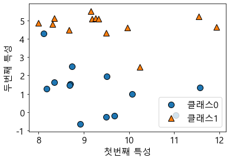
    


##### 회귀 알고리즘 

희귀 알고리즘 설명에는 인위적으로 만든 wave 데이터셋을 사용하겠습니다.


```python
x,y =mglearn.datasets.make_wave(n_samples=40)
plt.plot(x,y,'o')
plt.ylim(-3,3)
plt.xlabel('특성')
plt.ylabel('타깃')
```


    Text(0, 0.5, '타깃')


    
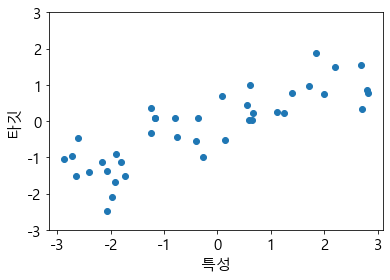
    


#### 사이킷런에 있는 유방암 데이터셋을 사용해보자 (분류)


```python
from sklearn.datasets import load_breast_cancer
cancer = load_breast_cancer()
cancer.keys()
```


    dict_keys(['data', 'target', 'frame', 'target_names', 'DESCR', 'feature_names', 'filename'])


```python
cancer.data.shape
```


    (569, 30)


```python
cancer.feature_names
```


    array(['mean radius', 'mean texture', 'mean perimeter', 'mean area',
           'mean smoothness', 'mean compactness', 'mean concavity',
           'mean concave points', 'mean symmetry', 'mean fractal dimension',
           'radius error', 'texture error', 'perimeter error', 'area error',
           'smoothness error', 'compactness error', 'concavity error',
           'concave points error', 'symmetry error',
           'fractal dimension error', 'worst radius', 'worst texture',
           'worst perimeter', 'worst area', 'worst smoothness',
           'worst compactness', 'worst concavity', 'worst concave points',
           'worst symmetry', 'worst fractal dimension'], dtype='<U23')


```python
cancer.DESCR
```


    '.. _breast_cancer_dataset:\n\nBreast cancer wisconsin (diagnostic) dataset\n--------------------------------------------\n\n**Data Set Characteristics:**\n\n    :Number of Instances: 569\n\n    :Number of Attributes: 30 numeric, predictive attributes and the class\n\n    :Attribute Information:\n        - radius (mean of distances from center to points on the perimeter)\n        - texture (standard deviation of gray-scale values)\n        - perimeter\n        - area\n        - smoothness (local variation in radius lengths)\n        - compactness (perimeter^2 / area - 1.0)\n        - concavity (severity of concave portions of the contour)\n        - concave points (number of concave portions of the contour)\n        - symmetry\n        - fractal dimension ("coastline approximation" - 1)\n\n        The mean, standard error, and "worst" or largest (mean of the three\n        worst/largest values) of these features were computed for each image,\n        resulting in 30 features.  For instance, field 0 is Mean Radius, field\n        10 is Radius SE, field 20 is Worst Radius.\n\n        - class:\n                - WDBC-Malignant\n                - WDBC-Benign\n\n    :Summary Statistics:\n\n    ===================================== ====== ======\n                                           Min    Max\n    ===================================== ====== ======\n    radius (mean):                        6.981  28.11\n    texture (mean):                       9.71   39.28\n    perimeter (mean):                     43.79  188.5\n    area (mean):                          143.5  2501.0\n    smoothness (mean):                    0.053  0.163\n    compactness (mean):                   0.019  0.345\n    concavity (mean):                     0.0    0.427\n    concave points (mean):                0.0    0.201\n    symmetry (mean):                      0.106  0.304\n    fractal dimension (mean):             0.05   0.097\n    radius (standard error):              0.112  2.873\n    texture (standard error):             0.36   4.885\n    perimeter (standard error):           0.757  21.98\n    area (standard error):                6.802  542.2\n    smoothness (standard error):          0.002  0.031\n    compactness (standard error):         0.002  0.135\n    concavity (standard error):           0.0    0.396\n    concave points (standard error):      0.0    0.053\n    symmetry (standard error):            0.008  0.079\n    fractal dimension (standard error):   0.001  0.03\n    radius (worst):                       7.93   36.04\n    texture (worst):                      12.02  49.54\n    perimeter (worst):                    50.41  251.2\n    area (worst):                         185.2  4254.0\n    smoothness (worst):                   0.071  0.223\n    compactness (worst):                  0.027  1.058\n    concavity (worst):                    0.0    1.252\n    concave points (worst):               0.0    0.291\n    symmetry (worst):                     0.156  0.664\n    fractal dimension (worst):            0.055  0.208\n    ===================================== ====== ======\n\n    :Missing Attribute Values: None\n\n    :Class Distribution: 212 - Malignant, 357 - Benign\n\n    :Creator:  Dr. William H. Wolberg, W. Nick Street, Olvi L. Mangasarian\n\n    :Donor: Nick Street\n\n    :Date: November, 1995\n\nThis is a copy of UCI ML Breast Cancer Wisconsin (Diagnostic) datasets.\nhttps://goo.gl/U2Uwz2\n\nFeatures are computed from a digitized image of a fine needle\naspirate (FNA) of a breast mass.  They describe\ncharacteristics of the cell nuclei present in the image.\n\nSeparating plane described above was obtained using\nMultisurface Method-Tree (MSM-T) [K. P. Bennett, "Decision Tree\nConstruction Via Linear Programming." Proceedings of the 4th\nMidwest Artificial Intelligence and Cognitive Science Society,\npp. 97-101, 1992], a classification method which uses linear\nprogramming to construct a decision tree.  Relevant features\nwere selected using an exhaustive search in the space of 1-4\nfeatures and 1-3 separating planes.\n\nThe actual linear program used to obtain the separating plane\nin the 3-dimensional space is that described in:\n[K. P. Bennett and O. L. Mangasarian: "Robust Linear\nProgramming Discrimination of Two Linearly Inseparable Sets",\nOptimization Methods and Software 1, 1992, 23-34].\n\nThis database is also available through the UW CS ftp server:\n\nftp ftp.cs.wisc.edu\ncd math-prog/cpo-dataset/machine-learn/WDBC/\n\n.. topic:: References\n\n   - W.N. Street, W.H. Wolberg and O.L. Mangasarian. Nuclear feature extraction \n     for breast tumor diagnosis. IS&T/SPIE 1993 International Symposium on \n     Electronic Imaging: Science and Technology, volume 1905, pages 861-870,\n     San Jose, CA, 1993.\n   - O.L. Mangasarian, W.N. Street and W.H. Wolberg. Breast cancer diagnosis and \n     prognosis via linear programming. Operations Research, 43(4), pages 570-577, \n     July-August 1995.\n   - W.H. Wolberg, W.N. Street, and O.L. Mangasarian. Machine learning techniques\n     to diagnose breast cancer from fine-needle aspirates. Cancer Letters 77 (1994) \n     163-171.'


##### 사이킷런에 있는 보스턴 주택가격 데이터셋을 사용해보자 (회귀 분석용)


```python
from sklearn.datasets import load_boston
boston = load_boston()
boston.data.shape
```


    (506, 13)


```python
x,y = mglearn.datasets.load_extended_boston()  # 특성끼리 곱한 (상호작용) 특성도 생각함. 이처럼 특성을 유도해내는 것을 특성공학!
x.shape
```


    (506, 104)


 ### k nn

 forge데이터셋을 분류


```python
mglearn.plots.plot_knn_classification(n_neighbors=1)
plt.show()
```

    C:\Users\s\anaconda3\lib\site-packages\sklearn\utils\deprecation.py:86: FutureWarning: Function make_blobs is deprecated; Please import make_blobs directly from scikit-learn
      warnings.warn(msg, category=FutureWarning)
    


    
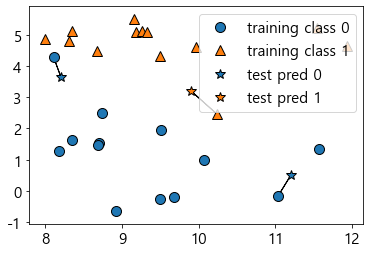
    


```python
mglearn.plots.plot_knn_classification(n_neighbors=3)
```

    C:\Users\s\anaconda3\lib\site-packages\sklearn\utils\deprecation.py:86: FutureWarning: Function make_blobs is deprecated; Please import make_blobs directly from scikit-learn
      warnings.warn(msg, category=FutureWarning)
    


    
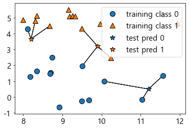
    


#### scikit-learn을 사용해 knn 알고리즘 적용


```python
from sklearn.model_selection import train_test_split
x,y = mglearn.datasets.make_forge()

x_train, x_test, y_train, y_test = train_test_split(x,y, random_state=0)
```

    C:\Users\s\anaconda3\lib\site-packages\sklearn\utils\deprecation.py:86: FutureWarning: Function make_blobs is deprecated; Please import make_blobs directly from scikit-learn
      warnings.warn(msg, category=FutureWarning)
    


```python
from sklearn.neighbors import KNeighborsClassifier
clf = KNeighborsClassifier(n_neighbors=3)
```


```python
clf.fit(x_train, y_train)
```


    KNeighborsClassifier(n_neighbors=3)


```python
clf.predict(x_test)
```


    array([1, 0, 1, 0, 1, 0, 0])


```python
clf.score(x_test, y_test)
```


    0.8571428571428571


#### knn 분석 xy평면에 그려 결졍 경계 확인하기


```python
fig, axes = plt.subplots(1,3, figsize=(10,3))

for n_neighbors, ax in zip([1,3,9], axes):
    #fit 메소드는 self 오브젝트를 리턴합니다.
    #그래서 객체 생성과 fit 메소드를 한 줄에 쓸 수 있다.
    clf = KNeighborsClassifier(n_neighbors=n_neighbors).fit(x,y)
    mglearn.plots.plot_2d_separator(clf,x,fill=True, eps=0.5, ax=ax, alpha=0.4)
    mglearn.discrete_scatter(x[:,0],x[:,1], y , ax=ax)
    ax.set_title("{}이웃".format(n_neighbors))
    ax.set_xlabel('특성 0')
    ax.set_ylabel('특성 1')
axes[0].legend(loc=3)
```


    <matplotlib.legend.Legend at 0x1822de428e0>


    
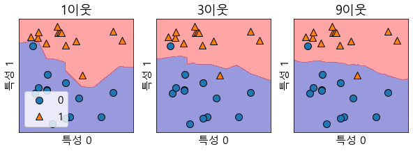
    


## neighbor의 값을 달리하여 일반화 사이의 관계를 입증해보자.


```python
from sklearn.datasets import load_breast_cancer

cancer = load_breast_cancer()
x_train, x_test, y_train, y_test = train_test_split(cancer.data, cancer.target, stratify=cancer.target, random_state=66)

training_accuracy=[]
test_accuracy=[]
#1~10 까지 neighbors를 적용
neighbors_settings = range(1,11)
for n_neighbors in neighbors_settings:
    #모델생성
    clf = KNeighborsClassifier(n_neighbors= n_neighbors)
    clf.fit(x_train, y_train)
    #훈련셋 정확도 저장
    training_accuracy.append(clf.score(x_train, y_train))
    #일반화 정확도 저장
    test_accuracy.append(clf.score(x_test, y_test))
    
plt.plot(neighbors_settings, training_accuracy, label='훈련 정확도')
plt.plot(neighbors_settings, test_accuracy, label = '테스트 정확도')
plt.ylabel('정확도')
plt.xlabel('n_neighbors')
plt.legend()
plt.show()
```


    
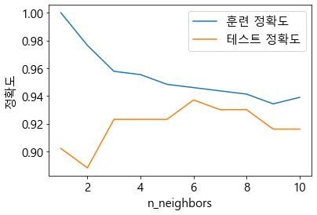
    


#### knn 회귀

knn 알고리즘은 회귀분석에도 쓰입니다. 이번에 wave 데이터셋을 이용해 최근접 이웃을 사용해보겠습니다.


```python
mglearn.plots.plot_knn_regression(n_neighbors=1)
```


    
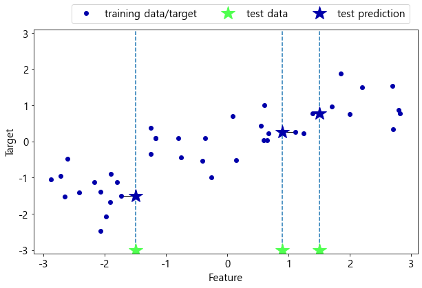
    


```python
mglearn.plots.plot_knn_regression(n_neighbors=3)
```


    
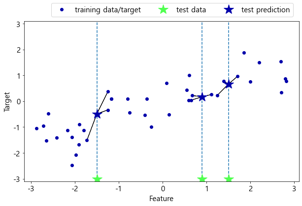
    


```python
from sklearn.neighbors import KNeighborsRegressor
x,y = mglearn.datasets.make_wave(n_samples=40)

#wave 데이터셋을 훈련 세트와 테스트 세트로 나눕니다.
x_train, x_test, y_train, y_test = train_test_split(x,y,random_state=0)

# 이웃의 수를 3으로 하여 모델의 객체를 만듭니다.
reg = KNeighborsRegressor(n_neighbors=3)
reg.fit(x_train, y_train)
```


    KNeighborsRegressor(n_neighbors=3)


```python
reg.predict(x_test)
```


    array([-0.05396539,  0.35686046,  1.13671923, -1.89415682, -1.13881398,
           -1.63113382,  0.35686046,  0.91241374, -0.44680446, -1.13881398])


이 또한 score 메소드를 사용해 모델을 평가할 수 있다. 회귀일 땐 R^2값을 반환


```python
reg.score(x_test, y_test)
```


    0.8344172446249605


### 선형 모델


```python
mglearn.plots.plot_linear_regression_wave()
```

    w[0]: 0.393906  b: -0.031804
    


    
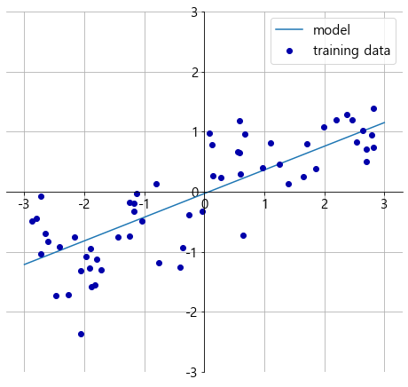
    


### 선형 회귀(최소제곱법)


```python
from sklearn.linear_model import LinearRegression
x,y = mglearn.datasets.make_wave(n_samples=60)
x_train, x_test, y_train, y_test = train_test_split(x,y, random_state=42)

lr = LinearRegression().fit(x_train, y_train)
```


```python
lr.coef_ # 기울기 파라미터
```


    array([0.39390555])


```python
lr.intercept_ # 절편 파라미터
```


    -0.031804343026759746


```python
lr.score(x_train, y_train ) # 훈련세트 점수
```


    0.6700890315075756


```python
lr.score(x_test, y_test) #테스트 셋 점수
```


    0.65933685968637


### 보스턴 주택가격 데이터셋을 활용해보자 ( 특성이 많은 고차원 데이터셋)


```python
x,y = mglearn.datasets.load_extended_boston()

x_train, x_test, y_train, y_test = train_test_split(x,y, random_state=0)
lr = LinearRegression().fit(x_train, y_train)
```


```python
lr.score(x_train, y_train ) # 훈련세트 점수
```


    0.9520519609032729


```python
lr.score(x_test, y_test) #테스트 셋 점수      # 훈련세트의 R^2 값은 매우 높지만 테스트 셋의 R^2 값은 매우낮다.
```


    0.6074721959665842


#### 리지 회귀

 리지 회귀의 과대적합이 되지않게 규제하는 방식 = L2 규제


```python
from sklearn.linear_model import Ridge

ridge = Ridge().fit(x_train, y_train)
ridge.score(x_train, y_train)
```


    0.8857966585170941


```python
ridge.score(x_test, y_test)  # 선형회귀보다 훈련데이터 스코어는 낮아지지만 일반화가 잘 된 모습을 보여준다.
```


    0.7527683481744758


#### 학습 곡선


```python
mglearn.plots.plot_ridge_n_samples()

```


    
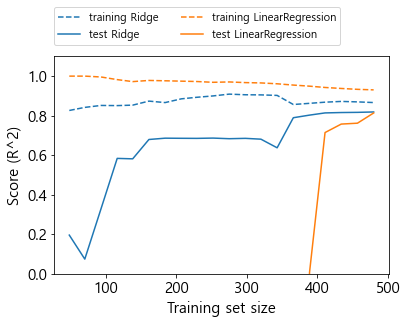
    


### 라소 회귀


```python
from sklearn.linear_model import Lasso
lasso = Lasso().fit(x_train, y_train)

```


```python
lasso.score(x_train, y_train)
```


    0.29323768991114596


```python
lasso.score(x_test, y_test)
```


    0.20937503255272272


```python
np.sum(lasso.coef_ !=0) # 사용한 특성의 수
```


    4


 alpha 매개변수를 변경해보자. 위는 너무 과소적합. 이렇게하려면 max_iter(반복하는 최대횟수) 늘려야한다.


```python
lasso001 = Lasso(alpha=0.01, max_iter=50000).fit(x_train, y_train)
lasso001.score(x_train, y_train)
```


    0.8962226511086497


```python
lasso001.score(x_test, y_test)
```


    0.7656571174549981


```python
np.sum(lasso001.coef_!=0)
```


    33


 ## 선형 분류 알고리즘
  * logistic regression (이진 분류)
  * support vector machine


```python
from sklearn.linear_model import LogisticRegression
from sklearn.svm import LinearSVC

x,y= mglearn.plots.plot_linear_svc_regularization()


```


    ---------------------------------------------------------------------------

    TypeError                                 Traceback (most recent call last)

    ~\AppData\Local\Temp/ipykernel_17148/3186428235.py in <module>
          2 from sklearn.svm import LinearSVC
          3 
    ----> 4 x,y= mglearn.plots.plot_linear_svc_regularization()
          5 
    

    TypeError: cannot unpack non-iterable NoneType object


    
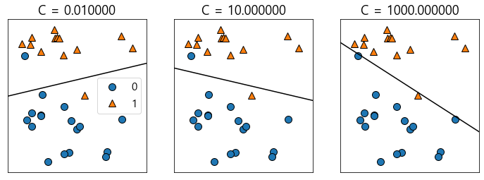
    


매개변수 c가 작으면 규제가 많아진다. 규제가 강해진 모델은 비교적 수평에 가까운 결정경계

c가 커질 수록 많이 기울어짐.

### Naive bayes 분류기

 * GaussianNB (연속적 데이터)
 * BernoulliNB (이진 데이터)
 * MultinomialNB (카운트 데이터 [예를들어 문장에 나타난 단어의 횟수] )

###### BernoulliNB 분류기

각 클래스의 특성 중 0이 아닌 것이 몇개인지 센다.


```python
x = np.array([[0,1,0,1],
              [1,0,1,1],
              [0,0,0,1],
              [1,0,1,0]])
y= np.array([0,1,0,1])
```


```python
counts={}
for label in np.unique(y):
    #각 클래스에 대해 반복
    # 특성마다 1이 나타난 횟수를 센다.
    counts[label]= x[y==label].sum(axis=0)
counts
```


    {0: array([0, 1, 0, 2]), 1: array([2, 0, 2, 1])}


## 결정 트리


```python
from sklearn.tree import DecisionTreeClassifier

cancer = load_breast_cancer()
x_trian, x_test, y_train, y_test = train_test_split(cancer.data, cancer.target, stratify=cancer.target, random_state=42)

```


```python
tree = DecisionTreeClassifier(random_state=0)
tree.fit(x_test, y_test)
```


    DecisionTreeClassifier(random_state=0)


```python
tree.score(x_test, y_test)
```


    1.0


```python
# 사전 가지치기로 깊이를 제한하면 과대적합이 줄어든다.
tree = DecisionTreeClassifier(max_depth=4, random_state=0)
tree.fit(x_test,y_test)
```


    DecisionTreeClassifier(max_depth=4, random_state=0)


```python
tree.score(x_test, y_test)
```


    1.0


##### 트리의 특성 중요도


```python
tree.feature_importances_
```


    array([0.        , 0.        , 0.        , 0.        , 0.        ,
           0.        , 0.        , 0.02767296, 0.02997904, 0.01463262,
           0.        , 0.        , 0.        , 0.        , 0.        ,
           0.        , 0.        , 0.        , 0.        , 0.        ,
           0.        , 0.        , 0.7819091 , 0.        , 0.02892515,
           0.01498952, 0.10189161, 0.        , 0.        , 0.        ])


```python
tree = mglearn.plots.plot_tree_not_monotone()
display(tree)
```

    Feature importances: [0. 1.]
    


    ---------------------------------------------------------------------------

    FileNotFoundError                         Traceback (most recent call last)

    ~\anaconda3\lib\site-packages\graphviz\backend\execute.py in run_check(cmd, input_lines, encoding, capture_output, quiet, **kwargs)
         82             assert iter(input_lines) is input_lines
    ---> 83             proc = _run_input_lines(cmd, input_lines, kwargs=kwargs)
         84         else:
    

    ~\anaconda3\lib\site-packages\graphviz\backend\execute.py in _run_input_lines(cmd, input_lines, kwargs)
        102 def _run_input_lines(cmd, input_lines, *, kwargs):
    --> 103     popen = subprocess.Popen(cmd, stdin=subprocess.PIPE, **kwargs)
        104 
    

    ~\anaconda3\lib\subprocess.py in __init__(self, args, bufsize, executable, stdin, stdout, stderr, preexec_fn, close_fds, shell, cwd, env, universal_newlines, startupinfo, creationflags, restore_signals, start_new_session, pass_fds, user, group, extra_groups, encoding, errors, text, umask)
        950 
    --> 951             self._execute_child(args, executable, preexec_fn, close_fds,
        952                                 pass_fds, cwd, env,
    

    ~\anaconda3\lib\subprocess.py in _execute_child(self, args, executable, preexec_fn, close_fds, pass_fds, cwd, env, startupinfo, creationflags, shell, p2cread, p2cwrite, c2pread, c2pwrite, errread, errwrite, unused_restore_signals, unused_gid, unused_gids, unused_uid, unused_umask, unused_start_new_session)
       1419             try:
    -> 1420                 hp, ht, pid, tid = _winapi.CreateProcess(executable, args,
       1421                                          # no special security
    

    FileNotFoundError: [WinError 2] 지정된 파일을 찾을 수 없습니다

    
    The above exception was the direct cause of the following exception:
    

    ExecutableNotFound                        Traceback (most recent call last)

    ~\anaconda3\lib\site-packages\IPython\core\formatters.py in __call__(self, obj, include, exclude)
        968 
        969             if method is not None:
    --> 970                 return method(include=include, exclude=exclude)
        971             return None
        972         else:
    

    ~\anaconda3\lib\site-packages\graphviz\jupyter_integration.py in _repr_mimebundle_(self, include, exclude, **_)
         96         include = set(include) if include is not None else {self._jupyter_mimetype}
         97         include -= set(exclude or [])
    ---> 98         return {mimetype: getattr(self, method_name)()
         99                 for mimetype, method_name in MIME_TYPES.items()
        100                 if mimetype in include}
    

    ~\anaconda3\lib\site-packages\graphviz\jupyter_integration.py in <dictcomp>(.0)
         96         include = set(include) if include is not None else {self._jupyter_mimetype}
         97         include -= set(exclude or [])
    ---> 98         return {mimetype: getattr(self, method_name)()
         99                 for mimetype, method_name in MIME_TYPES.items()
        100                 if mimetype in include}
    

    ~\anaconda3\lib\site-packages\graphviz\jupyter_integration.py in _repr_image_svg_xml(self)
        110     def _repr_image_svg_xml(self) -> str:
        111         """Return the rendered graph as SVG string."""
    --> 112         return self.pipe(format='svg', encoding=SVG_ENCODING)
    

    ~\anaconda3\lib\site-packages\graphviz\piping.py in pipe(self, format, renderer, formatter, quiet, engine, encoding)
         97             '<?xml version='
         98         """
    ---> 99         return self._pipe_legacy(format,
        100                                  renderer=renderer,
        101                                  formatter=formatter,
    

    ~\anaconda3\lib\site-packages\graphviz\_tools.py in wrapper(*args, **kwargs)
        170                               category=category)
        171 
    --> 172             return func(*args, **kwargs)
        173 
        174         return wrapper
    

    ~\anaconda3\lib\site-packages\graphviz\piping.py in _pipe_legacy(self, format, renderer, formatter, quiet, engine, encoding)
        112                      engine: typing.Optional[str] = None,
        113                      encoding: typing.Optional[str] = None) -> typing.Union[bytes, str]:
    --> 114         return self._pipe_future(format,
        115                                  renderer=renderer,
        116                                  formatter=formatter,
    

    ~\anaconda3\lib\site-packages\graphviz\piping.py in _pipe_future(self, format, renderer, formatter, quiet, engine, encoding)
        137             if codecs.lookup(encoding) is codecs.lookup(self.encoding):
        138                 # common case: both stdin and stdout need the same encoding
    --> 139                 return self._pipe_lines_string(*args, encoding=encoding, **kwargs)
        140             try:
        141                 raw = self._pipe_lines(*args, input_encoding=self.encoding, **kwargs)
    

    ~\anaconda3\lib\site-packages\graphviz\backend\piping.py in pipe_lines_string(engine, format, input_lines, encoding, renderer, formatter, quiet)
        194     kwargs = {'input_lines': input_lines, 'encoding': encoding}
        195 
    --> 196     proc = execute.run_check(cmd, capture_output=True, quiet=quiet, **kwargs)
        197     return proc.stdout
    

    ~\anaconda3\lib\site-packages\graphviz\backend\execute.py in run_check(cmd, input_lines, encoding, capture_output, quiet, **kwargs)
         86     except OSError as e:
         87         if e.errno == errno.ENOENT:
    ---> 88             raise ExecutableNotFound(cmd) from e
         89         raise
         90 
    

    ExecutableNotFound: failed to execute WindowsPath('dot'), make sure the Graphviz executables are on your systems' PATH


    <graphviz.sources.Source at 0x1eed8fd1220>


    
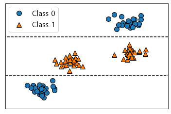
    


### DecisionTreeRegressor

 회귀를 위한 트리 기반 모델을 사용할 때 주의해야 할 점. 외삽(extrapolation) 즉 훈련데이터의 범위 밖 포인트에 대해 예측 불가.


```python
# 컴퓨터 메모리 가격 동향 데이터 셋
import os
ram_prices = pd.read_csv(os.path.join(mglearn.datasets.DATA_PATH, 'ram_price.csv'))

plt.yticks(fontname='Arial')
plt.semilogy(ram_prices.date, ram_prices.price)
plt.xlabel('년')
plt.ylabel('가격')
# y축은 로그 스케일 -> 로그 스케일로 그리면 약간의 굴곡을 제외하고 선형적으로 나타나 비교적 예측하기가 쉬워짐
```


    Text(0, 0.5, '가격')


    
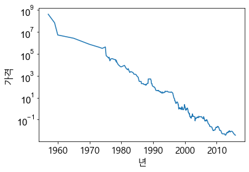
    


```python
### decisiontreeregressor / linearregression 차이를 보자.
```


```python
from sklearn.tree import DecisionTreeRegressor
#2000년 이전을 훈련, 2000년 이후를 테스트 데이터로 만든다.
data_train = ram_prices[ram_prices.date < 2000]
data_test = ram_prices[ram_prices.date<2000]

#가격 예측을 위해 날짜 특성만을 이용한다.
x_train = data_train.date.to_numpy()[:, np.newaxis]
#데이터와 타깃 사이의 관계를 간단하게 만들기 위해 로그 스케일로 바꾼다.
y_train = np.log(data_train.price)

tree = DecisionTreeRegressor().fit(x_train, y_train)
linear_reg = LinearRegression().fit(x_train, y_train)

#예측은 전체 기간에 대해 수행
x_all = ram_prices.date.to_numpy()[:,np.newaxis]

pred_tree = tree.predict(x_all)
pred_lr = linear_reg.predict(x_all)

#예측한 값의 로그 스케일을 되돌립니다.
price_tree = np.exp(pred_tree)
price_lr = np.exp(pred_lr)
```

 결정 트리의 장점  
 1. 만들어진 모델을 쉽게 시각화 할 수 있어 비전문가도 이해하기 쉽다.(비교적 작은트리일 때)
 2. 데이터의 스케일에 영향을 받지 않으므로 스케일이 서로 다르거나 이진 특성과 연속적인 특성이 혼합되어 있을 때도 잘 작동
 
 결정 트리의 단점
 1. 사진 가지치기를 사용함에도 불구하고 과대적합 되는 경향이 있다.
 

## 결정 트리의 앙상블 -> 랜덤포레스트 / 그레이디언트 부스팅

#### 랜덤포레스트


```python
from sklearn.ensemble import RandomForestClassifier
from sklearn.datasets import make_moons

x,y = make_moons(n_samples=100, noise = 0.25, random_state=3)

x_train, x_test, y_train, y_test = train_test_split(x,y, stratify=y, random_state=42)

forest = RandomForestClassifier(n_estimators=5, random_state=2)
forest.fit(x_train, y_train)
```


    RandomForestClassifier(n_estimators=5, random_state=2)


```python
forest.score(x_test, y_test)
```


    0.92


## 그레이디언트 부스팅 회귀 트리


```python
from sklearn.datasets import load_breast_cancer
cancer = load_breast_cancer()
from sklearn.ensemble import GradientBoostingClassifier

x_train, x_test, y_train, y_test = train_test_split(cancer.data, cancer.target, random_state=0)
gbrt = GradientBoostingClassifier(random_state=0)
gbrt.fit(x_train, y_train)
```


    GradientBoostingClassifier(random_state=0)


```python
 gbrt.score(x_train,y_train) #1이 나왔네 ... 과대적합? -> 최대깊이를 줄이거나 학습률 낮춰보자
```


    1.0


```python
gbrt.score(x_test,y_test)
```


    0.965034965034965


```python
gbrt = GradientBoostingClassifier(random_state=0, max_depth=1)
gbrt.fit(x_train, y_train)
```


    GradientBoostingClassifier(max_depth=1, random_state=0)


```python
gbrt.score(x_train,y_train)
```


    0.9906103286384976


```python
gbrt.score(x_test,y_test)
```


    0.972027972027972


```python
gbrt = GradientBoostingClassifier(random_state=0, learning_rate= 0.01)
gbrt.fit(x_train, y_train)
```


    GradientBoostingClassifier(learning_rate=0.01, random_state=0)


```python
gbrt.score(x_train,y_train)
```


    0.9882629107981221


```python
gbrt.score(x_test,y_test)
```


    0.965034965034965


```python
gbrt.feature_importances_
```


    array([0.00000000e+00, 9.07529959e-03, 0.00000000e+00, 0.00000000e+00,
           0.00000000e+00, 0.00000000e+00, 8.32035766e-03, 2.65686907e-01,
           3.49588341e-04, 0.00000000e+00, 0.00000000e+00, 3.00083378e-04,
           0.00000000e+00, 1.45838255e-02, 1.05083243e-03, 0.00000000e+00,
           4.75469106e-03, 0.00000000e+00, 9.56890421e-04, 0.00000000e+00,
           9.23939383e-03, 1.61819935e-02, 3.22495788e-01, 9.24249926e-02,
           6.44041105e-03, 0.00000000e+00, 6.85101108e-03, 2.31450675e-01,
           6.41500790e-03, 3.42225071e-03])


## 배깅, 엑스타트리, 에이다부스트


```python

from sklearn.model_selection import train_test_split
from sklearn.datasets import make_moons
from sklearn.datasets import load_breast_cancer

xm,ym = make_moons(n_samples=100, noise=0.25, random_state=3)
xm_train, xm_test, ym_train, ym_test = train_test_split(xm,ym,stratify=ym, random_state=42)

cancaer=load_breast_cancer()
xc_train, xc_test, yc_train, yc_test = train_test_split(cancer.data, cancer.target, random_state=0)
```

    Collecting tensorflow
      Downloading tensorflow-2.8.0-cp39-cp39-win_amd64.whl (438.0 MB)
    Collecting tensorboard<2.9,>=2.8
      Downloading tensorboard-2.8.0-py3-none-any.whl (5.8 MB)
    Requirement already satisfied: h5py>=2.9.0 in c:\users\s\anaconda3\lib\site-packages (from tensorflow) (3.2.1)
    Requirement already satisfied: setuptools in c:\users\s\anaconda3\lib\site-packages (from tensorflow) (58.0.4)
    Requirement already satisfied: wrapt>=1.11.0 in c:\users\s\anaconda3\lib\site-packages (from tensorflow) (1.12.1)
    Collecting tensorflow-io-gcs-filesystem>=0.23.1
      Downloading tensorflow_io_gcs_filesystem-0.24.0-cp39-cp39-win_amd64.whl (1.5 MB)
    Collecting absl-py>=0.4.0
      Downloading absl_py-1.0.0-py3-none-any.whl (126 kB)
    Collecting libclang>=9.0.1
      Downloading libclang-13.0.0-py2.py3-none-win_amd64.whl (13.9 MB)
    Collecting gast>=0.2.1
      Downloading gast-0.5.3-py3-none-any.whl (19 kB)
    Requirement already satisfied: typing-extensions>=3.6.6 in c:\users\s\anaconda3\lib\site-packages (from tensorflow) (3.10.0.2)
    Collecting tf-estimator-nightly==2.8.0.dev2021122109
      Downloading tf_estimator_nightly-2.8.0.dev2021122109-py2.py3-none-any.whl (462 kB)
    Collecting keras-preprocessing>=1.1.1
      Downloading Keras_Preprocessing-1.1.2-py2.py3-none-any.whl (42 kB)
    Collecting google-pasta>=0.1.1
      Downloading google_pasta-0.2.0-py3-none-any.whl (57 kB)
    Collecting termcolor>=1.1.0
      Downloading termcolor-1.1.0.tar.gz (3.9 kB)
    Collecting opt-einsum>=2.3.2
      Downloading opt_einsum-3.3.0-py3-none-any.whl (65 kB)
    Collecting grpcio<2.0,>=1.24.3
      Downloading grpcio-1.43.0-cp39-cp39-win_amd64.whl (3.4 MB)
    Collecting flatbuffers>=1.12
      Downloading flatbuffers-2.0-py2.py3-none-any.whl (26 kB)
    Requirement already satisfied: numpy>=1.20 in c:\users\s\anaconda3\lib\site-packages (from tensorflow) (1.20.3)
    Collecting protobuf>=3.9.2
      Downloading protobuf-3.19.4-cp39-cp39-win_amd64.whl (895 kB)
    Collecting keras<2.9,>=2.8.0rc0
      Downloading keras-2.8.0-py2.py3-none-any.whl (1.4 MB)
    Collecting astunparse>=1.6.0
      Downloading astunparse-1.6.3-py2.py3-none-any.whl (12 kB)
    Requirement already satisfied: six>=1.12.0 in c:\users\s\anaconda3\lib\site-packages (from tensorflow) (1.16.0)
    Requirement already satisfied: wheel<1.0,>=0.23.0 in c:\users\s\anaconda3\lib\site-packages (from astunparse>=1.6.0->tensorflow) (0.37.0)
    Requirement already satisfied: werkzeug>=0.11.15 in c:\users\s\anaconda3\lib\site-packages (from tensorboard<2.9,>=2.8->tensorflow) (2.0.2)
    Collecting tensorboard-plugin-wit>=1.6.0
      Downloading tensorboard_plugin_wit-1.8.1-py3-none-any.whl (781 kB)
    Collecting tensorboard-data-server<0.7.0,>=0.6.0
      Downloading tensorboard_data_server-0.6.1-py3-none-any.whl (2.4 kB)
    Collecting google-auth-oauthlib<0.5,>=0.4.1
      Downloading google_auth_oauthlib-0.4.6-py2.py3-none-any.whl (18 kB)
    Collecting google-auth<3,>=1.6.3
      Downloading google_auth-2.6.0-py2.py3-none-any.whl (156 kB)
    Requirement already satisfied: requests<3,>=2.21.0 in c:\users\s\anaconda3\lib\site-packages (from tensorboard<2.9,>=2.8->tensorflow) (2.26.0)
    Collecting markdown>=2.6.8
      Downloading Markdown-3.3.6-py3-none-any.whl (97 kB)
    Collecting pyasn1-modules>=0.2.1
      Downloading pyasn1_modules-0.2.8-py2.py3-none-any.whl (155 kB)
    Collecting rsa<5,>=3.1.4
      Downloading rsa-4.8-py3-none-any.whl (39 kB)
    Collecting cachetools<6.0,>=2.0.0
      Downloading cachetools-5.0.0-py3-none-any.whl (9.1 kB)
    Collecting requests-oauthlib>=0.7.0
      Downloading requests_oauthlib-1.3.1-py2.py3-none-any.whl (23 kB)
    Requirement already satisfied: importlib-metadata>=4.4 in c:\users\s\anaconda3\lib\site-packages (from markdown>=2.6.8->tensorboard<2.9,>=2.8->tensorflow) (4.8.1)
    Requirement already satisfied: zipp>=0.5 in c:\users\s\anaconda3\lib\site-packages (from importlib-metadata>=4.4->markdown>=2.6.8->tensorboard<2.9,>=2.8->tensorflow) (3.6.0)
    Collecting pyasn1<0.5.0,>=0.4.6
      Downloading pyasn1-0.4.8-py2.py3-none-any.whl (77 kB)
    Requirement already satisfied: charset-normalizer~=2.0.0 in c:\users\s\anaconda3\lib\site-packages (from requests<3,>=2.21.0->tensorboard<2.9,>=2.8->tensorflow) (2.0.4)
    Requirement already satisfied: certifi>=2017.4.17 in c:\users\s\anaconda3\lib\site-packages (from requests<3,>=2.21.0->tensorboard<2.9,>=2.8->tensorflow) (2021.10.8)
    Requirement already satisfied: idna<4,>=2.5 in c:\users\s\anaconda3\lib\site-packages (from requests<3,>=2.21.0->tensorboard<2.9,>=2.8->tensorflow) (3.2)
    Requirement already satisfied: urllib3<1.27,>=1.21.1 in c:\users\s\anaconda3\lib\site-packages (from requests<3,>=2.21.0->tensorboard<2.9,>=2.8->tensorflow) (1.26.7)
    Collecting oauthlib>=3.0.0
      Downloading oauthlib-3.2.0-py3-none-any.whl (151 kB)
    Building wheels for collected packages: termcolor
      Building wheel for termcolor (setup.py): started
      Building wheel for termcolor (setup.py): finished with status 'done'
      Created wheel for termcolor: filename=termcolor-1.1.0-py3-none-any.whl size=4847 sha256=1379a8b3db7f3fefd53707563386f5764a14cc1f205ba6074cb293310b9b6138
      Stored in directory: c:\users\s\appdata\local\pip\cache\wheels\b6\0d\90\0d1bbd99855f99cb2f6c2e5ff96f8023fad8ec367695f7d72d
    Successfully built termcolor
    Installing collected packages: pyasn1, rsa, pyasn1-modules, oauthlib, cachetools, requests-oauthlib, google-auth, tensorboard-plugin-wit, tensorboard-data-server, protobuf, markdown, grpcio, google-auth-oauthlib, absl-py, tf-estimator-nightly, termcolor, tensorflow-io-gcs-filesystem, tensorboard, opt-einsum, libclang, keras-preprocessing, keras, google-pasta, gast, flatbuffers, astunparse, tensorflow
    Successfully installed absl-py-1.0.0 astunparse-1.6.3 cachetools-5.0.0 flatbuffers-2.0 gast-0.5.3 google-auth-2.6.0 google-auth-oauthlib-0.4.6 google-pasta-0.2.0 grpcio-1.43.0 keras-2.8.0 keras-preprocessing-1.1.2 libclang-13.0.0 markdown-3.3.6 oauthlib-3.2.0 opt-einsum-3.3.0 protobuf-3.19.4 pyasn1-0.4.8 pyasn1-modules-0.2.8 requests-oauthlib-1.3.1 rsa-4.8 tensorboard-2.8.0 tensorboard-data-server-0.6.1 tensorboard-plugin-wit-1.8.1 tensorflow-2.8.0 tensorflow-io-gcs-filesystem-0.24.0 termcolor-1.1.0 tf-estimator-nightly-2.8.0.dev2021122109
    

## 배깅

배깅은 중복을 허용한 랜덤 샘플링으로 만든 훈련세트를 사용해 분류기를 각기 다르게 학습

 *  배깅을 사용해 cancer 데이터셋에 로지스틱 회귀모델을 100개 훈련하여 앙상블해보자


```python
from sklearn.linear_model import LogisticRegression
from sklearn.ensemble import BaggingClassifier
bagging = BaggingClassifier(LogisticRegression(), n_estimators=100, oob_score=True, n_jobs=-1, random_state=42)
bagging.fit(xc_train, yc_train)
```


    BaggingClassifier(base_estimator=LogisticRegression(), n_estimators=100,
                      n_jobs=-1, oob_score=True, random_state=42)


```python
bagging.score(xc_train,yc_train)
```


    0.9553990610328639


```python
bagging.score(xc_test, yc_test)
```


    0.951048951048951


```python
bagging.oob_score_
```


    0.9436619718309859


```python
from sklearn.tree import DecisionTreeClassifier
bagging = BaggingClassifier(DecisionTreeClassifier(), n_estimators=5, n_jobs=-1, random_state=42)
bagging.fit(xm_train,ym_train)
```


    BaggingClassifier(base_estimator=DecisionTreeClassifier(), n_estimators=5,
                      n_jobs=-1, random_state=42)


```python
bagging = BaggingClassifier(DecisionTreeClassifier(), n_estimators=100, oob_score=True, n_jobs=-1, random_state=42)
bagging.fit(xc_train,yc_train)
```


    BaggingClassifier(base_estimator=DecisionTreeClassifier(), n_estimators=100,
                      n_jobs=-1, oob_score=True, random_state=42)


```python
bagging.score(xc_train,yc_train)
```


    1.0


```python
bagging.score(xc_test, yc_test)
```


    0.965034965034965


```python
bagging.oob_score_
```


    0.9483568075117371


### 에이다 부스트


```python
from sklearn.ensemble import AdaBoostClassifier
ada = AdaBoostClassifier(n_estimators=100, random_state=42)
ada.fit(xc_train,yc_train)
```


    AdaBoostClassifier(n_estimators=100, random_state=42)


```python
ada.score(xc_train, yc_train)
```


    1.0


```python
ada.score(xc_test, yc_test)
```


    0.986013986013986


## svm 매개변수 튜닝


```python
fig, axes = plt.subplots(3,3, figsize=(15,10))

for ax, C in zip(axes,[-1,0,3]):
    for a, gamma in zip(ax, range(-1,2)):
        mglearn.plots.plot_svm(log_C=C, log_gamma=gamma, ax=a)
        
axes[0,0].legend(['클래스 0', '클래스1', '클래스 0 서포트벡터','클래스 1 서포트 벡터'], ncol=4, loc=(.9,1.2))
    
```


    <matplotlib.legend.Legend at 0x230868c4df0>


    
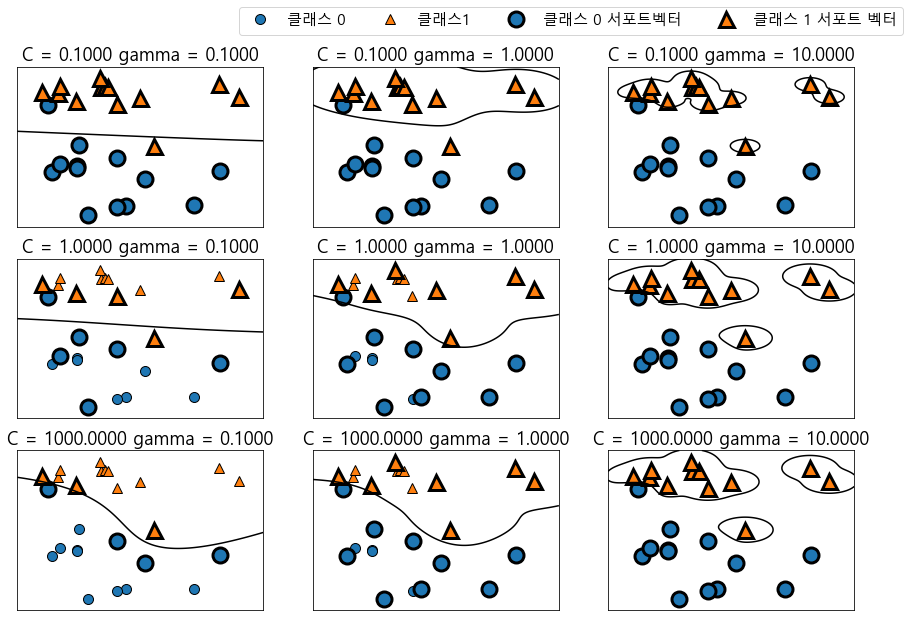
    


### svm을 위한 데이터 전처리


```python
#훈련 세트에서 특성별 최솟값 계산
min_on_training = x_train.min(axis=0)
#훈련 세트에서 특성별 (최대-최소) 범위 계산
range_on_training = (x_train- min_on_training).max(axis=0)

#훈련 데이터에 최솟값은 빼고 범위로 나누면
#각 특성에 대해 최솟값은 0 최댓값은 1
x_train_scaled = (x_train - min_on_training) / range_on_training

```


```python
x_train_scaled.min(axis=0)
```


    array([0., 0., 0., 0., 0., 0., 0., 0., 0., 0., 0., 0., 0., 0., 0., 0., 0.,
           0., 0., 0., 0., 0., 0., 0., 0., 0., 0., 0., 0., 0.])


```python
x_train_scaled.max(axis=0)
```


    array([1., 1., 1., 1., 1., 1., 1., 1., 1., 1., 1., 1., 1., 1., 1., 1., 1.,
           1., 1., 1., 1., 1., 1., 1., 1., 1., 1., 1., 1., 1.])


```python
#테스트 세트에도 같은 작업을 적용하지만
#훈련 세트에서 계산한 최솟값과 범위를 사용
x_test_scaled = (x_test - min_on_training) / range_on_training
```


```python
from sklearn import svm
svc=SVC()
scv.fit(x_train_scaled, y_train)
```


```python

```


```python

```


```python

```


```python

```
