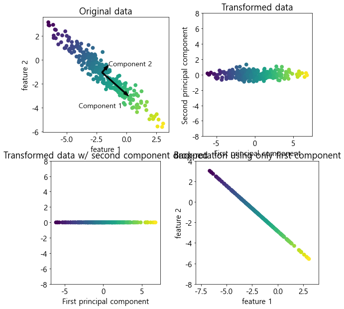
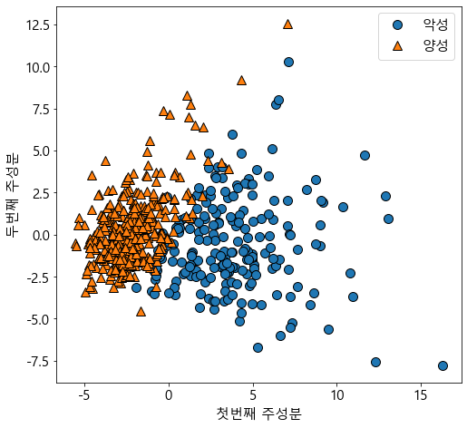
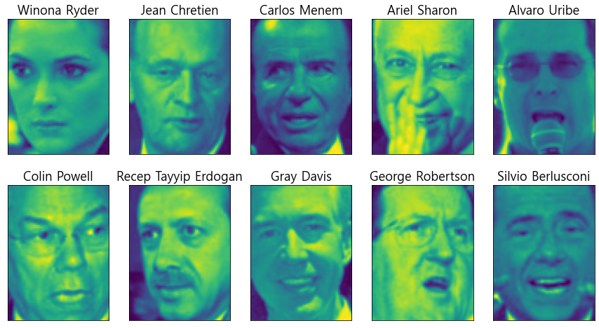

## 여러가지 전처리 방법


```python
from IPython.display import display
import numpy as np
import matplotlib.pyplot as plt
import pandas as pd
import mglearn
import matplotlib
from sklearn.model_selection import train_test_split
matplotlib.rcParams['font.family'] = 'Malgun Gothic' #window
##matplotlib.rcParams['font.family'] = 'AppltGothic' #mac
matplotlib.rcParams['font.size'] = 15 #글자크기\
matplotlib.rcParams['axes.unicode_minus'] = False # 한글 폰트 사용시 마이너스 글자가 깨지는 현상을 해결

from sklearn.datasets import load_breast_cancer
from sklearn.model_selection import train_test_split

from sklearn.preprocessing import MinMaxScaler

import matplotlib.pyplot as plt
import numpy as np
from sklearn.datasets import make_blobs
from sklearn.preprocessing import QuantileTransformer, StandardScaler, PowerTransformer
from sklearn.svm import SVC
from sklearn.decomposition import PCA
```


```python
from sklearn.datasets import load_breast_cancer
from sklearn.model_selection import train_test_split
cancer = load_breast_cancer()

x_train,x_test,y_train,y_test = train_test_split(cancer.data, cancer.target, random_state=1)

print(x_train.shape)
print(x_test.shape)
print(cancer.data.shape)
```

    (426, 30)
    (143, 30)
    (569, 30)
    


```python
from sklearn.preprocessing import MinMaxScaler

scaler = MinMaxScaler()
```


```python
scaler.fit(x_train)
```


    MinMaxScaler()


```python
#데이터 변환
x_train_scaled = scaler.transform(x_train)
#스케일이 조정된 후 데이터셋의 속성을 출력해보자
```


```python
print(x_train_scaled.shape)
print(x_train.min(axis=0))
print(x_train.max(axis=0))
print(x_train_scaled.min(axis=0))
print(x_train_scaled.max(axis=0))
```

    (426, 30)
    [6.981e+00 9.710e+00 4.379e+01 1.435e+02 5.263e-02 1.938e-02 0.000e+00
     0.000e+00 1.060e-01 5.024e-02 1.153e-01 3.602e-01 7.570e-01 6.802e+00
     1.713e-03 2.252e-03 0.000e+00 0.000e+00 9.539e-03 8.948e-04 7.930e+00
     1.202e+01 5.041e+01 1.852e+02 7.117e-02 2.729e-02 0.000e+00 0.000e+00
     1.566e-01 5.521e-02]
    [2.811e+01 3.928e+01 1.885e+02 2.501e+03 1.634e-01 2.867e-01 4.268e-01
     2.012e-01 3.040e-01 9.575e-02 2.873e+00 4.885e+00 2.198e+01 5.422e+02
     3.113e-02 1.354e-01 3.960e-01 5.279e-02 6.146e-02 2.984e-02 3.604e+01
     4.954e+01 2.512e+02 4.254e+03 2.226e-01 9.379e-01 1.170e+00 2.910e-01
     5.774e-01 1.486e-01]
    [0. 0. 0. 0. 0. 0. 0. 0. 0. 0. 0. 0. 0. 0. 0. 0. 0. 0. 0. 0. 0. 0. 0. 0.
     0. 0. 0. 0. 0. 0.]
    [1. 1. 1. 1. 1. 1. 1. 1. 1. 1. 1. 1. 1. 1. 1. 1. 1. 1. 1. 1. 1. 1. 1. 1.
     1. 1. 1. 1. 1. 1.]
    


```python
#테스트 데이터 변환
x_test_scaled = scaler.transform(x_test)
#스케일이 조정된 후 테스트 데이터의 속성을 출력
print(x_test_scaled.min(axis=0))
print(x_test_scaled.max(axis=0))
```

    [ 0.0336031   0.0226581   0.03144219  0.01141039  0.14128374  0.04406704
      0.          0.          0.1540404  -0.00615249 -0.00137796  0.00594501
      0.00430665  0.00079567  0.03919502  0.0112206   0.          0.
     -0.03191387  0.00664013  0.02660975  0.05810235  0.02031974  0.00943767
      0.1094235   0.02637792  0.          0.         -0.00023764 -0.00182032]
    [0.9578778  0.81501522 0.95577362 0.89353128 0.81132075 1.21958701
     0.87956888 0.9333996  0.93232323 1.0371347  0.42669616 0.49765736
     0.44117231 0.28371044 0.48703131 0.73863671 0.76717172 0.62928585
     1.33685792 0.39057253 0.89612238 0.79317697 0.84859804 0.74488793
     0.9154725  1.13188961 1.07008547 0.92371134 1.20532319 1.63068851]
    

#### qountile transformer 와 powertransformer

robustscaler 와 비슷하게 이상치에 민감하지 않으며 전체 데이터를 0~1사이로 압축

기본적으로 1000개 분위를 사용


```python
import matplotlib.pyplot as plt
import numpy as np
from sklearn.datasets import make_blobs
from sklearn.preprocessing import QuantileTransformer, StandardScaler, PowerTransformer
```

#### 단축 메서드와 효율적인 방법


```python
from sklearn.preprocessing import StandardScaler
scaler = StandardScaler()
#메소드 체이닝을 사용하여 fit과 transform을 연달아 호출합니다
x_scaled = scaler.fit(x_train).transform(x_train)
#위와 동일하지만 더 효율적
x_scaled_d = scaler.fit_transform(x_train)
```

### 지도 학습에서 데이터 전처리 효과


```python
# 전처리전
from sklearn.svm import SVC
x_train, x_test, y_train, y_test = train_test_split(cancer.data, cancer.target, random_state=0)

svm = SVC(gamma='auto')
svm.fit(x_train, y_train)
svm.score(x_test, y_test) 
```


    0.6293706293706294


```python
# 전처리후
# 0~1 사이로 스케일 조정
scaler = MinMaxScaler()
scaler.fit(x_train)
x_train_scaled = scaler.transform(x_train)
x_test_scaled = scaler.transform(x_test)

#조정된 데이터로 svm 학습
svm.fit(x_train_scaled,y_train)

# 스케일 조정된 테스트 세트의 정확도
svm.score(x_test_scaled, y_test)
```


    0.951048951048951


```python
#standardscaler 사용
scaler = StandardScaler()
scaler.fit(x_train)
x_train_scaled = scaler.transform(x_train)
x_test_scaled = scaler.transform(x_test)

#조정된 데이터로 svm 학습
svm.fit(x_train_scaled,y_train)

# 스케일 조정된 테스트 세트의 정확도
svm.score(x_test_scaled, y_test)

```


    0.965034965034965


### 주성분분석 ( pca )


```python
mglearn.plots.plot_pca_illustration()
```


    

    


```python
from sklearn.datasets import load_breast_cancer
cancer = load_breast_cancer()

scaler= StandardScaler()
scaler.fit(cancer.data)
x_scaled = scaler.transform(cancer.data)
```


```python
from sklearn.decomposition import PCA
#데이터의 처음 두개 주성분만 유지시킵니다.
pca = PCA(n_components=2)
#유방암 데이터로 pca 모델을 만듭니다.
pca.fit(x_scaled)

#처음 두개의 주성분을 사용해 데이터를 변환합니다.
x_pca = pca.transform(x_scaled)
print(str(x_scaled.shape)) #원본데이터형태
print(str(x_pca.shape))    #축소된 데이터 형태
```

    (569, 30)
    (569, 2)
    


```python
#클래스를 색깔로 구분하여 처음 두개의 주성분을 그래프로 나타냅니다.
plt.figure(figsize=(8,8))
mglearn.discrete_scatter(x_pca[:,0], x_pca[:,1], cancer.target)
plt.legend(['악성', '양성'], loc='best')
plt.gca().set_aspect('equal')
plt.xlabel('첫번째 주성분')
plt.ylabel('두번째 주성분')
```


    Text(0, 0.5, '두번째 주성분')


    

    


### 고유얼굴 특성 추출


```python
from sklearn.datasets import fetch_lfw_people
people = fetch_lfw_people(min_faces_per_person=20, resize=0.7)
image_shape = people.images[0].shape

fig, axes = plt.subplots(2,5, figsize=(15,8), subplot_kw={'xticks': (), 'yticks' :()})

for target, image, ax in zip(people.target, people.images, axes.ravel()):
    ax.imshow(image)
    ax.set_title(people.target_names[target])
```


    

    


```python
people.images.shape
```


    (3023, 87, 65)


```python
len(people.target_names)
```


    62


```python

```


```python

```


```python

```


```python

```


```python

```


```python

```


```python

```


```python

```


```python

```


```python

```


```python

```


```python

```


```python

```


```python

```


```python

```


```python

```


```python

```


```python

```


```python

```


```python

```


```python

```


```python

```


```python

```


```python

```


```python

```


```python

```


```python

```


```python

```


```python

```


```python

```


```python

```


```python

```


```python

```


```python

```


```python

```


```python

```


```python

```


```python

```


```python

```


```python

```


```python

```


```python

```


```python

```
