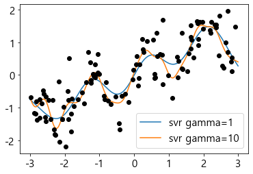

## one-hot-encoding(가변수 = 더미변수)


```python
from IPython.display import display
import numpy as np
import matplotlib.pyplot as plt
import pandas as pd
import mglearn
import matplotlib
from sklearn.model_selection import train_test_split
matplotlib.rcParams['font.family'] = 'Malgun Gothic' #window
##matplotlib.rcParams['font.family'] = 'AppltGothic' #mac
matplotlib.rcParams['font.size'] = 15 #글자크기\
matplotlib.rcParams['axes.unicode_minus'] = False # 한글 폰트 사용시 마이너스 글자가 깨지는 현상을 해결

from sklearn.datasets import load_breast_cancer
from sklearn.model_selection import train_test_split

from sklearn.preprocessing import MinMaxScaler

import matplotlib.pyplot as plt
import numpy as np
from sklearn.datasets import make_blobs
from sklearn.preprocessing import QuantileTransformer, StandardScaler, PowerTransformer
from sklearn.svm import SVC
from sklearn.decomposition import PCA
```


```python
import os
#이 파일은 열 이름을 나타내는 헤더가 없으므로 header = none 으로 지정하고
#'name'매개변수로 열이름을 제공하자
data = pd.read_csv(os.path.join(mglearn.datasets.DATA_PATH, 'adult.data'), header=None, index_col = False, 
                   names=['age','workclass','fnlwgt','education','education-num','marital-status','occupation','relationship','race',
                       'gender','capital-gain','capital-loss','hours-per-week','native-country','income'])
#예제를 위해 몇개의 열만 선택합니다.
data = data[['age','workclass','education','gender','hours-per-week','occupation','income']]

#ipython.display 함수는 주피터 노트북을 위해 포맷팅된 출력을 만듭니다.
display(data.head())


```


<div>
<style scoped>
    .dataframe tbody tr th:only-of-type {
        vertical-align: middle;
    }

    .dataframe tbody tr th {
        vertical-align: top;
    }

    .dataframe thead th {
        text-align: right;
    }
</style>
<table border="1" class="dataframe">
  <thead>
    <tr style="text-align: right;">
      <th></th>
      <th>age</th>
      <th>workclass</th>
      <th>education</th>
      <th>gender</th>
      <th>hours-per-week</th>
      <th>occupation</th>
      <th>income</th>
    </tr>
  </thead>
  <tbody>
    <tr>
      <th>0</th>
      <td>39</td>
      <td>State-gov</td>
      <td>Bachelors</td>
      <td>Male</td>
      <td>40</td>
      <td>Adm-clerical</td>
      <td>&lt;=50K</td>
    </tr>
    <tr>
      <th>1</th>
      <td>50</td>
      <td>Self-emp-not-inc</td>
      <td>Bachelors</td>
      <td>Male</td>
      <td>13</td>
      <td>Exec-managerial</td>
      <td>&lt;=50K</td>
    </tr>
    <tr>
      <th>2</th>
      <td>38</td>
      <td>Private</td>
      <td>HS-grad</td>
      <td>Male</td>
      <td>40</td>
      <td>Handlers-cleaners</td>
      <td>&lt;=50K</td>
    </tr>
    <tr>
      <th>3</th>
      <td>53</td>
      <td>Private</td>
      <td>11th</td>
      <td>Male</td>
      <td>40</td>
      <td>Handlers-cleaners</td>
      <td>&lt;=50K</td>
    </tr>
    <tr>
      <th>4</th>
      <td>28</td>
      <td>Private</td>
      <td>Bachelors</td>
      <td>Female</td>
      <td>40</td>
      <td>Prof-specialty</td>
      <td>&lt;=50K</td>
    </tr>
  </tbody>
</table>
</div>


```python
data.gender.value_counts()
```


     Male      21790
     Female    10771
    Name: gender, dtype: int64


```python
list(data.columns)
```


    ['age',
     'workclass',
     'education',
     'gender',
     'hours-per-week',
     'occupation',
     'income']


```python
data_dummies=pd.get_dummies(data)
```


```python
list(data_dummies.columns)
```


    ['age',
     'hours-per-week',
     'workclass_ ?',
     'workclass_ Federal-gov',
     'workclass_ Local-gov',
     'workclass_ Never-worked',
     'workclass_ Private',
     'workclass_ Self-emp-inc',
     'workclass_ Self-emp-not-inc',
     'workclass_ State-gov',
     'workclass_ Without-pay',
     'education_ 10th',
     'education_ 11th',
     'education_ 12th',
     'education_ 1st-4th',
     'education_ 5th-6th',
     'education_ 7th-8th',
     'education_ 9th',
     'education_ Assoc-acdm',
     'education_ Assoc-voc',
     'education_ Bachelors',
     'education_ Doctorate',
     'education_ HS-grad',
     'education_ Masters',
     'education_ Preschool',
     'education_ Prof-school',
     'education_ Some-college',
     'gender_ Female',
     'gender_ Male',
     'occupation_ ?',
     'occupation_ Adm-clerical',
     'occupation_ Armed-Forces',
     'occupation_ Craft-repair',
     'occupation_ Exec-managerial',
     'occupation_ Farming-fishing',
     'occupation_ Handlers-cleaners',
     'occupation_ Machine-op-inspct',
     'occupation_ Other-service',
     'occupation_ Priv-house-serv',
     'occupation_ Prof-specialty',
     'occupation_ Protective-serv',
     'occupation_ Sales',
     'occupation_ Tech-support',
     'occupation_ Transport-moving',
     'income_ <=50K',
     'income_ >50K']


```python
data_dummies.head()
```


<div>
<style scoped>
    .dataframe tbody tr th:only-of-type {
        vertical-align: middle;
    }

    .dataframe tbody tr th {
        vertical-align: top;
    }

    .dataframe thead th {
        text-align: right;
    }
</style>
<table border="1" class="dataframe">
  <thead>
    <tr style="text-align: right;">
      <th></th>
      <th>age</th>
      <th>hours-per-week</th>
      <th>workclass_ ?</th>
      <th>workclass_ Federal-gov</th>
      <th>workclass_ Local-gov</th>
      <th>workclass_ Never-worked</th>
      <th>workclass_ Private</th>
      <th>workclass_ Self-emp-inc</th>
      <th>workclass_ Self-emp-not-inc</th>
      <th>workclass_ State-gov</th>
      <th>...</th>
      <th>occupation_ Machine-op-inspct</th>
      <th>occupation_ Other-service</th>
      <th>occupation_ Priv-house-serv</th>
      <th>occupation_ Prof-specialty</th>
      <th>occupation_ Protective-serv</th>
      <th>occupation_ Sales</th>
      <th>occupation_ Tech-support</th>
      <th>occupation_ Transport-moving</th>
      <th>income_ &lt;=50K</th>
      <th>income_ &gt;50K</th>
    </tr>
  </thead>
  <tbody>
    <tr>
      <th>0</th>
      <td>39</td>
      <td>40</td>
      <td>0</td>
      <td>0</td>
      <td>0</td>
      <td>0</td>
      <td>0</td>
      <td>0</td>
      <td>0</td>
      <td>1</td>
      <td>...</td>
      <td>0</td>
      <td>0</td>
      <td>0</td>
      <td>0</td>
      <td>0</td>
      <td>0</td>
      <td>0</td>
      <td>0</td>
      <td>1</td>
      <td>0</td>
    </tr>
    <tr>
      <th>1</th>
      <td>50</td>
      <td>13</td>
      <td>0</td>
      <td>0</td>
      <td>0</td>
      <td>0</td>
      <td>0</td>
      <td>0</td>
      <td>1</td>
      <td>0</td>
      <td>...</td>
      <td>0</td>
      <td>0</td>
      <td>0</td>
      <td>0</td>
      <td>0</td>
      <td>0</td>
      <td>0</td>
      <td>0</td>
      <td>1</td>
      <td>0</td>
    </tr>
    <tr>
      <th>2</th>
      <td>38</td>
      <td>40</td>
      <td>0</td>
      <td>0</td>
      <td>0</td>
      <td>0</td>
      <td>1</td>
      <td>0</td>
      <td>0</td>
      <td>0</td>
      <td>...</td>
      <td>0</td>
      <td>0</td>
      <td>0</td>
      <td>0</td>
      <td>0</td>
      <td>0</td>
      <td>0</td>
      <td>0</td>
      <td>1</td>
      <td>0</td>
    </tr>
    <tr>
      <th>3</th>
      <td>53</td>
      <td>40</td>
      <td>0</td>
      <td>0</td>
      <td>0</td>
      <td>0</td>
      <td>1</td>
      <td>0</td>
      <td>0</td>
      <td>0</td>
      <td>...</td>
      <td>0</td>
      <td>0</td>
      <td>0</td>
      <td>0</td>
      <td>0</td>
      <td>0</td>
      <td>0</td>
      <td>0</td>
      <td>1</td>
      <td>0</td>
    </tr>
    <tr>
      <th>4</th>
      <td>28</td>
      <td>40</td>
      <td>0</td>
      <td>0</td>
      <td>0</td>
      <td>0</td>
      <td>1</td>
      <td>0</td>
      <td>0</td>
      <td>0</td>
      <td>...</td>
      <td>0</td>
      <td>0</td>
      <td>0</td>
      <td>1</td>
      <td>0</td>
      <td>0</td>
      <td>0</td>
      <td>0</td>
      <td>1</td>
      <td>0</td>
    </tr>
  </tbody>
</table>
<p>5 rows × 46 columns</p>
</div>


```python
features = data_dummies.loc[:,'age':'occupation_ Transport-moving']
#numpy 배열 추출
x= features.values
y=data_dummies['income_ >50K'].values
```


```python
x.shape
```


    (32561, 44)


```python
y.shape
```


    (32561,)


```python
from sklearn.linear_model import LogisticRegression
from sklearn.model_selection import train_test_split
x_train, x_test, y_train, y_test = train_test_split(x,y, random_state=0)
logreg = LogisticRegression(max_iter= 1000)
logreg.fit(x_train, y_train)
logreg.score(x_test, y_test)
```

    C:\Users\s\anaconda3\lib\site-packages\sklearn\linear_model\_logistic.py:763: ConvergenceWarning: lbfgs failed to converge (status=1):
    STOP: TOTAL NO. of ITERATIONS REACHED LIMIT.
    
    Increase the number of iterations (max_iter) or scale the data as shown in:
        https://scikit-learn.org/stable/modules/preprocessing.html
    Please also refer to the documentation for alternative solver options:
        https://scikit-learn.org/stable/modules/linear_model.html#logistic-regression
      n_iter_i = _check_optimize_result(
    


    0.8088686893502027


```python
# 숫자 특성과 범주형 문자열 특성을 가진 dataframe을 만듭니다.

demo_df = pd.DataFrame({'숫자특성' : [0,1,2,1],
                       '범주형 특성': ['양말','여우','양말','상자']})
demo_df
```


<div>
<style scoped>
    .dataframe tbody tr th:only-of-type {
        vertical-align: middle;
    }

    .dataframe tbody tr th {
        vertical-align: top;
    }

    .dataframe thead th {
        text-align: right;
    }
</style>
<table border="1" class="dataframe">
  <thead>
    <tr style="text-align: right;">
      <th></th>
      <th>숫자특성</th>
      <th>범주형 특성</th>
    </tr>
  </thead>
  <tbody>
    <tr>
      <th>0</th>
      <td>0</td>
      <td>양말</td>
    </tr>
    <tr>
      <th>1</th>
      <td>1</td>
      <td>여우</td>
    </tr>
    <tr>
      <th>2</th>
      <td>2</td>
      <td>양말</td>
    </tr>
    <tr>
      <th>3</th>
      <td>1</td>
      <td>상자</td>
    </tr>
  </tbody>
</table>
</div>


```python
pd.get_dummies(demo_df) # 숫자특성은 인코딩 되지않는다!!!!!!!! 
```


<div>
<style scoped>
    .dataframe tbody tr th:only-of-type {
        vertical-align: middle;
    }

    .dataframe tbody tr th {
        vertical-align: top;
    }

    .dataframe thead th {
        text-align: right;
    }
</style>
<table border="1" class="dataframe">
  <thead>
    <tr style="text-align: right;">
      <th></th>
      <th>숫자특성</th>
      <th>범주형 특성_상자</th>
      <th>범주형 특성_양말</th>
      <th>범주형 특성_여우</th>
    </tr>
  </thead>
  <tbody>
    <tr>
      <th>0</th>
      <td>0</td>
      <td>0</td>
      <td>1</td>
      <td>0</td>
    </tr>
    <tr>
      <th>1</th>
      <td>1</td>
      <td>0</td>
      <td>0</td>
      <td>1</td>
    </tr>
    <tr>
      <th>2</th>
      <td>2</td>
      <td>0</td>
      <td>1</td>
      <td>0</td>
    </tr>
    <tr>
      <th>3</th>
      <td>1</td>
      <td>1</td>
      <td>0</td>
      <td>0</td>
    </tr>
  </tbody>
</table>
</div>


```python
# 숫자특성도 가변수로 만들고 싶다면 columns 매개변수에 인코딩하고 싶은 열을 명시해야합니다. 그러면 모두 범주형으로 간주

demo_df['숫자특성']=demo_df['숫자특성'].astype(str)
pd.get_dummies(demo_df)
```


<div>
<style scoped>
    .dataframe tbody tr th:only-of-type {
        vertical-align: middle;
    }

    .dataframe tbody tr th {
        vertical-align: top;
    }

    .dataframe thead th {
        text-align: right;
    }
</style>
<table border="1" class="dataframe">
  <thead>
    <tr style="text-align: right;">
      <th></th>
      <th>숫자특성_0</th>
      <th>숫자특성_1</th>
      <th>숫자특성_2</th>
      <th>범주형 특성_상자</th>
      <th>범주형 특성_양말</th>
      <th>범주형 특성_여우</th>
    </tr>
  </thead>
  <tbody>
    <tr>
      <th>0</th>
      <td>1</td>
      <td>0</td>
      <td>0</td>
      <td>0</td>
      <td>1</td>
      <td>0</td>
    </tr>
    <tr>
      <th>1</th>
      <td>0</td>
      <td>1</td>
      <td>0</td>
      <td>0</td>
      <td>0</td>
      <td>1</td>
    </tr>
    <tr>
      <th>2</th>
      <td>0</td>
      <td>0</td>
      <td>1</td>
      <td>0</td>
      <td>1</td>
      <td>0</td>
    </tr>
    <tr>
      <th>3</th>
      <td>0</td>
      <td>1</td>
      <td>0</td>
      <td>1</td>
      <td>0</td>
      <td>0</td>
    </tr>
  </tbody>
</table>
</div>


## onegotencoder와 columnTransformer : scikit-learn으로 범주형 변수 다루기

onehotencoder은 훈련세트와 테스트 세트를 ㄱ같은 방식으로 다루기 쉬운것이 장점. 원핫인코딩은 모든열에 인코딩을 수행합니다.


```python
from sklearn.preprocessing import OneHotEncoder
# sparse=False로 설정하면 OneHotEncoder가 희소 행렬이 아니라 넘파이 배열을 반환
ohe = OneHotEncoder(sparse=False)
ohe.fit_transform(demo_df)
```


    array([[1., 0., 0., 0., 1., 0.],
           [0., 1., 0., 0., 0., 1.],
           [0., 0., 1., 0., 1., 0.],
           [0., 1., 0., 1., 0., 0.]])


```python
# scikit learn의 출력은 dataframe이 아니기 떄문에 열 이름이 없다. 변환된 특성에 해당하는 원본 범주형 변수 이름을 얻기위해 get_feature_names 메소드 사용
ohe.get_feature_names()
```


    array(['x0_0', 'x0_1', 'x0_2', 'x1_상자', 'x1_양말', 'x1_여우'], dtype=object)


 원핫인코딩은 모든 특성을 범주라고 가정하기때문에 바로 적용 불가. 따라서 columnstransformer가 필요하다


```python
data.head()
```


<div>
<style scoped>
    .dataframe tbody tr th:only-of-type {
        vertical-align: middle;
    }

    .dataframe tbody tr th {
        vertical-align: top;
    }

    .dataframe thead th {
        text-align: right;
    }
</style>
<table border="1" class="dataframe">
  <thead>
    <tr style="text-align: right;">
      <th></th>
      <th>age</th>
      <th>workclass</th>
      <th>education</th>
      <th>gender</th>
      <th>hours-per-week</th>
      <th>occupation</th>
      <th>income</th>
    </tr>
  </thead>
  <tbody>
    <tr>
      <th>0</th>
      <td>39</td>
      <td>State-gov</td>
      <td>Bachelors</td>
      <td>Male</td>
      <td>40</td>
      <td>Adm-clerical</td>
      <td>&lt;=50K</td>
    </tr>
    <tr>
      <th>1</th>
      <td>50</td>
      <td>Self-emp-not-inc</td>
      <td>Bachelors</td>
      <td>Male</td>
      <td>13</td>
      <td>Exec-managerial</td>
      <td>&lt;=50K</td>
    </tr>
    <tr>
      <th>2</th>
      <td>38</td>
      <td>Private</td>
      <td>HS-grad</td>
      <td>Male</td>
      <td>40</td>
      <td>Handlers-cleaners</td>
      <td>&lt;=50K</td>
    </tr>
    <tr>
      <th>3</th>
      <td>53</td>
      <td>Private</td>
      <td>11th</td>
      <td>Male</td>
      <td>40</td>
      <td>Handlers-cleaners</td>
      <td>&lt;=50K</td>
    </tr>
    <tr>
      <th>4</th>
      <td>28</td>
      <td>Private</td>
      <td>Bachelors</td>
      <td>Female</td>
      <td>40</td>
      <td>Prof-specialty</td>
      <td>&lt;=50K</td>
    </tr>
  </tbody>
</table>
</div>


```python
from sklearn.compose import ColumnTransformer
from sklearn.preprocessing import StandardScaler

ct = ColumnTransformer([('scaling', StandardScaler(),['age', 'hours-per-week']),
                       ('onehot', OneHotEncoder(sparse=False),
                       ['workclass','education','gender','occupation'])])
```


```python

```


    ColumnTransformer(transformers=[('scaling', StandardScaler(),
                                     ['age', 'hours-per-week']),
                                    ('onehot', OneHotEncoder(sparse=False),
                                     ['workclass', 'education', 'gender',
                                      'occupation'])])


```python
from sklearn.linear_model import LogisticRegression
from sklearn.model_selection import train_test_split
#income을 제외한 모든 열을 추출합니다.
data_features = data.drop('income', axis=1)

#데이터 프레임과 income을 분할합니다.
x_train,x_test,y_train, y_test = train_test_split(data_features, data.income, random_state=0)

ct.fit(x_train)
x_train_trans = ct.transform(x_train)
x_train_trans.shape
```


    (24420, 44)


```python
logreg = LogisticRegression(max_iter=1000)
logreg.fit(x_train_trans, y_train)

x_test_trans = ct.transform(x_test)
logreg.score(x_test_trans, y_test)
```


    0.808991524382754


```python
ct.named_transformers_.onehot
```


    OneHotEncoder(sparse=False)


```python
from sklearn.compose import make_column_transformer
ct = make_column_transformer(
(StandardScaler(), ['age','hour-per-week']),
(OneHotEncoder(sparse=False), ['workclass','education','gender','occupation']))
```

 ## 구간 분할, 이산화 그리고 선형 모델, 트리 모델

wave 데이터셋을 사용해 선형 회귀모델과 결정트리 모델 비교


```python
from sklearn.linear_model import LinearRegression
from sklearn.tree import DecisionTreeRegressor

x,y = mglearn.datasets.make_wave(n_samples=120)
line = np.linspace(-3,3,1000, endpoint=False).reshape(-1,1)

reg = DecisionTreeRegressor(min_samples_leaf=3).fit(x,y)
plt.plot(line, reg.predict(line), label='결정트리')

reg= LinearRegression().fit(x,y)
plt.plot(line, reg.predict(line), '--', label='선형회귀')

plt.xlabel('입력 특성')
plt.ylabel('회귀 특성')
plt.legend(loc='best')
plt.show()
```


    

    


연속형 데이터에 아주 강력한 선형 모델을 만드는 방법 중 하나는 한 특성을 여러 특성으로 나누는 '구간 분할'


```python
from sklearn.preprocessing import KBinsDiscretizer
```


```python
kb = KBinsDiscretizer(n_bins=10, strategy='uniform')
kb.fit(x)
kb.bin_edges_
```


    array([array([-2.9668673 , -2.37804841, -1.78922951, -1.20041062, -0.61159173,
                  -0.02277284,  0.56604605,  1.15486494,  1.74368384,  2.33250273,
                   2.92132162])                                                   ],
          dtype=object)


```python
x_binned = kb.transform(x)
x_binned
```


    <120x10 sparse matrix of type '<class 'numpy.float64'>'
    	with 120 stored elements in Compressed Sparse Row format>


```python
print(x[:10])
x_binned.toarray()[:10]
```

    [[-0.75275929]
     [ 2.70428584]
     [ 1.39196365]
     [ 0.59195091]
     [-2.06388816]
     [-2.06403288]
     [-2.65149833]
     [ 2.19705687]
     [ 0.60669007]
     [ 1.24843547]]
    


    array([[0., 0., 0., 1., 0., 0., 0., 0., 0., 0.],
           [0., 0., 0., 0., 0., 0., 0., 0., 0., 1.],
           [0., 0., 0., 0., 0., 0., 0., 1., 0., 0.],
           [0., 0., 0., 0., 0., 0., 1., 0., 0., 0.],
           [0., 1., 0., 0., 0., 0., 0., 0., 0., 0.],
           [0., 1., 0., 0., 0., 0., 0., 0., 0., 0.],
           [1., 0., 0., 0., 0., 0., 0., 0., 0., 0.],
           [0., 0., 0., 0., 0., 0., 0., 0., 1., 0.],
           [0., 0., 0., 0., 0., 0., 1., 0., 0., 0.],
           [0., 0., 0., 0., 0., 0., 0., 1., 0., 0.]])


결과 값을 보니 연속형 특성을 각 데이터 포인트가 어느 구간에 속했는지 원핫인코딩한 범주형 특성으로 변환

```python
#encoed = 'onehot-dense'로 지정하여 원핫인코딩된 밀집배열 만들면 모든특성 바로 출력가능

kb= KBinsDiscretizer(n_bins=10, strategy='uniform', encode='onehot-dense')
kb.fit(x)
x_binned = kb.transform(x)
```

구간으로 나뉜 특성에 적용한 선형회귀와 결정 트리 비교해보자


```python
line_binned = kb.transform(line)

leg = LinearRegression().fit(x_binned, y)
plt.plot(line, leg.predict(line_binned), label = '구간 선형 회귀')

reg = DecisionTreeRegressor(min_samples_split=3).fit(x_binned,y)
plt.plot(line, reg.predict(line_binned), label = '구간 결정 트리')


plt.legend()
plt.show()
```


    

    


결정트리 데이터셋에서는 구간분할이 의미가 없다. 고로 용량이 크고 고차원 데이터셋이라 선형모델을 사용해야 한다면 구간 분할이 모델 성능을 높이는데 좋은 도움을 줄것!!!

### 상호작용과 다항식


```python
x_combined = np.hstack([x,x_binned]) #구간 분할된 데이터에 원래특성을 다시 추가
x_combined.shape
```


    (120, 11)


```python
reg = LinearRegression().fit(x_combined, y)

line_combined = np.hstack([line, line_binned])
plt.plot(line, reg.predict(line_combined), label = '원본 특성을 더한 선형회귀')

plt.legend()
```


    <matplotlib.legend.Legend at 0x1cb3681b8e0>


    

    


모델 사이의 각 구간의 절편과 기울기를 학습했다. 학습된 기울기는 양수이고 모든 구간 동일하다. x축 특성이 하나 이므로 기울기도 하나.

오히려 각 구간에서 다른 기울기를 가지는게 좋을 것 같다! 이런효과를 위해서 상호작용 특성 추가할 수 있다.


```python
x_product = np.hstack([x_binned, x * x_binned])
x_product.shape
```


    (120, 20)


원본 특성에 다항식을 추가하는 방법도 있습니다. x가 주어지면 x **2 x **3 등 / 이 방식이 polynomialfeature에 구현


```python
from sklearn.preprocessing import PolynomialFeatures

# x ** 10 까지 고차항을 추가합니다.
# 기본값인 'inclued_bias=True' 는 절편에 해당하는 1인 특성을 추가합니다.

poly = PolynomialFeatures(degree=10, include_bias= False)
poly.fit(x)
x_poly = poly.transform(x)
```


```python
x_poly.shape
```


    (120, 10)


```python
x[:5]
```


    array([[-0.75275929],
           [ 2.70428584],
           [ 1.39196365],
           [ 0.59195091],
           [-2.06388816]])


```python
x_poly[:5]
```


    array([[-7.52759287e-01,  5.66646544e-01, -4.26548448e-01,
             3.21088306e-01, -2.41702204e-01,  1.81943579e-01,
            -1.36959719e-01,  1.03097700e-01, -7.76077513e-02,
             5.84199555e-02],
           [ 2.70428584e+00,  7.31316190e+00,  1.97768801e+01,
             5.34823369e+01,  1.44631526e+02,  3.91124988e+02,
             1.05771377e+03,  2.86036036e+03,  7.73523202e+03,
             2.09182784e+04],
           [ 1.39196365e+00,  1.93756281e+00,  2.69701700e+00,
             3.75414962e+00,  5.22563982e+00,  7.27390068e+00,
             1.01250053e+01,  1.40936394e+01,  1.96178338e+01,
             2.73073115e+01],
           [ 5.91950905e-01,  3.50405874e-01,  2.07423074e-01,
             1.22784277e-01,  7.26822637e-02,  4.30243318e-02,
             2.54682921e-02,  1.50759786e-02,  8.92423917e-03,
             5.28271146e-03],
           [-2.06388816e+00,  4.25963433e+00, -8.79140884e+00,
             1.81444846e+01, -3.74481869e+01,  7.72888694e+01,
            -1.59515582e+02,  3.29222321e+02, -6.79478050e+02,
             1.40236670e+03]])


```python
poly.get_feature_names()
```


    ['x0', 'x0^2', 'x0^3', 'x0^4', 'x0^5', 'x0^6', 'x0^7', 'x0^8', 'x0^9', 'x0^10']


다항식 특성을 선형 모델과 함께 사용한다면 전형적인 다황회귀 모델이 됩니다.


```python
reg = LinearRegression().fit(x_poly,y)
line_poly = poly.transform(line)
plt.plot(x, y, 'o',c='k')
plt.plot(line, reg.predict(line_poly), label='다항 선형 회귀')
plt.legend()
plt.show()
```


    

    


다항식의 특성은 1차원 데이터에서도 매우 부드러움! 그러나 고차원 다항식은 데이터가 부족한 영역에서 너무 민감하게 동작!

비교를 위해 아무런 변환도 거치지 않은 원본 데이터에 커널 svm 모델을 학습시켜보자


```python
from sklearn.svm import SVR

for gamma in [1,10]:
    svr = SVR(gamma=gamma).fit(x,y)
    plt.plot(line, svr.predict(line), label='svr gamma={}'.format(gamma))
    
plt.plot(x,y,'o',c='k')
plt.legend()
plt.show()
```


    

    


상호작용과 다항식을 위한 더현실적인 애플리케이션으로 보스턴 주택 가격 데이터셋을 이요해보자

다항식 특성이 얼마나 도움되는지 보자.

먼저 데이터를 읽고 minmaxscaler를 사용해 스케일을 0~1로 조정하자


```python
from sklearn.datasets import load_boston
from sklearn.model_selection import train_test_split
from sklearn.preprocessing import MinMaxScaler

boston = load_boston()
x_train, x_test, y_train, y_test = train_test_split(boston.data, boston.target, random_state=0)

#데이터 스케일 조정
scaler = MinMaxScaler()
x_train_scaled = scaler.fit_transform(x_train)
x_test_scaled = scaler.fit_transform(x_test)
```


```python
#차수를 2차로 하여 다항식 특성을 뽑자

poly = PolynomialFeatures(degree=2).fit(x_train_scaled)
x_train_poly = poly.transform(x_train_scaled)
x_test_poly=poly.transform(x_test_scaled)
print(x_train.shape)
print(x_train_poly.shape)
```

    (379, 13)
    (379, 105)
    

상호작용 특성이 있는 데이터와 없는 데이터에 대해 Ridge를 사용해 성능을 비교해보자


```python
from sklearn.linear_model import Ridge
ridge = Ridge().fit(x_train_scaled, y_train)
print(ridge.score(x_test_scaled,y_test))  #상호작용 특성 없을 때

ridge = Ridge().fit(x_train_poly, y_train)
print(ridge.score(x_test_poly, y_test))   # 상호작용 특성 있을 떄
```

    0.5768611445540037
    0.7411219642018834
    

랜덤 포레스트 같이 더 복잡한 모델을 사용할 떈??


```python
from sklearn.ensemble import RandomForestRegressor
rf = RandomForestRegressor(n_estimators=100, random_state=0).fit(x_train_scaled, y_train)
print(rf.score(x_test_scaled, y_test))

rf = RandomForestRegressor(n_estimators=100, random_state=0).fit(x_train_poly, y_train)
print(rf.score(x_test_poly, y_test))
```

    0.785231209287454
    0.7607681010412639
    

특성을 추가하지 않아도 랜포는 릿지 성능과 맞먹는다. 오히려 상호작용을 추가하니 성능이 줄어든다.

## 일변량 비선형 변환

 앞에서 제곱 항 or 세제곱 항을 추가하면 선형 회귀 모델에 도움이 됨을 보았습니다.
 한편 log, exp, sin 같은 수학함수를 적용하는 방법도 특성변환에 유용
 
 선형회귀에서 특성과 타깃값 사이에 비선형성이 있다면 특히 선형 회귀에서는 모델을 만들기가 어려우므로
 log exp함수는 데이터의 스케일을 변경해 선형 모델과 신경망 모델의 성능을 올리는데 도움을 줌
 
 sin cos함수는 주기적인 패턴이 들어 있는 데이터를 다룰 때 편리 합니다.
 
 특성이 정규분표화 비슷할 때 최고의 성능을 냅니다! 
 
 log exp 함수가 도움되는 전형적인 경우는 정수 카운트 데이터를 다룰때 (ex : 사용자가 얼마나 자주 로그인하는가?)

실제 데이터의 속성과 비슷한 카운트 데이터를 만들어 사용해보자 ( 특성은 모두 정수이고 응답은 실수)


```python
rnd = np.random.RandomState(0)
x_org = rnd.normal(size=(1000,3))
w = rnd.normal(size=3)

x=rnd.poisson(10* np.exp(x_org))
y=np.dot(x_org,w)

print(x[:10,0])
```

    [ 56  81  25  20  27  18  12  21 109   7]
    


```python
np.bincount(x[:,0])
```


    array([28, 38, 68, 48, 61, 59, 45, 56, 37, 40, 35, 34, 36, 26, 23, 26, 27,
           21, 23, 23, 18, 21, 10,  9, 17,  9,  7, 14, 12,  7,  3,  8,  4,  5,
            5,  3,  4,  2,  4,  1,  1,  3,  2,  5,  3,  8,  2,  5,  2,  1,  2,
            3,  3,  2,  2,  3,  3,  0,  1,  2,  1,  0,  0,  3,  1,  0,  0,  0,
            1,  3,  0,  1,  0,  2,  0,  1,  1,  0,  0,  0,  0,  1,  0,  0,  2,
            2,  0,  1,  1,  0,  0,  0,  0,  1,  1,  0,  0,  0,  0,  0,  0,  0,
            1,  0,  0,  0,  0,  0,  1,  1,  0,  0,  1,  0,  0,  0,  0,  0,  0,
            0,  1,  0,  0,  0,  0,  1,  0,  0,  0,  0,  0,  0,  0,  0,  0,  0,
            0,  0,  0,  0,  1], dtype=int64)


2가 68번으로 가장 많이 나타난다 (bincount는 0부터 시작)


```python
plt.xlim(0,160)
plt.ylim(0,70)
bins = np.bincount(x[:,0])
plt.bar(range(len(bins)), bins, color='gray')
plt.ylabel('출현횟수')
plt.xlabel('값')
```


    Text(0.5, 0, '값')


    

    


선형 모델은 이런 데이터를 잘 처리하지 못한다.
이 데이터에 리지 회귀를 적용해보자


```python
from sklearn.linear_model import Ridge
x_train,x_test,y_train,y_test = train_test_split(x,y, random_state=0)
score = Ridge().fit(x_train,y_train).score(x_test,y_test)
score
```


    0.6224186236310764


비교적 낮은 알 스퀘어 값이 나온것으로 보여 릿지는 xy관계를 제대로 모델링 하지 못했다.
하지만 로그 스케일로 변환하면 도움이 된다.

데이터에 0이 있을 시 log 함수를 적용할 수 없으므로 log(x+1)을 사용한다.


```python
x_train_log = np.log(x_train+1)
x_test_log = np.log(x_test +1)
```


```python
#변환 후 데이터의 분포를 보자
plt.hist(x_train_log[:,0], bins=25, color='gray')
plt.ylabel('출현횟수')
plt.xlabel('값')
```


    Text(0.5, 0, '값')


    

    


이 데이터에 리지 모델을 만들면 훨씬 좋은 결과가 나온다.


```python
score = Ridge().fit(x_train_log,y_train).score(x_test_log, y_test)
score
```


    0.8749342372887816


## 특성 자동 선택

새로운 특성을 만드는 방법이 많다 -> 이말은 즉 데이터의 차원이 원본 특성 수 이상으로 증가하기 쉽다. 하지만 특성이 추가되면 모델은 복잡해지고 과대적합될 가능성도 높아집니다. 

따라서 특성을 추가할 때나 고차원 데이터셋을 사용할 때, 가장 유용한 특성만 선택하고 나머지는 무시해서 특성의 수를 줄이는 것이 좋다.

이렇게 할 시 모델이 간단해지고 일반화 성능이 올라간다.


이를 위한 전략으로 
##### 일변량 통계 / 모델 기반 선택 / 반복적 선택 
이 있습니다.

### 일변량 통계 univariate statistics
개개인의 특성과 타깃 사이에 중요한 통계적 관계가 있는지를 계산합니다. 그런다음 깊게 관련되어 있다고 판단되는 특성을 선택함!!!!! 
( 분류에서는 anova 분산북석 이라고도함)

핵심요소는 
##### 일변량
즉 각 특성이 독립적으로 평가된다는 점입니다.  따라서 다른 특성과 깊게 연관된 특성은 선택되지 않을 것!

일변량 분석은 계산이 매우 빠르고 평가를 위해 모델을 만들 필요가 없습니다.

cancer 데이터셋에 분류를 위한 특성 선택을 해보겠습니다.

의미없는 노이즈 특성을 데이터에 추가한 뒤 특성선택이 이 의미없는 특성을 식별해 제거하는지 보겠습니다.


```python
from sklearn.datasets import load_breast_cancer
from sklearn.feature_selection import SelectPercentile, f_classif
from sklearn.model_selection import train_test_split

cancer = load_breast_cancer()

#고정된 난수를 발생
rng = np.random.RandomState(42)
noise = rng.normal(size=(len(cancer.data), 50))

#데이터에 노이즈 특성을 추가합니다.
#처음 30개는 원본 특성이고 다음 50개는 노이즈 입니다.
x_w_noise = np.hstack([cancer.data, noise])

x_train, x_test, y_train, y_test = train_test_split(x_w_noise, cancer.target, random_state=0, test_size=0.5)

# f_classif(기본값)와 SelectPercentile을 사용하여 특성의 50% 선택합니다.
select = SelectPercentile(score_func=f_classif, percentile=50)
select.fit(x_train,y_train)

#훈련 세트에 적용합니다.
x_train_select = select.transform(x_train)

print(x_train.shape)
print(x_train_select.shape)

```

    (284, 80)
    (284, 40)
    

결과에서 볼 수 있듯 특성 개수가 40개로 50퍼센트 줄어들었다.

get_support 메서드는 선택된 특성을 불리언 값으로 표시해주어 어떤 특성이 선택되었는지 확인할 수 있다.


```python
mask = select.get_support()
print(mask)

#true 검은색, false는 흰색으로 매스킹
plt.matshow(mask.reshape(1,-1), cmap='gray_r')
plt.xlabel('특성번호')
plt.yticks([0])
```

    [ True  True  True  True  True  True  True  True  True False  True False
      True  True  True  True  True  True False False  True  True  True  True
      True  True  True  True  True  True False False False  True False  True
     False False  True False False False False  True False False  True False
     False  True False  True False False False False False False  True False
      True False False False False  True False  True False False False False
      True  True False  True False False False False]
    


    ([<matplotlib.axis.YTick at 0x1cb37a68220>], [Text(0, 0, '')])


    

    


우왓! 마스킹된 크래프에서 볼 수 있듯이 선택된 특성은 대부분 원본 특성! 그러나 원본 특성이 완벽하게 복원 된 것은 아니다.

이제 전체 특성을 이용했을 때와 선택된 특성만 사용했을 때 로지스틱 회귀의 성능을 비교해보자


```python
from sklearn.linear_model import LogisticRegression

#테스트 데이터 변환
x_test_selected = select.transform(x_test)
lr = LogisticRegression(max_iter=5000)
lr.fit(x_train, y_train)
print(lr.score(x_test, y_test))  #전체 특성을 이용

lr.fit(x_train_select, y_train)
print(lr.score(x_test_selected, y_test)) #선택된 일부 특성 이용
```

    0.9508771929824561
    0.9333333333333333
    

### 모델 기반 특성 선택 model based selection

모델 기반 특성 선택은 지도 학습 머신러닝 모델을 사용해 특성의 중요도를 평가해 가장 중요한 특성들만 선택합니다!

특성 선택에 사용하는 지도 학습 모델은 최종적으로 사용할 지도 학습 모델과 같을 필요는 없다.

일변량 분석과는 반대로 모델 기반특성 선택은 한번에 모든 특성을 고려하므로 (사용된 모델이 상호작용을 잡아낼 수 있다면)
상호작용 부분을 반영할 수 있다.


```python
from sklearn.feature_selection import SelectFromModel
from sklearn.ensemble import RandomForestClassifier
select = SelectFromModel(RandomForestClassifier(n_estimators=100, random_state=42), threshold='median') 

# threshold는 임계치로 이보다 높은 중요도 특성을 선택한다. 디폴트 값은 mean이다.
```


```python
select.fit(x_train, y_train)
x_train_1 = select.transform(x_train)
print(x_train.shape)
print(x_train_1.shape)
```

    (284, 80)
    (284, 40)
    


```python
mask = select.get_support()
plt.matshow(mask.reshape(1,-1), cmap='gray_r')
plt.xlabel('특성번호')
```


    Text(0.5, 0, '특성번호')


    

    


```python
x_test_1 = select.transform(x_test)
score=LogisticRegression(max_iter=5000).fit(x_train_1,y_train).score(x_test_1,y_test)
score
```


    0.9473684210526315


특성 선택이 더 잘 되었으므로 성능도 조금 향상 되었다.

### 반복적 특성 선택 iterative feature selection

반복적 특성 선택에서는 특성의 수가 각기 다른 일련의 모델이 만들어진다.
 * 첫번 째 방법 : 특성을 하나도 선택하지 않은 상태로 어떤 종료 조건에 도달할 때까지 하나씩 추가하는 방법.
 * 두번 째 방법 : 모든 특성을 가지고 어떤 종료조건이 될 때까지 특성을 하나씩 제거하는 방법
 
 특성 선택에 사용할 모델은 특성의 중요도를 경정하는 방법을 제공하야 한다. 앞의 예제와 같이 랜덤포레스트 모델을 사용해보겠다.


```python
from sklearn.feature_selection import RFE # RFE (재귀적 특성제거)
select = RFE(RandomForestClassifier(n_estimators=100, random_state=42), n_features_to_select=40)

select.fit(x_train,y_train)

#선택된 특성을 표시합니다.
mask = select.get_support()
plt.matshow(mask.reshape(1,-1),cmap='gray_r')
plt.xlabel('특성번호')

```


    Text(0.5, 0, '특성번호')


    

    


```python
x_train_rfe = select.transform(x_train)
x_test_rfe=select.transform(x_test)

score = LogisticRegression(max_iter=5000).fit(x_train_rfe,y_train).score(x_test_rfe,y_test)
score
```


    0.9403508771929825


```python
select.score(x_test,y_test)
```


    0.9508771929824561


### 전문가 지식 활용


```python
citibike = mglearn.datasets.load_citibike()
```


```python
citibike.head()
```


    starttime
    2015-08-01 00:00:00     3
    2015-08-01 03:00:00     0
    2015-08-01 06:00:00     9
    2015-08-01 09:00:00    41
    2015-08-01 12:00:00    39
    Freq: 3H, Name: one, dtype: int64


```python
# 한 달 동안 대여 횟수를 그래프로 나타내보자

plt.figure(figsize=(10,3))
xticks = pd.date_range(start = citibike.index.min(), end = citibike.index.max(), freq='D')
week = ['일','월','화','수','목','금','토']
xticks_name=[week[int(w)]+d for w, d in zip(xticks.strftime('%w'), xticks.strftime('%m-%d'))]

plt.xticks(xticks, xticks_name, rotation=90, ha='left')
plt.plot(citibike, linewidth=1)
plt.xlabel('날짜')
plt.ylabel('대여 횟수')
plt.show()
```


    

    


데이터를 보면 24시간 간격으로 낮 밤을 구분할 수 있다. 주중과 주말의 패턴도 차이가 나 보인다.

이와 같은 시계열 데이터를 이용한 예측 작업은 과거 데이터에서 학습하여 미래를 예측하는 방식을 사용합니다.

즉, 훈련셋과 테스트셋을 나눌때 어떤 날짜까지의 모든 데이터를 훈련/ 그 날짜 이후의 모든 데이터를 테스트 세트로 사용


여기서는 23일치 184개의 데이터 포인트를 훈련셋/ 남은 8일치 64개 데이터 포인트를 테스트 세트로 사용하겠습니다.


```python
# 타깃 값 추출( 대여 횟수 )
y= citibike.values
# POSIX 시간을 10**9로 나누어 변환
x= citibike.index.astype('int64').values.reshape(-1,1)// 10**9
```

    C:\Users\s\AppData\Local\Temp/ipykernel_12324/1688645484.py:4: FutureWarning: casting datetime64[ns] values to int64 with .astype(...) is deprecated and will raise in a future version. Use .view(...) instead.
      x= citibike.index.astype('int64').values.reshape(-1,1)// 10**9
    

먼저 데이터를 훈련 세트와 테스트 세트로 나눠 모델을 만들고, 결과 그래프를 그리는 함수를 만듭니다.


```python
# 처음 184개 데이터 포인트를 훈련세트로 사용하고 나머지는 테스트 세트로 사용합니다.
n_train=184

# 주어진 특성을 사용하여 평가하고 그래프를 만듭니다.
def eval_on_feature(features, target, regressor):
    # 훈련셋/테스트셋 으로 나눕니다.
    x_train, x_test = features[:n_train], features[n_train:]
    # 타깃 값 또한 나눕니다.
    y_train, y_test = target[:n_train], target[n_train:]
    regressor.fit(x_train, y_train)
    print('테스트 세트 r^2 : {:.2f}'.format(regressor.score(x_test,y_test)))
    y_pred = regressor.predict(x_test)
    y_pred_train = regressor.predict(x_train)
    
    plt.figure(figsize=(10,3))
    plt.xticks(range(0,len(x), 8),xticks_name, rotatIon=90, ha='left')
    plt.plot(range(n_train), y_train, label='훈련')
    plt.plot(range(n_train, len(y_test) + n_train), y_test, '-', label='테스트')
    plt.plot(range(n_train), y_pred_train, '--', label='훈련 예측')
             
    
    plt.plot(range(n_train, len(y_test) + n_train), y_pred, '--', label='테스트 예측')
    
    plt.legend(loc=(1.01,0))
    plt.xlabel('날짜')
    plt.ylabel('대여횟수')
    
from sklearn.ensemble import RandomForestRegressor
regressor = RandomForestRegressor(n_estimators=100, random_state=0)
eval_on_feature(x,y, regressor)
```

    테스트 세트 r^2 : -0.04
    

    C:\Users\s\AppData\Local\Temp/ipykernel_12324/3020723325.py:16: MatplotlibDeprecationWarning: Case-insensitive properties were deprecated in 3.3 and support will be removed two minor releases later
      plt.xticks(range(0,len(x), 8),xticks_name, rotatIon=90, ha='left')
    


    

    


엥? 테스트 세트는 24부터 직선 즉 한가지로 예측 했으며 R^2 값은 -0.04로 거의 아무것도 학습되지 않았다는 것을 나타냅니다.

테스트 세트에 있는 데이터 포인트는  훈련 세트에 있는 모든 데이터보다 뒤의 시간. 트리 모델인 랜덤포레스트는 훈련세트에 있는 특성의 범위 밖으로 외삽 할 수 있는 능력이 없음!!!!

결국 이 모델은 테스트 세트와 가장 가까이 있는 마지막 훈련 세트 데이터의 타깃 값을 예측으로 사용 ..

 이보다 나은 방법이 있습니다! 
 
 훈련 데이터의 대여 데이터 그래프를 보면 시간과 요일이라는 두 요소가 중요한 것으로 보입니다. 그럼 이 두 특성을 추가해보자.
 
 POSIX 시간으로는 아무것도 학습되지 않으므로 이 특성은 제외합니다.
 
 먼저 시간만 사용해보겠습니다.


```python
x_hour = citibike.index.hour.values.reshape(-1,1)
eval_on_feature(x_hour, y, regressor)
```

    테스트 세트 r^2 : 0.60
    

    C:\Users\s\AppData\Local\Temp/ipykernel_12324/3020723325.py:16: MatplotlibDeprecationWarning: Case-insensitive properties were deprecated in 3.3 and support will be removed two minor releases later
      plt.xticks(range(0,len(x), 8),xticks_name, rotatIon=90, ha='left')
    


    

    


R^2가 훨씬 나아졌지만 주간 패턴은 예측 못하는 것 같으니 요일 정보도 추가해보겠습니다.


```python
x_hour_week = np.hstack([citibike.index.dayofweek.values.reshape(-1,1),
                        citibike.index.hour.values.reshape(-1,1)])
eval_on_feature(x_hour_week, y, regressor)
```

    테스트 세트 r^2 : 0.84
    

    C:\Users\s\AppData\Local\Temp/ipykernel_12324/3020723325.py:16: MatplotlibDeprecationWarning: Case-insensitive properties were deprecated in 3.3 and support will be removed two minor releases later
      plt.xticks(range(0,len(x), 8),xticks_name, rotatIon=90, ha='left')
    


    

    


좋은 성능을 내었다. 이 모델은 8/23일 까지 요일별, 시간별 평균 대여횟수를 학습했다.

랜덤 포레스트 같이 복잡한 모델이 필요한 것은 아니므로 더 간단한 모델인 linearregression을 적용해보겠다.


```python
from sklearn.linear_model import LinearRegression
eval_on_feature(x_hour_week, y, LinearRegression())
```

    테스트 세트 r^2 : 0.13
    

    C:\Users\s\AppData\Local\Temp/ipykernel_12324/3020723325.py:16: MatplotlibDeprecationWarning: Case-insensitive properties were deprecated in 3.3 and support will be removed two minor releases later
      plt.xticks(range(0,len(x), 8),xticks_name, rotatIon=90, ha='left')
    


    

    


성능은 훨씬 나쁘고 주기적인 패턴도 이상합니다. 그 이유는 요일과 시간이 정수로 인코딩 되어있으므로 연속형 변수로 해석.

이 패턴을 잡기 위해 onehotencoder를 사용하여 정수형을 범주형 변수로 해석해보자.


```python
from sklearn.preprocessing import OneHotEncoder
enc = OneHotEncoder()
x_hour_week_onehot = enc.fit_transform(x_hour_week).toarray()
```


```python
eval_on_feature(x_hour_week_onehot, y, Ridge())
```

    테스트 세트 r^2 : 0.62
    

    C:\Users\s\AppData\Local\Temp/ipykernel_12324/3020723325.py:16: MatplotlibDeprecationWarning: Case-insensitive properties were deprecated in 3.3 and support will be removed two minor releases later
      plt.xticks(range(0,len(x), 8),xticks_name, rotatIon=90, ha='left')
    


    

    


```python

```


```python

```


```python

```


```python

```


```python

```


```python

```
