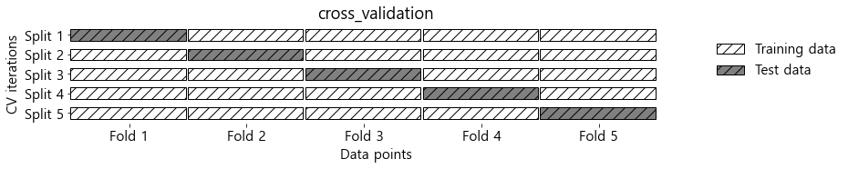
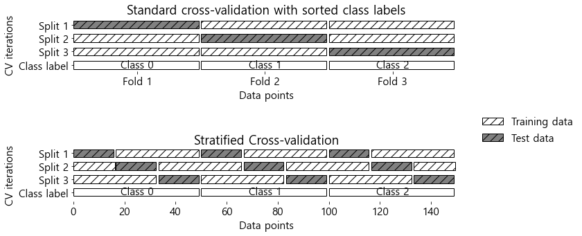
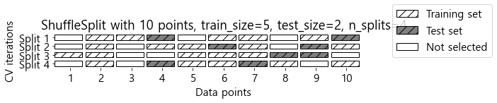
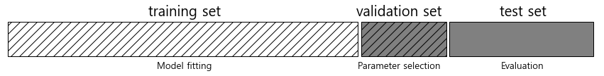
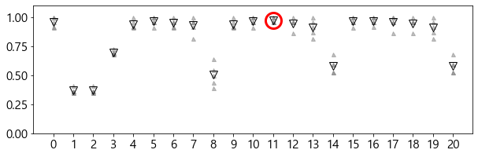
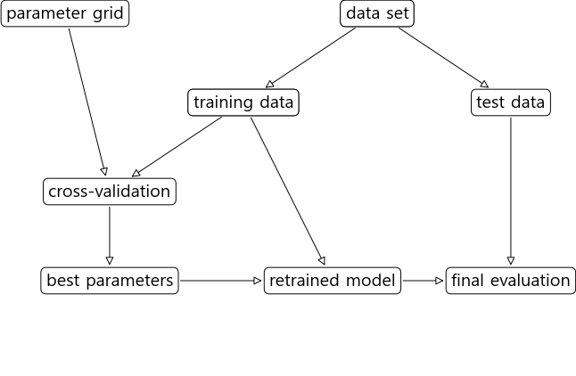

```python
from IPython.display import display
import numpy as np
import matplotlib.pyplot as plt
import pandas as pd
import mglearn
import matplotlib
from sklearn.model_selection import train_test_split
matplotlib.rcParams['font.family'] = 'Malgun Gothic' #window
##matplotlib.rcParams['font.family'] = 'AppltGothic' #mac
matplotlib.rcParams['font.size'] = 15 #글자크기\
matplotlib.rcParams['axes.unicode_minus'] = False # 한글 폰트 사용시 마이너스 글자가 깨지는 현상을 해결

from sklearn.datasets import load_breast_cancer
from sklearn.model_selection import train_test_split

from sklearn.preprocessing import MinMaxScaler

import matplotlib.pyplot as plt
import numpy as np
from sklearn.datasets import make_blobs
from sklearn.preprocessing import QuantileTransformer, StandardScaler, PowerTransformer
from sklearn.svm import SVC
from sklearn.decomposition import PCA
```


```python
from sklearn.datasets import make_blobs
from sklearn.linear_model import LogisticRegression
from sklearn.model_selection import train_test_split

# 인위적인 데이터셋을 만듭니다.
x,y = make_blobs(random_state=0)
# 데이터와 타깃 레이블을 훈련 세트와 테스트 세트로 나눕니다.
x_train, x_test, y_train, y_test = train_test_split(x,y,random_state=0)
#모델 객체를 만들고 훈련 세트로 학습시킵니다.
logreg = LogisticRegression().fit(x_train,y_train)
#모델을 테스트 세트로 평가
score = logreg.score(x_test, y_test)
score
```


    0.88


이번 장에서는 평가 방법을 확장해보겠습니다.

먼저 안정적인 일반화 성능 측정 방법인 교차검증을 소개
score 메서드가 제공하는 정확도와 R^2값 이외에 분류와 회귀 성능을 측정하는 다른 방법을 알아보겠습니다.

 ## 교차 검증
 
 


```python
mglearn.plots.plot_cross_validation()
```


    

    


사이킷런에서 교차검증은 model_selection 모듈의 cross_val_score 함수로 구현되어 있습니다.

cross_val_score함수의 매개변수는 평가하려는 모델과 훈련데이터, 타깃 레이블입니다.

iris데이터셋에 적용한 logisticRegression을 평가해보겠습니다.


```python
from sklearn.model_selection import cross_val_score
from sklearn.datasets import load_iris
from sklearn.linear_model import LogisticRegression

iris = load_iris()
logreg = LogisticRegression(max_iter=1000)

scores = cross_val_score(logreg, iris.data, iris.target)
scores
```


    array([0.96666667, 1.        , 0.93333333, 0.96666667, 1.        ])


여기서는 cross_val_score가 5겹 교차겁증을 수행했기 때문에 5개 점수가 반환되었습니다. k의수 는 cv매개변수를 통해변경가능


```python
scores= cross_val_score(logreg, iris.data, iris.target, cv=10)
scores
```


    array([1.        , 0.93333333, 1.        , 1.        , 0.93333333,
           0.93333333, 0.93333333, 1.        , 1.        , 1.        ])


```python
# 보통 교차검증 정확도를 간단하게 나타내려면 평균을 사용
scores.mean()
```


    0.9733333333333334


### 계층별 k-겹 교차 검증과 그외 전략들

00000 111111 222222 데이터가 있을 경우 k=3 교차검증을 하게되면 정확도는 0이 되어버린다.
단순k-겹 교차검증은 문제가 있으니 대신

계층별 k-겹 교차검증을 사용합니다.


```python
mglearn.plots.plot_stratified_cross_validation()
```


    

    


### 교차 검증 상세옵션
cv매개변수에 교차검증 분할기를 전달함으로써 데이터를 분할할 때 더 세밀하게 제어할 수 있습니다.


```python
from sklearn.model_selection import KFold
kfold = KFold(n_splits=5)
```

이렇게 한다음 kfold객체를 cross_val_score의 cv 매개변수로 전달합니다.


```python
cross_val_score(logreg, iris.data, iris.target, cv=kfold)
```


    array([1.        , 1.        , 0.86666667, 0.93333333, 0.83333333])


일반 3겹 교차검증을 해보면?


```python
kfold = KFold(n_splits=3)
cross_val_score(logreg, iris.data,iris.target, cv=kfold)
```


    array([0., 0., 0.])


데이터를 섞어서 샘플의 순서를 뒤죽박죽 만드는것이 해결방안!


```python
kfold=KFold(n_splits=3, shuffle=True, random_state=0)
cross_val_score(logreg,iris.data,iris.target, cv = kfold)
```


    array([0.98, 0.96, 0.96])


## LOOCV (Leave One Out Cross Validation)

하나의 데이터 포인트를 선택해 테스트 세트로 사용.
데이터셋이 클 때는 시간이 매우 오래 걸리지만, 적은 데이터셋에서는 이따금 더좋은 결과를 만들어냅니다.


```python
from sklearn.model_selection import LeaveOneOut
loo=LeaveOneOut()
scores = cross_val_score(logreg, iris.data, iris.target, cv=loo)
print(len(scores)) #분할 횟수
print(scores.mean()) #평균 정확도
```

    150
    0.9666666666666667
    

## 임의 분할 교차 검증 ( Shuffle split cross validation)


```python
mglearn.plots.plot_shuffle_split()
```


    

    


데이터셋의 50% 훈련 나머지 50% 테스트 세트로 10번 반복 분할합니다.


```python
from sklearn.model_selection import ShuffleSplit
shuffle_split= ShuffleSplit(test_size=.5, train_size=.5, n_splits=10)
scores = cross_val_score(logreg, iris.data, iris.target, cv=shuffle_split)
scores
```


    array([0.98666667, 0.96      , 0.94666667, 0.98666667, 0.96      ,
           0.93333333, 0.94666667, 0.96      , 0.98666667, 0.97333333])


전체데이터의 일부만사용할 수 있어요(부분 샘플링) 이 방법은 대규모 데이터셋으로 작업할 때 도움이 됩니다.

## 그리드 서치
이번에는 매개변수를 튜닝하여 일반화 성능을 개선하겠습니다. 
가장널리 사용하는 방법은 그리드 서치로서 관심있는 매개변수들을 대상으로 가능한 모든 조합을 시도해보는 것.

SVC 파이썬 클래스에 구현된 RBF 커널 SVM을 사용해보겠습니다. 커널의 폭에 해당되는 gamma와 규제 매개변수C가 중요합니다.

### 간단한 그리드 서치

두 매개변수를 조합해 분류기를 학습시키고 평가하는 간단한 그리드 서치를 for문을 사용해 만들 수 있습니다.


```python
# 간단한 그리드 서치 구현
from sklearn.svm import SVC
from sklearn.datasets import load_iris
x_train, x_test, y_train, y_test = train_test_split(iris.data, iris.target, random_state=0)

print(x_train.shape[0], x_test.shape[0]) #훈련 세트의 크기, 테스트세트의 크기

best_score = 0

for gamma in [0.001, 0.01, 0.1, 1, 10, 100]:
    for c in [0.001, 0.01, 0.1, 1, 10, 100]:
        # 매개변수의 각 조합에 대해 svc를 훈련시킵니다.
        svm = SVC(gamma=gamma, C=c)
        svm.fit(x_train, y_train)
        # 테스트 세트로 svc를 평가합니다.
        score = svm.score(x_test, y_test)
        # 점수가 더 높으면 매개변수와 함께 기록합니다.
        if score > best_score:
            best_score = score
            best_parameters = {'c' :c, 'gamma' : gamma}
            
print('최고 점수: {:.2f}'.format(best_score))
print('최적 매개변수 :', best_parameters)
```

    112 38
    최고 점수: 0.97
    최적 매개변수 : {'c': 100, 'gamma': 0.001}
    

### 매개변수 과대적합과 검증 세트
평가를 위해서는 모델을 만들 때 사용하지 않은 독립된 데이터 셋이 필요합니다.


```python
mglearn.plots.plot_threefold_split()
```


    

    


검증 세트를 사용해 최적의 매개변수를 선택한 후, 그 매개변수에서 훈련 세트와 검증세트 데이터를 모두 이용해 모델을 다시 만든다.

가능한 많은 데이터를 사용하기 위함!


```python
from sklearn.svm import SVC
# 데이터를 훈련 + 검증 세트 그리고 테스트 세트로 분할

x_trainval, x_test,y_trainval, y_test = train_test_split(iris.data, iris.target, random_state=0)

# 훈련 + 검증 세트를 훈련 세트와 검증 세트로 분할
x_train, x_valid, y_train, y_valid = train_test_split(x_trainval, y_trainval, random_state=1)

print(x_train.shape[0], x_valid.shape[0], x_test.shape[0])

best_score = 0

for gamma in [0.001, 0.01, 0.1, 1, 10, 100]:
    for C in [0.001, 0.01, 0.1, 1, 10, 100]:
        # 매개변수의 각 조합에 대해 svc를 훈련
        svm = SVC(gamma=gamma, C=C)
        svm.fit(x_train,y_train)
        # 검증 세트로 svc를 평가합니다.
        score = svm.score(x_valid, y_valid)
        # 점수가 더 높으면 매개변수와 함께 기록합니다.
        if score > best_score:
            best_score = score
            best_parameter = {'C': C, 'gamma': gamma}
# 훈련 세트와 검증 세트를 합쳐 모델을 다시 만든 후
# 테스트 세트를 사용해 평가합니다.
svm = SVC(**best_parameter)
svm.fit(x_trainval, y_trainval)
test_score = svm.score(x_test, y_test)

print(best_score)
print(best_parameter)
print(test_score)

```

    84 28 38
    0.9642857142857143
    {'C': 10, 'gamma': 0.001}
    0.9210526315789473
    

### 교차 검증을 사용한 그리드 서치

일반화 성능을 더 잘 평가하기 위해 훈련 세트와 검증 세트를 한 번만 나누지 않고, 교차 검증을 사용해 각 매개변수 조합의 성능을 평가할 수 있다.


```python
for gamma in [0.001, 0.01, 0.1, 1, 10, 100]:
    for C in [0.001, 0.01, 0.1, 1, 10, 100]:
        # 매개변수의 각 조합에 대해 svc를 훈련
        svm = SVC(gamma = gamma, C=C)
        # 교차 검증을 적용합니다.
        scores = cross_val_score(svm,x_trainval, y_trainval, cv=5)
        # 교차 검증 정확도의 평균을 계산
        score = np.mean(scores)
        # 점수가 더 높으면 매개변수와 함께 기록합니다.
        if score > best_score:
            best_score = score
            best_parameter = {'C':C, 'gamma':gamma}
# 훈련 세트와 검증 세트를 합쳐 모델을 다시 만듭니다.
svm = SVC(**best_parameter)
svm.fit(x_trainval, y_trainval)
```


    SVC(C=10, gamma=0.1)


```python
mglearn.plots.plot_cross_val_selection()
```


    ---------------------------------------------------------------------------

    ValueError                                Traceback (most recent call last)

    ~\AppData\Local\Temp/ipykernel_7764/2557306081.py in <module>
    ----> 1 mglearn.plots.plot_cross_val_selection()
    

    ~\anaconda3\lib\site-packages\mglearn\plot_grid_search.py in plot_cross_val_selection()
         35                                     markeredgewidth=3)
         36 
    ---> 37     plt.xticks(range(len(results)), [str(x).strip("{}").replace("'", "") for x
         38                                      in grid_search.cv_results_['params']],
         39                rotation=90)
    

    ~\anaconda3\lib\site-packages\matplotlib\pyplot.py in xticks(ticks, labels, **kwargs)
       1812         labels = ax.get_xticklabels()
       1813     else:
    -> 1814         labels = ax.set_xticklabels(labels, **kwargs)
       1815     for l in labels:
       1816         l.update(kwargs)
    

    ~\anaconda3\lib\site-packages\matplotlib\axes\_base.py in wrapper(self, *args, **kwargs)
         71 
         72         def wrapper(self, *args, **kwargs):
    ---> 73             return get_method(self)(*args, **kwargs)
         74 
         75         wrapper.__module__ = owner.__module__
    

    ~\anaconda3\lib\site-packages\matplotlib\_api\deprecation.py in wrapper(*args, **kwargs)
        469                 "parameter will become keyword-only %(removal)s.",
        470                 name=name, obj_type=f"parameter of {func.__name__}()")
    --> 471         return func(*args, **kwargs)
        472 
        473     return wrapper
    

    ~\anaconda3\lib\site-packages\matplotlib\axis.py in _set_ticklabels(self, labels, fontdict, minor, **kwargs)
       1793         if fontdict is not None:
       1794             kwargs.update(fontdict)
    -> 1795         return self.set_ticklabels(labels, minor=minor, **kwargs)
       1796 
       1797     def set_ticks(self, ticks, *, minor=False):
    

    ~\anaconda3\lib\site-packages\matplotlib\axis.py in set_ticklabels(self, ticklabels, minor, **kwargs)
       1714             # remove all tick labels, so only error for > 0 ticklabels
       1715             if len(locator.locs) != len(ticklabels) and len(ticklabels) != 0:
    -> 1716                 raise ValueError(
       1717                     "The number of FixedLocator locations"
       1718                     f" ({len(locator.locs)}), usually from a call to"
    

    ValueError: The number of FixedLocator locations (21), usually from a call to set_ticks, does not match the number of ticklabels (36).


    

    


```python
mglearn.plots.plot_grid_search_overview()
```


    

    

교차 검증을 사용한 그리드 서치를 매개변수 조정 방법으로 널리 사용하기 때문에 사이킷런은 추정기 형태로 구현된 

GridSearchCV를 제공하고 있습니다


gridsearchcv를 사용하려면 먼저 딕셔너리 형태로 검색 대상 매개변수를 지정해야합니다. 

```python
param_grid = {'C':[0.001,0.01,0.1,1,10,100],
             'gamma':[0.001,0.01,0.1,1,10,100]}

print('매개변수 그리드:\n', param_grid)
```

    매개변수 그리드:
     {'C': [0.001, 0.01, 0.1, 1, 10, 100], 'gamma': [0.001, 0.01, 0.1, 1, 10, 100]}
    

이제 모델(svc), 검색대상 매개변수 그리드(param_grid), 원하는 교차검증으로 GridSearchCV의 객체를 형성


```python
from sklearn.model_selection import GridSearchCV
from sklearn.svm import SVC
grid_search = GridSearchCV(SVC(), param_grid, cv=5, return_train_score=True)
```


```python
x_train, x_test, y_train, y_test = train_test_split(iris.data, iris.target, random_state=0)
```


```python
grid_search.fit(x_train, y_train)
```


    GridSearchCV(cv=5, estimator=SVC(),
                 param_grid={'C': [0.001, 0.01, 0.1, 1, 10, 100],
                             'gamma': [0.001, 0.01, 0.1, 1, 10, 100]},
                 return_train_score=True)


```python
grid_search.score(x_test, y_test)
```


    0.9736842105263158


```python
grid_search.best_params_
```


    {'C': 10, 'gamma': 0.1}


```python
grid_search.best_score_
```


    0.9731225296442687


```python
grid_search.best_estimator_
```


    SVC(C=10, gamma=0.1)


### 교차 검증 결과 분석

교차 검증의 결과를 시각화하면 검색 대상 매개변수가 모델의 일반화에 영향을 얼마나 주는지 이해하는데 도움이 됩니다.


```python
import pandas as pd
pd.set_option('display.max_columns',None)
#datafram 변환
results = pd.DataFrame(grid_search.cv_results_)
np.transpose(results.head())
```


<div>
<style scoped>
    .dataframe tbody tr th:only-of-type {
        vertical-align: middle;
    }

    .dataframe tbody tr th {
        vertical-align: top;
    }

    .dataframe thead th {
        text-align: right;
    }
</style>
<table border="1" class="dataframe">
  <thead>
    <tr style="text-align: right;">
      <th></th>
      <th>0</th>
      <th>1</th>
      <th>2</th>
      <th>3</th>
      <th>4</th>
    </tr>
  </thead>
  <tbody>
    <tr>
      <th>mean_fit_time</th>
      <td>0.000797</td>
      <td>0.000798</td>
      <td>0.000599</td>
      <td>0.000802</td>
      <td>0.001001</td>
    </tr>
    <tr>
      <th>std_fit_time</th>
      <td>0.000399</td>
      <td>0.000399</td>
      <td>0.000489</td>
      <td>0.000401</td>
      <td>0.000003</td>
    </tr>
    <tr>
      <th>mean_score_time</th>
      <td>0.000402</td>
      <td>0.0004</td>
      <td>0.000599</td>
      <td>0.000402</td>
      <td>0.0004</td>
    </tr>
    <tr>
      <th>std_score_time</th>
      <td>0.000492</td>
      <td>0.00049</td>
      <td>0.000489</td>
      <td>0.000492</td>
      <td>0.00049</td>
    </tr>
    <tr>
      <th>param_C</th>
      <td>0.001</td>
      <td>0.001</td>
      <td>0.001</td>
      <td>0.001</td>
      <td>0.001</td>
    </tr>
    <tr>
      <th>param_gamma</th>
      <td>0.001</td>
      <td>0.01</td>
      <td>0.1</td>
      <td>1</td>
      <td>10</td>
    </tr>
    <tr>
      <th>params</th>
      <td>{'C': 0.001, 'gamma': 0.001}</td>
      <td>{'C': 0.001, 'gamma': 0.01}</td>
      <td>{'C': 0.001, 'gamma': 0.1}</td>
      <td>{'C': 0.001, 'gamma': 1}</td>
      <td>{'C': 0.001, 'gamma': 10}</td>
    </tr>
    <tr>
      <th>split0_test_score</th>
      <td>0.347826</td>
      <td>0.347826</td>
      <td>0.347826</td>
      <td>0.347826</td>
      <td>0.347826</td>
    </tr>
    <tr>
      <th>split1_test_score</th>
      <td>0.347826</td>
      <td>0.347826</td>
      <td>0.347826</td>
      <td>0.347826</td>
      <td>0.347826</td>
    </tr>
    <tr>
      <th>split2_test_score</th>
      <td>0.363636</td>
      <td>0.363636</td>
      <td>0.363636</td>
      <td>0.363636</td>
      <td>0.363636</td>
    </tr>
    <tr>
      <th>split3_test_score</th>
      <td>0.363636</td>
      <td>0.363636</td>
      <td>0.363636</td>
      <td>0.363636</td>
      <td>0.363636</td>
    </tr>
    <tr>
      <th>split4_test_score</th>
      <td>0.409091</td>
      <td>0.409091</td>
      <td>0.409091</td>
      <td>0.409091</td>
      <td>0.409091</td>
    </tr>
    <tr>
      <th>mean_test_score</th>
      <td>0.366403</td>
      <td>0.366403</td>
      <td>0.366403</td>
      <td>0.366403</td>
      <td>0.366403</td>
    </tr>
    <tr>
      <th>std_test_score</th>
      <td>0.022485</td>
      <td>0.022485</td>
      <td>0.022485</td>
      <td>0.022485</td>
      <td>0.022485</td>
    </tr>
    <tr>
      <th>rank_test_score</th>
      <td>22</td>
      <td>22</td>
      <td>22</td>
      <td>22</td>
      <td>22</td>
    </tr>
    <tr>
      <th>split0_train_score</th>
      <td>0.370787</td>
      <td>0.370787</td>
      <td>0.370787</td>
      <td>0.370787</td>
      <td>0.370787</td>
    </tr>
    <tr>
      <th>split1_train_score</th>
      <td>0.370787</td>
      <td>0.370787</td>
      <td>0.370787</td>
      <td>0.370787</td>
      <td>0.370787</td>
    </tr>
    <tr>
      <th>split2_train_score</th>
      <td>0.366667</td>
      <td>0.366667</td>
      <td>0.366667</td>
      <td>0.366667</td>
      <td>0.366667</td>
    </tr>
    <tr>
      <th>split3_train_score</th>
      <td>0.366667</td>
      <td>0.366667</td>
      <td>0.366667</td>
      <td>0.366667</td>
      <td>0.366667</td>
    </tr>
    <tr>
      <th>split4_train_score</th>
      <td>0.355556</td>
      <td>0.355556</td>
      <td>0.355556</td>
      <td>0.355556</td>
      <td>0.355556</td>
    </tr>
    <tr>
      <th>mean_train_score</th>
      <td>0.366092</td>
      <td>0.366092</td>
      <td>0.366092</td>
      <td>0.366092</td>
      <td>0.366092</td>
    </tr>
    <tr>
      <th>std_train_score</th>
      <td>0.005581</td>
      <td>0.005581</td>
      <td>0.005581</td>
      <td>0.005581</td>
      <td>0.005581</td>
    </tr>
  </tbody>
</table>
</div>


```python

```


```python

```


```python

```


```python

```


```python

```


```python

```


```python

```


```python

```


```python

```


```python

```


```python

```


```python

```


```python

```


```python

```


```python

```


```python

```


```python

```


```python

```


```python

```


```python

```


```python

```


```python

```


```python

```


```python

```


```python

```


```python

```


```python

```


```python

```


```python

```


```python

```


```python

```


```python

```


```python

```


```python

```
