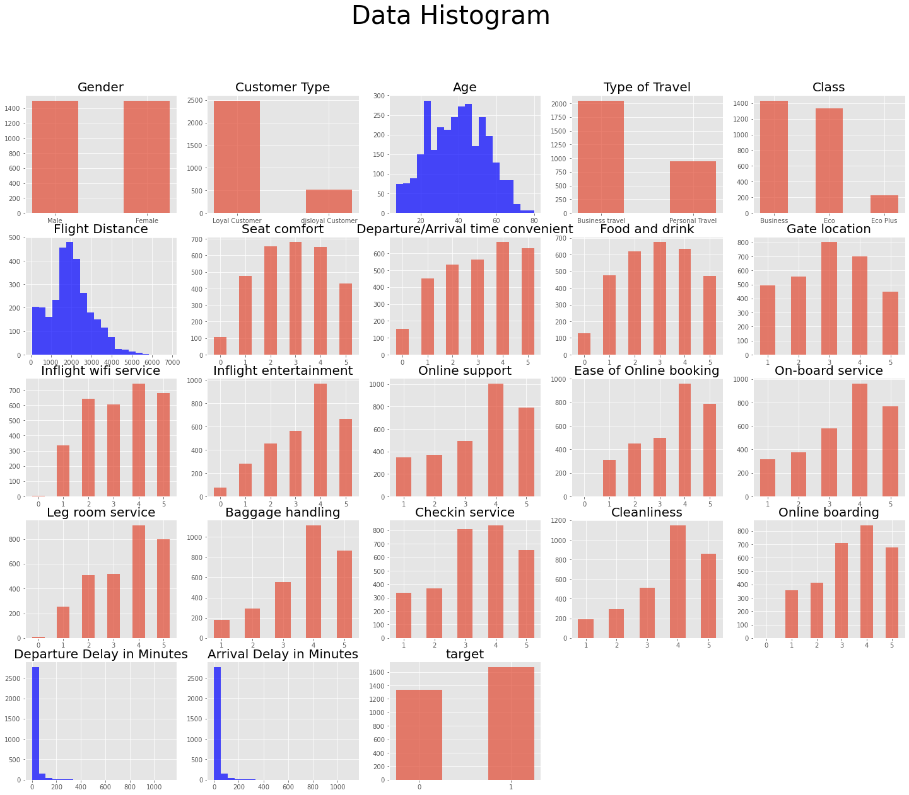

## 데이터 불러오기


```python
import pandas as pd
import numpy as np
import matplotlib.pyplot as plt
import seaborn as sns


```


```python
train_data = pd.read_csv('airline_dataset/train.csv')
test_data = pd.read_csv('airline_dataset/test.csv')


train = train_data.drop(['id'], axis=1)
y_train = train_data['target']
test = test_data.drop('id', axis = 1)

pd.set_option('display.max_columns', None) #컬럼 수가 많으므로 요약되어 표시 하지 않게

```


```python
train.head()
```


<div>
<style scoped>
    .dataframe tbody tr th:only-of-type {
        vertical-align: middle;
    }

    .dataframe tbody tr th {
        vertical-align: top;
    }

    .dataframe thead th {
        text-align: right;
    }
</style>
<table border="1" class="dataframe">
  <thead>
    <tr style="text-align: right;">
      <th></th>
      <th>Gender</th>
      <th>Customer Type</th>
      <th>Age</th>
      <th>Type of Travel</th>
      <th>Class</th>
      <th>Flight Distance</th>
      <th>Seat comfort</th>
      <th>Departure/Arrival time convenient</th>
      <th>Food and drink</th>
      <th>Gate location</th>
      <th>Inflight wifi service</th>
      <th>Inflight entertainment</th>
      <th>Online support</th>
      <th>Ease of Online booking</th>
      <th>On-board service</th>
      <th>Leg room service</th>
      <th>Baggage handling</th>
      <th>Checkin service</th>
      <th>Cleanliness</th>
      <th>Online boarding</th>
      <th>Departure Delay in Minutes</th>
      <th>Arrival Delay in Minutes</th>
      <th>target</th>
    </tr>
  </thead>
  <tbody>
    <tr>
      <th>0</th>
      <td>Female</td>
      <td>disloyal Customer</td>
      <td>22</td>
      <td>Business travel</td>
      <td>Eco</td>
      <td>1599</td>
      <td>3</td>
      <td>0</td>
      <td>3</td>
      <td>3</td>
      <td>4</td>
      <td>3</td>
      <td>4</td>
      <td>4</td>
      <td>5</td>
      <td>4</td>
      <td>4</td>
      <td>4</td>
      <td>5</td>
      <td>4</td>
      <td>0</td>
      <td>0.0</td>
      <td>0</td>
    </tr>
    <tr>
      <th>1</th>
      <td>Female</td>
      <td>Loyal Customer</td>
      <td>37</td>
      <td>Business travel</td>
      <td>Business</td>
      <td>2810</td>
      <td>2</td>
      <td>4</td>
      <td>4</td>
      <td>4</td>
      <td>1</td>
      <td>4</td>
      <td>3</td>
      <td>5</td>
      <td>5</td>
      <td>4</td>
      <td>2</td>
      <td>1</td>
      <td>5</td>
      <td>2</td>
      <td>18</td>
      <td>18.0</td>
      <td>0</td>
    </tr>
    <tr>
      <th>2</th>
      <td>Male</td>
      <td>Loyal Customer</td>
      <td>46</td>
      <td>Business travel</td>
      <td>Business</td>
      <td>2622</td>
      <td>1</td>
      <td>1</td>
      <td>1</td>
      <td>1</td>
      <td>4</td>
      <td>5</td>
      <td>5</td>
      <td>4</td>
      <td>4</td>
      <td>4</td>
      <td>4</td>
      <td>5</td>
      <td>4</td>
      <td>3</td>
      <td>0</td>
      <td>0.0</td>
      <td>1</td>
    </tr>
    <tr>
      <th>3</th>
      <td>Female</td>
      <td>disloyal Customer</td>
      <td>24</td>
      <td>Business travel</td>
      <td>Eco</td>
      <td>2348</td>
      <td>3</td>
      <td>3</td>
      <td>3</td>
      <td>3</td>
      <td>3</td>
      <td>3</td>
      <td>3</td>
      <td>3</td>
      <td>2</td>
      <td>4</td>
      <td>5</td>
      <td>3</td>
      <td>4</td>
      <td>3</td>
      <td>10</td>
      <td>2.0</td>
      <td>0</td>
    </tr>
    <tr>
      <th>4</th>
      <td>Female</td>
      <td>Loyal Customer</td>
      <td>58</td>
      <td>Business travel</td>
      <td>Business</td>
      <td>105</td>
      <td>3</td>
      <td>3</td>
      <td>3</td>
      <td>3</td>
      <td>4</td>
      <td>4</td>
      <td>5</td>
      <td>4</td>
      <td>4</td>
      <td>4</td>
      <td>4</td>
      <td>4</td>
      <td>4</td>
      <td>5</td>
      <td>0</td>
      <td>0.0</td>
      <td>1</td>
    </tr>
  </tbody>
</table>
</div>


```python
train.isna().sum() # 결측치 없다.
```


    Gender                               0
    Customer Type                        0
    Age                                  0
    Type of Travel                       0
    Class                                0
    Flight Distance                      0
    Seat comfort                         0
    Departure/Arrival time convenient    0
    Food and drink                       0
    Gate location                        0
    Inflight wifi service                0
    Inflight entertainment               0
    Online support                       0
    Ease of Online booking               0
    On-board service                     0
    Leg room service                     0
    Baggage handling                     0
    Checkin service                      0
    Cleanliness                          0
    Online boarding                      0
    Departure Delay in Minutes           0
    Arrival Delay in Minutes             0
    target                               0
    dtype: int64


## 기초 통계 분석

#### feature 분포들 시각화


```python
plt.style.use('ggplot')

# 히스토그램을 사용해 데이터의 분포 살펴보기
plt.figure(figsize=(25,20))
plt.suptitle('Data Histogram', fontsize = 40)

# id 제외하고 시각화
cols = train.columns
for i in range(len(cols)):
    plt.subplot(5, 5, i+1) # 5행 5열 최대 25개의 분포 확인 가능
    plt.title(cols[i], fontsize=20) # 각 분포그림의 제목을 특징명으로 설정
    if len(train[cols[i]].unique()) > 20:
        plt.hist(train[cols[i]], bins=20, color='b', alpha=0.7) #히스토 그램출력 bins는 칸을 나누는 값
    
    else: # unique() 값이 20개가 넘지않으면
        temp = train[cols[i]].value_counts() # 특징 값 종류의 개수를 temp에 저장
        plt.bar(temp.keys(), temp.values, width = 0.5, alpha=0.7)
        plt.xticks(temp.keys())
        

plt.show()
                
    
```


    

    


## target 과 feature들의 관계 확인


```python
# 타겟 설정
target = 'target'
# 범주형 데이터 분리
categorical_feature = train.columns[train.dtypes == 'object']

plt.figure(figsize=(20,15))
plt.suptitle('Violin Plot', fontsize=40)

#id 제외하고 시각화
for i in range(len(categorical_feature)):
    plt.subplot(2,2,i+1)
    plt.xlabel(categorical_feature[i])
    plt.ylabel('target')
    sns.violinplot(x= train[categorical_feature[i]], y= train['target'])
plt.show()
```


    

    


customer type 의 경우 disloyal과 loyal에 따라 target 값 차이가 확실하다. 중요한 특징인 것 같다.


```python
# 수치형 데이터 분리
numeric_feature = train.columns[(train.dtypes=='int64') | (train.dtypes == 'float')]

# 박스 플롯
fig, axes = plt.subplots(3,6, figsize=(25,20))

fig.suptitle('Box Plot', fontsize=40)
for ax, col in zip(axes.flat, numeric_feature[:-1]):
    sns.boxplot(x= train['target'], y=col, ax=ax, data=train[numeric_feature])
    ax.set_title(col, fontsize=20)
    
plt.show()
```


    

    


```python
numeric_feature = train.columns[(train.dtypes=='int64') | (train.dtypes == 'float')]
```

박스들이 중간에 있을 수록, 이상치가 없을 수록 골고루 분포되어있다 라는 것으로 해석가능합니다.

age, departure/arrival time convenient / gate location 등등이 별 연관이 없어보입니다.


## 범주형 데이터 인코딩

숫자의 순서가 연속형 의미를 가지는 범주형 데이터와 
숫자의 순서가 연속형 의미를 가지지 않는 범주형 데이터를 나눠

label encoding
onehot encoding을 해보겠습니다.


```python
categorical_feature

# gender 만 one hot 인코딩 나머지 label 인코딩
```


    Index(['Gender', 'Customer Type', 'Type of Travel', 'Class'], dtype='object')


```python
from sklearn.preprocessing import LabelEncoder
from sklearn.preprocessing import OneHotEncoder
```

먼저gender 데이터를 one hot 인코딩 해보겠습니다.


```python
encoder = OneHotEncoder()
```


```python
onh = encoder.fit_transform(train[['Gender']])
onh_test = encoder.fit_transform(test[['Gender']])
```


```python
onh = onh.toarray()
onh_test = onh_test.toarray()
```


```python
onh = pd.DataFrame(onh)
onh_test = pd.DataFrame(onh_test)
print(onh.head())
print(onh_test.head())
```

         0    1
    0  1.0  0.0
    1  1.0  0.0
    2  0.0  1.0
    3  1.0  0.0
    4  1.0  0.0
         0    1
    0  1.0  0.0
    1  1.0  0.0
    2  1.0  0.0
    3  0.0  1.0
    4  1.0  0.0
    


```python
onh.columns=encoder.get_feature_names() #onh의 column이름을 바꿨다.
onh_test.columns = encoder.get_feature_names()

```


```python
# onh를 원본데이터에 병합
train = pd.concat([train, onh], axis=1)
test = pd.concat([test,onh_test], axis=1)

# train 데이터의 gender 제거
train = train.drop('Gender', axis=1)
test = test.drop('Gender', axis=1)
```


```python
train.head()
```


<div>
<style scoped>
    .dataframe tbody tr th:only-of-type {
        vertical-align: middle;
    }

    .dataframe tbody tr th {
        vertical-align: top;
    }

    .dataframe thead th {
        text-align: right;
    }
</style>
<table border="1" class="dataframe">
  <thead>
    <tr style="text-align: right;">
      <th></th>
      <th>Customer Type</th>
      <th>Age</th>
      <th>Type of Travel</th>
      <th>Class</th>
      <th>Flight Distance</th>
      <th>Seat comfort</th>
      <th>Departure/Arrival time convenient</th>
      <th>Food and drink</th>
      <th>Gate location</th>
      <th>Inflight wifi service</th>
      <th>Inflight entertainment</th>
      <th>Online support</th>
      <th>Ease of Online booking</th>
      <th>On-board service</th>
      <th>Leg room service</th>
      <th>Baggage handling</th>
      <th>Checkin service</th>
      <th>Cleanliness</th>
      <th>Online boarding</th>
      <th>Departure Delay in Minutes</th>
      <th>Arrival Delay in Minutes</th>
      <th>target</th>
      <th>x0_Female</th>
      <th>x0_Male</th>
    </tr>
  </thead>
  <tbody>
    <tr>
      <th>0</th>
      <td>disloyal Customer</td>
      <td>22</td>
      <td>Business travel</td>
      <td>Eco</td>
      <td>1599</td>
      <td>3</td>
      <td>0</td>
      <td>3</td>
      <td>3</td>
      <td>4</td>
      <td>3</td>
      <td>4</td>
      <td>4</td>
      <td>5</td>
      <td>4</td>
      <td>4</td>
      <td>4</td>
      <td>5</td>
      <td>4</td>
      <td>0</td>
      <td>0.0</td>
      <td>0</td>
      <td>1.0</td>
      <td>0.0</td>
    </tr>
    <tr>
      <th>1</th>
      <td>Loyal Customer</td>
      <td>37</td>
      <td>Business travel</td>
      <td>Business</td>
      <td>2810</td>
      <td>2</td>
      <td>4</td>
      <td>4</td>
      <td>4</td>
      <td>1</td>
      <td>4</td>
      <td>3</td>
      <td>5</td>
      <td>5</td>
      <td>4</td>
      <td>2</td>
      <td>1</td>
      <td>5</td>
      <td>2</td>
      <td>18</td>
      <td>18.0</td>
      <td>0</td>
      <td>1.0</td>
      <td>0.0</td>
    </tr>
    <tr>
      <th>2</th>
      <td>Loyal Customer</td>
      <td>46</td>
      <td>Business travel</td>
      <td>Business</td>
      <td>2622</td>
      <td>1</td>
      <td>1</td>
      <td>1</td>
      <td>1</td>
      <td>4</td>
      <td>5</td>
      <td>5</td>
      <td>4</td>
      <td>4</td>
      <td>4</td>
      <td>4</td>
      <td>5</td>
      <td>4</td>
      <td>3</td>
      <td>0</td>
      <td>0.0</td>
      <td>1</td>
      <td>0.0</td>
      <td>1.0</td>
    </tr>
    <tr>
      <th>3</th>
      <td>disloyal Customer</td>
      <td>24</td>
      <td>Business travel</td>
      <td>Eco</td>
      <td>2348</td>
      <td>3</td>
      <td>3</td>
      <td>3</td>
      <td>3</td>
      <td>3</td>
      <td>3</td>
      <td>3</td>
      <td>3</td>
      <td>2</td>
      <td>4</td>
      <td>5</td>
      <td>3</td>
      <td>4</td>
      <td>3</td>
      <td>10</td>
      <td>2.0</td>
      <td>0</td>
      <td>1.0</td>
      <td>0.0</td>
    </tr>
    <tr>
      <th>4</th>
      <td>Loyal Customer</td>
      <td>58</td>
      <td>Business travel</td>
      <td>Business</td>
      <td>105</td>
      <td>3</td>
      <td>3</td>
      <td>3</td>
      <td>3</td>
      <td>4</td>
      <td>4</td>
      <td>5</td>
      <td>4</td>
      <td>4</td>
      <td>4</td>
      <td>4</td>
      <td>4</td>
      <td>4</td>
      <td>5</td>
      <td>0</td>
      <td>0.0</td>
      <td>1</td>
      <td>1.0</td>
      <td>0.0</td>
    </tr>
  </tbody>
</table>
</div>


```python
test.head()
```


<div>
<style scoped>
    .dataframe tbody tr th:only-of-type {
        vertical-align: middle;
    }

    .dataframe tbody tr th {
        vertical-align: top;
    }

    .dataframe thead th {
        text-align: right;
    }
</style>
<table border="1" class="dataframe">
  <thead>
    <tr style="text-align: right;">
      <th></th>
      <th>Customer Type</th>
      <th>Age</th>
      <th>Type of Travel</th>
      <th>Class</th>
      <th>Flight Distance</th>
      <th>Seat comfort</th>
      <th>Departure/Arrival time convenient</th>
      <th>Food and drink</th>
      <th>Gate location</th>
      <th>Inflight wifi service</th>
      <th>Inflight entertainment</th>
      <th>Online support</th>
      <th>Ease of Online booking</th>
      <th>On-board service</th>
      <th>Leg room service</th>
      <th>Baggage handling</th>
      <th>Checkin service</th>
      <th>Cleanliness</th>
      <th>Online boarding</th>
      <th>Departure Delay in Minutes</th>
      <th>Arrival Delay in Minutes</th>
      <th>x0_Female</th>
      <th>x0_Male</th>
    </tr>
  </thead>
  <tbody>
    <tr>
      <th>0</th>
      <td>Loyal Customer</td>
      <td>61</td>
      <td>Personal Travel</td>
      <td>Eco</td>
      <td>2037</td>
      <td>1</td>
      <td>1</td>
      <td>1</td>
      <td>1</td>
      <td>3</td>
      <td>5</td>
      <td>5</td>
      <td>5</td>
      <td>5</td>
      <td>5</td>
      <td>5</td>
      <td>3</td>
      <td>5</td>
      <td>3</td>
      <td>51</td>
      <td>58.0</td>
      <td>1.0</td>
      <td>0.0</td>
    </tr>
    <tr>
      <th>1</th>
      <td>disloyal Customer</td>
      <td>27</td>
      <td>Business travel</td>
      <td>Business</td>
      <td>1846</td>
      <td>1</td>
      <td>1</td>
      <td>1</td>
      <td>4</td>
      <td>1</td>
      <td>1</td>
      <td>1</td>
      <td>1</td>
      <td>3</td>
      <td>4</td>
      <td>5</td>
      <td>4</td>
      <td>4</td>
      <td>1</td>
      <td>0</td>
      <td>0.0</td>
      <td>1.0</td>
      <td>0.0</td>
    </tr>
    <tr>
      <th>2</th>
      <td>Loyal Customer</td>
      <td>52</td>
      <td>Business travel</td>
      <td>Business</td>
      <td>1622</td>
      <td>4</td>
      <td>4</td>
      <td>4</td>
      <td>4</td>
      <td>4</td>
      <td>3</td>
      <td>4</td>
      <td>5</td>
      <td>5</td>
      <td>5</td>
      <td>5</td>
      <td>4</td>
      <td>5</td>
      <td>3</td>
      <td>0</td>
      <td>0.0</td>
      <td>1.0</td>
      <td>0.0</td>
    </tr>
    <tr>
      <th>3</th>
      <td>Loyal Customer</td>
      <td>54</td>
      <td>Business travel</td>
      <td>Business</td>
      <td>3534</td>
      <td>4</td>
      <td>4</td>
      <td>4</td>
      <td>4</td>
      <td>5</td>
      <td>4</td>
      <td>5</td>
      <td>2</td>
      <td>2</td>
      <td>2</td>
      <td>2</td>
      <td>5</td>
      <td>2</td>
      <td>1</td>
      <td>0</td>
      <td>0.0</td>
      <td>0.0</td>
      <td>1.0</td>
    </tr>
    <tr>
      <th>4</th>
      <td>Loyal Customer</td>
      <td>41</td>
      <td>Business travel</td>
      <td>Eco</td>
      <td>1471</td>
      <td>4</td>
      <td>3</td>
      <td>3</td>
      <td>3</td>
      <td>4</td>
      <td>4</td>
      <td>4</td>
      <td>4</td>
      <td>3</td>
      <td>1</td>
      <td>2</td>
      <td>5</td>
      <td>4</td>
      <td>4</td>
      <td>0</td>
      <td>0.0</td>
      <td>1.0</td>
      <td>0.0</td>
    </tr>
  </tbody>
</table>
</div>


이번에는 라벨인코딩을 해보겠습니다.


```python
from sklearn.preprocessing import LabelEncoder
```


```python
le = LabelEncoder()
train['Customer Type'] = le.fit_transform(train['Customer Type'])
test['Customer Type'] = le.fit_transform(test['Customer Type'])
train['Class'] = le.fit_transform(train['Class'])
test['Class'] = le.fit_transform(test['Class'])
train['Type of Travel'] = le.fit_transform(train['Type of Travel'])
test['Type of Travel'] = le.fit_transform(test['Type of Travel'])
```


```python
train.head()
```


<div>
<style scoped>
    .dataframe tbody tr th:only-of-type {
        vertical-align: middle;
    }

    .dataframe tbody tr th {
        vertical-align: top;
    }

    .dataframe thead th {
        text-align: right;
    }
</style>
<table border="1" class="dataframe">
  <thead>
    <tr style="text-align: right;">
      <th></th>
      <th>Customer Type</th>
      <th>Age</th>
      <th>Type of Travel</th>
      <th>Class</th>
      <th>Flight Distance</th>
      <th>Seat comfort</th>
      <th>Departure/Arrival time convenient</th>
      <th>Food and drink</th>
      <th>Gate location</th>
      <th>Inflight wifi service</th>
      <th>Inflight entertainment</th>
      <th>Online support</th>
      <th>Ease of Online booking</th>
      <th>On-board service</th>
      <th>Leg room service</th>
      <th>Baggage handling</th>
      <th>Checkin service</th>
      <th>Cleanliness</th>
      <th>Online boarding</th>
      <th>Departure Delay in Minutes</th>
      <th>Arrival Delay in Minutes</th>
      <th>target</th>
      <th>x0_Female</th>
      <th>x0_Male</th>
    </tr>
  </thead>
  <tbody>
    <tr>
      <th>0</th>
      <td>1</td>
      <td>22</td>
      <td>0</td>
      <td>1</td>
      <td>1599</td>
      <td>3</td>
      <td>0</td>
      <td>3</td>
      <td>3</td>
      <td>4</td>
      <td>3</td>
      <td>4</td>
      <td>4</td>
      <td>5</td>
      <td>4</td>
      <td>4</td>
      <td>4</td>
      <td>5</td>
      <td>4</td>
      <td>0</td>
      <td>0.0</td>
      <td>0</td>
      <td>1.0</td>
      <td>0.0</td>
    </tr>
    <tr>
      <th>1</th>
      <td>0</td>
      <td>37</td>
      <td>0</td>
      <td>0</td>
      <td>2810</td>
      <td>2</td>
      <td>4</td>
      <td>4</td>
      <td>4</td>
      <td>1</td>
      <td>4</td>
      <td>3</td>
      <td>5</td>
      <td>5</td>
      <td>4</td>
      <td>2</td>
      <td>1</td>
      <td>5</td>
      <td>2</td>
      <td>18</td>
      <td>18.0</td>
      <td>0</td>
      <td>1.0</td>
      <td>0.0</td>
    </tr>
    <tr>
      <th>2</th>
      <td>0</td>
      <td>46</td>
      <td>0</td>
      <td>0</td>
      <td>2622</td>
      <td>1</td>
      <td>1</td>
      <td>1</td>
      <td>1</td>
      <td>4</td>
      <td>5</td>
      <td>5</td>
      <td>4</td>
      <td>4</td>
      <td>4</td>
      <td>4</td>
      <td>5</td>
      <td>4</td>
      <td>3</td>
      <td>0</td>
      <td>0.0</td>
      <td>1</td>
      <td>0.0</td>
      <td>1.0</td>
    </tr>
    <tr>
      <th>3</th>
      <td>1</td>
      <td>24</td>
      <td>0</td>
      <td>1</td>
      <td>2348</td>
      <td>3</td>
      <td>3</td>
      <td>3</td>
      <td>3</td>
      <td>3</td>
      <td>3</td>
      <td>3</td>
      <td>3</td>
      <td>2</td>
      <td>4</td>
      <td>5</td>
      <td>3</td>
      <td>4</td>
      <td>3</td>
      <td>10</td>
      <td>2.0</td>
      <td>0</td>
      <td>1.0</td>
      <td>0.0</td>
    </tr>
    <tr>
      <th>4</th>
      <td>0</td>
      <td>58</td>
      <td>0</td>
      <td>0</td>
      <td>105</td>
      <td>3</td>
      <td>3</td>
      <td>3</td>
      <td>3</td>
      <td>4</td>
      <td>4</td>
      <td>5</td>
      <td>4</td>
      <td>4</td>
      <td>4</td>
      <td>4</td>
      <td>4</td>
      <td>4</td>
      <td>5</td>
      <td>0</td>
      <td>0.0</td>
      <td>1</td>
      <td>1.0</td>
      <td>0.0</td>
    </tr>
  </tbody>
</table>
</div>


```python
test.head()
```


<div>
<style scoped>
    .dataframe tbody tr th:only-of-type {
        vertical-align: middle;
    }

    .dataframe tbody tr th {
        vertical-align: top;
    }

    .dataframe thead th {
        text-align: right;
    }
</style>
<table border="1" class="dataframe">
  <thead>
    <tr style="text-align: right;">
      <th></th>
      <th>Customer Type</th>
      <th>Age</th>
      <th>Type of Travel</th>
      <th>Class</th>
      <th>Flight Distance</th>
      <th>Seat comfort</th>
      <th>Departure/Arrival time convenient</th>
      <th>Food and drink</th>
      <th>Gate location</th>
      <th>Inflight wifi service</th>
      <th>Inflight entertainment</th>
      <th>Online support</th>
      <th>Ease of Online booking</th>
      <th>On-board service</th>
      <th>Leg room service</th>
      <th>Baggage handling</th>
      <th>Checkin service</th>
      <th>Cleanliness</th>
      <th>Online boarding</th>
      <th>Departure Delay in Minutes</th>
      <th>Arrival Delay in Minutes</th>
      <th>x0_Female</th>
      <th>x0_Male</th>
    </tr>
  </thead>
  <tbody>
    <tr>
      <th>0</th>
      <td>0</td>
      <td>61</td>
      <td>1</td>
      <td>1</td>
      <td>2037</td>
      <td>1</td>
      <td>1</td>
      <td>1</td>
      <td>1</td>
      <td>3</td>
      <td>5</td>
      <td>5</td>
      <td>5</td>
      <td>5</td>
      <td>5</td>
      <td>5</td>
      <td>3</td>
      <td>5</td>
      <td>3</td>
      <td>51</td>
      <td>58.0</td>
      <td>1.0</td>
      <td>0.0</td>
    </tr>
    <tr>
      <th>1</th>
      <td>1</td>
      <td>27</td>
      <td>0</td>
      <td>0</td>
      <td>1846</td>
      <td>1</td>
      <td>1</td>
      <td>1</td>
      <td>4</td>
      <td>1</td>
      <td>1</td>
      <td>1</td>
      <td>1</td>
      <td>3</td>
      <td>4</td>
      <td>5</td>
      <td>4</td>
      <td>4</td>
      <td>1</td>
      <td>0</td>
      <td>0.0</td>
      <td>1.0</td>
      <td>0.0</td>
    </tr>
    <tr>
      <th>2</th>
      <td>0</td>
      <td>52</td>
      <td>0</td>
      <td>0</td>
      <td>1622</td>
      <td>4</td>
      <td>4</td>
      <td>4</td>
      <td>4</td>
      <td>4</td>
      <td>3</td>
      <td>4</td>
      <td>5</td>
      <td>5</td>
      <td>5</td>
      <td>5</td>
      <td>4</td>
      <td>5</td>
      <td>3</td>
      <td>0</td>
      <td>0.0</td>
      <td>1.0</td>
      <td>0.0</td>
    </tr>
    <tr>
      <th>3</th>
      <td>0</td>
      <td>54</td>
      <td>0</td>
      <td>0</td>
      <td>3534</td>
      <td>4</td>
      <td>4</td>
      <td>4</td>
      <td>4</td>
      <td>5</td>
      <td>4</td>
      <td>5</td>
      <td>2</td>
      <td>2</td>
      <td>2</td>
      <td>2</td>
      <td>5</td>
      <td>2</td>
      <td>1</td>
      <td>0</td>
      <td>0.0</td>
      <td>0.0</td>
      <td>1.0</td>
    </tr>
    <tr>
      <th>4</th>
      <td>0</td>
      <td>41</td>
      <td>0</td>
      <td>1</td>
      <td>1471</td>
      <td>4</td>
      <td>3</td>
      <td>3</td>
      <td>3</td>
      <td>4</td>
      <td>4</td>
      <td>4</td>
      <td>4</td>
      <td>3</td>
      <td>1</td>
      <td>2</td>
      <td>5</td>
      <td>4</td>
      <td>4</td>
      <td>0</td>
      <td>0.0</td>
      <td>1.0</td>
      <td>0.0</td>
    </tr>
  </tbody>
</table>
</div>


### 상관계수 확인하기

heatmap을 활용하여 시각화 해보겠습니다.


```python
corr_df = train.copy()

plt.figure(figsize=(35,25))

heat_table = corr_df.corr()
mask = np.zeros_like(heat_table)
mask[np.triu_indices_from(mask)]= True
heatmap_ax = sns.heatmap(heat_table, annot=True, mask = mask, cmap='coolwarm')
heatmap_ax.set_xticklabels(heatmap_ax.get_xticklabels(), fontsize=15, rotation=45)
heatmap_ax.set_yticklabels(heatmap_ax.get_yticklabels(), fontsize=15)
plt.title('correlation between features', fontsize =40)
plt.show()
```


    

    


상관계수의 절대값이 0에 가까운 feature들이 좋지 않은 변수.

현재는 target기준으로 gate location , departure/arrical time convenient food and drink , age 의 상관계수가 낮은것을 확인 할 수 있습니다.

반대로 inflight entertainment와 online support ease of online booking이 높은 상관계수를 보입니다.


## 다중 공선성 확인


```python
from statsmodels.stats.outliers_influence import variance_inflation_factor

vif=[]
for i in range(len(train.columns)):
    vif.append(variance_inflation_factor(train.values, i))
    
vif
```


    [1.5594981143876332,
     1.2039018104928518,
     1.7245881949577588,
     1.5893150290590379,
     1.151848336671263,
     2.5894343419650325,
     1.854997789414278,
     2.765289553826162,
     1.6918329457372454,
     2.042613654783657,
     1.9612814524166164,
     2.399780315310934,
     3.7711615485321603,
     1.8429172774481057,
     1.4449352473232737,
     1.9727956035504157,
     1.2839275377647035,
     1.9861373169807914,
     2.707614074598557,
     22.10471723048456,
     22.168480707353652,
     1.9924046693482984,
     29.430750136783992,
     28.994706957447793]


```python
vif = pd.DataFrame(vif)
vif.index = train.columns
vif
```


<div>
<style scoped>
    .dataframe tbody tr th:only-of-type {
        vertical-align: middle;
    }

    .dataframe tbody tr th {
        vertical-align: top;
    }

    .dataframe thead th {
        text-align: right;
    }
</style>
<table border="1" class="dataframe">
  <thead>
    <tr style="text-align: right;">
      <th></th>
      <th>0</th>
    </tr>
  </thead>
  <tbody>
    <tr>
      <th>Customer Type</th>
      <td>1.559498</td>
    </tr>
    <tr>
      <th>Age</th>
      <td>1.203902</td>
    </tr>
    <tr>
      <th>Type of Travel</th>
      <td>1.724588</td>
    </tr>
    <tr>
      <th>Class</th>
      <td>1.589315</td>
    </tr>
    <tr>
      <th>Flight Distance</th>
      <td>1.151848</td>
    </tr>
    <tr>
      <th>Seat comfort</th>
      <td>2.589434</td>
    </tr>
    <tr>
      <th>Departure/Arrival time convenient</th>
      <td>1.854998</td>
    </tr>
    <tr>
      <th>Food and drink</th>
      <td>2.765290</td>
    </tr>
    <tr>
      <th>Gate location</th>
      <td>1.691833</td>
    </tr>
    <tr>
      <th>Inflight wifi service</th>
      <td>2.042614</td>
    </tr>
    <tr>
      <th>Inflight entertainment</th>
      <td>1.961281</td>
    </tr>
    <tr>
      <th>Online support</th>
      <td>2.399780</td>
    </tr>
    <tr>
      <th>Ease of Online booking</th>
      <td>3.771162</td>
    </tr>
    <tr>
      <th>On-board service</th>
      <td>1.842917</td>
    </tr>
    <tr>
      <th>Leg room service</th>
      <td>1.444935</td>
    </tr>
    <tr>
      <th>Baggage handling</th>
      <td>1.972796</td>
    </tr>
    <tr>
      <th>Checkin service</th>
      <td>1.283928</td>
    </tr>
    <tr>
      <th>Cleanliness</th>
      <td>1.986137</td>
    </tr>
    <tr>
      <th>Online boarding</th>
      <td>2.707614</td>
    </tr>
    <tr>
      <th>Departure Delay in Minutes</th>
      <td>22.104717</td>
    </tr>
    <tr>
      <th>Arrival Delay in Minutes</th>
      <td>22.168481</td>
    </tr>
    <tr>
      <th>target</th>
      <td>1.992405</td>
    </tr>
    <tr>
      <th>x0_Female</th>
      <td>29.430750</td>
    </tr>
    <tr>
      <th>x0_Male</th>
      <td>28.994707</td>
    </tr>
  </tbody>
</table>
</div>


출발 지연시각과 도착시간 시각이 vif >10을 넘는 것으로 봐서 다중공선성이 있다고 판단
arrival delay in minutes를 제거 하겠습니다.


```python
train.drop('Arrival Delay in Minutes', axis=1, inplace= True)
test.drop('Arrival Delay in Minutes', axis=1, inplace = True)
```


```python
# 다시 vif를 만들어 보자

vif2 = []
for i in range(len(train.columns)):
    vif2.append(variance_inflation_factor(train.values,i))
vif2 = pd.DataFrame(vif2)
vif2.index = train.columns
vif2
```


<div>
<style scoped>
    .dataframe tbody tr th:only-of-type {
        vertical-align: middle;
    }

    .dataframe tbody tr th {
        vertical-align: top;
    }

    .dataframe thead th {
        text-align: right;
    }
</style>
<table border="1" class="dataframe">
  <thead>
    <tr style="text-align: right;">
      <th></th>
      <th>0</th>
    </tr>
  </thead>
  <tbody>
    <tr>
      <th>Customer Type</th>
      <td>1.558395</td>
    </tr>
    <tr>
      <th>Age</th>
      <td>1.203862</td>
    </tr>
    <tr>
      <th>Type of Travel</th>
      <td>1.719180</td>
    </tr>
    <tr>
      <th>Class</th>
      <td>1.587351</td>
    </tr>
    <tr>
      <th>Flight Distance</th>
      <td>1.151840</td>
    </tr>
    <tr>
      <th>Seat comfort</th>
      <td>2.589434</td>
    </tr>
    <tr>
      <th>Departure/Arrival time convenient</th>
      <td>1.854974</td>
    </tr>
    <tr>
      <th>Food and drink</th>
      <td>2.764986</td>
    </tr>
    <tr>
      <th>Gate location</th>
      <td>1.690345</td>
    </tr>
    <tr>
      <th>Inflight wifi service</th>
      <td>2.040897</td>
    </tr>
    <tr>
      <th>Inflight entertainment</th>
      <td>1.961113</td>
    </tr>
    <tr>
      <th>Online support</th>
      <td>2.398794</td>
    </tr>
    <tr>
      <th>Ease of Online booking</th>
      <td>3.769812</td>
    </tr>
    <tr>
      <th>On-board service</th>
      <td>1.841611</td>
    </tr>
    <tr>
      <th>Leg room service</th>
      <td>1.444386</td>
    </tr>
    <tr>
      <th>Baggage handling</th>
      <td>1.971594</td>
    </tr>
    <tr>
      <th>Checkin service</th>
      <td>1.282900</td>
    </tr>
    <tr>
      <th>Cleanliness</th>
      <td>1.983326</td>
    </tr>
    <tr>
      <th>Online boarding</th>
      <td>2.704571</td>
    </tr>
    <tr>
      <th>Departure Delay in Minutes</th>
      <td>1.051857</td>
    </tr>
    <tr>
      <th>target</th>
      <td>1.988507</td>
    </tr>
    <tr>
      <th>x0_Female</th>
      <td>29.428913</td>
    </tr>
    <tr>
      <th>x0_Male</th>
      <td>28.993810</td>
    </tr>
  </tbody>
</table>
</div>


## 랜덤 포레스트 

이상치를 제거하기전과 비교를 위해 또한 랜덤포레스트는 scaling에 큰 영향을 받지 않으므로 먼저 랜덤 포레스트로 fitting을 해보겠습니다.


```python
train.rf = train.drop('target', axis=1)
from sklearn.ensemble import RandomForestClassifier
rf = RandomForestClassifier()
rf.fit(train.rf, train['target'])


```

    C:\Users\s\AppData\Local\Temp/ipykernel_9268/423729900.py:1: UserWarning: Pandas doesn't allow columns to be created via a new attribute name - see https://pandas.pydata.org/pandas-docs/stable/indexing.html#attribute-access
      train.rf = train.drop('target', axis=1)
    


    RandomForestClassifier()


```python
prediction = rf.predict(test)
```


```python
submission = pd.read_csv('airline_dataset/sample_submission.csv')
```


```python
submission['target'] = prediction
submission.to_csv('airline_dataset/submission_rf.csv', index=False)
```

## 이상치 제거

이상치 확인을 위해 boxplot을 이용하여 이상치들을 확인해보자


```python
train.plot(kind='box', subplots=True, layout=(5,5), figsize=(15,21))
plt.show()
```


    

    


```python
def outliers_iqr(train):
    q1, q3= np.percentile(train, [25,75]) # 넘파이의 값을 퍼센트로 표시
    
    iqr = q3 - q1
    lower_bound = q1 - (iqr*1.5)
    upper_bound = q3 + (iqr*1.5)
    
    return np.where((train> upper_bound) | (train < lower_bound))
```


```python
departuredelay_index_train = outliers_iqr(train['Departure Delay in Minutes'])[0]
flightdistance_index_train = outliers_iqr(train['Flight Distance'])[0]
checkin_index_train = outliers_iqr(train['Checkin service'])[0]
```


```python
departuredelay_index_train.shape
```


    (428,)


428개의 많은 이상치 보유. -> 제거 말고 평균값으로 대체


```python
train.loc[departuredelay_index_train,'Departure Delay in Minutes']=train['Departure Delay in Minutes'].mean()
train.loc[flightdistance_index_train,'Flight Distance']=train['Flight Distance'].mean()
train.loc[checkin_index_train,'Checkin service']=train['Checkin service'].mean()
```


```python
train.plot(kind='box', subplots=True, layout=(5,5), figsize=(15,21))
plt.show()
```


    

    


다시 랜덤포레스트 모델 적용!


```python
train.rf = train.drop('target', axis=1)
from sklearn.ensemble import RandomForestClassifier
rf = RandomForestClassifier()
rf.fit(train.rf, train['target'])
```


    RandomForestClassifier()


```python
prediction = rf.predict(test)
```


```python
submission = pd.read_csv('airline_dataset/sample_submission.csv')
```


```python
submission['target'] = prediction
submission.to_csv('airline_dataset/submission_rf2.csv', index=False)
```

## 데이터 스케일링

이상치를 제거 했으니 데이터 스케일링을 해보겠습니다.


```python
x_train = train.drop('target', axis=1)
from sklearn.preprocessing import MinMaxScaler
scaler = MinMaxScaler()
scaler.fit(x_train)
```


    MinMaxScaler()


```python
train_scaled = scaler.transform(x_train)
```


```python
test_scaled = scaler.transform(test)
```

## 모델 학습


```python
# 여러 모델 비교
!pip install catboost

```

    Collecting catboost
      Downloading catboost-1.0.4-cp39-none-win_amd64.whl (73.5 MB)
    Requirement already satisfied: six in c:\users\s\anaconda3\lib\site-packages (from catboost) (1.16.0)
    Requirement already satisfied: matplotlib in c:\users\s\anaconda3\lib\site-packages (from catboost) (3.4.3)
    Requirement already satisfied: pandas>=0.24.0 in c:\users\s\anaconda3\lib\site-packages (from catboost) (1.3.4)
    Collecting plotly
      Downloading plotly-5.6.0-py2.py3-none-any.whl (27.7 MB)
    Requirement already satisfied: numpy>=1.16.0 in c:\users\s\anaconda3\lib\site-packages (from catboost) (1.20.3)
    Requirement already satisfied: graphviz in c:\users\s\anaconda3\lib\site-packages (from catboost) (0.19.1)
    Requirement already satisfied: scipy in c:\users\s\anaconda3\lib\site-packages (from catboost) (1.7.1)
    Requirement already satisfied: pytz>=2017.3 in c:\users\s\anaconda3\lib\site-packages (from pandas>=0.24.0->catboost) (2021.3)
    Requirement already satisfied: python-dateutil>=2.7.3 in c:\users\s\anaconda3\lib\site-packages (from pandas>=0.24.0->catboost) (2.8.2)
    Requirement already satisfied: kiwisolver>=1.0.1 in c:\users\s\anaconda3\lib\site-packages (from matplotlib->catboost) (1.3.1)
    Requirement already satisfied: cycler>=0.10 in c:\users\s\anaconda3\lib\site-packages (from matplotlib->catboost) (0.10.0)
    Requirement already satisfied: pyparsing>=2.2.1 in c:\users\s\anaconda3\lib\site-packages (from matplotlib->catboost) (3.0.4)
    Requirement already satisfied: pillow>=6.2.0 in c:\users\s\anaconda3\lib\site-packages (from matplotlib->catboost) (8.4.0)
    Collecting tenacity>=6.2.0
      Downloading tenacity-8.0.1-py3-none-any.whl (24 kB)
    Installing collected packages: tenacity, plotly, catboost
    Successfully installed catboost-1.0.4 plotly-5.6.0 tenacity-8.0.1
    Collecting catboost
      Using cached catboost-1.0.4-cp39-none-win_amd64.whl (73.5 MB)
    Requirement already satisfied: pandas>=0.24.0 in c:\users\s\anaconda3\lib\site-packages (from catboost) (1.3.4)
    Requirement already satisfied: graphviz in c:\users\s\anaconda3\lib\site-packages (from catboost) (0.19.1)
    Requirement already satisfied: six in c:\users\s\anaconda3\lib\site-packages (from catboost) (1.16.0)
    Requirement already satisfied: scipy in c:\users\s\anaconda3\lib\site-packages (from catboost) (1.7.1)
    Collecting plotly
      Using cached plotly-5.6.0-py2.py3-none-any.whl (27.7 MB)
    Requirement already satisfied: matplotlib in c:\users\s\anaconda3\lib\site-packages (from catboost) (3.4.3)
    Requirement already satisfied: numpy>=1.16.0 in c:\users\s\anaconda3\lib\site-packages (from catboost) (1.20.3)
    Requirement already satisfied: python-dateutil>=2.7.3 in c:\users\s\anaconda3\lib\site-packages (from pandas>=0.24.0->catboost) (2.8.2)
    Requirement already satisfied: pytz>=2017.3 in c:\users\s\anaconda3\lib\site-packages (from pandas>=0.24.0->catboost) (2021.3)
    Requirement already satisfied: cycler>=0.10 in c:\users\s\anaconda3\lib\site-packages (from matplotlib->catboost) (0.10.0)
    Requirement already satisfied: kiwisolver>=1.0.1 in c:\users\s\anaconda3\lib\site-packages (from matplotlib->catboost) (1.3.1)
    Requirement already satisfied: pillow>=6.2.0 in c:\users\s\anaconda3\lib\site-packages (from matplotlib->catboost) (8.4.0)
    Requirement already satisfied: pyparsing>=2.2.1 in c:\users\s\anaconda3\lib\site-packages (from matplotlib->catboost) (3.0.4)
    Requirement already satisfied: tenacity>=6.2.0 in c:\users\s\anaconda3\lib\site-packages (from plotly->catboost) (8.0.1)
    Installing collected packages: plotly, catboost
    Successfully installed catboost-1.0.4 plotly-5.6.0
    


```python
from sklearn.linear_model import LogisticRegression
from sklearn.ensemble import RandomForestClassifier
from xgboost import XGBClassifier
from catboost import CatBoostClassifier
```


```python
cat = CatBoostClassifier(silent=True)
cat.fit(train_scaled, train['target'])
```


    <catboost.core.CatBoostClassifier at 0x231cf8f9c70>


```python
prediction = cat.predict(test_scaled)
```


```python
submission = pd.read_csv('airline_dataset/sample_submission.csv')
submission['target'] = prediction
submission.to_csv('airline_dataset/submission_catboost.csv', index=False)
```
